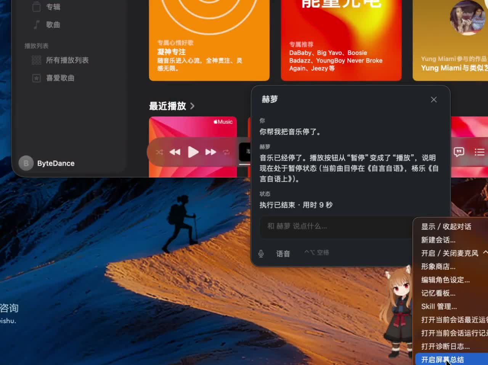

# BoxAgent 桌宠 POC

## 产品愿景

BoxAgent 的目标是一个长期运行在 MacBook 上的桌宠 Agent：既能随时对话、接受委托并操作电脑，也能根据用户的要求持续关注桌面活动，在合适的时机提醒，并逐步积累可回顾的活动记录和长期记忆。

最初设想中的体验包括：说一句“随便放一首钢琴曲”，桌宠先回应，再在后台完成操作；交代“接下来专心学习一小时”，它安静观察，发现持续偏离学习目标时及时提醒；晚上问“我今天做了什么”，它按有依据的时间段回顾当天活动。用户工作时尽量不受干扰，耗时执行也不阻塞继续交谈。

**当前已完成全双工语音、统一 Qwen 前台交互、Computer Use、持久 Product Session、任务完成通知、Jev-Mem-first 自动/显式长期记忆与模块化架构重写。** 文字和语音先进入 Qwen Realtime，普通聊天由前台直答，需要操作电脑时再异步委托 Codex Runtime；后台任务不阻塞继续对话，终态先进入持久 Outbox，再由语音、桌宠或系统通知送达。macOS 语音传输已接入 AOQ 优先、WebSocket 降级的边界，在完成 Workspace 配置后由 AOQ 提供原生回声消除与降噪。以下是演进方向，具体边界随实际体验调整。

## 产品展示

[](docs/media/boxagent-product-showcase.mp4)

点击上图观看 5 分钟真人录屏（含声音）。视频展示了全双工语音对话、跨 Session 长期记忆、后台音乐操作、任务结果通知，以及角色、记忆和 Skill 等产品管理入口。

## Roadmap：从能力统合到长期陪伴

- [x] **全双工语音：技术验证与统合。** 接入千问实时语音，支持快捷键对话、插话和后台任务期间继续交谈。
- [x] **本地端模型：技术验证与统合。** 接入 MLX Qwen3.5-0.8B，定期解读前台窗口并在桌宠旁展示摘要，支持开关。
- [x] **Computer Use：技术验证与统合。** 接入 Codex 通用桌面操作，接受语音或文字的自然语言委托，反馈执行状态与结果，支持取消。
- [x] **桌宠 POC。** 三项能力在同一桌宠中运行，语音与耗时执行独立，形象层可替换。
- [ ] **持续委托与及时响应。** 从“专注学习一小时”开始，将桌面观察交给决策层；支持委托启动、修改、暂停与结束，在有效时间内判断是否提醒，避免重复或过时打扰。
- [ ] **多场景监控与动态扩展。** 用第二种不同的委托验证通用性，例如下载完成提醒；复用事件来源、计时、生命周期与输出机制，让各场景的判断和调优独立，探索按需生成监控与热加载。
- [ ] **活动时间线。** 结合窗口变化、闲置等活动信号（如 ActivityWatch）与屏幕观察，形成有证据的活动区间；先支持短时回顾，再扩展到全天，保留采集空白。
- [x] **长期记忆基础。** 用户可明确要求记住、回忆和删除文本形态的偏好、约定或事实；普通 Final User Message 也会异步进入 Jev-Mem admission。屏幕感知仍不自动入库，冲突消歧和多尺度 consolidation 继续迭代。
- [x] **原生记忆看板。** 从 macOS 右上角 `◉` 菜单或桌宠右键菜单打开“记忆看板…”，可搜索记忆、查看选中节点的一跳关系与详情，并在原生确认后按精确 ID 删除。
- [x] **Jev-Mem-first 自动长期记忆主链。** Final User Message 持久化后异步进入 Jev-Mem admission/store，支持 Profile、Narrative、L2 direct 与 L3 deep recall；质量评测和高级 consolidation 仍继续迭代。详见 [Phase 4 长期记忆设计](docs/BoxAgent-Phase4-Memory-设计.md)。
- [x] **本地 Skill 管理与对话式创建。** BoxAgent 自己管理内置与用户 Skill、启停状态和 Engine IPC CRUD；可从菜单管理，也可让 Reze 搜索现有 Skill、结合最近真实任务轨迹生成草稿，并在用户明确授权后安装。Codex App Server 只接收受控目录与 allowlist 投影，不再启用用户全局目录中的无关 Skill。

整个系统围绕事件驱动设计。用户消息、桌面观察、执行结果、定时器及外部 Feed 都可以成为事件；决策结合事件本身、当前时间、有效委托、相关记忆与可用工具，选择保持安静、更新桌宠表现、发送消息或委托执行。事件处理与具体执行分离，按事件的时效要求处理；每种监控维护自己的判断逻辑和状态，减少场景之间的相互影响。

当前代码按 `entrypoints → bootstrap → application/domain/agent ← infrastructure` 组织，macOS 与 Engine IPC 放在 `interfaces/`。`domain/<能力>/models.py` 保存领域数据，`contracts.py` 定义该能力需要的端口，`service.py` 实现用例；`agent/harness/` 编译上下文与策略，`agent/runtime/` 只定义 Runtime 合同和模型 Profile；Codex、Qwen、Jev-Mem 与本地持久化均在 `infrastructure/` 实现。`bootstrap/desktop.py` 和 `bootstrap/engine.py` 是两个进程唯一的生产装配点，旧路径不保留 import 兼容层。详见 [架构重构方案](docs/BoxAgent-架构重构方案.md)。

端云分工沿用已验证的方向：本地模型提供桌面观察，云端模型负责语音交互和复杂判断、执行。**目前本地窗口摘要仅用于展示，尚未自动写入记忆或接入执行决策；长期记忆已经通过 Profile、L2 direct 与 L3 deep recall 注入 Qwen/Codex，但冲突消歧、质量集和延迟分位数仍需完善。** 持续监控、时间线、通用事件决策和时效调度仍需后续探索。

长期运行质量贯穿各阶段：持续验证真人全双工体验、后台操作对工作的干扰、读屏质量与资源占用，以及断网、睡眠唤醒、退出清理等恢复行为。初步技术验证和 POC 统合不等于这些可靠性问题已经全部解决，已验证范围见 [验收记录](docs/poc-verification.md)。

## 当前 POC 与使用方式

桌面小鸭、千问实时语音、字幕与状态表现，以及自然语言委托后台 Codex Agent 操作应用、反馈结果和取消任务。

本地屏幕总结已接入：默认每 15 秒读取前台应用最上层的普通窗口，截图最长边缩到 960 像素，交给本机 MLX Qwen3.5-0.8B。收起对话时，摘要在小鸭旁逐字浮现，速度随文本长度调整，约 2 秒内显示全文（受界面刷新调度影响），显示完至少保留 8 秒，长文本延长停留，悬停时不自动消失。气泡自动换行并按全文增高，超出半屏高度时可滚动查看，不再限制 3 行；展开对话时也可查看完整摘要、应用名和截图时间。气泡不抢焦点、不播报，也不会派发操作任务。模型不再被要求最多输出 40 字，生成预算提高到 512 token（仍保留防止异常长生成的上限）。

右键小鸭或菜单栏选择 **开启／关闭屏幕总结**。关闭会停止推理并释放模型进程；再次开启重新加载。启动参数可调整周期与分辨率：

```sh
uv run --script scripts/pet.py --log-dir ./logs/boxagent --context-interval 15 --context-size 960
```

`--context-interval 0` 表示启动时关闭，之后仍可从菜单开启；`--context-size 720` 可进一步降低图片分辨率。推理超过周期时不积压请求，切换前台窗口会丢弃旧窗口结果。截图只保存在推理期间的临时目录，完成、取消或失败后删除；摘要和模型诊断写入本机日志，不上传云端。需要启动终端的屏幕录制权限。已有 `.venv` 与 `models/qwen3.5-0.8b-mlx` 被直接复用，准备方法见 [本地 MLX 读屏](docs/qwen-mlx-probe.md)。

单次真实窗口检查：`uv run --script scripts/pet.py --check-context`。这是展示上下文感知的演示，0.8B 模型可能误读文字或概括不准，尚未作为任务执行或长期记忆的依据。

首次在新环境运行前，先按 [环境准备](docs/setup.md) 安装本机依赖、准备模型和官方执行器。仓库不包含模型、凭据或 Codex 二进制，也不保证克隆后无准备即可运行。

在项目根目录直接启动，不需要编译或生成应用包：

```sh
uv run --script scripts/pet.py
```

需要指定诊断目录时：

```sh
uv run --script scripts/pet.py --log-dir ./logs/boxagent
```

开发环境默认启用 Engine 源码监听：AppKit 桌宠保持运行，`application/`、`agent/`、
`domain/`、`infrastructure/` 及 Engine 服务端代码变化时，只重启独立后端进程并自动重连。
修改 `interfaces/macos/` 或 IPC 客户端代码仍需重启整个应用。如需关闭监听，可设置
`BOXAGENT_ENGINE_WATCH=0`。

默认日志目录为 `.runtime/pet/`。`.runtime/` 和 `logs/` 均由 Git 忽略；选择其他目录时也应将其加入忽略规则。日志保留任务目标、工具参数与界面文字，可能包含私人信息，不应直接上传或提交。

默认自动允许 Computer Use 的操作授权请求，不再逐次弹出确认。需要恢复手动确认时，启动命令加上 `--require-approval`。这个设置不代替 macOS 的系统权限；系统授权仍需用户授予。

每个任务结束时，宿主会按本轮标识发送 `turn-ended` 通知并释放任务租约，但不会退出共享的 Codex App Server。模型、稳定指令和工具 schema 未变化时，同一 Product Session 继续使用同一 Codex Thread；这些条件变化时创建新的 Runtime Epoch。Thread Binding 保存在 BoxAgent Session 目录中，Engine 重启后优先通过 `thread/resume` 恢复。

也可以双击 `启动桌宠.command`，或使用 Codex 项目的 Run 按钮。uv 根据脚本依赖及 `scripts/pet.py.lock` 管理独立缓存环境，保留原来用于 MLX 的 `.venv`。首次运行需要下载依赖；PyAudio 依赖本机已有的 PortAudio。

- **Control + Option + 空格**：开启／关闭麦克风。初始麦克风关闭。
- **点击小鸭**：展开／收起对话；**拖动小鸭**：移动位置。
- **输入文字后按回车或点击箭头**：先交给 Qwen 前台交互 Runtime。普通聊天直接回答；需要操作电脑时才委托后台 Codex。后台任务运行期间仍可继续提交聊天消息。
- **右键小鸭或菜单栏 ◉**：打开控制菜单，或退出。终端 `Ctrl+C` 也可退出。
- 试说：“用计算器帮我算一下，503 加 219。”先听到回应，后台开始执行；等待时可以继续聊天。
- 也可以直接说：“帮我打开哔哩哔哩 App，然后随机点开播放一个视频。”前台把完整目标交给同一个通用 Agent，由它观察和选择操作。
- 后台动态发现 Computer Use 的应用列表、读界面、点击、输入、滚动等工具；代码不按应用分派，也没有场景模板或专用任务定义。具体能否完成取决于应用界面、工具能力和模型判断。
- 使用 `--require-approval` 时，工具请求授权后，气泡显示当前请求，可允许或拒绝。已允许的同一请求在本次进程内复用；默认自动允许不显示此按钮。
- 说“取消任务”或点“停止任务”，停止后续动作。普通插话只中断播报；关闭麦克风后后台任务继续，结果保留在气泡中。
- Final User Message 一经 Session Store 持久化，就创建 durable Job 并把原文交给 Jev-Mem 判断是否保存、属于哪类记忆及如何建图；显式“记住”会强制保存，但仍先经过 Secret Filter。删除时使用 recall 返回的精确 Jev-Mem ID，不执行模糊批量删除。
- 点击菜单栏 `◉` →“记忆看板…”可打开本地原生看板；通过 Worker 查看脱敏、限量的 Jev-Mem 节点和关系，并执行精确删除。看板不会启动 HTTP 服务，也不会直接编辑 Jev-Mem 持久化文件。
- 点击菜单栏 `◉` →“Skill 管理…”可打开本地原生管理页；内置 Skill 只读但可启停，用户 Skill 可新建、编辑、启停和删除。
- 可以说“把刚才的操作沉淀成 Skill”。Qwen 先搜索当前安装目录，随后调用独立、无工具、只读的 Codex structured turn 分析最近完成任务的脱敏轨迹并生成草稿；只有当前用户消息明确要求创建、安装、更新，或用户随后确认时，宿主才会写入并热同步 Runtime。
- 后台任务结束后先写入 `<BOXAGENT_DATA_DIR>/notifications/outbox.json`。Qwen 在线时等待安静窗口主动语音播报，开始播放后才记为送达；Realtime 离线时回退到桌宠未读状态和 macOS 系统通知。
- Qwen 重连使用“Stable Profile + Context Checkpoint + 最近原生消息”恢复；Checkpoint 由独立 Codex structured turn 异步生成，并投影为可检索的 Jev-Mem Narrative。自动记忆不等待 Interaction 结束：原始 Final User Message 落盘后即进入 Jev-Mem。原始 Session Event 不会因摘要或记忆写入而删除。

未配置 AOQ 时会降级到 WebSocket，这种模式建议戴耳机体验插话；AOQ 模式由原生 SDK 管理回声消除和降噪。首次开启麦克风时，macOS 可能要求允许启动它的终端或 Codex 访问麦克风；直接 uv 启动没有独立的 BoxAgent 权限身份。AOQ 安装与 Workspace 配置见 [本机环境准备](docs/setup.md)。

程序读取已有 `.env.local` 中的 `DASHSCOPE_API_KEY`。尚未配置时运行 `zsh scripts/set-key.zsh`。语音默认沿用已验证的 `qwen-audio-3.0-realtime-plus`，切换方式：

```sh
BOXAGENT_VOICE_MODEL=qwen3.5-omni-flash-realtime uv run --script scripts/pet.py
```

后台需要一套同时包含 `codex` 和 `codex-code-mode-host` 的 App Server 运行时，依次查找 `BOXAGENT_CODEX_BIN`、工作区 `.runtime/codex-0.153.0/`、Codex 插件运行时与 `PATH`；也需要已安装的 Codex Computer Use 执行器。Codex Agent Runtime 默认模型为 `gpt-5.6-luna`，可用 `BOXAGENT_TASK_MODEL` 调整。具体路径见 [Python Computer Use 记录](docs/python-codex-computer-use.md)。

桌面规划模型现可切换为 DeepSeek，但 Computer Use 工具传输仍依赖上述本机 Codex App Server 与执行器：

```sh
./scripts/run-deepseek.sh
```

脚本会固定使用 Codex Runtime 的 DeepSeek 模型 Profile，默认模型为 `deepseek-flash`，并将其他参数透传给桌宠，例如 `./scripts/run-deepseek.sh --context-interval 0`。也可直接使用 `--task-provider deepseek --task-model deepseek-flash`。DeepSeek 读取 `.env.local` 或环境变量中的 `DEEPSEEK_API_KEY`；语音仍由千问 Realtime 提供，不会随任务模型一起切换。

人格可通过 `BOXAGENT_SOUL_FILE=/绝对路径/SOUL.md` 自定义；未指定时先读取本地私有的 `.runtime/pet/SOUL.md`，不存在则使用仓库内置的 `assets/personas/default/SOUL.md`。人格只控制语气、称呼和互动风格，不能覆盖权限、安全边界和任务完成验证。

BoxAgent 官方 Skill 位于 `skills/builtin/`，用户创建的 Skill 默认位于
`.runtime/pet/skills/`，也可通过 `BOXAGENT_SKILLS_DIR=/绝对路径` 调整。每个 Skill
使用标准的 `<skill-id>/SKILL.md` 结构。启用状态由 BoxAgent 保存并同步给 Codex
App Server；`~/.agents/skills` 中的个人全局 Skill 不会自动进入 BoxAgent 的启用集合。
可在原生 Skill 管理页中直接编辑 `name`、`description` 和正文。对话式创建当前只接受 instruction-only Skill：模型没有文件写入工具，真正落盘由宿主完成；Shell/Python、依赖安装和任意脚本包会被拒绝。ZIP/Git 导入、第三方市场和脚本型 Skill 沙箱尚未实现。

**右键桌宠或点击菜单栏 ◉ →「形象商店…」即可换形象。** 可以搜索、翻页、查看分享者的来源页，点击「下载并使用」后立即切换；「已下载」中的形象支持离线使用，也可以随时「换回小鸭」。切换失败会保留原形象，成功后下次启动自动恢复。下载和切图在后台进行，切换保留桌宠位置、输入草稿和现有语音／任务生命周期。

形象来自 codex-pets.net，支持 V1/V2 图集。下载资源和选择保存在 `.runtime/pets/`，不随 `--log-dir` 改变；不会提交到 Git。分享者、来源与站点提供的许可信息随资源保存，未提供许可时不推断授权。内置 Debug Duck 的来源和 MIT 许可保存在 [assets/pet](assets/pet/README.md)。

本地兼容包仍可用 `--pet /绝对路径/角色目录` 加载，仅覆盖本次启动；未指定时依次使用上次有效选择、内置小鸭。完全不同的形象实现仍可通过 `Appearance` 接口接入。实现与验收方式见 [形象商店](docs/pet-store.md)。

运行记录保存在 `.runtime/pet/`：`events.jsonl` 是状态和字幕，`tasks/` 是操作、界面观察和结果；`position.json` 保存位置。Session 原始轨迹位于 `conversations/`，Jev-Mem 唯一长期记忆 Store 位于 `memory/jev-mem/`，异步投递状态位于 `memory/jobs/ingestion.jsonl`，稳定画像投影位于 `memory/projections/profile.json`。当前不保存原始音频、连续截图或自动活动时间线。启用真实 JEV Decision backend 时，Jev-Mem 会把决策所需文本发送给 TypeSafe.ai；Profile 模式会把画像构造所需文本发送给配置的模型服务，因此不应宣称为全本地处理。

指定 `--log-dir` 后，`events.jsonl`、`tasks/`、`runtime/codex/codex.log` 和 `context-worker.log` 改写到指定目录，窗口位置和单实例锁仍留在 `.runtime/pet/`。每个任务目录包含 `task.json`、`status.json`、`events.jsonl`、`agent-result.json`、`result.json` 和步骤证据；`result.json.runtime_process_alive` 表示共享 Runtime 是否仍在服务。截图单独保存，不把 base64 写进事件日志。进程意外终止时可能没有最终记录；应结合心跳时间与进程状态判断，不能仅凭旧的 `running` 字段认为仍在运行。

个人电脑截图、界面文本及历史实验记录只保存在已被 Git 忽略的 `.runtime/private/`、`.runtime/pet/` 和 `results/`。`docs/assets/` 与旧 `artifacts/` 目录也加入忽略规则，避免再次误提交；角色素材仍保留在 `assets/pet/`。

并发与取消检查：

```sh
uv run --script scripts/pet.py --check
```

实际系统验收记录见 [POC 验收](docs/poc-verification.md)。原有独立语音 Demo 仍可通过 `uv run --script scripts/voice-demo.py` 运行；它使用本地延迟计算函数。相关预实验：[千问语音](docs/qwen-full-duplex-summary.md)、[本地 MLX 读屏](docs/qwen-mlx-probe.md)。

文档入口：[当前实现](docs/poc-implementation.md)、[按日期记录的验收](docs/poc-verification.md)、[历史规划](docs/poc-plan.md)、[脚本用途与副作用](scripts/README.md)、[首次提交检查](docs/first-commit-review.md)。历史预实验中的默认值与架构不代表当前产品。
