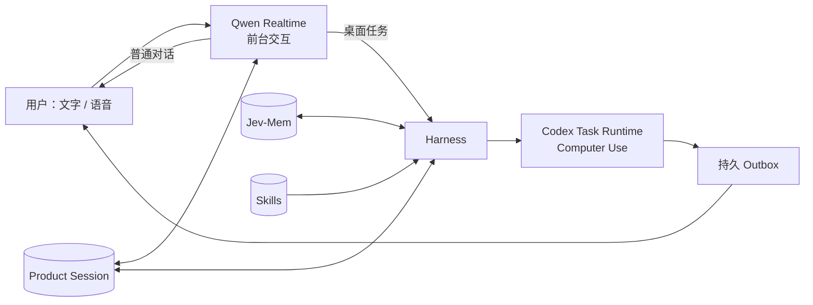

# BoxAgent

> A full-duplex, memory-native desktop companion for macOS.

BoxAgent 是一个常驻在 Mac 桌面的 AI 伙伴。它可以自然对话、记住长期偏好，并在后台操作电脑；耗时任务不会阻塞当前聊天，完成后会主动回来告诉你结果。

> [!IMPORTANT]
> BoxAgent 目前是面向 macOS / Apple Silicon 的开发版本，不是开箱即用的正式发行包。运行前需要准备模型凭据、Codex Computer Use 组件和相应的 macOS 系统权限。

## 产品演示

[](docs/media/boxagent-product-showcase.mp4)

点击封面观看 5 分钟真人录屏（含声音），了解全双工语音、跨 Session 长期记忆、后台音乐操作、任务结果通知，以及角色、记忆和 Skill 管理。

## 它能做什么

| 能力 | 体验 |
| --- | --- |
| 全双工语音 | 随时说话、自然插话；AOQ 优先提供回声消除与降噪，WebSocket 可降级使用 |
| 后台 Computer Use | 对话不中断的情况下操作 macOS 应用，任务完成后主动通知 |
| 统一会话上下文 | 文字、语音、Qwen 与任务 Runtime 共享同一个持久 Product Session |
| 长期记忆 | Jev-Mem 自动判断值得保存的信息，支持画像、叙事记忆和主动召回 |
| Skill 系统 | 管理内置与用户 Skill，也可以从真实任务轨迹生成并安装 Skill 草稿 |
| 原生桌宠界面 | 提供角色、形象商店、任务状态、记忆图谱和 Skill 管理入口 |

例如，你可以对它说：

- “帮我播放一首音乐，完成后告诉我。”
- “去知乎找几篇关于 Agent Memory 的高赞文章，我先继续和你聊。”
- “我更喜欢简洁一点的回答。”
- “把刚才这套操作沉淀成一个 Skill。”

## 工作方式

BoxAgent 将“陪伴式交互”和“耗时执行”分开，但由同一个 Session 保持连续体验：



- 所有文字和语音首先进入 Qwen Realtime，普通聊天直接回答。
- 需要操作电脑时，完整用户目标会异步委托给任务 Runtime。
- Harness 负责编译当前时间、Session 历史、相关记忆、Skill 与安全策略。
- 后台结果先写入持久 Outbox，再通过语音、桌宠未读状态或系统通知送达。
- Final User Message 落盘后异步进入 Jev-Mem，不阻塞当轮回复。

更完整的数据流和模块边界见 [架构重构方案](docs/BoxAgent-架构重构方案.md)、[Conversation Context 设计](docs/BoxAgent-Phase3-Conversation-Context-设计.md) 与 [Memory 设计](docs/BoxAgent-Phase4-Memory-设计.md)。

## 快速开始

### 1. 准备环境

- macOS / Apple Silicon
- Python 3.12、[uv](https://docs.astral.sh/uv/) 与 PortAudio
- 北京地域 DashScope API Key
- Codex App Server、`codex-code-mode-host` 与 Computer Use 组件
- 可选：AOQ SDK、DeepSeek 任务模型、本地 MLX 视觉模型

完整安装步骤、运行时路径和权限说明见 [本机环境准备](docs/setup.md)。

### 2. 配置凭据

```sh
zsh scripts/set-key.zsh
```

如需外放全双工语音，安装 AOQ SDK，并在 `.env.local` 中配置百炼 Workspace：

```sh
./scripts/setup-aoq-sdk.sh

BOXAGENT_QWEN_TRANSPORT=auto
BOXAGENT_DASHSCOPE_WORKSPACE_ID=<your-workspace-id>
BOXAGENT_DASHSCOPE_REGION=cn-beijing
```

### 3. 启动

```sh
uv run --script scripts/pet.py
```

也可以双击 `启动桌宠.command`。首次启动需要下载 Python 依赖，并可能请求麦克风、屏幕录制与辅助功能权限。

### 4. 开始使用

- `Control + Option + Space`：开启或关闭麦克风
- 点击桌宠：展开或收起对话
- 拖动桌宠：移动位置
- 右键桌宠或点击菜单栏 `◉`：打开角色、记忆、Skill、形象和屏幕总结等入口
- “取消任务”或“停止任务”：停止当前后台任务的后续操作

## 配置

| 模块 | 默认行为 | 主要配置 |
| --- | --- | --- |
| Qwen Realtime | AOQ 就绪时优先使用，否则回退 WebSocket | `DASHSCOPE_API_KEY`、`BOXAGENT_DASHSCOPE_WORKSPACE_ID` |
| 桌面任务 | Codex Runtime，默认任务模型 `gpt-5.6-luna` | `BOXAGENT_CODEX_BIN`、`BOXAGENT_TASK_MODEL` |
| DeepSeek 任务模型 | 可选，通过同一 Codex Runtime 工具链执行 | `DEEPSEEK_API_KEY`、`./scripts/run-deepseek.sh` |
| Jev-Mem | 启动时后台预热，用户消息落盘后异步准入 | `TYPESAFE_API_KEY`、`BOXAGENT_JEV_MEM_BACKEND` |
| 本地屏幕总结 | 默认每 15 秒检查前台窗口 | `--context-interval`、`--context-size` |
| 人格 | 优先读取本地私有人格，否则使用内置默认人格 | `BOXAGENT_SOUL_FILE` |
| 用户 Skill | 默认保存在本地运行目录并热同步 Runtime | `BOXAGENT_SKILLS_DIR` |

更多环境变量和依赖边界见 [docs/setup.md](docs/setup.md)。

## 安全与隐私

BoxAgent 能真实操作用户电脑，因此安全边界是产品能力的一部分，而不是模型提示词里的附加说明。

- Session、任务轨迹、记忆、下载形象和本地配置默认保存在 `.runtime/`，该目录不会提交到 Git。
- 日志可能包含任务目标、应用界面文字和工具参数，不应直接上传或公开分享。
- 当前版本默认自动允许 Computer Use 工具请求；使用 `--require-approval` 可恢复逐次确认。
- 不可逆操作仍依赖任务策略和最终状态核验；当前版本不是完整操作系统沙箱。
- 启用真实 Jev-Mem backend 时，相关文本会发送给 TypeSafe.ai；Qwen、任务模型与 Profile 模型也会接收各自完成请求所需的上下文。
- 屏幕总结截图仅在本地推理期间临时存在，当前不会自动进入长期记忆。

请只在你信任的机器和测试账号中运行开发版。详细的数据落盘与审计说明见 [运行记录与上下文审计](docs/BoxAgent-运行记录与上下文审计.md)。

## 项目状态

### 已实现

- Qwen 统一文字 / 语音前台与 AOQ 全双工链路
- 异步 Computer Use、取消、终态核验与持久通知 Outbox
- 持久 Product Session、Runtime 恢复 Checkpoint 与跨 Runtime 上下文
- Jev-Mem 自动写入、Profile、Narrative、L2 direct recall 与 L3 deep recall
- 原生记忆图谱、Skill 管理、对话式 Skill 创建与安装
- 形象商店、本地形象缓存和可替换桌宠外观
- 本地 MLX 前台窗口总结

### 仍在推进

- 新用户 Onboarding、依赖检测与正式应用分发
- 桌面任务队列、并发调度和更稳定的第三方应用适配
- 记忆冲突消歧、画像质量评测与多尺度 consolidation
- 脚本型 Skill 沙箱、ZIP / Git 导入与 Skill 市场
- 持续委托、活动时间线和长期运行可靠性

当前能力的验证边界见 [POC 验收记录](docs/poc-verification.md)。

## 项目结构

```text
boxagent/
├── entrypoints/       # 进程入口
├── bootstrap/         # Desktop / Engine 生产装配
├── application/       # 用例编排
├── domain/            # Session、Task、Memory、Skill 等领域模型与服务
├── agent/
│   ├── harness/       # 上下文、策略与 Runtime 编排
│   └── runtime/       # Runtime 合同与模型 Profile
├── infrastructure/   # Qwen、Codex、Jev-Mem、持久化等适配器
└── interfaces/        # macOS 原生 UI 与 Engine IPC
```

依赖方向为 `entrypoints → bootstrap → application/domain/agent ← infrastructure`。领域层不直接依赖 Qwen、Codex、Jev-Mem 或 AppKit 的具体实现。

## 开发与测试

```sh
# 本地替身检查，不调用模型或操作其他应用
uv run --script scripts/pet.py --check

# 原生 UI 检查
uv run --script scripts/pet.py --check-ui

# 测试套件
uv run --with pytest python -m pytest -q
```

真实语音、Computer Use 和屏幕总结测试可能产生模型用量、读取屏幕或改变应用状态。运行前请先阅读 [脚本用途与副作用](scripts/README.md)。

## 文档

| 主题 | 文档 |
| --- | --- |
| 安装与配置 | [本机环境准备](docs/setup.md) |
| 当前架构 | [架构重构方案](docs/BoxAgent-架构重构方案.md) |
| 会话与上下文 | [Phase 3：Conversation Context](docs/BoxAgent-Phase3-Conversation-Context-设计.md) |
| 长期记忆 | [Phase 4：Memory](docs/BoxAgent-Phase4-Memory-设计.md) |
| 运行记录与审计 | [运行记录与上下文审计](docs/BoxAgent-运行记录与上下文审计.md) |
| 形象商店 | [Pet Store](docs/pet-store.md) |
| Computer Use | [Python Computer Use](docs/python-codex-computer-use.md) |
| 语音链路 | [Qwen 全双工实验](docs/qwen-full-duplex-summary.md) |
| 本地视觉 | [Qwen MLX 实验](docs/qwen-mlx-probe.md) |
| 验收结果 | [POC Verification](docs/poc-verification.md) |

## Acknowledgements

BoxAgent 的当前实现建立在 Qwen Realtime / AOQ、OpenAI Codex Computer Use、Jev-Mem、DeepSeek、MLX，以及 [codex-pets.net](https://codex-pets.net) 提供的开放生态之上。

---

如果你正在尝试运行或参与开发，请从 [本机环境准备](docs/setup.md) 开始；如果你想先理解设计，推荐依次阅读 [架构](docs/BoxAgent-架构重构方案.md)、[上下文](docs/BoxAgent-Phase3-Conversation-Context-设计.md) 和 [记忆](docs/BoxAgent-Phase4-Memory-设计.md)。
