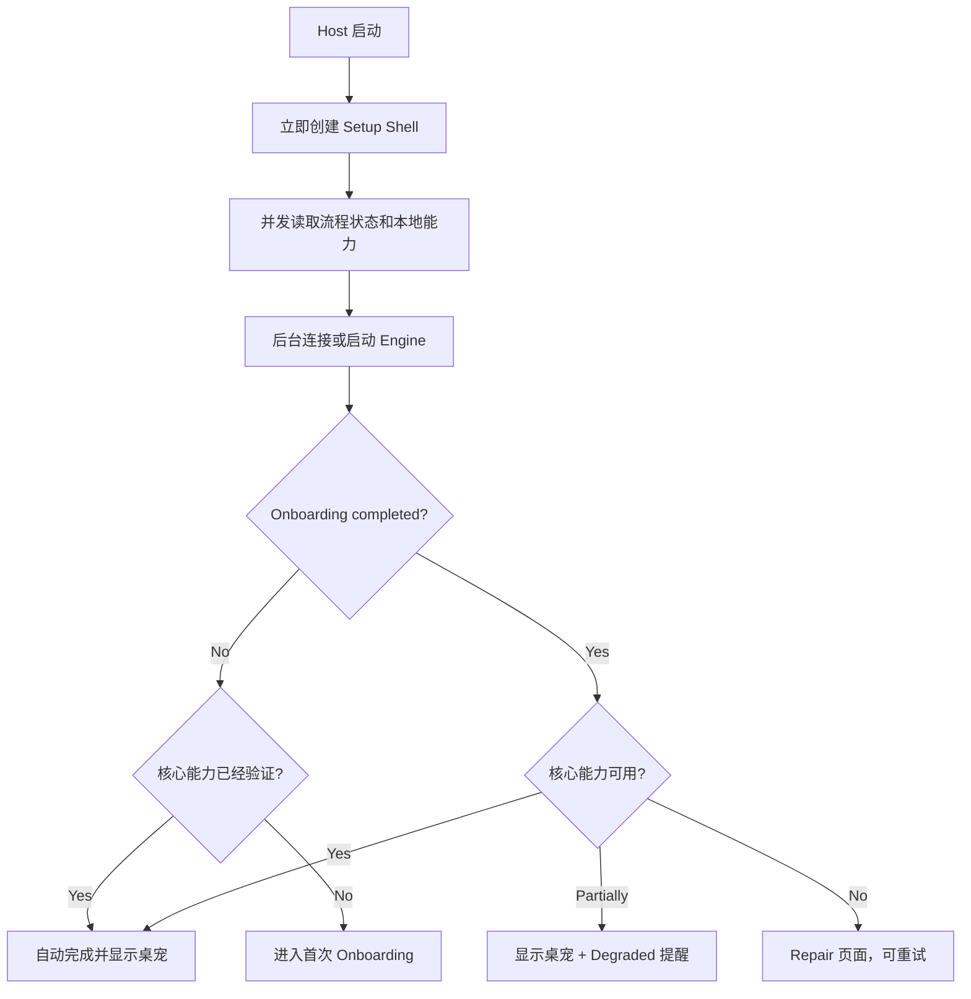

# BoxAgent Onboarding 与启动就绪设计

## 当前结论

BoxAgent 需要首次启动引导，但不新增独立的“初始化业务进程”。现有进程边界保持不变：

```text
macOS Host 进程
├── Onboarding / Repair / Settings 页面
├── 桌宠和对话窗口
├── BootCoordinator
└── EngineSupervisor
        │
        ▼
Engine 子进程
├── Conversation / Context
├── Qwen Realtime
├── Codex Runtime
├── Memory
└── Perception
```

Onboarding 必须属于始终可用的 macOS Host。即使 Engine 无法启动、Key 缺失、模型未安装或 Runtime 鉴权失败，用户仍然能够看到原因、完成配置并重试。

V0 采用以下产品规则：

1. Host 先显示，再并发检查配置和启动 Engine，不让用户面对空白等待。
2. Onboarding 只保存流程进度；Key、权限、模型和 Runtime 状态每次从真实来源查询。
3. 首次启动且核心能力已经通过真实检查时自动跳过引导，开发者不需要重复配置。
4. 已完成引导的用户如果后来缺少权限、Key 失效或模型被删除，进入 Repair，而不是重置完整 Onboarding。
5. Jev-Mem 和本地视觉模型属于 BoxAgent 的核心产品能力；首次完成引导前必须安装并通过基础健康检查。
6. 已完成引导后，Jev 或视觉能力的临时故障进入 Repair/Degraded，不把老用户重新送回首次引导。
7. Persona/SOUL 编辑不属于本期 Onboarding，由独立功能负责人继续开发。

## 为什么不增加第三个进程

当前 Host 已经可以在 Engine 后台启动时创建 AppKit 窗口；EngineBridge 的初始化只启动后台线程和子进程，不要求 UI 等待所有 Runtime 就绪。

增加第三个 Setup 进程会带来额外问题：

- 配置写入后需要在 Setup、Host、Engine 之间同步；
- macOS 权限授权主体可能落到错误的可执行文件；
- 窗口生命周期、单实例锁和应用退出语义更复杂；
- 打包、签名和 Keychain Access Group 都需要额外处理。

因此，Onboarding 是 Host 内的一种页面状态，不是一套新的应用生命周期。

## 当前启动事实

```text
python -m boxagent
  → load_settings()
  → 创建 Data Root、Log Root 和单实例锁
  → 创建 NSApplication
  → create_desktop_host()
      → 加载桌宠资源和 Persona
      → 创建 EngineBridge
      → EngineBridge 后台线程启动 EngineSupervisor
  → AppKit Event Loop
  → applicationDidFinishLaunching()
      → 创建桌宠、对话框、菜单和快捷键

Engine 子进程
  → boxagent.entrypoints.engine
  → EngineServer
  → create_application()
  → BoxAgentApplication.start()
      → 恢复 Conversation Store
      → 恢复 Notification Outbox
      → 启动 Memory Ingestion Job Store
      → 异步预热仓库内置 Jev
      → 启动 Context Checkpoint / Memory Ingestion 协调器
      → 注册 CodexRuntimeHost 生命周期
  → 创建 Unix Socket
  → 客户端连接后发送 engine.ready
```

`engine.ready` 当前只表示 Engine 进程和 Unix Socket 可用，不代表下列能力均可用：

- Qwen Key 可以通过鉴权；
- Codex 二进制存在；
- Codex 登录有效；
- DeepSeek Key 有效；
- Accessibility / Screen Recording / Microphone 已授权；
- Jev 或本地视觉模型已经完成预热。

后续应把 `engine.ready` 明确解释为 `engine_process_ready`，另外维护产品级 Capability Snapshot。

## 设计目标

### 用户目标

- 第一次启动后立即看到可交互页面和明确进度。
- 不打开终端、不编辑 `.env.local` 也能完成正式应用配置。
- 知道缺少的能力、影响和修复方式。
- 配置成功后不需要重启整个桌宠。
- 已经完成配置的开发者可以直接进入应用。

### 工程目标

- Host 在 Engine 不可用时仍能独立显示、读写配置和打开系统设置。
- Onboarding 与 Settings 共享配置、权限和健康检查实现。
- 各项检查有独立状态和超时，单项失败不拖死整个启动。
- Secret 不进入仓库、Conversation JSONL、Trace、IPC 日志或 Onboarding State。
- 后续替换 Qwen、Codex 或 Memory Provider 时不重写 Onboarding 页面。

### 非目标

- 本期不重新设计 Persona/SOUL。
- 本期不实现账号体系、云同步或 Skill 市场。
- 本期必须完成 Jev-Mem 和默认本地视觉模型的安装、完整性校验与基础健康检查；其他未来扩展模型仍可按需安装。
- 本期不将 Product Session 或 Memory 数据迁移到云端。

## 核心概念

### Boot State

Boot State 描述当前应用启动流程，而不是某个模型的健康状态：

```text
booting
├── needs_setup
├── ready
├── degraded
└── failed_retryable
```

| 状态 | 含义 | 主界面行为 |
|---|---|---|
| `booting` | 正在读取配置、权限和 Engine 状态 | 显示轻量启动页和分项进度 |
| `needs_setup` | 首次引导未完成，且核心能力不完整 | 打开 Onboarding |
| `ready` | 核心能力可用 | 进入桌宠和对话界面 |
| `degraded` | 可以进入应用，但部分能力不可用 | 进入桌宠，展示非阻塞提醒 |
| `failed_retryable` | Engine 或本地依赖启动失败 | 保持 Setup/Repair 页面，允许重试 |

### Capability Snapshot

每一项能力独立建模，不再用一个 `ready: bool` 混合表示：

```python
@dataclass(frozen=True)
class CapabilityStatus:
    state: Literal["checking", "ready", "missing", "invalid", "unavailable"]
    reason_code: str = ""
    message: str = ""
    checked_at: float = 0


@dataclass(frozen=True)
class StartupSnapshot:
    engine: CapabilityStatus
    qwen: CapabilityStatus
    codex_binary: CapabilityStatus
    task_provider: CapabilityStatus
    accessibility: CapabilityStatus
    screen_recording: CapabilityStatus
    microphone: CapabilityStatus
    memory_index: CapabilityStatus
    perception_model: CapabilityStatus
```

状态中只保存可展示的结果，不放 Key、本地 Token、Codex Auth 内容或完整异常堆栈。

## 能力分级

BoxAgent 不应把所有能力都设成首次启动硬门禁。

| 能力 | 当前实现依赖 | 首次引导策略 | 缺失后的产品状态 |
|---|---|---|---|
| 基础 UI | AppKit Host | 必须 | Fatal，仅保留错误窗口 |
| 前台对话 | `DASHSCOPE_API_KEY` + Qwen Realtime | V0 核心能力 | `needs_setup`，无法正常聊天 |
| 后台任务 | Codex 二进制 + Codex 登录或 DeepSeek Key | 推荐完成 | 可进入聊天，但桌面任务为 degraded |
| Accessibility | macOS TCC | 桌面控制需要 | 聊天可用，桌面操作受限 |
| Screen Recording | macOS TCC | 截图和视觉回退需要 | 无障碍读取仍可用，视觉能力受限 |
| Microphone | macOS TCC | 语音模式需要 | 文字聊天可用 |
| 长期记忆 | 仓库内置 Jev Worker + 当前选定后端 | 首次完成前必须安装依赖并验证 | 已完成用户进入 degraded，保留 Session 原始轨迹并提示修复 |
| 本地视觉模型 | MLX 环境与模型目录 | 首次完成前必须安装并验证 | 已完成用户进入 degraded，暂停持续桌面总结并提示修复 |

DeepSeek 当前不是独立 Runtime：它仍通过 Codex App Server 执行，因此即使用户选择 DeepSeek，也必须先找到可启动的 Codex 二进制；区别只是无需 OpenAI Codex 登录，改为检查 DeepSeek Key。

## 首次启动流程

### Step 0：Checking

Checking 是瞬时页面，不写入 `last_step`。

Host 启动后并发执行：

1. 读取 Onboarding State；
2. 读取非敏感 Settings；
3. 检查 Keychain / 开发环境配置是否存在；
4. 检查 Codex 二进制、本地 Python 和模型目录；
5. 查询 macOS 权限；
6. 启动或连接 Engine；
7. Engine 可用后查询 Runtime Capability Snapshot。

页面逐项更新，不等待全部检查完成才显示。

### Step 1：Meet reze

目标是说明产品能力和边界，不承担 Persona 编辑：

- reze 是常驻桌面的个人伙伴；
- 可以聊天，也可以将操作交给后台执行器；
- 长期记忆、持续观察和语音可以分别启用；
- 用户始终可以在 Settings 中修改配置。

首次引导期间只显示 Setup Window；桌宠浮窗暂不显示，避免形成两个相互竞争的主入口。完成或跳过后再显示桌宠。

### Step 2：Models & Providers

分为前台交互和后台执行两部分。

前台交互：

- 当前只支持 Qwen Realtime；
- 输入 DashScope Key；
- 保存后执行一次有超时的轻量鉴权检查；
- 不在 UI、日志和错误消息中回显完整 Key。

后台执行：

- 检查 Codex App Server 是否可启动；
- 用户选择 Codex/OpenAI 或 DeepSeek；
- Codex 模式检查隔离 `CODEX_HOME` 中的登录状态；
- DeepSeek 模式输入 Key，并执行轻量鉴权检查；
- Provider 改变后只重启 Engine，不退出 Host。

### Step 3：macOS Permissions

按实际产品能力解释权限，不把所有权限混成一个“全开”按钮：

1. Accessibility：读取和操作控件；
2. Screen Recording：截图、视觉理解和无障碍失败后的坐标回退；
3. Microphone：语音交互。

页面行为：

- 每次只处理第一个缺失权限；
- 打开对应 Privacy & Security 页面；
- 窗口重新获得焦点时立即刷新；
- 页面可定时轮询，但只以系统查询结果为准；
- Microphone 缺失时允许选择“暂时只使用文字”。

### Step 4：Local Intelligence

这是首次引导的必要步骤，负责安装并验证：

- Jev-Mem 语义记忆索引；
- 本地视觉模型；
- 持续桌面观察所需的本地运行环境。

每个组件必须展示：

- 是否已安装；
- 大致磁盘占用；
- 是否需要网络下载；
- 是否会上传数据；
- 下载、取消、重试和删除入口。

因为这两项能力不能跳过，V0 必须提供真实的安装/下载、完整性校验、取消和重试链路，不能只展示状态和文档链接。用户可以关闭应用并在下次启动时从当前步骤继续，但不能在未完成安装时进入正常 Ready 状态。

“必须完成”指组件已经安装、配置可读取且基础 Health Probe 通过，不要求每次冷启动都等待模型完成暖加载。模型暖加载继续在后台进行。

### Step 5：Ready

Ready 页面重新读取一次真实状态，而不是使用前几个页面缓存的结果。

展示：

- 前台对话 Runtime；
- 后台任务 Runtime；
- 已授权的系统能力；
- Jev-Mem 与本地视觉模型状态；
- 当前是否满足首次进入条件。

用户点击“开始使用”后：

```text
refresh capability snapshot
  → 原子写入 onboarding completed
  → 关闭 Setup Window
  → 显示桌宠与对话窗口
```

## 自动跳过策略

首次启动时可以自动跳过，但必须经过能力检查，不能只判断 Key 字符串存在。

```text
Onboarding 尚未完成
  + Qwen 配置存在并验证通过
  + Codex 二进制可启动
  + 所选 Task Provider 可认证
  + 核心权限状态可读取
  + Jev-Mem 已安装且基础 Health Probe 通过
  + 本地视觉模型已安装且完整性校验通过
  → 自动完成并进入桌宠
```

自动跳过适合已经准备好 `.env.local`、Codex 环境和权限的开发者。

额外保留开发开关：

```text
BOXAGENT_SKIP_ONBOARDING=1
```

该开关只跳过 UI，不伪造 Capability 为 Ready；能力缺失仍以 degraded 或错误状态展示。

后续启动策略：

- `completed=false`：执行首次引导入口判断；
- `completed=true`：直接进入桌宠，能力检查在后台进行；
- 已完成用户出现能力缺失：显示 Repair 提醒，不重置 `completed`；
- 网络暂时不可用：使用最近一次成功验证结果进入 degraded，并允许重试；
- Key、Provider 或本地模型路径变化：使对应健康缓存失效并重新检查。

## Onboarding State

建议保存到：

```text
<BOXAGENT_DATA_DIR>/state/onboarding.json
```

内容只描述流程：

```json
{
  "schema_version": 1,
  "flow_version": 1,
  "completed": true,
  "last_step": "ready",
  "completed_at": 1791280000.0
}
```

不允许写入：

- API Key；
- 权限布尔值镜像；
- Codex Auth；
- 下载模型列表；
- Engine 健康状态；
- Provider 返回的完整错误响应。

权限、模型和 Runtime 状态必须在进入页面时重新查询。

## 配置与 Secret 管理

当前源码版从环境变量和仓库 `.env.local` 读取 Key，并在进程启动时构造不可变 Settings。这适合开发，但不适合作为正式用户配置方案。

目标配置来源：

```text
开发模式
  环境变量 → .env.local → Keychain → 默认值

发布模式
  Keychain → 应用非敏感 Settings → 默认值
```

建议抽象：

```python
class CredentialStore(Protocol):
    def has(self, credential: str) -> bool: ...
    def save(self, credential: str, value: str) -> None: ...
    def delete(self, credential: str) -> None: ...


class AppSettingsRepository(Protocol):
    def load(self) -> UserSettings: ...
    def update(self, patch: SettingsPatch) -> UserSettings: ...
```

安全要求：

- 正式应用的 Key 写入 macOS Keychain；
- 不把 Key 写入命令行参数；
- Engine 日志和 IPC 使用脱敏错误；
- Host 启动 Engine 时通过受控环境传递 Secret；
- 修改 Key 后停止旧 Engine，再用新环境启动；
- 不复制用户个人 `~/.codex/auth.json`，继续使用 BoxAgent 专用 `CODEX_HOME`。

## BootCoordinator

BootCoordinator 是 Host 侧的应用编排服务，不包含 AppKit 控件，也不直接实现 Provider API。

职责：

1. 读取 Onboarding State；
2. 并发执行 Capability Probe；
3. 启动、停止和重启 Engine；
4. 计算 `booting/needs_setup/ready/degraded/failed_retryable`；
5. 将状态快照推送给 Onboarding Window；
6. 配置变化后只重启受影响的后端能力；
7. 已完成用户发生退化时生成 Repair Plan。

不负责：

- 保存 Conversation；
- 拼装模型 Context；
- 执行桌面任务；
- 编辑 Persona；
- 直接下载模型文件。

建议接口：

```python
class BootCoordinator:
    async def start(self) -> StartupSnapshot: ...
    async def refresh(self, capability=None) -> StartupSnapshot: ...
    async def save_provider_config(self, patch) -> StartupSnapshot: ...
    async def retry_engine(self) -> StartupSnapshot: ...
    async def complete_onboarding(self) -> OnboardingState: ...
```

## Engine 健康协议

当前 `health` 只返回 `status/pid/protocol_version`。建议保留轻量 `health`，新增能力查询：

```text
startup_snapshot
provider_probe
restart_with_configuration
```

建议返回：

```json
{
  "engine": {"state": "ready"},
  "front_runtime": {
    "provider": "dashscope",
    "state": "ready"
  },
  "task_runtime": {
    "provider": "deepseek",
    "model": "deepseek-flash",
    "state": "ready"
  },
  "memory": {
    "store": "ready",
    "backend": "jev",
    "ingestion": "ready",
    "legacy_migration": "completed"
  },
  "perception": {
    "state": "missing"
  }
}
```

Provider Probe 必须有短超时、支持取消并避免每次启动产生模型推理费用。首次保存 Key 或 Key 发生变化时执行真实鉴权；正常启动可先使用最近一次成功验证记录，随后后台刷新。

## Host 启动与页面路由



页面显示规则：

- 首次引导中不同时显示完整桌宠浮窗；
- 已完成用户启动时优先恢复桌宠；Jev 和视觉组件先读取安装与最近健康状态，暖加载在后台进行；
- Engine 重启时 Host、Setup/Repair Window 和用户输入草稿继续保留；
- Engine 未连接时禁用提交按钮，并显示具体准备状态；
- 不将 Python traceback 直接显示给用户，详细信息写入诊断日志。

## 建议目录

沿用当前 Domain/Application/Infrastructure/Interfaces 分层：

```text
boxagent/
├── application/
│   └── startup/
│       ├── __init__.py
│       ├── contracts.py          # Credential、State、Probe ports
│       ├── models.py             # BootState、CapabilityStatus、Snapshot
│       └── service.py            # BootCoordinator
├── infrastructure/
│   ├── configuration/
│   │   ├── keychain.py
│   │   ├── environment.py
│   │   └── onboarding_state.py
│   └── system/
│       ├── macos_permissions.py
│       └── local_dependencies.py
├── interfaces/
│   ├── engine/
│   │   └── protocol.py           # startup snapshot / probe 协议
│   └── macos/
│       ├── startup_controller.py
│       └── windows/
│           ├── onboarding.py
│           └── repair.py
└── bootstrap/
    └── desktop.py                # 组合 Host、BootCoordinator 和窗口
```

`bootstrap/` 只负责装配；启动判断不继续堆入 `bootstrap/desktop.py`。AppKit 页面只渲染状态和发送命令，不自己读取 `.env.local`、检查 Key 或判断 Engine 是否健康。

## 与 Context 的边界

Onboarding 不修改 Phase 3 的 Context 模型。

- Product Session JSONL 仍是跨 Runtime 会话真相；
- Qwen 和 Codex 仍从同一 Product Session 投影上下文；
- Provider 配置变化会重启对应 Runtime，但不会创建新的 Product Session；
- Runtime Thread 无法恢复时创建替代 Thread，并从 Product Session 重建；
- Onboarding State 不进入模型 Context；
- Provider Key、权限状态和健康错误不写入 Conversation Event Log；
- 用户主动在 Setup 中选择的语言、称呼等产品偏好，未来应通过 Persona 或明确 Memory 流程进入 Context，而不是由 Onboarding 偷偷注入。

## 异常与恢复

| 场景 | 行为 |
|---|---|
| Engine 启动失败 | Host 保持运行，展示日志入口、Retry 和重新配置 |
| Qwen Key 缺失 | 进入 Models & Providers；不允许提交聊天 |
| Qwen 网络超时 | 保留 Key，显示网络错误，可重试 |
| Codex 二进制缺失 | 提供安装说明或选择路径，不影响配置 Qwen |
| Codex 未登录 | 打开登录引导；不读取个人 Codex Home |
| DeepSeek Key 无效 | 保持当前 Provider 配置但标记 invalid，允许修改 |
| Accessibility 未授权 | 允许聊天，桌面操作前提示修复 |
| Microphone 未授权 | 文字模式可用，语音按钮显示缺权状态 |
| 首次引导中 Jev 安装或检查失败 | 留在 Local Intelligence，允许取消下载、重试或下次继续 |
| 首次引导中本地视觉模型缺失 | 留在 Local Intelligence，完成下载和校验后才能进入 Ready |
| 已完成用户的 Jev 临时失败 | Session 原始轨迹继续工作，长期记忆读写 degraded，并进入 Repair 提醒 |
| 已完成用户的视觉模型损坏或丢失 | 暂停持续观察，进入 Repair 提醒，不重置首次引导 |
| 配置更新 | Host 保留，重启 Engine，状态从 booting 重新收敛 |
| Onboarding State 损坏 | 回到 Meet；不删除 Key、模型、会话或记忆 |

## 性能预算

用户感知目标：

| 阶段 | 目标 |
|---|---|
| Host 窗口出现 | 启动后尽快，不等待网络和模型 |
| 本地配置与文件检查 | 通常小于 500 ms |
| Engine Socket 可连接 | 单独展示进度，不阻塞窗口 |
| 权限状态检查 | 小于 1 s，失败可重试 |
| Provider 鉴权 | 首次配置或配置变化时执行，建议 3–5 s 超时 |
| Jev / 视觉组件首次安装与基础检查 | 阻塞首次 Ready，并展示真实进度 |
| Jev / 视觉模型暖加载 | 完成安装验证后在后台执行，不阻塞后续启动 |

禁止为了自动跳过引导而在每次启动执行一次收费模型推理。健康验证优先使用无生成费用的鉴权或模型列表接口；没有可靠轻量接口时使用带 TTL 的最近验证记录，并在后台刷新。

## 分阶段实现

### Phase A：启动状态基础设施

- 定义 BootState、CapabilityStatus、StartupSnapshot；
- 实现 Onboarding State Repository；
- 将本地配置、权限和依赖检查封装成 Probe；
- 扩展 Engine health，区分 Engine Ready 与 Capability Ready；
- BootCoordinator 单元测试。

### Phase B：Onboarding UI

- Setup Window 和五步导航；
- Key 输入、遮罩、保存、删除和重试；
- 权限状态和打开系统设置；
- Ready 汇总；
- 完成后切换到桌宠。

### Phase C：配置热应用

- 开发环境读取 `.env.local`；
- 发布环境接入 Keychain；
- Settings 与 Onboarding 共享配置服务；
- 配置变化时重启 Engine，Host 不退出；
- 对话草稿和 Product Session 保持不变。

### Phase D：Repair 与打包验收

- 已完成用户的 degraded/repair 流程；
- 签名 `.app` 下验证 TCC 权限主体；
- 验证 Codex 隔离 Home 和登录流程；
- 验证无 Key、错误 Key、无网络、无模型和 Engine 崩溃恢复；
- 验证开发者全配置环境可自动跳过。

## 协作拆分

为了避免多人修改同一组文件，建议这样派活：

| 工作包 | 主要范围 | 不应修改 |
|---|---|---|
| Startup Core | `application/startup/`、状态模型和测试 | Persona、Context 拼装 |
| macOS Onboarding UI | `interfaces/macos/windows/onboarding.py` | Provider 具体实现 |
| Config & Keychain | `infrastructure/configuration/` | Conversation JSONL |
| Engine Capability | Engine protocol、Provider Probe | AppKit 页面 |
| Persona | SOUL、角色面板和角色体验 | BootCoordinator、Context Store |

Persona 配置变化仍可要求 Runtime 重新加载，但不应与 Onboarding 的核心开发互相阻塞。

## 验收标准

### 自动化

- 无 Onboarding State 时进入 Meet；
- 状态文件损坏时安全回退；
- 全部核心能力健康时自动跳过；
- 已完成用户的 Jev 或视觉能力失效时进入 degraded/repair，而不是重跑引导；
- Engine 失败时页面仍可操作和重试；
- 保存 Secret 后日志、IPC 事件和 State 文件中不存在明文；
- 配置变化只重启 Engine，Host PID 不变；
- Onboarding 不创建、清空或切换 Product Session；
- Jev 和视觉模型未安装时阻塞首次 Ready；完成后发生临时故障时保留应用可用性并进入 Repair。

### 真实 macOS 验收

1. 全新 Data Root、无 Key、无权限启动；
2. 逐项配置 Qwen 和任务 Provider；
3. 授权 Accessibility、Screen Recording、Microphone；
4. 完成引导并进入桌宠；
5. 重启应用，确认直接进入桌宠；
6. 撤销 Microphone，确认文字模式仍可用并显示 Repair；
7. 修改 Provider，确认 Host 不退出、Engine 重启；
8. 使用已配置开发环境启动，确认自动跳过；
9. Engine 人为退出，确认 Host 显示恢复状态并能自动重连；
10. 检查 Conversation、Memory、Keychain 和日志边界没有被破坏。

## 实施前最终决策

以下事项已在本设计中确定，不再留给实现阶段临时判断：

1. 不新增第三个初始化进程；
2. Onboarding 由 macOS Host 持有；
3. 首次引导不展示完整桌宠浮窗；
4. Qwen 是当前 V0 前台交互核心能力；
5. 后台执行允许降级，但 Ready 页必须明确展示；
6. Jev 和本地视觉模型阻塞首次完成，但不阻塞已完成用户的后续冷启动；
7. 开发者全配置环境自动跳过；
8. 完成状态与真实能力状态分离；
9. 正式 Secret 使用 Keychain；
10. Context、Conversation 和 Runtime Binding 不因 Onboarding 重构而改变语义。
