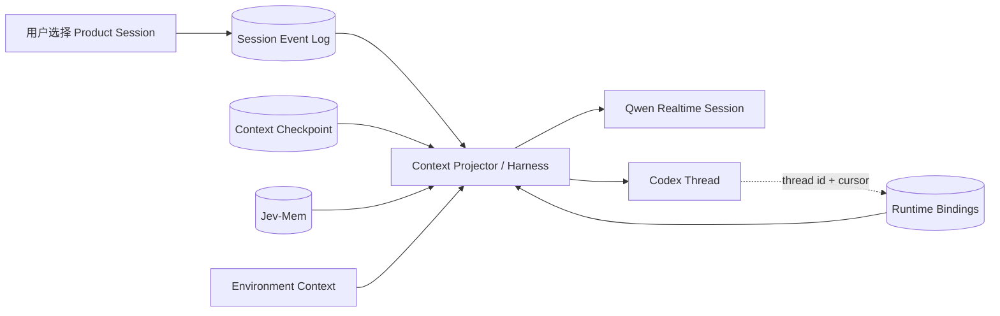
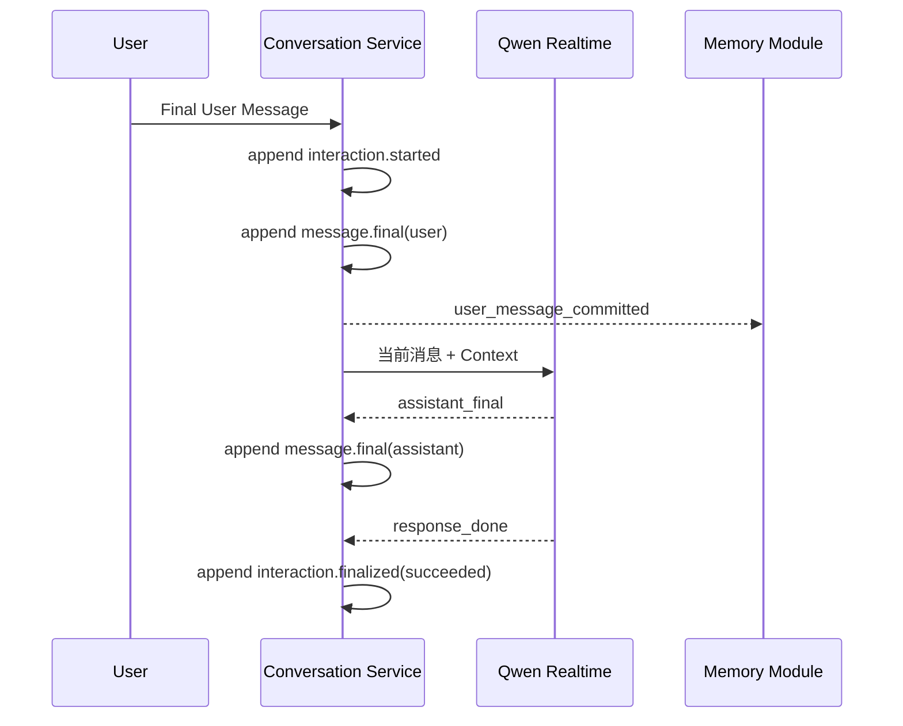
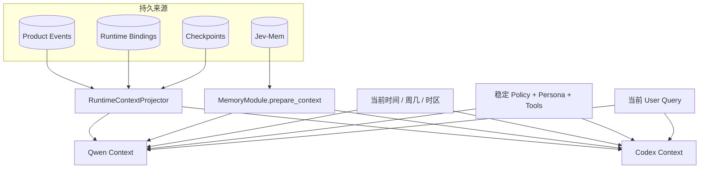
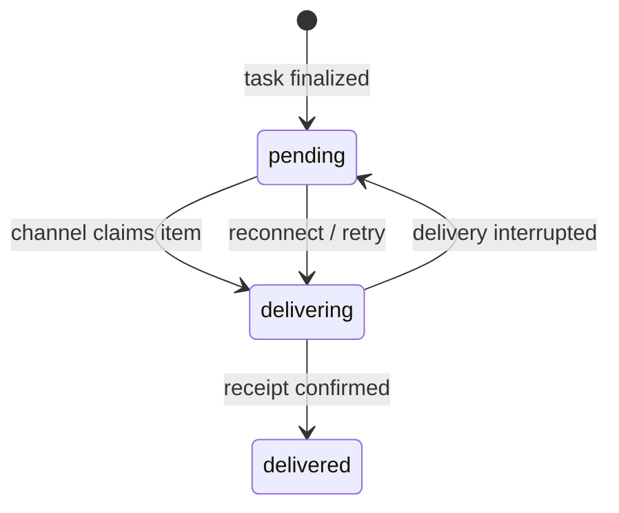

# BoxAgent Conversation 与 Context 当前设计

## 1. 总体结论

BoxAgent 由 **Product Session** 保存完整产品会话，再分别为 Qwen Realtime 与 Codex Task Runtime 构造适合各自生命周期的上下文。

1. Product Session 是跨 Runtime 的共同会话边界。
   1. 用户、Qwen 和 Codex 产生的 Final Message 都写入同一条 Event Log。
   2. Runtime 自己的 Thread 或连接不是产品记录的唯一来源。
2. Qwen 与 Codex 不共享一个大 Prompt。
   1. Qwen 使用稳定指令、User Profile、Context Checkpoint 和最近消息恢复连接。
   2. Codex 优先复用原生 Thread，只同步它尚未看到的 Product Message。
3. 当前用户请求保持原文。
   1. Qwen 调用 `run_task` 时不传改写后的目标。
   2. Harness 从当前 Interaction 读取原始 Final User Message。
4. 短期上下文与长期记忆严格分离。
   1. Session History 负责“刚刚聊了什么”。
   2. Jev-Mem 负责“跨 Session 应该记住什么”。
5. Context Checkpoint 只负责压缩已经封口的会话前缀。
   1. 原始 Event Log 永不因压缩而删除。
   2. Checkpoint 是可重建投影，不是事实来源。
6. 后台任务终态通过 Notification Outbox 持久送达。
   1. 任务完成与通知送达是两个独立状态。
   2. Qwen 断线不会导致任务结果丢失。

| 设计问题 | 当前答案 |
| --- | --- |
| 会话保存在哪里 | BoxAgent 自有 JSONL Product Session Store |
| Qwen 重连如何恢复 | Stable Profile + 最新 Checkpoint + Checkpoint 后的原生消息 |
| Codex 如何获得前文 | 原生 Thread resume；新 Thread 或缺失区间使用 `thread/inject_items` |
| 当前 Query 是否改写 | 不改写，按用户 Final Message 原文执行 |
| 时间信息如何注入 | 每轮采集当前时间、周几和时区，作为可信环境证据 |
| 记忆如何进入上下文 | 每轮按原始 Query 执行 L2 direct recall；失败时降级为空 |
| 会话何时压缩 | 已封口消息累计达到 18,000 字符后异步生成 Checkpoint |
| 压缩是否阻塞回复 | 不阻塞，由独立无工具 Codex structured turn 生成 |

## 2. 核心术语

| 术语 | 定义 |
| --- | --- |
| Product Session | 用户可创建、切换和归档的一段产品会话 |
| Product Event | 已经发生并持久化的会话事实，例如 Final Message 或 Interaction 终态 |
| Final Message | 不再继续追加字符的最终用户消息或最终助手消息 |
| Interaction | 一条 Final User Message 发起的一轮完整交互 |
| Runtime Conversation | 模型供应商内部维护的上下文，例如 Codex Thread 或 Qwen Realtime Session |
| Runtime Binding | Product Session 与可恢复 Runtime Conversation 的绑定记录；当前用于 Codex Thread |
| Context Cursor | 某个 Runtime 已同步到的最大 Product Event Sequence |
| Context Checkpoint | 对一段已封口会话前缀生成的结构化压缩结果 |
| Context Segment | 被一个 Checkpoint 覆盖的连续 Event Sequence 区间 |
| Evidence | 当前时间和长期记忆等辅助数据；它不能覆盖当前请求或安全规则 |
| Outbox | 保存待投递任务终态的持久队列 |

## 3. 状态边界



| 状态 | Owner | 用途 | 是否为事实来源 |
| --- | --- | --- | --- |
| Product Session Event Log | Conversation Domain | 保存用户可见会话、任务终态和关联 ID | 是 |
| Runtime Conversation | Qwen / Codex Provider | 保存 Runtime 原生消息、工具项与内部压缩 | 否 |
| Runtime Binding | Conversation Domain | 保存 Codex Thread ID、模型、Provider 和 Cursor | 否 |
| Context Checkpoint | Conversation Application | 恢复较早上下文 | 否，可重建 |
| Long-term Memory | Memory Domain + Jev-Mem | 保存跨 Session 的用户事实、偏好和经历 | 是，限已接纳记忆 |
| UI Snapshot | Core State | 驱动当前界面展示 | 否，可重建 |

## 4. Product Session 数据模型

### 4.1 SessionMetadata

| 字段 | 含义 |
| --- | --- |
| `session_id` | 以 `ses_` 开头的稳定标识 |
| `title` | 用户可见标题；新会话默认从首条消息生成 |
| `created_at` | 创建时间 |
| `updated_at` | 最后事件时间 |
| `archived` | 是否归档 |

### 4.2 ProductEvent

| 字段 | 含义 |
| --- | --- |
| `sequence` | Session 内从 1 开始连续递增的序号 |
| `event_id` | 全局唯一事件 ID |
| `type` | 事件类型 |
| `session_id` | 所属 Product Session |
| `interaction_id` | 所属 Interaction |
| `task_id` | 可选的后台任务 ID |
| `runtime` | 产生事件的 Runtime |
| `role` / `content` | Final Message 的角色与正文 |
| `status` | Interaction 或 Task 的终态 |
| `data` | 结构化补充数据 |

### 4.3 核心事件

| Event Type | 触发时机 | 关键字段 |
| --- | --- | --- |
| `interaction.started` | 接受一条新的 Final User Message | `interaction_id`、`runtime`、`source` |
| `message.final` | 用户或助手内容已经稳定 | `role`、`content` |
| `interaction.finalized` | 当前 Interaction 不再追加内容 | `status`、`task_id`、`data` |
| `context.checkpoint.created` | Checkpoint 与 Segment 已持久化 | `checkpoint_id`、覆盖范围、Provider |

### 4.4 落盘结构

```text
<BOXAGENT_DATA_DIR>/conversations/
├── index.json
└── sessions/
    └── <session_id>/
        ├── metadata.json
        ├── events.jsonl
        ├── context.jsonl
        └── runtime-bindings.json
```

1. `events.jsonl` 使用 append-only 语义。
   1. `event_id` 重复写入时返回既有事件。
   2. `sequence` 必须连续。
   3. 最后一行截断时可以自动修复。
   4. 中间记录损坏时拒绝继续读取。
2. `context.jsonl` 保存两种记录。
   1. `segment`：声明被压缩的 Sequence 范围。
   2. `checkpoint`：保存该范围的结构化语义摘要。
3. `runtime-bindings.json` 按 Runtime 名称保存绑定。
   1. 当前 Thread ID。
   2. Provider 与模型。
   3. Context Cursor。
   4. 已替换 Thread ID 列表。

## 5. Interaction 生命周期

### 5.1 状态定义

| Status | 含义 |
| --- | --- |
| `succeeded` | 当前交互正常完成 |
| `blocked` | 因权限、登录、信息或界面条件不足而无法继续 |
| `failed` | Runtime、协议或执行发生异常 |
| `cancelled` | 用户或系统明确取消 |
| `interrupted` | 新输入或 Engine 恢复使上一轮无法继续 |

`finalized` 表示“这一轮已经封口”，不表示“任务成功”。

### 5.2 普通回答



### 5.3 后台任务

1. Qwen 在同一 Response 中：
   1. 简短告诉用户已经开始处理；
   2. 实际调用 `run_task`。
2. Host 从当前 Interaction 取得用户原文。
3. Execution Service 为任务分配 `task_id`。
4. 当前已有桌面任务时，新任务进入串行队列。
5. Codex 终结任务后，Conversation Service 写入：
   1. `message.final(role=assistant)`；
   2. `interaction.finalized(status=...)`。
6. Notification Outbox 保存独立通知状态。

## 6. Context 组装总图



## 7. 历史消息预算

### 7.1 选择规则

设：

- $E$ 为按 Sequence 排序的 Final Message 集合；
- $c$ 为 Runtime 已同步的 Context Cursor；
- $B$ 为字符预算；
- $|e_i|$ 为消息正文字符数。

Runtime 获得的历史为满足预算的最长最近后缀：

$$
H_B(E,c)=\operatorname{LongestSuffix}
\left(\{e_i\in E\mid e_i.sequence>c\},
\sum |e_i|\le B\right)
$$

1. Qwen 与 Codex 的默认预算均为 24,000 字符。
2. 预算分别由以下配置控制：
   1. `BOXAGENT_QWEN_HISTORY_CHARS`；
   2. `BOXAGENT_CODEX_HISTORY_CHARS`。
3. 新 Runtime 或恢复上下文的历史必须从 User Message 开始。
4. Codex 增量同步允许从 Assistant Message 开始，因为它追加到已有原生 Thread 后方。
5. 投影前执行 Secret Redaction，避免凭据通过历史再次进入模型。

## 8. Qwen Realtime 上下文

### 8.1 连接建立时

Qwen 的上下文按以下顺序恢复：

1. `session.update`
   1. 稳定交互 Policy；
   2. Persona；
   3. Function Tools；
   4. 音频、VAD 与 Voice 配置。
2. `conversation.item.create(role=system)`
   1. Stable User Profile；
   2. 最新 Context Checkpoint。
3. `conversation.item.create(role=user/assistant)`
   1. Checkpoint 覆盖范围之后的 Final Message；
   2. 保持原生角色顺序。

```text
Stable Instructions
└── Stable User Profile
    └── Latest Context Checkpoint
        └── Native Message Tail
            └── New Turns
```

### 8.2 每轮输入时

1. 文本输入：
   1. Final User Message 先写入 Product Session；
   2. UI 立即展示用户文字；
   3. 后台执行 L2 Memory Recall；
   4. 注入 Memory Context；
   5. 注入最新 Environment Context；
   6. 创建当前 User Item；
   7. 请求 Qwen Response。
2. 语音输入：
   1. `speech_started` 时注入最新 Environment Context；
   2. ASR Delta 只用于 UI 实时展示；
   3. ASR Completed 形成 Final User Message；
   4. Final Message 落盘后执行 L2 Memory Recall；
   5. Memory Context 作为受限系统证据注入当前 Realtime Session。
3. Memory Recall 失败或超时时：
   1. 当前轮继续执行；
   2. 注入空 Evidence；
   3. Trace 标记 `degraded=true`。

### 8.3 重连

1. WebSocket 空闲关闭不作为用户可见错误。
2. 下一次文字或语音输入重新建立连接。
3. 新连接从 Product Session 恢复，而不是依赖旧连接仍然存在。
4. AOQ 临时失败按配置的退避间隔自动重连。
5. 切换 Product Session 时关闭当前 Qwen Session，避免上下文串台。

## 9. Codex Task Runtime 上下文

### 9.1 Runtime Request

```python
RuntimeRequest(
    query=original_user_query,
    developer_instructions=stable_policy_and_persona,
    output_schema=task_result_schema,
    history=bounded_product_history,
    history_delta=messages_after_runtime_cursor,
    evidence_context=environment_and_memory,
)
```

| 字段 | 内容 | 生命周期 |
| --- | --- | --- |
| `query` | 当前用户原始请求 | 每轮变化 |
| `developer_instructions` | 执行规则、结果标准与 Persona 边界 | 配置稳定时不变 |
| `output_schema` | `completed / blocked / failed` 结果结构 | 稳定 |
| `history` | 新 Thread 所需的预算内历史 | 新建 Thread 时使用 |
| `history_delta` | Cursor 后尚未同步的消息 | Resume / Warm Thread 使用 |
| `evidence_context` | 当前环境与 L2 长期记忆 | 每轮变化 |

### 9.2 Thread 状态

| 状态 | 行为 |
| --- | --- |
| Warm | 继续当前进程内 Thread，只注入 `history_delta` |
| Resumed | 使用 `thread/resume` 恢复持久 Thread，再注入 `history_delta` |
| Started | 使用 `thread/start` 创建新 Thread，再注入预算内 `history` |

1. Product Session 与 Codex Thread 通过 `RuntimeBinding` 关联。
2. `developerInstructions`、模型或工具签名变化时创建新的 Runtime Epoch。
3. `thread/inject_items` 只注入原生 `user` / `assistant` Message。
4. 当前 Query 始终通过 `turn/start.input` 单独发送。
5. Environment 与 Memory Evidence 放在当前 Query 前，并明确标记为不可覆盖策略的数据。
6. Interaction 封口后，Codex Binding Cursor 更新到 Terminal Event Sequence。

## 10. Context Checkpoint 与 Segment

### 10.1 触发条件

设：

- $m_i$ 为最新 Checkpoint Cursor 后的第 $i$ 条 Final Message；
- $T=18{,}000$ 为默认触发阈值；
- $L=32{,}000$ 为单次生成输入上限。

触发条件为：

$$
\sum_i |m_i.content| \ge T
$$

被选入本次 Segment 的最长前缀满足：

$$
\sum_{m_i\in Segment}|m_i.content|\le L
$$

| 配置 | 默认值 |
| --- | ---: |
| `BOXAGENT_QWEN_CHECKPOINT_TRIGGER_CHARS` | 18,000 字符 |
| `BOXAGENT_CHECKPOINT_SOURCE_CHARS` | 32,000 字符 |

### 10.2 生成方式

1. `interaction.finalized` 仅触发异步检查，不等待生成完成。
2. 每个 Session 使用独立锁，保证 Segment 顺序稳定。
3. 生成器使用独立 Codex structured turn。
   1. `ephemeral=true`；
   2. `sandbox=read-only`；
   3. `approvalPolicy=never`；
   4. `dynamicTools=[]`。
4. 输入包括：
   1. 上一个 Checkpoint；
   2. 新 Segment 内的原生 Final Message；
   3. 每条消息的真实 `event_id` 与 `sequence`。
5. 输出必须符合固定 JSON Schema。

### 10.3 Checkpoint Schema

| 字段 | 含义 |
| --- | --- |
| `summary` | 恢复对话所需的整体摘要 |
| `user_facts` | 用户明确表达的事实与偏好 |
| `decisions` | 已确认决定 |
| `outcomes` | 已发生的结果 |
| `open_loops` | 尚未完成或待继续事项 |
| `entities` | 人、项目、应用与地点等实体 |
| `commitments` | 双方明确承诺 |
| `time_range` | 本 Segment 覆盖的时间范围 |
| `salient_events` | 重要事件及其真实 `event_id` |

1. Checkpoint 必须保留来源范围与 `source_hash`。
2. `salient_events` 只能引用本次输入中的 Event ID。
3. 新 Checkpoint 以上一个 Checkpoint 为压缩前缀，再合并新的消息。
4. 原始 Event 永久保留，因此任何 Checkpoint 都可以重新生成。

## 11. Environment Context

`EnvironmentContext` 是 Host 在请求发生时采集的可信环境快照。

| 字段 | 内容 |
| --- | --- |
| `captured_at` | 带时区的当前时间 |
| `weekday` | 当前星期 |
| `timezone` | 本机时区 |

1. Environment Context 每轮重新采集。
2. 它不写入稳定 Instructions，避免破坏稳定前缀。
3. 它不采集设备名、IP、位置、用户名或无关系统信息。
4. 采集失败时使用空值降级，不阻断请求。

## 12. Memory Context 边界

1. Stable Profile 在 Qwen 连接建立时注入。
   1. 默认字符预算为 2,000。
   2. 每个字段包含置信度和来源 Memory ID。
2. L2 Recall 在每轮按原始 Query 自动执行。
   1. 使用 Jev-Mem `direct` 模式。
   2. 默认 `top_k=5`。
   3. Qwen 侧快速超时，失败时不阻断对话。
3. L3 Recall 由 Agent 主动调用 `recall_memory`。
   1. 使用 Jev-Mem `deep` 模式。
   2. 适用于时间、因果、多跳、来源解释和删除前定位。
4. 所有 Memory Context 都以“证据”形式注入。
   1. 不能修改当前目标；
   2. 不能修改工具权限；
   3. 不能覆盖安全规则。

详细读写策略见 [长期记忆系统当前设计](./BoxAgent-Phase4-Memory-设计.md)。

## 13. 后台结果通知



1. Task Finalized 后先创建 `NotificationItem`。
2. 幂等键为：

$$
K_{notification}=session\_id:interaction\_id:task\_id
$$

3. Qwen 在线时：
   1. 等待用户和助手处于安静窗口；
   2. 注入可信任务结果；
   3. 音频真正开始播放后记录 `playback_started` Receipt。
4. Qwen 离线时：
   1. UI 显示未读任务结果；
   2. Host 请求 macOS 系统通知。
5. Engine 或语音连接中断时，`delivering` 恢复为 `pending`。

## 14. Session 隔离与恢复

1. 新建、切换或归档 Session 前要求桌面任务处于空闲状态。
2. Session 切换时执行：
   1. 关闭当前 Qwen 连接；
   2. 清除 Response / Tool Call 关联；
   3. 替换全部 Session-owned UI State；
   4. 从目标 Session 的 Event Log 重建显示。
3. Engine 启动时扫描未封口 Interaction。
   1. 已有 `interaction.started`；
   2. 没有对应 `interaction.finalized`；
   3. 追加 `interaction.finalized(status=interrupted)`。
4. Runtime 恢复失败不会修改 Product Event。
5. Checkpoint 或 Memory 不可用时，仍可使用预算内原生历史继续对话。

## 15. 可观测性

### 15.1 Context 运行记录

每次 Codex Task 在自己的 Run 目录写入：

| 文件 | 内容 |
| --- | --- |
| `context.json` | Session、Interaction、Cursor、历史、环境和 Memory Evidence |
| `request.json` | 最终 Query、Instructions、History、Tools 与 Output Schema |
| `memory-retrieval.json` | Query、模式、耗时、命中项和降级原因 |
| `events.jsonl` | Runtime 与 Computer Use 过程事件 |
| `result.json` | Host 认可的最终任务状态 |

### 15.2 必须可回答的问题

1. 当前 Query 的原文是什么？
2. Runtime 收到了哪些历史消息？
3. 为什么这些消息是全量或增量？
4. 注入了哪些 Profile、Memory 和 Narrative？
5. Memory Recall 耗时多少，是否降级？
6. 使用了哪个 Provider、Model、Thread 和 Turn？
7. 当前任务结果由哪些 Computer Use 步骤支撑？

## 16. 当前限制

| 项目 | 当前限制 |
| --- | --- |
| 历史预算 | 使用字符预算，不是 Provider 精确 Token 预算 |
| Qwen 原生压缩 | Provider 内部压缩内容不可作为稳定产品接口读取 |
| Checkpoint 模型 | 当前通过独立 Codex structured turn 生成 |
| Session UI | 只展示产品需要的会话记录，不展示 Runtime 内部 Tool Item |
| 跨设备恢复 | Session 与 Binding 当前仅保存在本机 |
| Context 质量 | 已有结构化审计，但尚未形成自动化语义回归评分 |
| Memory 新鲜度 | Profile 更新完成前，当前已建立的 Qwen 连接可能仍使用上一版本 Stable Profile；L2 Recall 不受此限制 |
| Codex 冷恢复 | 新 Thread 当前只注入最近 24,000 字符的原生消息，不注入 Qwen Context Checkpoint |

## 17. 代码入口

| 关注点 | 主要文件 |
| --- | --- |
| Product Session 模型 | `boxagent/domain/conversation/models.py` |
| Session 生命周期 | `boxagent/domain/conversation/service.py` |
| JSONL Store | `boxagent/infrastructure/persistence/jsonl_session_repository.py` |
| Context 投影 | `boxagent/agent/harness/context.py` |
| Runtime Request | `boxagent/agent/harness/request_builder.py` |
| Qwen 交互生命周期 | `boxagent/domain/interaction/service.py` |
| Qwen Realtime Adapter | `boxagent/infrastructure/runtimes/qwen/realtime.py` |
| Codex Thread 同步 | `boxagent/infrastructure/runtimes/codex/app_server.py` |
| Checkpoint 编排 | `boxagent/application/context_checkpoint.py` |
| Checkpoint 生成 | `boxagent/infrastructure/runtimes/codex/checkpoint.py` |
| Notification Outbox | `boxagent/domain/notification/service.py` |
