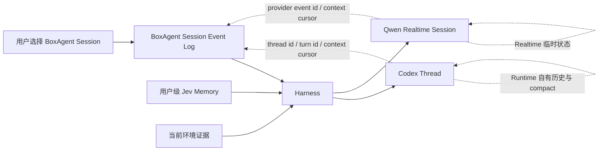
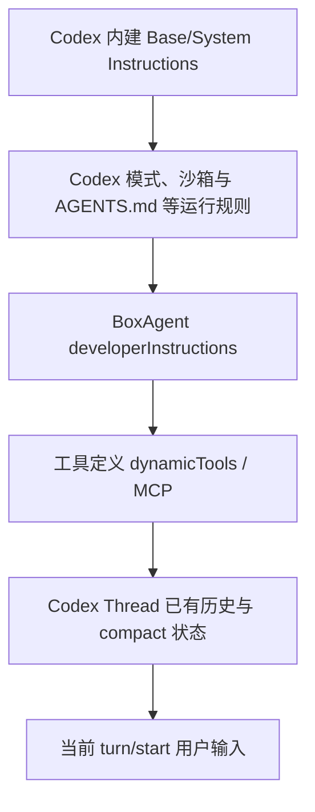
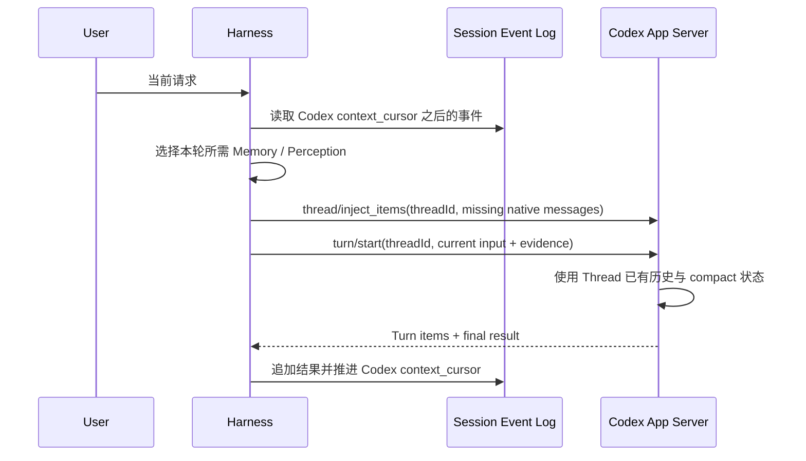
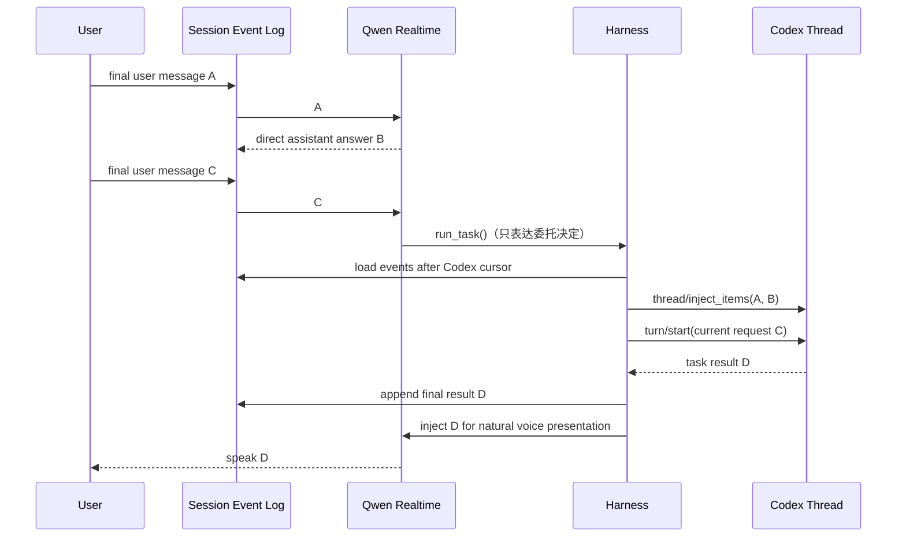
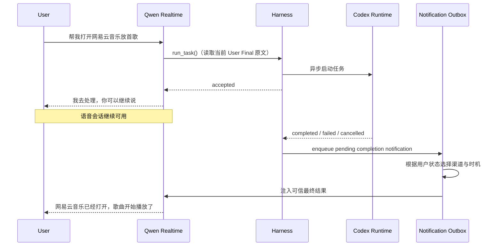
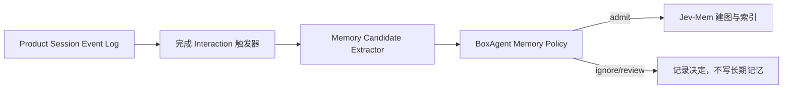
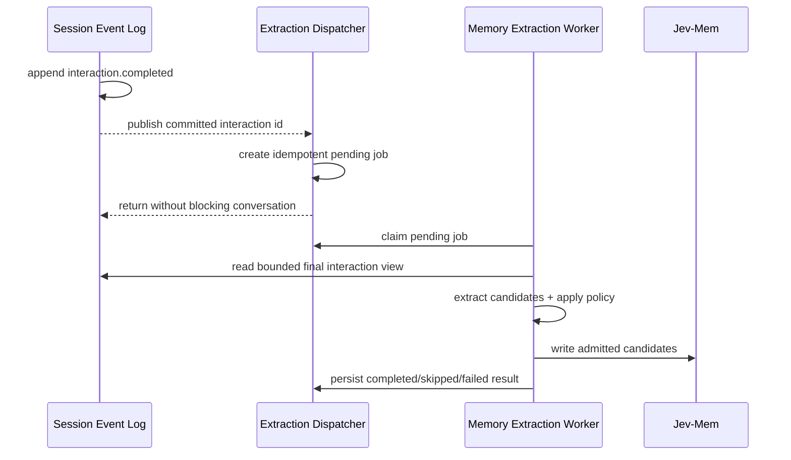
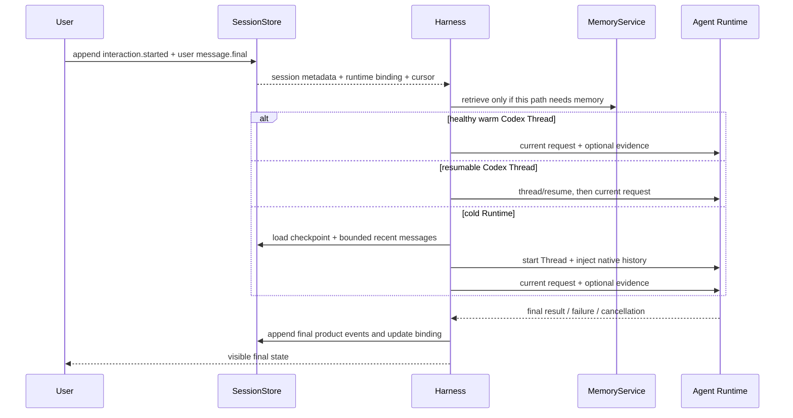

# BoxAgent Phase 3：Conversation 与 Context 设计

## 当前结论

Phase 3 要解决两件不同的事：

1. BoxAgent 如何保存用户可见的会话，使其可查看、切换、恢复和迁移；
2. Harness 如何根据当前 Runtime 的状态，为本次请求准备最小且正确的输入。

这两件事不能等同于“每轮都从数据库取历史，再拼成一个大 Prompt”。V0 采用以下语义：

1. 用户手动新建、选择和切换 Session；系统不按时间或语义阈值自动切换。
2. BoxAgent 使用自有的 append-only JSONL Session Event Log 保存产品会话，不把 SQLite 作为 Phase 3 前置条件。
3. Product Session Event Log 是 Qwen Realtime、Codex 和未来 Runtime 共享的短期会话边界；Runtime Thread 只是各自可恢复的上下文投影，不是唯一真相来源。
4. Codex Thread 本身是一条包含多个 Turn 的 Runtime Conversation。同一 Session 的健康 Thread 应持续复用；后续请求不重放 Codex 已经见过的历史，但必须增量同步由 Qwen 等其他路径产生、Codex 尚未见过的最终会话事件。
5. Engine 重启后优先调用 `thread/resume` 恢复已持久化的 Codex Thread；由其他 Runtime 产生、Codex 尚未见过的 Final Message 使用 `thread/inject_items` 按原生 user/assistant message 注入。新 Thread 同样用原生历史重建，不再把历史 JSON 拼入当前 User Prompt。
6. Qwen Voice、Codex Desktop、记忆提取和主动性判断是不同执行路径，共享同一 Product Session 和原始事件，但由 Harness 生成不同 Context View，不共享一份固定的大 Prompt。
7. 短期会话按 Session 隔离；长期记忆属于用户，默认跨 Session 检索。
8. 后台任务的终态必须被用户感知，但“记录完成结果”不等于“每次都立即出声”。Harness 通过持久化 Notification Outbox 在语音、桌宠 UI 和 macOS 系统通知之间选择合适的送达方式。
9. 当前本地时间、周几和时区由强类型 `EnvironmentContext` 每轮采集，作为动态可信 Evidence 投影给 Runtime；不改写稳定 Instructions，也不采集与当前交互无关的设备信息。

| 范围 | 当前状态 |
|---|---|
| 旧 SQLite Conversation prototype | removed；不保留双写兼容层 |
| `RuntimeContextProjector` 原生历史投影与近期字符预算 | implemented，verified；Product Final Message 被映射为 provider-neutral `RuntimeMessage`，再由 Codex Infrastructure Adapter 注入原生历史 |
| App Server 长驻与 Codex Thread 持久化/恢复 | implemented，verified；使用 BoxAgent 专用 `CODEX_HOME`，真实跨进程 `thread/resume` 保持同一 Thread ID |
| BoxAgent JSONL Session Store、多 Session 与 Thread Binding | backend implemented，tested；Session UI planned |
| Qwen 最终转写/回答记录与重连恢复 | implemented，verified；已处理真实 Qwen 的 `response.created` 早于 `user_final`，Assistant Final 与 Interaction 终态可完整落盘 |
| Qwen/Codex 跨 Runtime 短期上下文增量同步 | implemented，verified；真实 DeepSeek 冷/暖 Thread 回归确认 `thread/inject_items` 只注入完整历史或 cursor 后增量，`turn/start` 只发送最新请求 |
| 动态 Environment Context | implemented，tested；Codex 与 Qwen 共享同一强类型 Provider，每轮在当前 User Item 前注入，采集失败时降级为空 |
| 后台任务完成通知、断线补发与送达确认 | implemented，verified；持久 Outbox 与真实 `playback_started` receipt 已接入 |
| Memory Evidence 空实现与异步提取边界 | implemented；Phase 3 不执行自动提取或 Context 记忆注入 |
| Jev Memory 自动候选提取、准入、更新与按需检索 | Phase 4；不作为 Phase 3 Context 主链的前置条件 |

## 三类状态必须分开



| 状态 | 所有者 | 用途 | 是否可重建 |
|---|---|---|---|
| Product Session Event Log | BoxAgent | 用户看到的消息、请求终态、Session 元数据与 Runtime 绑定 | 否，是产品恢复与审计记录 |
| Runtime Conversation | Codex Thread / Qwen Realtime Session | 该 Runtime 已经看到的历史、工具 item、compact 和实时流状态 | 是，可由绑定或 BoxAgent 记录恢复 |
| Long-term Memory | BoxAgent Memory Service + Jev | 跨 Session 的用户偏好、事实和承诺 | 独立于 Conversation 管理 |

这里的“产品记录”只表示“BoxAgent 认定发生过哪些交互”，不表示其中每句话都是事实真相。原设计中的“SQLite Final Turn 是对话真相来源”表述容易误解，予以删除。

Product Session 是两个 Runtime 之间的会话桥梁。例如第一轮由 Qwen 直接回答，第二轮委托 Codex 执行，Codex 在被调用前必须收到第一轮它尚未见过的最终消息。Qwen 只决定是否委托，不改写 Codex 的当前 Query；Harness 从 Product Interaction 读取用户原始 User Final，并确定性同步上下文。

## 为什么采用 JSONL，而不是先用 SQLite

可以，而且当前阶段更适合 JSONL。Codex App Server 自己也将持久化 Thread 保存为 JSONL 日志，并提供 `thread/read`、`thread/list` 和 `thread/resume` API。BoxAgent 不直接解析或依赖 Codex 私有 rollout 文件，而是维护一份稳定、Runtime 无关的产品事件格式。

建议目录：

```text
.runtime/pet/conversations/
├── index.json
└── sessions/
    └── <session-id>/
        ├── metadata.json
        ├── events.jsonl
        ├── checkpoint.json
        └── runtime-bindings.json
```

| 文件 | 内容 | 写入方式 |
|---|---|---|
| `index.json` | Session 顺序、标题、当前 Active Session、归档状态 | 临时文件写完后原子替换 |
| `metadata.json` | 单个 Session 的创建时间、更新时间和显示信息 | 原子替换 |
| `events.jsonl` | 用户最终输入、Assistant 最终输出、Interaction 状态与引用 ID | append-only；每行一个带 schema version 的事件 |
| `checkpoint.json` | 可重建的摘要、摘要覆盖到的 event cursor 和 source hash | 原子替换；删除后可由事件日志重建 |
| `runtime-bindings.json` | 当前 Runtime、model、thread id、配置版本与历史替换记录 | 原子替换；丢失后可重建 |

选择 JSONL 的原因：

- 与本项目现有 IPC、Trace 和 Codex rollout 的事件模型一致；
- append-only，崩溃时通常只需处理最后一行，便于人工检查和调试；
- 当前是单机、单用户、单写者，不需要先支付数据库 migration、锁和 ORM 成本；
- 将来需要全文查询、多用户并发或云端同步时，可以把 SQLite/Postgres 作为派生索引或替换 Repository，而不改变 Harness 合同。

不直接复用 Codex 自己的 JSONL 作为 BoxAgent 产品记录，原因是 BoxAgent 还要统一 Qwen 语音、主动触发、用户可见终态和未来其他 Runtime；Codex rollout 的 schema 与生命周期属于 Codex，不应成为 BoxAgent UI 和记忆系统的内部依赖。

### 保存路径与所有权

持久状态不能跟随 `--log-dir` 移动。`--log-dir` 只控制可轮转、可删除的诊断日志；Conversation、Memory 和 Runtime Thread 使用独立的 Data Root。

| 环境 | Data Root | 说明 |
|---|---|---|
| 源码开发 | `<repo>/.runtime/pet/` | 已被 Git 忽略，便于清理和调试 |
| 正式 macOS App | `~/Library/Application Support/BoxAgent/` | 不依赖仓库位置，符合应用持久数据语义 |
| 显式覆盖 | `BOXAGENT_DATA_DIR` | 测试、便携运行或迁移时使用 |

推荐完整布局：

```text
<BOXAGENT_DATA_DIR>/
├── conversations/                 # BoxAgent 拥有
│   ├── index.json
│   └── sessions/<session-id>/...
├── notifications/
│   └── outbox.json                  # Harness 拥有，原子替换
├── memory/jev/                    # Jev 拥有，BoxAgent 通过 Adapter 使用
├── memory/extraction/             # Phase 4 派生任务；可由 Session Event Log 重建
│   ├── jobs.jsonl                 # append-only 的 pending/running/terminal 状态变化
│   └── scan-checkpoint.json       # 每个 Session 已检查到的 event sequence，原子替换
├── runtimes/
│   └── codex-home/                # Codex 拥有，不由 BoxAgent 解析
│       ├── sessions/.../*.jsonl
│       ├── archived_sessions/...
│       └── runtime 自有配置与状态
├── state/                         # 窗口位置、模型选择等小型产品状态
└── logs/                          # 默认诊断目录，可单独覆盖和轮转
```

路径规则：

- Codex 子进程显式使用 `<BOXAGENT_DATA_DIR>/runtimes/codex-home` 作为专用 `CODEX_HOME`，避免 BoxAgent Thread 混入用户日常 `~/.codex/sessions`。
- `BOXAGENT_CODEX_BIN` 只指定可执行文件位置，与 Codex 数据目录分开，不能再让一个 `CODEX_HOME` 同时承担“找二进制”和“存产品 Runtime 数据”两种职责。
- BoxAgent 在 `runtime-bindings.json` 保存当前 Runtime Binding 和必要的替换历史，而不是只保存一个没有上下文的字符串。实际 rollout 路径由 App Server 管理。
- 查看历史使用 `thread/read`；恢复使用 `thread/resume`；归档和删除使用 `thread/archive`/`thread/delete`，不直接移动或修改 Codex JSONL。
- BoxAgent Session 归档时可同步 archive 对应 Thread；永久删除需要用户二次确认，再删除 Product Event Log 和关联 Runtime Thread。
- Data Root 目录权限应限制为当前用户；API Key 后续进入 macOS Keychain，不写入 Conversation、Trace 或 Codex rollout。

当前实现已让 BoxAgent 子进程显式使用专用 `CODEX_HOME`，并将任务 Thread 设为 `ephemeral=false`；工具发现使用的 bootstrap Thread 仍为临时 Thread。真实冒烟已验证：至少完成一个 Turn 后，关闭 App Server 再启动的新进程可以用已记录 ID 恢复同一个 Thread。仅调用 `thread/start` 而未产生 Turn 时不会形成可恢复 rollout，因此不能把“拿到 Thread ID”误当成“已经持久化”。

### Runtime Binding 是什么

可以先把它理解成 Product Session 贴在各个 Runtime 上的绑定标签：它告诉系统“继续这个产品会话时，应恢复哪个 Runtime Conversation，并从哪个 Product Event 继续同步”。通常一个 BoxAgent Session 持续复用一个 active Codex Thread，Qwen Realtime 连接则可以断开后重建：

```json
{
  "session_id": "ses_daily",
  "bindings": {
    "codex": {
      "provider": "deepseek",
      "model": "deepseek-flash",
      "thread_id": "thr_abc",
      "context_cursor": 18,
      "persona_version": 2,
      "tool_schema_hash": "sha256:current",
      "previous_threads": []
    },
    "qwen_realtime": {
      "provider": "dashscope",
      "model": "qwen-audio-3.0-realtime-plus",
      "session_id": null,
      "context_cursor": 22
    }
  }
}
```

用户切回 `ses_daily` 时，BoxAgent 读取 `thr_abc` 并调用 `thread/resume`。模型或 Persona 改变时，优先在同一 Thread 上使用 App Server 支持的配置覆盖，并更新绑定元数据，不自动拆出新 Thread。只有 Thread 已删除、损坏、无法恢复，或者目标 Runtime 无法承接原 Thread 时，才创建替代 Thread 并把旧 ID 放入 `previous_threads`。`Runtime Epoch` 只保留为日志里的配置版本概念，不进入产品会话模型。

`context_cursor` 表示该 Runtime 已经处理到的 Product Event 序号，不表示所有事件都必须原样注入。Context Builder 只在游标之后选择对该 Runtime 有用的最终用户/助手消息，忽略心跳、流式 delta、工具内部过程和该 Runtime 已经内生拥有的内容。Runtime 确认接收后才原子推进游标，以避免崩溃造成丢失。

## Codex 自带长期记忆是否复用

Codex 本地客户端确实还有一套独立于 Thread 历史的 Memories：启用后，它会从符合条件的旧会话中后台生成本地 Markdown 记忆，并在未来会话中按需注入。文件默认位于 `$CODEX_HOME/memories/`；它与 `$CODEX_HOME/sessions/.../*.jsonl` 的 Thread rollout 不是同一层。

这解释了为什么使用 Codex 时有时会看到它查找历史文件：可能是在读取 Codex Memories 生成的摘要或证据，也可能是在当前任务明确要求下检查历史记录；这不等于 App Server 每轮都会自动遍历全部 JSONL。

BoxAgent V0 推荐：

- Codex Thread 负责当前 Session 的短期连续上下文和 compact；
- BoxAgent JSONL 负责产品级会话、UI、恢复和跨 Runtime 迁移；
- Jev-Mem 负责用户可查看、可追溯、可删除的长期记忆；
- BoxAgent 专用 `CODEX_HOME` 默认关闭 Codex Memories，避免 Codex Memory 与 Jev 重复提取、重复注入或产生不同删除语义。

Codex Memories 可以作为以后单独实验的 Memory Backend，但目前 App Server 文档没有提供与 Jev 等价的完整记忆 CRUD、来源图和 snapshot API，而且记忆生成是后台、延迟和条件触发的，不能作为 Phase 3 的确定性依赖。

## 核心概念

| 概念 | 定义 | 是否用户可见 |
|---|---|---|
| Session | 用户显式创建、命名、选择和恢复的一条产品会话 | 是 |
| Active Session | 新请求当前归属的 Session；只能由用户操作切换 | 是 |
| Interaction | 一次用户请求及其最终结果；无论是否调用工具都属于同一模型 | 是 |
| Task | Interaction 的执行状态；简单回答和长程工具执行不拆成两套会话语义 | 只显示必要进度 |
| Product Event | 写入 `events.jsonl` 的不可变记录，如最终消息、完成、失败或取消 | 诊断可见 |
| Runtime Binding | BoxAgent Session 到 Codex Thread/Qwen Session 的可恢复映射 | 否 |
| Native History Projection | 新 Thread 或跨 Runtime 增量同步时，将 Product Final Message 映射为原生 user/assistant item | 否 |
| Completion Notification | 任务进入终态后等待送达的用户感知事件 | 是，通过语音、桌宠或系统通知呈现 |

## Session 策略

### V0 只支持手动多 Session

- 第一次发送请求时创建默认 Session；之后只有用户点击“新建会话”才创建新 Session。
- 用户可以从会话列表选回旧 Session，并继续原来的上下文。
- 不因跨天、休眠、前台 App 改变、无操作时长或语义距离自动切换。
- V0 不允许在 Task、审批等待或语音回合运行中切换 Session；用户需先等待或取消。
- 删除 Session 不等于删除长期记忆；二者需要独立操作。

### 长期记忆作用域

- 短期 Conversation Event 始终按 Session 隔离。
- 长期 Memory 默认按用户级保存，对所有 Session 可见。
- Memory Record 保留 `source_session_id` 和 `source_event_id` 只用于来源追溯。
- Session B 可以检索 Session A 中明确保存的偏好，但不能把 Session A 的普通聊天历史直接注入 Session B。

### 原生聊天历史不等于长期记忆

二者都会影响模型回答，但产品语义不同：

| 维度 | Codex Thread 原生历史 | 长期 Memory Evidence |
|---|---|---|
| 范围 | 仅当前 Product Session | 用户级，跨 Session |
| 形态 | 按顺序保存的 user/assistant messages | 去重、结构化、有来源的少量事实 |
| 生命周期 | 随 Thread compact、归档或 Session 删除 | 独立查看、更正、过期和删除 |
| 注入方式 | `thread/inject_items` 或 Thread 自己产生的 Turns | Harness 按当前请求检索后作为 fenced evidence |
| 目的 | 保持“刚才聊到哪里”的连续性 | 让新 Session 仍记得稳定偏好、关系和承诺 |

因此，同一 Session 的前两轮应该成为 Codex 的原生历史，最新操作 Query 才是新的 `turn/start`；不同 Session 的旧聊天不整体导入，只召回其中已经形成的相关长期记忆。

## Codex Prompt Stack 与 App Server 调用

BoxAgent 当前真正使用的是下面这条概念上的 Prompt Stack，而不是一份由 Harness 独立拥有的 L0–L5 大 Prompt。它表达职责与优先级，不声称这些内容在 Runtime 内部一定按该顺序拼成一段字符串：



| 层次 | 谁拥有 | BoxAgent 如何使用 |
|---|---|---|
| Codex Base/System Instructions | Codex Runtime | 不复制、不覆盖；让 Runtime 维护 Agent Loop 和基础约束 |
| Codex 运行规则 | Codex Runtime | 由模式、沙箱、指令文件等机制加载 |
| BoxAgent Developer Instructions | Harness | 稳定编译核心策略、能力规则、SOUL/Persona；通过 `thread/start.developerInstructions` 传入 |
| 工具定义 | Runtime + Tool Gateway | 通过 `dynamicTools` 和 MCP 提供；schema 变化时更新配置版本并验证能否继续原 Thread |
| Thread 历史 | Codex Thread | 由 Codex 持有、持久化和 compact；Warm Turn 不由 Harness 重放 |
| 当前用户输入 | 用户 + Harness | 通过 `turn/start.input` 传入，可附带本轮必要的 Environment/Memory/Perception Evidence |

因此 `TASK_INSTRUCTIONS`/后续的 `BOXAGENT_INSTRUCTIONS + PERSONA_PROFILE` 属于 Developer Instructions，不是 User Prompt；`goal` 才是本轮 User Prompt。安全与执行策略由产品控制，Persona 只影响角色、语气和互动方式，不能扩大工具权限或跳过结果验证。

Qwen Realtime 同样不再把历史序列化成 JSON 追加到 Instructions。新连接的顺序固定为：

```text
session.update
  稳定 Qwen 交互策略 + SOUL/Persona + 工具定义

conversation.item.create
  当前 Product Session 预算内的 user/assistant Final Messages

conversation.item.create
  本轮 Environment Evidence（system item，非稳定 Instructions）

conversation.item.create
  当前 User Query（文字输入；语音输入由 Realtime 自身生成对话 item）

response.create
```

历史是 Realtime Conversation 的原生 message item，不是 System Prompt，也不会与当前 Query 合并成一段文本。当前代码的 Qwen/Codex 恢复预算分别由 `BOXAGENT_QWEN_HISTORY_CHARS` 和 `BOXAGENT_CODEX_HISTORY_CHARS` 配置，默认均为 24,000 字符；它们只影响新 Runtime Conversation 的恢复，不会让 Warm Runtime 每轮重放全部历史。字符预算是 V0 的可配置保护线，后续应改为按各 Provider tokenizer 计算的 token 预算。

### EnvironmentContext 的采集与投影

BoxAgent 借鉴 OpenMira `ChatContext + ProcessorMeta + EnvProcessor` 的分层：由独立 Provider 采集结构化宿主事实，Harness 再根据 Runtime 协议投影。不直接复制 OpenMira 将 Host/TZ 主要写入进程环境变量的做法，因为 BoxAgent 的 Qwen/Codex 需要让模型明确看到当前本地时间。

```text
LocalSystemEnvironmentProvider.capture()
  -> EnvironmentContext
  -> RuntimeContextProjector.environment_packet()
  -> Codex turn evidence / Qwen system item
  -> current user item
```

V0 只保留 `captured_at`（带时区 RFC3339）、`weekday` 和 `timezone` 三个字段。locale、OS 版本、设备类型、架构、主机名、本机用户名、序列号、IP、精确位置、前台窗口和截图都不进入这个结构。前台 App/截图仍属于按需采集的 Perception Evidence；精确位置未来需要单独权限和明确的产品目的。

Codex 在每次 `turn/start` 前采集快照，并与当前 Query 保持显式边界。Qwen 文字输入在当前 user item 前刷新；语音输入在 `speech_started` 时注入，使其排在 Realtime 产生的本轮语音 user item 之前。这些动态数据不修改 `session.update.instructions` 或 Codex `developerInstructions`，避免破坏稳定前缀和 KV Cache；采集异常只记 Trace 并降级为空，不阻断用户请求。

## Context 按 Runtime 生命周期组装

原设计的 L0–L5 表把不同生命周期的内容画成了同一份 Prompt，容易产生两个错误印象：一是 BoxAgent 每轮都要重放历史，二是所有执行路径都使用同样的上下文结构。V0 改为以下三条路径。

### 1. 建立新的 Codex Thread

通过 `thread/start` 传入稳定配置：

| App Server 字段 | BoxAgent 内容 | 变化策略 |
|---|---|---|
| `developerInstructions` | Harness 核心规则 + 能力策略 + SOUL/Persona | 稳定时保持不变；变化时记录配置版本 |
| `dynamicTools` | BoxAgent 可用工具 schema | 恢复时可沿用或显式更新，并验证兼容性 |
| `model` | 当前 Model Profile | App Server 支持在 resume 时覆盖；记录模型切换 |
| `cwd`、权限配置 | 工作目录与执行边界 | 按产品配置设置 |

如果当前 Product Session 在 Codex 首次介入前已经由 Qwen 产生过对话，`thread/start` 后先把预算内的 Final Message 映射成原生 Responses API message，并通过 `thread/inject_items` 写入 Codex Thread：

```json
{
  "method": "thread/inject_items",
  "params": {
    "threadId": "thr_123",
    "items": [
      {
        "type": "message",
        "role": "user",
        "content": [{"type": "input_text", "text": "我偏好简洁回答"}]
      },
      {
        "type": "message",
        "role": "assistant",
        "content": [{"type": "output_text", "text": "好的，我会保持简洁"}]
      }
    ]
  }
}
```

这些 item 会成为 Codex 模型可见且持久化的 Thread 历史，后续由 Codex 原生 compact 管理。它们不再伪装成最新 User Prompt 的一段 JSON。

### 2. Warm Thread 的每轮请求

同一 BoxAgent Session 已绑定健康 Codex Thread 时，分成两步：

1. 将该 Codex Thread 的 `context_cursor` 之后，由 Qwen Realtime 或其他路径产生的必要 Final Message 通过 `thread/inject_items` 注入为原生历史；
2. 再调用 `turn/start`，其 User Input 只包含当前用户请求，以及与本轮直接相关的 Environment/Memory/Perception Evidence。

近期对话和历史摘要不做无条件重放。Codex 自己已处理的 Turn 留在 Thread 中，由 Codex 管理可见历史与 compact；只有在 Codex 未被调用期间由其他 Runtime 产生的对话需要补发。



### 3. Engine 重启或 Cold Thread

依次尝试：

1. 使用 `runtime-bindings.json` 中的 Thread ID 调用 `thread/resume`；
2. `thread/resume` 成功时，根据 Codex `context_cursor` 用 `thread/inject_items` 补发恢复期间由其他 Runtime 产生的必要原生消息，不重放 Codex 已见历史；
3. 若 Thread 不存在、不可恢复，或目标 Runtime 无法承接原 Thread，则创建新 Thread；
4. 新 Thread 在预算允许时通过 `thread/inject_items` 重建近期 user/assistant 历史，然后用 `turn/start` 发送最新请求；
5. 历史超过预算时使用 Session Checkpoint + 近期原生消息；V0 所绑定的 Codex App Server 必须支持 `thread/inject_items`，不再保留历史 JSON Prompt 兼容路径。

`thread/resume` 的含义是恢复一个已经存在的 Codex Thread，不是把 BoxAgent 历史导入新 Thread；导入 Qwen/Product Session 历史使用 `thread/inject_items`。当前实现已经完成迁移，并通过真实 DeepSeek 冷启动与 Warm Thread 连续任务回归。

## 双 Runtime 的短期上下文连续性

Qwen Realtime 和 Codex 会各自保留 Runtime 内部上下文，但它们不能直接共享同一个 Thread。Harness 必须将 Product Session Event Log 作为共享会话平面，并为每个 Runtime 维护独立 `context_cursor`。



同步规则：

1. 每个最终消息都先进入 Product Session，再由 Context Builder 投影给 Runtime。
2. Qwen 的直接回答不会自动出现在 Codex Thread 中；下次调用 Codex 时，Harness 必须把 `session_delta` 映射成原生 message items 补齐。
3. Codex 生成的用户可见最终结果写回 Product Session，再作为可信的工具结果注入 Qwen；不向 Qwen 重放 Codex thinking、工具轨迹或未完成草稿。
4. Qwen 只负责决定是否调用 `run_task()`；Codex 当前 Query 必须取自 Product Interaction 中落盘的原始 User Final，不接受 Qwen 改写。代词等语境由注入的原生历史解析。
5. Runtime 游标只在请求已被 Runtime 确认接收后推进；失败前未确认的增量在重试时仍可重发。
6. 新建或重连 Qwen Realtime Session 时，把有界的近期 Final Message 投影为原生 `conversation.item.create` 消息；活跃连接由 Realtime 原生会话持续追加。Summary Checkpoint 尚未实现，实现后也必须作为独立有来源的恢复 item，不得重新塞进 Instructions。
7. 被 barge-in 打断的 Assistant 输出不记为 `message.final`。若能确定用户实际听到的文本，可记录 `message.interrupted` 及 `delivered_content`；无法确定时只写 Trace，不把未播放内容当作共享上下文。

### `session_delta` 的边界

`session_delta` 是需要同步进 Codex Thread 的历史消息集合，不是 Developer Instructions，也不是当前 User Prompt。它只包含：

- 游标之后必要的 `message.final` 与可靠的 `message.interrupted` 摘要；
- 与当前请求相关的任务最终状态；
- 原始 `event_id` 和生成来源，用于去重与追溯。

它不包含流式 delta、模型 thinking、心跳、截图原图或完整工具轨迹。同步时按角色映射为 Responses API message items，并调用 `thread/inject_items`；已在 Runtime Thread 内的事件不再重复发送。Memory、Perception 和策略数据仍保持有来源的 fence，不伪装为历史聊天。

## 后台任务的主动完成通知

用户将“打开网易云音乐播放一首歌”之类请求交给 BoxAgent 后，语音会话不应被后台执行阻塞。产品将“受理回执”和“终态通知”分开：



### 两类反馈

| 反馈 | 触发时机 | 语义 |
|---|---|---|
| Acceptance Receipt | Harness 成功创建后台任务后立即返回 | 只表示“已受理/正在处理”，不得暗示已完成 |
| Completion Notification | 后台任务进入 completed/failed/cancelled 后创建 | 表示可验证的最终结果、失败或取消 |

### Notification Outbox

Notification Outbox 属于 Harness，不属于 Qwen 或 Codex。任务终态先写入 Session Event Log，再以 `session_id + interaction_id + task_id` 作为幂等键生成 Outbox Item。

```json
{
  "notification_id": "ntf_01",
  "session_id": "ses_daily",
  "interaction_id": "int_02",
  "task_id": "task_01",
  "dedupe_key": "ses_daily:int_02:task_01",
  "status": "pending",
  "outcome": "succeeded",
  "summary": "音乐已经开始播放",
  "policy": "always_notify",
  "attempts": [],
  "created_at": "..."
}
```

Outbox Item 的核心状态为：

```text
pending -> delivering -> delivered
                    \-> pending (retry / restart recovery)
```

- `pending`：任务已终止，但用户还没有通过可用渠道感知结果。
- `delivering`：某个渠道已领取，避免语音、UI 和系统通知并发重复播报。
- `delivered`：收到该渠道的可验证回执，不以“已生成文本/音频”代替实际送达。
- V0 不删除失败送达项；失败尝试写入 `attempts`，Item 回到 `pending`。有界重试与死信策略留给后续通知调度器。

Outbox 是可由 Product Event 重建的物化投影。V0 使用 `<BOXAGENT_DATA_DIR>/notifications/outbox.json` 原子替换，后续迁移到 SQLite/Postgres 时不改变上层合同。

### 送达策略

| 用户状态 | V0 行为 |
|---|---|
| Qwen Realtime 在线，且用户和 Assistant 均未说话 | 将最终结果作为可信结果事件注入 Qwen，由 Qwen 生成简短口语播报 |
| 用户正在说话或已有音频播放 | Voice 渠道已 claim 时保持 `delivering`，Qwen 队列等待安静窗口，不抢话 |
| Realtime 已关闭或断线 | 展示桌宠未读状态，并根据用户设置发送 macOS 系统通知 |
| 用户明确说“好了告诉我” | 使用 `always_notify`，不因任务快速完成或结果在当前窗口可见而省略 |
| 失败、被取消或需要用户授权 | 高优先级提示；授权请求不得在后台无限等待 |
| 瞬时完成且结果已在用户正看的界面明确可见 | 仍写入完成记录；`auto` 策略可只更新界面而不额外出声 |

语音播报的结果不直接使用 Codex 长文。Harness 先生成有界的结果包，Qwen 只负责在不改变事实的前提下生成口语表达；详细结果保留在对话卡片中。若任务导致音乐或其他媒体开始播放，语音层可在播报期间临时 duck 媒体音量，播报后恢复。

### 断线、重启与去重

- Qwen 断线不删除 Outbox Item；连接恢复后重新 claim 尚未送达的通知。
- 语音通知只在客户端报告 playback started 后标记该渠道已送达；生成完成但未播放仍可重试。
- 桌宠卡片按 `notification_id` 去重；系统通知点击后打开对应 Session/Interaction。
- 同一结果可在多个渠道可见，但不得因重连、迟到事件或重试生成多次语音播报。
- 用户手动查看任务结果后，`auto` 通知可标记为已感知；`always_notify` 仍遵循用户明确要求。

## 不再使用 `Consumer`，改称执行路径

之前的 `Consumer` 只是“谁要消费 Context”的抽象名称，但没有帮助理解，删除。文档和代码统一使用明确的执行路径：

| 执行路径 | 需要的上下文 |
|---|---|
| Codex Desktop | Warm 时注入缺失的跨 Runtime `session_delta`；Cold 时注入预算内原生历史；随后只发送当前请求与按需证据 |
| Qwen Voice | SOUL、语音工具说明、当前 Session 摘要和有限近期消息；重连时重新发送 |
| Memory Extraction | Phase 4 使用单次已完成 Interaction、来源 ID 和少量相关 Memory；不需要桌面工具历史 |
| Proactivity Evaluation | 当前环境状态、冷却/权限策略和少量相关 Memory；不读取整段 Conversation |

这些路径由 Harness 调用各自的 Context Builder。它们共享 Session、Memory 和安全边界，但不共享一份序列化后的大 Prompt。

## 自动长期记忆：Phase 3 留边界，Phase 4 再实现

Phase 4 的最终决策、Ledger Schema、延迟预算和实施顺序见 [BoxAgent Phase 4：长期记忆设计](./BoxAgent-Phase4-Memory-设计.md)。本节保留 Phase 3 为后续 Memory 提供的事件和 Context 边界。

陪伴型产品不能只依赖用户明确说“记住”。显式记忆是用户可控的强制入口，但稳定偏好、长期目标、重要关系、承诺和更正应当能够在普通交流后被自动发现。与此同时，也不能把每句话、每张截图或每次工具调用都保存为长期记忆。

因此将 Conversation 与 Memory 明确分成两阶段：

1. Phase 3 先可靠记录 Product Session、Final Message 和 Interaction 终态，并定义 `MemoryEvidenceProvider` 与 `MemoryExtractionSink` 两个可空合同；默认返回空 Memory Evidence，默认不启动自动提取 Worker。
2. Phase 4 再从已经落盘的 Interaction 派生 Memory Candidate，完成准入、去重、冲突处理和 Jev-Mem 写入。Memory 是 Event Log 的可重建派生视图，不能反过来成为 Conversation 的唯一来源。

### Jev-Mem 已经提供什么

Jev-Mem 的写入控制包含两类不同判断：

| 判断 | Jev-Mem 能力 | 当前 BoxAgent 配置 |
|---|---|---|
| Admission | 根据 `should_store`、`future_utility`、`importance`、`novelty` 和 `redundancy` 计算是否保存 | `admission_enabled=false`，未启用；所有已提交的有效 observation 都会保存 |
| Memory Type | 为 observation 给出可重叠的 episodic、semantic、procedural、preference 分数 | 已启用，但类型分数本身不决定是否保存 |
| Graph Relation | 在有界候选集中判断 semantic、causal 和 entity 关系；时间关系由确定性代码补充 | 已启用 |
| Retrieval | 混合检索锚点、路由图遍历并判断何时停止 | 已启用 |

Jev-Mem 的 Admission 可以回答“这段已经整理好的 observation 是否值得保存”，但当前公共写入路径不会把一轮复杂对话自动拆成多个原子事实，也不会可靠地产生 `更新旧偏好`、`使旧事实失效`、`敏感信息禁止保存` 等产品动作。因此不能把 Jev-Mem 当作完整的 Conversation Memory Extractor。

V0 自动记忆采用明确的两级结构：



- `Memory Candidate Extractor` 负责从对话中提炼原子、可归因的候选事实。
- `BoxAgent Memory Policy` 负责产品级隐私、准入、去重、更新和过期规则。
- Jev-Mem 负责候选进入长期记忆后的类型评分、关系构建、索引和召回。
- Jev Admission 后续可以作为附加评分信号或对照实验；在完成中文陪伴场景校准前，不作为唯一准入裁判。

### 异步触发与扫盘恢复

正常触发点是 `interaction.completed` 已成功 append 到 Session Event Log 之后。自动提取不得阻塞 Assistant 最终回复，也不得在 ASR partial、模型流式 delta、thinking 或工具中间步骤上触发。



“扫盘”只用于恢复和补偿，不用于每次对话同步遍历所有历史：

- 正常运行时，Event Log commit 后立即通知 Dispatcher。
- Engine 启动或 Worker 恢复时，扫描 `interaction.completed`，查找没有对应提取结果的 Interaction 并补建任务。
- 幂等键使用 `extractor_version + session_id + interaction_id + source_hash`；重复通知或重启不能重复写入。
- 任务状态至少包含 `pending/running/completed/skipped/failed/superseded`，失败采用有界重试。
- Event Log 是来源证据；提取任务和 Jev 索引可以删除后重建。
- Context Checkpoint 或 Runtime compact 不能被当作 Memory 提取来源；`interaction.completed` 后先持久化 Extraction Job，再允许该 Interaction 进入未来可压缩区。原始事件只有在 Context Checkpoint 与 Memory Extraction 两个 cursor 都越过后才允许按保留策略清理。完整不变式见 Phase 4 设计的“Memory 与短期 Context 压缩的顺序”。

Phase 4 的持久任务账本位于 `<BOXAGENT_DATA_DIR>/memory/extraction/`。`jobs.jsonl` 追加任务状态变化，`scan-checkpoint.json` 只保存每个 Session 已扫描到的 event sequence。恢复器先重放任务账本得到每个幂等键的最新状态，再从 checkpoint 之后扫描 Session Event Log；即使进程恰好在 Event Log commit 后、任务创建前崩溃，也能补出缺失任务。正常请求路径不等待扫描器、Extractor 或 Jev。

显式记忆是例外路径：用户明确要求“记住”后，可在 Final User Message 落盘后创建高优先级任务并向用户确认；仍需经过敏感信息硬规则和原子化处理。普通自动记忆等 Interaction 到达终态后再执行，以获得完整的用户表达和真实任务结果。

### Extractor 的输入

Extractor 不读取整段 Session，也不读取 Codex thinking 或原始工具轨迹。输入是一个有界、版本化的 `MemoryExtractionInput`：

```json
{
  "schema_version": 1,
  "extractor_version": "conversation-memory-v1",
  "session_id": "ses_01",
  "interaction_id": "int_01",
  "occurred_at": "...",
  "source": "voice",
  "explicit_remember": false,
  "user_message": {
    "event_id": "evt_02",
    "content": "我以后晚上一般不喝咖啡，容易睡不着"
  },
  "assistant_message": {
    "event_id": "evt_03",
    "content": "好，那晚上我会优先推荐其他饮品。"
  },
  "task_outcome": null,
  "recent_context": [],
  "related_memories": []
}
```

输入规则：

- `user_message` 和真实 `task_outcome` 是主要事实来源；Assistant 的推测和承诺不能自动当作用户事实。
- `recent_context` 只为解析“他、那个、还是之前那样”等指代保留少量近期 Final Message。
- `related_memories` 只取少量高相关项，用于识别重复、更正和冲突，不把长期记忆全集发送给模型。
- 截图、OCR 和环境观察默认不进入聊天记忆提取；未来需要时必须携带独立授权、来源和证据等级。
- API Key、密码、Token、验证码、身份证件和其他凭据在模型调用前由确定性规则移除，并禁止写入长期记忆。

### 谁负责提取

提取器是 Harness 调度的独立后台能力，通过 Model Gateway 使用可配置的小模型，第一版可默认选择 DeepSeek Flash。它不依赖 Qwen Realtime 连接，也不占用当前 Codex Thread，因此文字、语音和后台任务共享同一策略，并且可以独立重试、评测和替换模型。

模型只负责结构化候选生成，不直接写 Jev。Provider 输出必须先通过 schema 校验、证据校验和 Memory Policy；模型超时或输出无效时整项失败或跳过，不能把原始对话作为 fallback 直接写入长期记忆。

### Extractor 的输出

```json
{
  "schema_version": 1,
  "interaction_id": "int_01",
  "candidates": [
    {
      "content": "用户晚上避免饮用咖啡，因为会影响睡眠",
      "kind": "preference",
      "durability": "stable",
      "operation": "add",
      "confidence": 0.94,
      "importance": 0.72,
      "sensitivity": "normal",
      "evidence": [
        {"event_id": "evt_02", "quote": "我以后晚上一般不喝咖啡，容易睡不着"}
      ],
      "expires_at": null
    }
  ]
}
```

候选类型至少包含 `preference/profile/relationship/goal/commitment/episodic/procedural`；它比 Jev 的图类型更接近产品语义，写入 Jev 后仍可获得 Jev 的重叠类型分数。`operation` 预留 `add/update/invalidate/ignore`，以支持“我不再喜欢……”“刚才说错了”等更正，而不是静默覆盖旧证据。

### 产品级准入规则

| 候选 | V0 动作 |
|---|---|
| 用户明确要求记住，且不属于禁止保存内容 | 高优先级写入 |
| 稳定偏好、身份事实、长期目标、重要关系、承诺 | 达到置信度与证据要求后自动写入 |
| 明确更正已有记忆 | 创建 update/invalidate 候选，保留新旧来源 |
| 一次性命令、寒暄、普通问答、临时情绪 | 默认忽略，必要时使用短期 Context 即可 |
| Assistant 推测、未验证的桌面结果 | 禁止作为用户事实写入 |
| 密钥、密码、Token 和验证码 | 硬拒绝，不进入模型输入和 Jev |
| 高敏感个人信息 | 默认不自动写入，后续由产品设置决定是否请求确认 |

自动记忆不应每次语音提示“我记住了”，避免打断交流；记忆看板应标记“自动记住/用户要求记住”、来源 Interaction、时间和可撤销入口。召回时仍按相关性注入，不因为某条信息被保存就每轮加入 Context。

## 预算应该放在哪里

预算仍然需要，但不是固定的 L0–L5 全局字符表：

| 预算对象 | 何时生效 | V0 策略 |
|---|---|---|
| 当前用户请求 | 每轮 | 不裁剪 |
| Warm Codex Thread 历史 | Codex 内部 | 由 Thread/compact 管理；BoxAgent 只观测 token usage |
| 每轮 Memory Evidence | 检索发生时 | 限制条数和总 token；低相关项优先丢弃 |
| 每轮 Perception Evidence | 任务需要时 | 限制截图/文本数量；过期证据不发送 |
| Cold Native History | 新 Thread 建立时 | 预算内近期 Final Message；未来有 Checkpoint 后使用摘要 + 近期原生消息 |
| Qwen Voice 恢复上下文 | 新建/重连 Realtime Session 时 | 独立配置预算，不沿用 Codex 数值 |

预算以 token 为主要指标，字符数只作为 Provider tokenizer 不可用时的保守 fallback。具体数值在真实 trace 上标定，不先把 `6000/2000` 写成产品事实。

## Event Log 与 Trace 的边界

`events.jsonl` 保存用户可见、可恢复的产品事件，例如：

```json
{"schema_version":1,"sequence":1,"event_id":"evt_01","type":"interaction.started","session_id":"ses_01","interaction_id":"int_01","source":"voice","occurred_at":"..."}
{"schema_version":1,"sequence":2,"event_id":"evt_02","type":"message.final","session_id":"ses_01","interaction_id":"int_01","role":"user","content":"我最近想学 Rust","source_runtime":"qwen_realtime","occurred_at":"..."}
{"schema_version":1,"sequence":3,"event_id":"evt_03","type":"message.final","session_id":"ses_01","interaction_id":"int_01","role":"assistant","content":"可以先从所有权开始。","source_runtime":"qwen_realtime","occurred_at":"..."}
{"schema_version":1,"sequence":4,"event_id":"evt_04","type":"interaction.completed","session_id":"ses_01","interaction_id":"int_01","runtime":"qwen_realtime","status":"succeeded","occurred_at":"..."}
```

工具参数、截图、模型 thinking、流式 delta、心跳和底层 RPC 仍写入独立 Trace，并通过 `session_id/interaction_id/thread_id/turn_id` 关联。它们不进入用户会话，也不默认用于后续 Prompt。

### 安全不变式

- 历史消息、Memory、窗口文本和工具返回都属于数据，不能改变本轮授权或 Developer Instructions。
- 只有最终用户输入和最终 Assistant 输出进入产品 Conversation；流式 delta、thinking 和工具观察只进入 Trace。
- Assistant 在 BoxAgent UI 中显示的文字不能再被 Perception 当作外部事实摄取。
- 当前用户请求、权限规则和安全约束不能因预算不足而被裁剪。

## 一次 Interaction 的生命周期



### 异常与重启

- Engine 启动时扫描每个 Session Event Log；没有终态的 Interaction 追加 `interaction.interrupted`，不覆写旧事件。
- 用户点击重试时创建新 Interaction，并通过 `parent_interaction_id` 关联原请求。
- Provider 迟到事件必须同时匹配 Session、Interaction 和 Provider event ID，不能写入已切换的 Session。
- JSONL 最后一行若因崩溃不完整，恢复器忽略该行并记录诊断；已完成的前序事件仍可读取。

## 当前实现映射

| 路径 | 当前职责 |
|---|---|
| `domain/conversation/` | Product Session、Final Message、Runtime Binding 和 Memory Extraction Sink 合同 |
| `infrastructure/persistence/jsonl_session_repository.py` | JSONL Session Store；不保留 SQLite 双写兼容层 |
| `agent/harness/context.py` | 将 Product Final Message 投影为 Runtime 原生历史，并按 Consumer 预算裁剪 |
| `agent/harness/request_builder.py` | 把当前 Query、历史、记忆证据、人格和稳定策略编译为 `RuntimeRequest` |
| `domain/notification/` | Completion Notification Outbox、Repository contract、claim/ack/retry 和去重 |
| `infrastructure/persistence/json_notification_repository.py` | Notification Outbox 的原子 JSON 持久化 |
| `infrastructure/runtimes/codex/app_server.py` | 按 Session 绑定可持久化 Thread，支持 `thread/resume` 与原生历史注入 |
| `domain/execution/service.py` | 请求开始与终态 append Product Event，底层步骤只写 Trace |
| `domain/interaction/service.py` | 保存 Qwen 最终转写/回答和 Provider ID，并报告 playback receipt |
| `interfaces/engine/server.py` | 暴露 create/list/activate/archive Session 与历史读取命令 |
| `interfaces/macos/windows/conversation.py` | Conversation UI；Session 列表与手动切换仍是后续项 |
| Phase 4 新模块 | 自动 Memory Candidate 提取、准入和 Model Gateway 尚未实现 |

## 实施切片

### Phase 3A：JSONL Session Store 与文字主链（backend implemented）

- 定义 versioned Product Event、Session metadata、index 和原子 checkpoint/binding 写入。
- 为事件分配 Session 内单调序号，在 Runtime Binding 中保存每个 Runtime 的 `context_cursor`。
- 实现手动新建、命名、选择、归档和恢复 Session。
- 将 `submit_text` 的用户最终输入、Assistant 最终输出和 Interaction 终态写入 Event Log。
- 删除未接生产的 SQLite Conversation prototype，不做双写。

### Phase 3B：Codex Thread 持久化与恢复（核心链路 implemented）

- 任务 Thread 使用 `ephemeral=false`；只用于工具发现的 bootstrap Thread 保持临时。
- App Server 进程仍由 Engine 长驻；Thread Binding 改为按 BoxAgent Session 保存。
- 切回 Session 或 Engine 重启时优先 `thread/resume`。
- Warm Thread 执行前根据 Codex `context_cursor` 注入缺失的跨 Runtime `session_delta`，不重放 Codex 已见历史。
- Thread 不可恢复时创建新 Thread，并用 `thread/inject_items` 注入预算内原生历史；记录 compact、token usage 和 binding cursor。

当前状态：implemented、verified。Qwen 最终消息已进入 Product Session Event Log；Codex 新 Thread 注入预算内完整历史，warm/resumed Thread 根据 `context_cursor` 只补充尚未看过的跨 Runtime 最终消息。同一增量在 Codex Interaction 到达终态后不会再次注入。真实 DeepSeek 连续任务验证了同一 App Server 进程、同一 Thread、首次序号 2–3 与第二次序号 10–11 的增量边界。

### Phase 3C：语音最终消息与重连

- 保存用户最终转写和 Assistant 最终回答。
- 取消、barge-in、重连和迟到事件不能生成重复或串话消息。
- Qwen 新 Realtime Session 使用有界近期最终消息恢复，按 user/assistant role 注入原生 Realtime Conversation；Summary Checkpoint 与 token 预算留待后续实现。
- Qwen 直答后再委托 Codex 时，Codex 能收到缺失的 Qwen 对话增量；Codex 结果也能回写 Session 并注入 Qwen 播报。
- 为被打断的语音输出区分 generated、delivered 和 final，不将用户未听到的尾部当作已发生对话。

当前状态：代码和确定性测试已覆盖最终转写、最终回答、直答终态、`response_id`→Interaction 关联、barge-in/迟到取消隔离和 Qwen 原生历史恢复。2026-10-06 已按真实 Qwen Realtime 顺序 `response.created → user_final → assistant_final → response.done` 增加 pending response 绑定；同日真实 DashScope 验证了 `session.update → user history → assistant history → current user → response.create` 协议，模型可正确回答历史中的“爵士乐”。Phase 3C 核心链路为 implemented、verified。

普通回答仍只区分 generated/final；Phase 3D 已为任务终态通知增加 `playback_started` receipt。它证明音频设备已开始播放，不等于用户听完全部内容。

### Phase 3D：Completion Notification Outbox

- 后台任务完成、失败或取消时，以幂等键生成持久化 Outbox Item。
- 实现 `auto` 和 `always_notify` 策略，受理回执与终态通知严格分开。
- 语音在线时等待安静窗口再注入结果；语音离线时使用桌宠未读状态和可配置的 macOS 通知。
- 以 playback receipt、UI viewed receipt 或 system notification receipt 记录分渠道送达结果，断线和崩溃后可重试。
- 结果播报使用有界摘要；完整输出保留在 Session 对话卡片中。

当前状态：核心链路 implemented、verified。Outbox 原子落盘到
`<BOXAGENT_DATA_DIR>/notifications/outbox.json`，支持幂等 enqueue、claim、ack、retry
与重启恢复；Engine IPC 可列举和确认通知。文字/语音共用 Qwen
前台连接，`run_task` 立即返回 `accepted`，用户可在 Codex 后台执行时继续
聊天。任务结束后 Qwen 在安静窗口播报可信结果，音频回调进入
`playback_started` 后标记 delivered；Realtime 离线时发出桌宠未读与 macOS
系统通知请求。自适应 `auto` 通知、媒体 ducking、系统通知点击回 Session
与有界死信重试尚未实现。

### Phase 3E：Checkpoint 与 Memory 边界（implemented）

- 仅为 cold recovery、跨 Runtime 切换和非 Codex 路径生成可重建 Summary Checkpoint。
- 原始 Product Event 始终保留；Checkpoint 带 source cursor/hash。
- 定义 `MemoryEvidenceProvider`；Memory 不可用或超时不阻止 Context 主链。
- `MemoryExtractionSink` 在 `interaction.completed` commit 后接收 `session_id/interaction_id/source_hash`；生产装配已接入 durable 自动提取，测试或禁用场景仍可使用空实现。
- Event Log 必须保留 Phase 4 重建 `MemoryExtractionInput` 所需的 Final Message、真实任务终态、时间和来源 ID。
- 预留 `MemorySnapshot(as_of, revision)` 合同；Jev 暂无精确 revision 时标记 `best_effort`，但 Phase 3 不把结果注入 Runtime。

当前状态：Summary Checkpoint 已实现。Qwen 累积完成消息超过配置阈值后，后台通过独立、
无动态工具的 Codex ephemeral Thread 请求结构化 JSON；结果与 `RuntimeContextSegment`、
source cursor/hash 一起追加到 Session 的 `context.jsonl`。Qwen 重连顺序为 Stable Profile、
最新 Checkpoint、Checkpoint 之后的原生 user/assistant 消息。Codex 任务 Thread 继续使用原生
compact，不读取私有 rollout 中的 `compacted.payload.message` 作为生产接口。

`MemorySnapshot` 已由 Canonical Memory Ledger 的 `snapshot.json` 实现；自动提取和 Runtime
注入的当前状态详见 Phase 4 设计。原始 Product Event 不会因 Checkpoint 被删除。

### Phase 3F：跨 Runtime Checkpoint（implemented、verified）

- `ContextCheckpoint` 保存 provider/model、覆盖序号、source hash 和结构化内容。
- `RuntimeContextSegment` 表示已由该 Checkpoint 覆盖的 Product Event 范围；未压缩尾部由
  `covered_through_sequence` 之后的 Final Message 自然表示。
- 生成路径与桌面执行 Thread 隔离，`ephemeral=true`、`dynamicTools=[]`、
  `approvalPolicy=never`，失败时保留原始消息并继续使用近期历史。
- 进入 Checkpoint 或 Runtime replay 前执行凭据脱敏；当前用户原始请求仍单独发送，不被摘要改写。
- 触发阈值与单次输入上限分别由 `BOXAGENT_QWEN_CHECKPOINT_TRIGGER_CHARS` 和
  `BOXAGENT_CHECKPOINT_SOURCE_CHARS` 配置。

### Phase 4：自动长期记忆

- 实现持久化 Extraction Dispatcher、任务账本、增量扫盘恢复和有界重试。
- 通过 Model Gateway 接入可配置的 Memory Candidate Extractor，首个配置可使用 DeepSeek Flash。
- 实现 schema/evidence/secret 校验、产品级 admission、语义去重、update/invalidate 和来源追溯。
- 将通过准入的原子候选写入 Jev-Mem，并补充记忆看板中的自动/显式来源与撤销能力。
- 实现按需 Memory Retrieval；只有当前请求相关且满足预算的 Evidence 才进入 Qwen/Codex Context。
- 使用陪伴场景测试集标定自动记忆 precision、遗漏率、冲突更新和敏感信息拒绝率，再决定是否启用 Jev Admission 作为第二级过滤。

## 验收标准

1. 文字请求完成后，当前 Session 的 `events.jsonl` 存在用户最终输入、Assistant 最终输出和 Interaction 终态。
2. Engine 重启后可以列出、选择和读取旧 Session；损坏的最后一行不影响此前事件。
3. 同一 Session 的 warm Codex 请求复用 Thread，第二轮不重复注入第一轮历史。
4. 第一轮由 Qwen 直接回答、第二轮转交 Codex 时，Codex 能看到第一轮的必要最终消息，且同一增量不会在后续 Turn 重复注入。
5. Codex 返回的最终结果写回 Product Session 并注入活跃 Qwen Session 后，Qwen 能继续自然对话，不重复生成一份冲突结果。
6. 后台任务终态会生成唯一 Outbox Item；语音活跃时等待用户说完后播报，语音断开时仍有桌宠或系统通知可感知。
7. 应用在通知播放前崩溃或 Realtime 断线时，重启后只补发未送达结果；已确认送达的结果不再语音重播。
8. 用户明确要求“好了告诉我”时，即使结果已在界面可见，仍有至少一个主动通知渠道成功送达。
9. Engine 重启后优先 `thread/resume`；恢复成功时只注入 cursor 后缺失的跨 Runtime 原生消息。
10. Thread 无法恢复时，新 Thread 只接收一次有边界的原生历史重建，当前用户请求仍由独立的 `turn/start` 发送。
11. 新建 Session 不注入旧 Session 的普通对话；切回旧 Session 后恢复其绑定或记录。
12. Phase 3 的 Memory Evidence Provider 返回空或不可用时，Session A/B 的 Conversation 与 Runtime Context 仍能独立正常运行；跨 Session 记忆召回留给 Phase 4 验收。
13. Qwen barge-in 或取消 response 不生成 Assistant Final Message；重连不重复写入转写，未播放的输出不得注入另一 Runtime。
14. Memory/Perception 超时不阻止普通请求，且 Trace 明确记录降级。
15. 历史文本不能提升为 Developer Instructions、扩大授权或改变安全规则。
16. Warm、resume、cold、cross-runtime delta 和 notification retry 路径分别具有确定性 contract test 和真实 App Server 冒烟。

## 本设计不做的事

- 不根据时间、前台 App 或语义相似度自动切 Session。
- 不把全部历史在每次 `turn/start` 中重放。
- 不直接读取 Codex 私有 rollout JSONL 作为产品 API；通过 App Server 的 Thread API 使用它。
- 不将所有对话、窗口摘要、截图 OCR 或音频自动写入长期记忆。
- 不在 Phase 3 引入云数据库、Docker、多用户账号或跨设备同步。
- 不把 SQLite 与 JSONL 双写作为过渡兼容层。

## 已确认与待评审决策

已确认：

- V0 为用户手动多 Session；旧 Session 可切回继续。
- 短期会话按 Session 隔离，长期记忆按用户级共享。
- 产品会话使用 BoxAgent 自有 JSONL Event Log；Codex Thread 是 Runtime Conversation，通过官方 API start/resume/read。
- Harness 按执行路径和 Runtime 生命周期组装输入，不采用固定 L0–L5 大 Prompt。
- Phase 3 不实现自动长期记忆，也不要求 Context 注入 Memory；只保留可空合同和可恢复的来源事件。
- Phase 4 使用完成 Interaction 驱动异步候选提取，BoxAgent 负责产品准入，Jev-Mem 负责候选入库后的类型、关系、索引和召回。

待评审：

1. 是否在历史 UI 中展示 failed/cancelled/interrupted Interaction；本方案推荐显示简短终态，但不自动继续。
2. 是否允许删除单条原始消息；本方案推荐 V0 先只支持归档/删除整个 Session，避免 checkpoint、memory provenance 和 Runtime history 不一致。

## 参考与证据边界

- [OpenAI Codex App Server](https://developers.openai.com/codex/app-server/)：Thread 是 Conversation，包含 Turns；客户端可使用 `thread/start`、`thread/resume`、`thread/read` 和 `thread/compact/start`。官方文档同时说明持久化 Thread 使用 JSONL log。
- BoxAgent 当前实现在 `thread/start` 传入 `developerInstructions` 与 `dynamicTools`，在 `turn/start` 传入当前文本 `input`；任务 Thread 已持久化并按 Product Session 保存 Runtime Binding。Qwen 最终消息已纳入同一 Event Log，Codex 通过 cursor delta 获得它尚未见过的跨 Runtime 历史。

本设计继续借鉴 OpenMira 的 Harness/Runtime 分层和 MiraJelly 的 session owner、幂等与快照边界，但 Context 的具体组装以 BoxAgent 当前 Codex App Server 生命周期为准。
