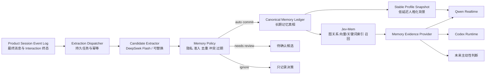
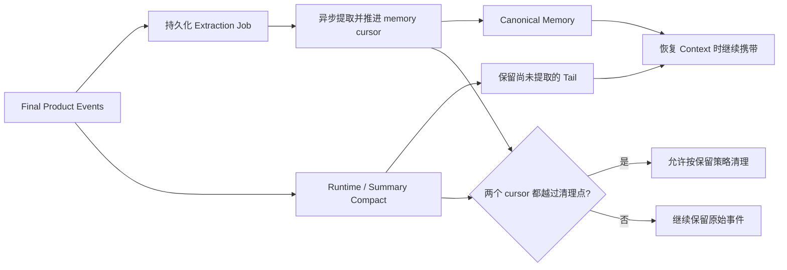

# BoxAgent Phase 4：长期记忆设计

状态：Phase 4A–4C 产品闭环已实现并验证；Phase 4D 已具备确定性回归与真实 E2E 冒烟，规模化质量集、延迟分位数和长期漂移评测仍待完成。

## 一句话结论

BoxAgent 以 Product Session Event Log 作为来源证据，以本地 Canonical Memory Ledger 作为长期记忆真相，以 Jev-Mem 作为可替换的图索引与召回后端；记忆提取在 `interaction.completed` 后异步执行，普通聊天不等待写入，召回采用“稳定画像零额外延迟、按需检索有界等待、失败无记忆降级”的策略。

## 最终产品决策

1. 不要求用户每次说“记住”，否则陪伴关系无法自然积累。
2. 也不把所有隐式候选都弹窗确认，否则产品会不断打断用户。
3. 安全、稳定、由用户直接陈述且无冲突的事实可以静默自动写入，并在记忆看板中提供来源和撤销入口。
4. 敏感、依赖推断、涉及第三方或存在冲突的候选进入待确认区；一次性命令、寒暄和临时状态直接忽略。
5. 用户明确要求记住时走高优先级路径，但仍执行凭据和敏感信息硬拦截。
6. V0 主要记住用户事实与共同承诺，不把 Assistant 的猜测、表达风格或未经验证的工具结果当作事实。
7. 记忆默认属于用户并跨 Session 生效；Session 历史仍按 Session 隔离。

## 系统边界



职责必须保持单一：

| 组件 | 负责 | 不负责 |
|---|---|---|
| Conversation Event Log | 保存可追溯的原始来源 | 不直接充当长期记忆 |
| Candidate Extractor | 从已完成 Interaction 生成原子候选 | 不直接写库、不决定权限 |
| Memory Policy | 隐私、准入、去重、冲突、更新和过期 | 不做图检索 |
| Canonical Ledger | 记忆 ID、版本、状态、来源和删除真相 | 不依赖某个模型 Provider |
| Jev-Mem | 类型评分、关系构建、索引和召回 | 不作为唯一真相或唯一准入裁判 |
| Harness | 为不同执行路径选择和封装相关证据 | 不把全部记忆塞进每轮 Prompt |

## 写入路径

### 显式记忆

用户说“记住……”时：

1. Final User Message 先进入 Session Event Log。
2. 同步进行凭据、验证码、Token 等硬拒绝检查。
3. 在 Canonical Ledger 原子提交记录；这一步完成即可向用户确认“收到并会记住”，不等待 Jev 建图。
4. 后台完成 Jev 索引；失败状态和下一次重试时间继续落在 Canonical Record 中。
5. 如果最终被敏感规则拒绝或索引持续失败，在记忆看板显示失败；不能悄悄宣称已经可检索。

当前 `remember_memory` 已采用上述 durable commit 语义。真实 Jev 验收中前台 26 ms 返回，
随后后台把状态从 `active/index_state=pending` 更新为 `active/indexed`；Canonical 记录在索引
建立前已经可用于本地召回，只有真实索引尝试失败后才转为 `index_failed`。

### 自动记忆

触发点固定为 `interaction.completed` 已成功落盘之后。ASR partial、流式 delta、thinking、截图和工具中间步骤都不触发。

Extractor 输入只包含：

- 本 Interaction 的 Final User Message；
- Final Assistant Message 和真实任务终态，仅用于理解上下文；
- 为消解指代选取的少量近期 Final Message；
- 最多 3 条相关旧记忆，用于去重、更正和冲突判断；
- Session、Interaction、Event ID 和提取器版本。

模型输出结构化候选：

```json
{
  "content": "用户晚上避免喝咖啡，因为会影响睡眠",
  "subject": "user",
  "kind": "preference",
  "durability": "stable",
  "operation": "add",
  "confidence": 0.94,
  "sensitivity": "normal",
  "evidence": [{"event_id": "evt_02", "quote": "我晚上一般不喝咖啡"}],
  "expires_at": null,
  "canonical_slot": "preference:caffeine_evening"
}
```

候选类型使用产品语义：`profile/preference/relationship/goal/commitment/episode/procedure`。Jev 自己的 episodic、semantic、procedural、preference 分数保留为后端索引属性，两套类型不互相替代。

### 三档准入

| 档位 | 条件 | 动作 |
|---|---|---|
| 自动写入 | 用户直接陈述；长期有用；普通敏感度；证据可引用；无未解决冲突 | 静默写入，记忆看板可见并可撤销 |
| 请求确认 | 推断所得、高敏感、涉及第三方、来源模糊或冲突无法确定 | 进入待确认区；只在合适时机合并询问，不逐条打断 |
| 忽略 | 寒暄、一次性命令、临时情绪、Assistant 猜测、未验证工具结果 | 不进入长期记忆 |

明确更正如“我不再喜欢 A，以后改成 B”可以自动 `supersede` 普通敏感度旧记录，但必须保留新旧来源和版本，不做原地覆盖。

## Canonical Memory Ledger

继续采用本地追加式文件，不在当前阶段引入云数据库或 Docker：

```text
<BOXAGENT_DATA_DIR>/memory/
├── ledger/
│   ├── events.jsonl              # add/update/supersede/delete/review 决策
│   └── snapshot.json             # 可重建的当前 active records
├── extraction/
│   ├── jobs.jsonl                # pending/running/completed/skipped/failed
│   └── scan-checkpoint.json      # 崩溃恢复扫描位置
├── profiles/
│   └── stable-profile.json       # Qwen 建连时使用的有界画像
└── jev/                           # Jev 自有图、向量和审计文件
```

Canonical Record 至少包含：

```text
memory_id, revision, canonical_slot, content, subject, kind, status,
confidence, sensitivity, source_mode,
source_session_id, source_interaction_id, source_event_ids,
created_at, updated_at, expires_at,
supersedes_revision, lineage_event_ids, backend_links, metadata.index_state
```

`status` 至少支持 `active/pending_review/superseded/rejected/deleted/index_failed`。删除先在 Canonical Ledger 写 tombstone，使 Context 检索立即不可见，再异步清理 Jev 图、向量和关键词索引。

## 召回与 Context 注入

### Qwen 前台

- 新建或重连 Realtime Session 时，从 Canonical Ledger 生成小型 Stable Profile Snapshot，包含少量高价值、低敏感的稳定偏好和关系信息。
- 同一 Realtime 连接中，新记忆对应的原始对话已经存在，不需要为了更新画像重连或重写 System Prompt。
- 用户明确问“你还记得……”或需要具体旧事件时，Qwen 调用 `recall_memory`；工具只返回少量带 ID 的证据。
- 普通聊天不在每轮同步查询 Jev，避免增加首字延迟。

### Codex 后台任务

- Harness 根据任务目标选择是否需要记忆；“打开音乐”“还是按以前那样”等目标可检索首选应用、音量或操作偏好。
- 最多注入 3–5 条相关 Memory Evidence，并携带 `memory_id/kind/content/source`。
- 证据作为 fenced data 放在当前 Turn，不改变 Developer Instructions、权限或安全策略。
- 检索超时则空记忆降级，任务继续执行；不得让记忆服务故障阻塞桌面任务。

### 不同执行路径的关系

稳定画像解决“每轮都查库会慢”的问题，按需检索解决“画像装不下具体经历”的问题。二者都来自同一 Canonical Ledger，因此 Qwen、Codex 和未来主动性判断不会各自维护一套相互冲突的记忆。

## Memory 与短期 Context 压缩的顺序

必须保证长期记忆不会因为短期 Context 压缩而永久丢失，但不能让云端提取阻塞每次 Runtime compact。这里区分三件事：

1. **Codex/Qwen 内部 Context 压缩**：属于 Runtime 自己的 Prompt 管理，可以随时发生；BoxAgent 不依赖其内部摘要作为记忆来源。
2. **BoxAgent Summary Checkpoint**：是可重建的 Context 加速数据，不能删除原始 Product Event。
3. **原始事件保留与清理**：只有这一层是不可逆操作，必须受 Memory Extraction Barrier 约束。

每个 Session 维护两个真实 event cursor：

```text
context_checkpoint_cursor     # Session Summary 已覆盖到哪里
memory_extraction_cursor      # Memory Worker 已完成或明确跳过到哪里
```

需要满足以下不变式：

```text
允许不可逆删除的最大 cursor
= min(context_checkpoint_cursor, memory_extraction_cursor)
```

因此实际链路是：



具体规则：

- `interaction.completed` 落盘时，必须先把幂等 Extraction Job 持久化，再允许该 Interaction 进入未来可压缩区；这里只写本地 JSONL，目标 p95 小于 50 ms，不等待模型和 Jev。
- Summary Checkpoint 可以在提取尚未完成时生成，但恢复 Context 时必须继续附带 `memory_extraction_cursor` 之后的未提取 Final Message，不能只依赖可能丢细节的 Summary。
- 当 Extractor 对某个 Interaction 得出 `completed/skipped/rejected` 终态后，才推进 memory cursor；`failed/pending/running` 都不能推进越过该缺口。
- Session 切换和应用退出只要求 Extraction Job 已 durable enqueue，不等待云模型完成；下次启动由扫盘恢复。这样不会拖慢退出，也不会丢失来源。
- 通常自动提取会在数秒内完成，而 Runtime compact 往往在更长对话后发生；水位机制处理异常、断网和崩溃时的极端顺序。

这保证了两点：同一 Session 中，新偏好在提取完成前仍由近期对话或未提取 Tail 提供；提取完成后由长期 Memory Evidence 接替。上下文可以压缩，但信息不能在“短期已丢、长期未写”的缝隙中消失。

## 延迟预算与降级

当前真实 Jev 观测约为：冷启动 33 秒、写入 2.5 秒、暖查询 0.7 秒。它适合作为后台索引，不适合成为每轮前台回复的同步前置条件。

| 路径 | 用户可感知预算 | 策略 |
|---|---:|---|
| 无需记忆的普通聊天 | 额外 0 ms | 不调用 Memory |
| 显式“记住” | 本地 durable enqueue p95 < 50 ms | 后台提取和建图；UI 展示 pending/indexed |
| 自动提取 | 不阻塞用户；完成 p95 < 15 s | Interaction 后异步，崩溃可恢复 |
| Stable Profile 读取 | p95 < 100 ms | 只读本地 snapshot；失败使用空画像 |
| Qwen 显式 recall | 本地候选 p95 < 100 ms；Jev hard timeout 1 s | 超时返回本地证据或“暂时无法回忆” |
| Codex 任务 recall | hard timeout 2 s | 超时为空，后台任务继续 |

Engine 不因 Jev 冷启动阻塞桌宠出现、Qwen 建连或用户第一句话。显式写入先提交 Canonical，
自动写入本来就在后台任务内；召回超时或冷启动期间由 Canonical Snapshot 提供本地 fallback。

## 并发、幂等与恢复

- Extraction Job 幂等键：`extractor_version + session_id + interaction_id + source_hash`。
- 正常路径由 `interaction.completed` 立即投递；Engine/Worker 重启时从 checkpoint 后扫盘补偿，不在每轮全量扫描。
- Canonical 变更由 `MemoryService` 串行化；同一语义事实使用稳定 canonical slot，避免两个并行 Interaction 互相覆盖。
- 模型超时、无效 JSON 或 Jev 故障只使 Job 进入 `failed/index_failed`，不能回退为“把整段原文直接存入长期记忆”。
- Jev 写入失败时 Canonical Record 仍可存在，但必须标记 `index_failed`；本地精确查询仍可用，图召回等待重试。

## 隐私与用户体验

- 设置页提供“自动记忆”总开关、敏感类别开关和“本 Session 不记忆”。
- 自动记忆默认不语音播报，只在桌宠或记忆入口显示轻量提示；用户可以撤销。
- 记忆看板展示内容、类型、来源原句、来源 Session、自动/显式、更新时间和状态。
- 用户问“你为什么知道”时返回来源，而不是模型编造理由。
- 密钥、密码、Token、验证码和认证材料在进入 Extractor 前确定性删除，并硬拒绝写入。
- 第三方隐私和高敏感个人信息默认不自动写入。

## 实施顺序

### Phase 4A：Ledger 与异步任务底座

- 实现 Canonical Ledger、Extraction Job Ledger、幂等与崩溃恢复。
- 将显式记忆从“同步直写 Jev”迁移为“本地 durable enqueue → 异步索引”。
- 保持现有记忆看板与精确删除可用。

当前状态：implemented、verified。`interaction.completed` 先幂等追加 Extraction Job，前台
不等待模型；Engine 启动会恢复 `pending/running/failed` 且未超过重试上限的任务。Canonical
Memory 使用追加事件与原子 snapshot，显式记忆也进入同一 Ledger，Jev 仅作为派生索引。

### Phase 4B：自动候选与产品策略

- 使用 Model Gateway + DeepSeek Flash 实现结构化 Extractor。
- 实现三档准入、去重、更新、过期、敏感硬规则和失败重试。
- 记忆看板增加来源、状态与待确认区。

当前状态：implemented、verified。DeepSeek 通过独立 Codex structured turn 输出候选；
确定性策略再次检查 subject、kind、durability、confidence、sensitivity、证据 event/quote 和
凭据模式。普通稳定用户事实自动写入，敏感或证据不足进入 `pending_review`，无效候选拒绝，
精确文本重复跳过。`canonical_slot` 支持语义更正，旧记录保留为 `superseded` 并保存来源 lineage；
原生记忆看板已支持批准、拒绝、索引重试和删除。Extraction 失败使用持久 `retry_wait` 与指数退避，
Jev 索引失败独立按 Canonical metadata 恢复重试。

### Phase 4C：低延迟召回与 Harness 注入

- 生成 Stable Profile Snapshot，并在 Qwen 重连时注入。
- 实现 `MemoryEvidenceProvider`，按需向 Codex 注入 3–5 条证据。
- 增加本地 fallback、Jev 预热、timeout 和 Context trace。

当前状态：implemented、verified。Qwen 新连接从 Canonical Ledger 生成并原子写入
`memory/profiles/stable-profile.json`，再注入有界 Stable Profile；Codex 任务通过
`MemoryContextProvider` 获取最多 5 条相关证据，并由 Harness 作为
fenced evidence 放入当前 Turn。召回优先使用 Jev，失败时回退本地 Canonical Ledger。
删除先写 Canonical tombstone 并刷新 Stable Profile，再清理 Jev，因此 Qwen 新连接、Codex
任务和本地 fallback 立即不可见；更精确的混合检索排序仍可继续优化。

### Phase 4D：质量与体验评测

- 建立包含偏好、更正、冲突、敏感信息、临时状态和跨 Session 回忆的中文测试集。
- 自动写入 precision 目标不低于 90%，凭据误存必须为 0，重复率低于 5%。
- 验证前台无记忆路径无额外延迟，暖 recall p95 不超过 1 秒。
- 验证删除后所有 Context 路径立即不可见，Jev 派生索引最终一致。

当前状态：基础验收 implemented、executed、verified。164 项确定性测试覆盖幂等、崩溃恢复、
提取/索引退避、语义更正、待确认、凭据拒绝、Stable Profile、删除和 Engine IPC。真实隔离 E2E
使用 `deepseek-flash` 与 Jev 依次通过自动提取、跨 Session 召回、更正、批准、拒绝、删除和看板
投影。真实 Codex 任务确认 `memory_evidence_count=1` 且 Runtime Thread 存活；由于验收时 Mac
处于锁屏状态，Computer Use 正确返回 blocked，未把不可观察状态误报为成功。规模化精度、p95
和长期漂移仍属于 Phase 4D 后续评测，不因一次 E2E 通过而视为完成。

## 暂不做

- 不保存原始音频、连续截图或完整工具轨迹；多模态先转成有来源的文本 observation，且默认不自动进入长期记忆。
- 不为每个 Agent Runtime 建独立记忆库。
- 不让 Jev Admission 单独决定产品准入。
- 不在每个 Turn 前调用一次记忆提取模型或把全部图谱注入 Prompt。
- 不在 Phase 4 引入云端主数据库；未来多设备同步只同步 Canonical Ledger，不直接同步 Jev 内部文件。
