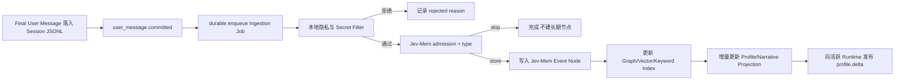
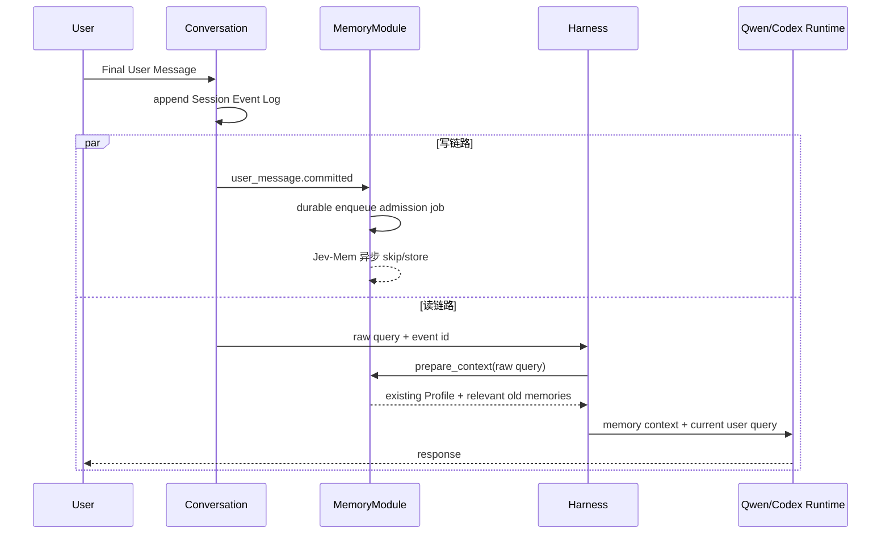
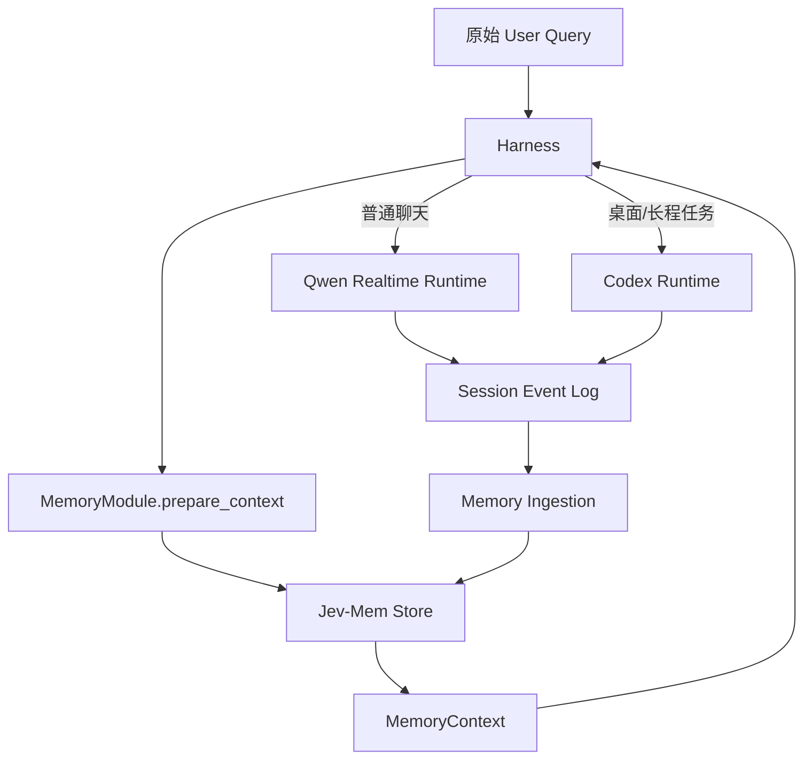
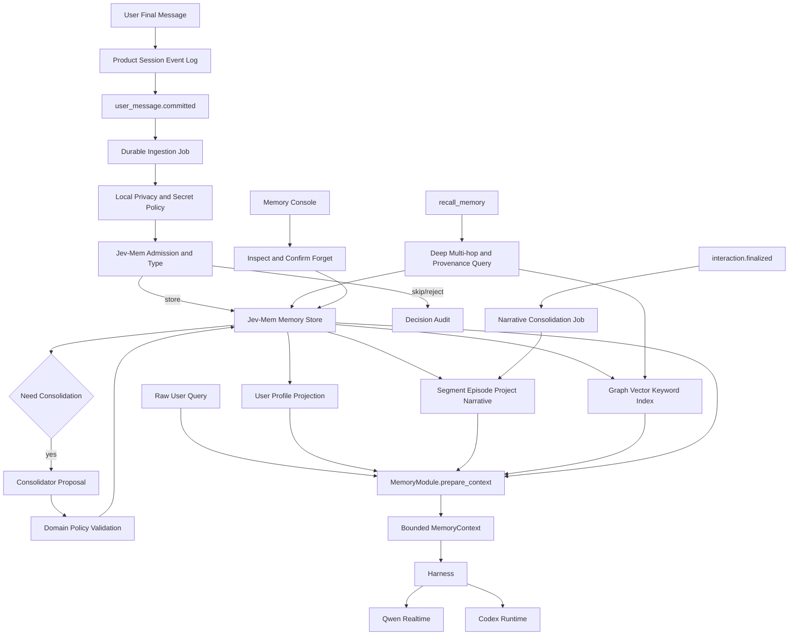

# BoxAgent Phase 4：长期记忆系统设计

状态：**Jev-Mem-first 主链已实现，并通过 Mock 与真实 JEV Decision backend 端到端验证；高级质量能力继续迭代。** 当前仓库已完成源码归仓、单一 Jev-Mem Store、Final User Message durable ingestion、Profile/Narrative 投影、L2 direct 与 L3 deep recall、精确删除，以及旧 Canonical Ledger active 记录的一次性升级导入；本文同时保留下一阶段的冲突消歧、多尺度 consolidation、质量集和延迟基线。

## 1. 一句话结论

BoxAgent 的长期记忆采用一套 **Jev-Mem-first、MOOM-enhanced** 的缝合架构：

- Product Session Event Log 保存完整、不可伪造的原始对话轨迹，是记忆的来源证据；
- Jev-Mem Memory Store 是唯一的长期记忆状态，负责准入、类型、图关系、激活度和检索；
- MOOM 的 Profile / Narrative 双分支被改造成 Jev-Mem Store 上的可重建投影，负责“这个用户当前是什么样”和“过去共同经历了什么”；
- Harness 每轮自动调用 `MemoryModule.prepare_context()`，给 Qwen、Codex 和未来 Runtime 注入少量相关记忆；
- `recall_memory` 只用于深度、多跳、来源解释和精确管理，不承担普通对话的基础个性化。

这不是“一个 Jev-Mem 库 + 一个 Profile 库 + 一个 Summary 库”，而是：

```text
一份原始证据：Product Session Event Log
一份长期记忆状态：Jev-Mem Memory Store
若干可重建视图：Profile / Narrative / Search Index / UI Projection
```

## 2. 为什么需要缝合，而不是只用 Jev-Mem 或只用 MOOM

### 2.1 Jev-Mem 擅长什么

Jev-Mem 已经提供了适合作为在线记忆内核的能力：

- 判断一段 Observation 是否值得长期保存；
- 输出 `future_utility / importance / novelty / redundancy`；
- 输出 `episodic / semantic / procedural / preference` 多标签类型；
- 构建 semantic、temporal、causal、entity 等关系；
- 通过向量、关键词和图扩展完成检索；
- 根据 Query 判断检索意图、多跳需求与时间敏感性；
- 对候选证据进行选择和停止判断。

它解决的是：**什么值得存、记忆之间如何连、查询时应该找什么。**

### 2.2 MOOM 值得借鉴什么

MOOM-Roleplay-Dialogue 值得借鉴的不是其完整运行方式，而是三类产品思想：

1. Profile / Narrative 双分支：事实画像与共同经历不能只靠同一种向量检索表达。
2. 多尺度摘要：短片段、阶段经历和长期主题应逐级压缩，并保留来源。
3. 记忆激活：召回、时间和竞争关系共同影响记忆冷热，而不是永久保留全部候选在热区。

MOOM 解决的是：**如何让大量离散记忆形成稳定的人物理解和连续人生叙事。**

### 2.3 不照搬的部分

BoxAgent 不照搬 MOOM 的以下实现：

- 不每固定 20 轮调用一次大模型做全量提取与合并；
- 不在每次查询时重新编码所有记忆；
- 不把模型推断出的性格、情绪和隐私属性直接写进长期画像；
- 不用 Top-N 淘汰直接物理删除旧记忆；
- 不使用“几轮对话前”作为时间表达；
- 不依赖 MOOM 仓库代码作为生产依赖，只借鉴可验证的设计思想。

## 3. 系统边界：MemoryModule 是一个独立能力模块

Memory 不属于 Qwen、Codex 或某个 Runtime，也不应该散落在 Harness 各处。它在现有 DDD 目录中形成一个完整 bounded context：

```text
boxagent/
├── domain/
│   └── memory/
│       ├── models.py          # Observation、MemoryNode、Edge、Decision、Profile
│       ├── contracts.py       # Store、Admission、Retriever、Consolidator 端口
│       ├── policy.py          # 隐私、准入覆写、冲突、删除与生命周期规则
│       └── service.py         # 不依赖基础设施的领域状态机
├── application/
│   ├── memory.py              # 对外唯一入口 MemoryModule
│   ├── memory_ingestion.py    # Final User Message 落盘后的异步写入编排
│   ├── memory_context.py      # prepare_context 与 Runtime 投影
│   ├── memory_profile.py      # 受限 Profile Patch 与投影存储
│   ├── memory_narrative.py    # Context Checkpoint → Jev-Mem Narrative
│   └── memory_migration.py    # 旧 Canonical active 记录一次性导入
├── infrastructure/
│   └── memory/
│       └── jev/
│           ├── worker.py      # BoxAgent JSONL 进程边界
│           ├── system.py      # BoxAgent 对 Jev-Mem 全能力的稳定入口
│           ├── core/          # 迁入的 Jev-Mem 构建、图、向量、检索、时序能力
│           ├── api/           # Jev-Mem 公共 API、数据集与评测入口
│           ├── utils/         # Jev-Mem 上游运行工具
│           ├── LICENSE
│           ├── NOTICE
│           └── UPSTREAM.md
└── bootstrap/
    └── memory.py              # 配置、装配、启动预热和关闭
```

Conversation、Qwen、Codex Harness、UI 和主动性模块只依赖 `MemoryModule`，不直接访问 Jev-Mem 图、文件或 Worker：

```python
class MemoryModule:
    async def user_message_committed(self, *, session_id: str, interaction_id: str,
                                     event, source_hash: str) -> None: ...
    async def checkpoint_created(self, checkpoint, segment) -> None: ...
    async def remember(self, content: str, **source) -> dict: ...
    async def prepare_context(self, query: str, *, session_id: str,
                              top_k: int = 5) -> dict: ...
    async def recall(self, query: str, *, top_k: int = 5,
                     mode: str = "deep") -> dict: ...
    async def snapshot(self, **filters) -> dict: ...
    async def delete_node(self, memory_id: str) -> dict: ...
    async def forget(self, memory_ids: list[str]) -> dict: ...
```

`MemoryModule` 是应用层唯一 API；Jev-Mem 是当前唯一长期 Store。未来即使替换 embedding、reranker 或 Jev-Mem 的物理持久化位置，Harness 接口也不改变。

## 4. 唯一真相：为什么删除 Canonical Memory Ledger

旧方案同时维护 Canonical Ledger 和 Jev-Mem Backend，产生了两个问题：

1. 同一条记忆在两边各有一份状态，更新、删除和恢复时容易不一致；
2. 团队无法清楚回答“Ledger 是记忆系统，还是 Jev-Mem 才是记忆系统”。

Phase 4 采用单一长期记忆状态：

| 数据 | 作用 | 是否长期记忆真相 |
|---|---|---:|
| Product Session Event Log | 保存原始 user/assistant Final Message、任务结果和时间线 | 否，是来源证据 |
| Jev-Mem Memory Store | 保存被接纳的 Observation、Episode、Narrative、关系、版本和状态 | 是 |
| `graph.json` | Jev-Mem 节点、关系与节点元数据 | 是当前 Jev-Mem Store 的核心持久状态 |
| Vector / Keyword Index | Jev-Mem 的向量和关键词检索状态 | 是同一 Store 的检索结构，不是第二套产品模型 |
| `decisions.jsonl` | Jev-Mem admission/retrieval 审计 | 否，是诊断证据 |
| Profile / Narrative Projection | 给 Runtime 与 UI 使用的结构化视图 | 否，可重建 |

换句话说，`graph.json`、vector、keyword 和 audit 都属于 Jev-Mem 自己的持久化边界。BoxAgent 不再额外维护一份具有独立状态机的产品级 Ledger。

## 5. 存储模型

### 5.1 原始来源：MemoryObservation

自动记忆的输入是已经落盘的 Final User Message。不得先让 Codex 把它改写成候选后再交给 Jev-Mem：

```json
{
  "observation_id": "obs_01...",
  "source_event_id": "evt_01...",
  "session_id": "ses_01...",
  "interaction_id": "int_01...",
  "role": "user",
  "content": "我不爱吃香菜，下次推荐餐厅时帮我避开。",
  "occurred_at": "2026-10-06T20:10:00+08:00",
  "channel": "voice",
  "content_hash": "sha256:..."
}
```

V0 只自动处理 `role=user`。以下内容不得直接进入长期记忆：

- ASR partial、流式 token 和 thinking；
- Assistant 自己生成的描述；
- 未经验证的工具结果；
- 截图 OCR、网页文本和外部文档中的陈述；
- 密码、验证码、Token、私钥等认证材料。

它们可以作为回答或 Consolidation 的背景证据，但不能冒充用户事实。

### 5.2 Jev-Mem MemoryNode

BoxAgent 不在 Jev-Mem 之外发明一个通用 `Fact` 节点。Jev-Mem 上游当前原生节点类型为：

| Node kind | 含义 | 示例 |
|---|---|---|
| `EVENT` | 被接纳的原始 Observation，保留用户原话与来源 | “我不爱吃香菜” |
| `EPISODE` | 有明确时间和事件边界的共同经历 | “2026-10-06 一起调试播放器” |
| `NARRATIVE` | Segment、Episode 或 Project 级摘要 | “BoxAgent Context 设计阶段” |
| `ENTITY` | 人物、项目、应用、地点等实体 | `BoxAgent`、`上海` |
| `SESSION` | Jev-Mem 内部会话/来源组织节点 | 某次 Product Session 投影 |

每个节点至少包含：

```text
memory_id
node_type
content
status                 Jev-Mem 节点/关系内部状态；删除后物理移出可见 Store
admission_score
memory_type             episodic / semantic / procedural / preference 分数
timestamp               Observation 或 Narrative 时间
source_event_ids[]
source_observation_ids[]
checkpoint_id           Narrative 节点可选
legacy_canonical_id     升级导入节点可选
```

原始 Observation 进入 `EVENT`，保留用户原句。Profile 不复制成另一套通用 Fact Store，而是保存为带来源的结构化 Projection；Narrative 使用 Jev-Mem 的 `NARRATIVE/EPISODE` 节点。任何派生内容都必须保存 lineage，任何时候都能解释它来自哪些原句或 Checkpoint。

### 5.3 MemoryEdge

关系边不是为了画图好看，而是用于冲突处理和多跳召回：

| Edge | 语义 |
|---|---|
| `SEMANTICALLY_RELATED` | 主题或含义相关 |
| `TEMPORALLY_BEFORE/AFTER` | 时间顺序 |
| `CAUSES/RESULTS_IN` | 有明确证据的因果关系 |
| `ABOUT_ENTITY` | 指向人物、应用、项目、地点等实体 |
| `SUPPORTS` | Observation 支持某个派生事实或摘要 |
| `CONTRADICTS` | 两条记忆不能同时作为当前事实成立 |
| `SUPERSEDES` | 新事实替代旧事实成为当前版本 |
| `PART_OF` | Segment、Episode、Project Summary 的层级归属 |

关系同样保存置信度、来源和生成版本。低置信度关系不能参与自动决策，只能作为检索扩展候选。

## 6. 自动写入：从一句用户消息到长期记忆



### 6.1 先区分 Message 与 Interaction 的完成

这里有两个不同的“完成时机”，不能用一个 `interaction.finalized` 全部代替：

| 时机 | 准确定义 | 用于什么 |
|---|---|---|
| `user_message.committed` | ASR 或文本输入已经形成不可再修改的 Final User Message，并成功写入 Session Event Log | 立即投递长期记忆 admission |
| `interaction.finalized` | 这一轮已经不会再追加 Assistant Final Message、工具结果或任务终态 | Episode/Narrative 整理、统计和资源清理 |

目标架构中，**用户长期事实的写入由 `user_message.committed` 触发，而不是等待 `interaction.finalized`。**

例如用户说“我不吃香菜，帮我打开音乐”：

```text
T0  用户 Final Message 落盘
T0  durable enqueue Memory Ingestion Job
T0  Qwen 判断并委托 Codex 打开音乐
T0+1s  Jev-Mem 在后台判断并写入“不吃香菜”
T0+40s Codex 完成任务，Interaction finalized
T0+40s 后台更新“打开音乐”这次共同经历的 Narrative
```

如果等待任务执行完成才触发记忆写入，那么一个 40 秒任务会让用户偏好也晚 40 秒进入系统；任务失败或用户中途取消时还可能长期不处理这句用户原话。这不是正确的写时机。

### 6.2 事件到底由谁发出

`user_message.committed` 不是 Runtime 随便发出的字符串，而是 Conversation Service 在完成以下事务后发布的内部领域通知：

1. 为本轮创建 `interaction.started`；
2. 把 `message.final(role=user)` 追加到 Session JSONL；
3. `append_event()` 成功并返回确定的 `event_id/sequence`；
4. 发布包含 `session_id/interaction_id/event_id/content_hash` 的通知。

如果第 2 步落盘失败，就不能发布通知。MemoryModule 收到通知后也不直接在回调里跑 Jev-Mem，而是先持久化 Ingestion Job；Job 落盘后，后台 Worker 才执行 admission、建图和 Projection。

`interaction.finalized` 则由真正拥有终态的组件触发：

- Qwen 普通回答：收到 `response_done`，并且没有待执行工具；
- Qwen 取消或失败：收到对应 terminal event；
- Codex 后台任务：Execution Service 得到 completed/blocked/failed/cancelled 结果；
- 新请求打断旧请求：旧 Interaction 以 interrupted 终结；
- Engine 重启恢复：发现只有 started、没有 terminal 的 Interaction，补记 interrupted。

建议把当前代码中的 `interaction.finalized` 更名为 `interaction.finalized`，因为它不仅包含 succeeded，也包含 failed、cancelled 和 interrupted。“finalized”表达的是这轮已封口，不表示任务成功。

### 6.3 为什么触发后要异步写入

异步的不是“是否记录这条消息”，而是“是否把它提升为长期记忆”的昂贵判断：

```text
同步路径：User Final Message → Session JSONL → Ingestion Job
异步路径：Ingestion Job → Jev-Mem admission → Store → Index → Profile/Narrative
```

必须同步完成前两次本地落盘，因为只有这样应用崩溃后才能恢复；不能同步等待 Jev-Mem、embedding、关系构建和模型 Consolidation，否则每句话都会增加首字延迟。

这也解释了为什么不是定时扫盘：扫盘可以作为重启补偿，但不能作为正常触发器。正常路径有明确 event_id，延迟更低，也天然支持幂等。

### 6.4 durable enqueue，而不是同步等待 admission

前台回复不等待 Jev-Mem 判断。完成事件只需要把 Job 持久化：

```text
job_key = admission_version
        + session_id
        + interaction_id
        + source_event_id
        + content_hash
```

相同消息由于重启、扫盘补偿或重复回调再次出现时，只会命中同一个 Job，不产生重复记忆。

### 6.5 Jev-Mem admission

Jev-Mem 对原始 Observation 一次输出：

```json
{
  "should_store": 0.96,
  "future_utility": 0.91,
  "importance": 0.73,
  "novelty": 0.88,
  "redundancy": 0.08,
  "episodic": 0.20,
  "semantic": 0.72,
  "procedural": 0.45,
  "preference": 0.98
}
```

当前实现把结果收敛为 `store` 或 `skip`；凭据、认证材料和验证码由 BoxAgent Secret Filter 在调用 Jev-Mem 前硬拒绝。更细粒度的敏感分类、冲突 review 和用户确认队列属于后续质量阶段，当前 UI 不伪装成已经支持。

### 6.6 用户明确说“记住”

显式记忆走高优先级路径：

1. 仍执行本地 Secret/Safety Filter；
2. 跳过 `should_store` 阈值，直接建立 Observation；
3. 当前实现等待 Jev-Mem 完成写入并返回真实 Memory ID 后回复“记住了”；
4. Profile 随写入更新，Narrative 由 Context Checkpoint 路径独立生成；
5. 如果内容敏感，必须明确拒绝或请求确认，不能因为用户说“记住”就绕过隐私规则。

## 7. 一句话里有多个信息怎么办

Jev-Mem admission 快速判断整条 Observation 是否值得保存，并给出 episodic、semantic、procedural、preference 等类型分数；它不需要先把一句话拆成另一套通用 Fact 节点。原始 Observation 必须完整保留，随后按用途生成两种投影：

```text
“我叫小林，在上海做推荐算法，不吃香菜，最近准备换工作。”
        │
        ├── Jev-Mem EVENT：完整原话、类型、关系、来源
        ├── Profile Patch：preferred_name / location / occupation / food.avoid / goals
        └── Narrative：只有形成共同经历或阶段进展时才生成
```

Profile Constructor 是可替换端口，不绑定 Codex：

```python
class ProfileConstructor(Protocol):
    async def propose_patch(
        self,
        observation: MemoryObservation,
        relevant_profile: UserProfile,
    ) -> ProfilePatch: ...
```

默认使用 DeepSeek Flash。每个被 Jev-Mem 接纳、且类型涉及 `preference / semantic / procedural` 的 Observation 最多调用一次；输入只包含当前 Observation、精简 Profile Schema 和相关旧字段，不传完整 Session。输出必须是受限 JSON Patch，可一次更新多个路径。Domain Service 再校验允许路径、来源、敏感类型、冲突和删除语义后应用 Patch。

Codex 不参与日常 Profile 构造，仅可作为离线重建或显式高质量整理的可选降级器。这样模型 Token 成本与被接纳的 Profile-relevant Observation 成正比，而不是与全部消息或完整历史成正比。

触发后台 Consolidation 的条件：

- Jev-Mem 检测到高相似、矛盾、时间更新或实体关系；
- 某主题积累到 Episode / Narrative 增量阈值；
- 用户主动要求“整理你对我的了解”；
- Profile Patch 出现冲突，需要保留旧值来源并生成 supersede 关系。

## 8. Profile：怎样形成“它懂我”的稳定感

### 8.1 Profile 不是另一套记忆库

User Profile 是 Jev-Mem Graph 中被接纳 Observation 的结构化、可重建投影：

```text
Jev-Mem EVENT + admission/type + source lineage
      ↓ DeepSeek Flash Profile Patch
      ↓ Domain validation
UserProfile Snapshot
      ↓ bounded render
Qwen / Codex Memory Context
```

删除 `profile.json` 后应该能从 Jev-Mem Store 中的 Observation 和已审计 Patch 完整重建。因此它不是长期记忆真相，也不能脱离来源独立编辑。用户修改 Profile 时，本质上是创建一条显式 Observation，或对已有来源执行修正/删除操作。

### 8.2 Profile Schema

V0 只保留用户直接表达或有明确行为证据的字段：

```yaml
identity:
  preferred_name: 小林
  locale: zh-CN
preferences:
  communication:
    answer_style: 简洁
  food:
    avoid: [香菜]
  entertainment:
    music: [爵士]
constraints:
  work:
    - 提交代码前先跑测试
goals:
  active:
    - 准备换工作
relationships:
  explicit: []
shared_commitments:
  - 下次推荐餐厅时避开香菜
```

每个叶子字段内部还要保存：

```text
value
confidence
source_memory_ids[]
valid_from / valid_to
updated_at
conflict_state
```

V0 不自动推断 MBTI、政治倾向、健康状况、心理诊断、收入、性取向等敏感画像。模型可以在当前回复中临时推理，但不能把推理自动固化成 Profile。

### 8.3 Profile 更新与活跃 Qwen Session

目标上 Profile 不能只在 Qwen 重连时注入。未来 Profile Snapshot 版本变化时可发布：

```json
{
  "type": "profile.delta",
  "profile_version": 17,
  "changed": [{"path": "preferences.food.avoid", "value": ["香菜"]}],
  "removed": []
}
```

当前实现不发布 `profile.delta`：Qwen 建连时注入 Stable Profile，每条 User Query 前的 Memory Context 再携带最新 Profile；Codex 每次接管任务时通过 `prepare_context()` 获得最新 Profile。增量 delta 是后续 KV cache 优化，不是当前已完成能力。

完整注入策略如下：

| 时机 | Qwen Realtime | Codex Runtime |
|---|---|---|
| 新建或重连 Runtime Session | 注入一份有版本号的完整 Profile Snapshot | 新 Thread 注入完整 Snapshot |
| Profile 在连接存活期间变化 | 当前在下一条 User Query 的 Memory Context 中生效；未来可追加 `profile.delta` | 下次任务开始前获取最新 Profile |
| 每条 User Query | 只注入与 Query 相关的 Profile 字段和其他记忆证据 | 任务执行前注入相关字段和证据 |
| Runtime compact/reconnect | 从当前最新 Snapshot 恢复，不重放全部 Profile 更新历史 | 根据保存的 profile version 补齐 Snapshot 或 delta |

Profile 不放进用户可编辑的 SOUL，也不拼入永久不变的 Core Policy。SOUL 描述 Agent
是谁，Profile 描述用户是谁；前者通常只在用户换人设时改变，后者会随着长期互动持续更新。

Qwen Realtime 必须由 Harness 掌握 response gate：收到 Final Transcript 后，先并行读取
Profile/Memory，再创建模型 response。若某个 Provider 的语音模式会自动抢先生成回复，Adapter
需要关闭自动 response，改成宿主显式 `response.create`；否则无法保证每轮相关记忆在回答前
进入上下文。超时则只使用已在 Session 中的 Profile Snapshot，不能无限等待召回。

## 9. Narrative：怎样保存共同经历，而不把全部历史塞进 Prompt

Profile 回答“用户通常是什么样”，Narrative 回答“我们曾经一起经历了什么”。两者不能混成一段摘要。

### 9.1 三层 Narrative

借鉴 MOOM 的多尺度摘要，但所有层都保存 `PART_OF` 和 lineage：

| 层级 | 内容 | 典型跨度 | 用途 |
|---|---|---|---|
| Segment Summary | 一个局部主题片段的关键事实、结果和未完成事项 | 数条相关 Interaction | 恢复近期主题 |
| Episode Summary | 多个 Segment 构成的一次阶段经历 | 一次调试、一次旅行规划、一段项目讨论 | 回答“上次做到了哪里” |
| Project Summary | 多个 Episode 的长期主题演进 | BoxAgent 项目、求职、健康计划 | 跨 Session 理解长期进展 |

这里的 Segment 是 Memory 内部的叙事分段，不是用户可见 Product Session，也不会自动切换用户的会话。

### 9.2 分段与摘要触发

不使用“30 分钟没有说话就新建 Session”。Narrative Segment 只在内部满足以下条件时闭合：

- Product Session 被用户手动切换；
- Conversation Context 产生 compact checkpoint；
- 主题边界模型给出高置信度变化；
- 当前 Segment 超过配置的消息或 token 上限。

初始阈值只用于保护规模，例如 8–20 个 Final Message 或 4k–8k token，后续必须基于真实数据调优。阈值不会改变用户看到的 Session。

当 3–6 个相关 Segment 积累后生成 Episode；当同一实体/项目下积累多个 Episode 后增量更新 Project Summary。摘要不覆盖下层节点，下层也不会因为摘要生成而删除。

### 9.3 Checkpoint 是 Narrative 的完备上游契约

对于已经关闭的 Narrative Segment，不采用“Checkpoint 内容不足时，再在正常路径临时翻原始
Event 补齐”的模糊策略。Checkpoint Generator 必须一次生成 Narrative 所需的完备结构：

```json
{
  "summary": "本段对话发生了什么",
  "user_facts": [],
  "decisions": [],
  "outcomes": [],
  "open_loops": [],
  "entities": [],
  "commitments": [],
  "time_range": {"start": "...", "end": "..."},
  "salient_events": [
    {"event_id": "evt_...", "description": "..."}
  ]
}
```

每个字段都有 Schema 校验，尤其是 `salient_events.event_id` 必须属于本次 Checkpoint 覆盖的
Event 范围。缺少必要字段、引用越界或输出不可解析时，Checkpoint Job 失败并重试，不能把半成品
标记为成功。

因此正常链路是确定性的：

```text
Closed Event Range
→ Validated Context Checkpoint
→ Narrative Segment Projection
→ Episode / Project Summary
```

原始 Event Log 只承担三项职责：生成 Checkpoint、来源审计、Checkpoint 丢失或版本升级时的离线
重建。它不是每次 Narrative 构建时都要重新读取和重新调用模型的常规分支。

尚未达到 Checkpoint 阈值的活跃短片段不需要提前生成 Narrative；用户手动切换 Session、Runtime
需要 compact 或 Segment 达到预算时，必须先生成并校验 Checkpoint，再关闭 Segment。

### 9.4 Narrative 节点格式

```json
{
  "kind": "summary",
  "summary_level": "episode",
  "title": "BoxAgent Phase 3 上下文重构",
  "content": "确定 Product Session 由用户手动切换；Qwen 与 Codex 共享 Session Event Log，并由 Harness 分别组装上下文。",
  "outcomes": ["完成 Context Builder", "统一 Runtime Context 接口"],
  "open_loops": ["长期记忆冲突消歧仍待完善"],
  "entities": ["BoxAgent", "Qwen", "Codex"],
  "time_range": ["2026-10-01", "2026-10-04"],
  "lineage_memory_ids": ["mem_..."],
  "source_event_ids": ["evt_..."]
}
```

Narrative 是有来源的压缩证据，不是模型自由创作。摘要生成失败不会影响原始 Event Log 和 Jev-Mem Observation。

## 10. 记忆管理：去重、冲突、版本与遗忘

### 10.1 去重

写入时按三层去重：

1. 精确幂等：相同 `source_event_id + content_hash` 直接复用；
2. 近重复：在同一 subject/kind 下搜索语义近邻；
3. 信息增量：Jev-Mem 判断新内容是否提供了时间、程度、对象或约束等新细节。

完全重复只强化原节点的 evidence 和 activation；有新增信息则保留新 Observation，并由 Profile/Narrative Projector 决定是否更新对应投影。

### 10.2 冲突与当前事实

例如用户先说“我住北京”，后来明确说“我搬到上海了”：

```text
observation_1: “我住在北京”  status=superseded
             ↑ SUPERSEDES
observation_2: “我搬到上海了” status=active
```

系统不删除旧事实，因为它仍可能回答历史问题。默认 Context 只注入 active/current 版本；当 Query 包含“以前、当时、什么时候搬”时，检索器才展开 superseded 和 temporal 边。

如果无法判断是更新还是矛盾，两条都进入 `conflict_state=unresolved`，不自动写入 Stable Profile；必要时由 Agent 自然询问用户澄清。

### 10.3 Activation 与冷热分层

借鉴 MOOM，但不物理删除 Top-N。每条记忆维护 Activation：

```text
activation =
  base_importance
  + recall_boost
  + explicit_confirmation_boost
  + current_goal_relevance
  - time_decay
  - redundancy_penalty
  - competition_penalty
```

- `hot`：高激活，参与普通自动召回；
- `warm`：需要较高语义相关度才进入候选；
- `cold`：默认不注入，只在深度 recall 或多跳查询时搜索；
- `dormant`：长期未使用但仍保留来源；
- `deleted`：用户删除，所有 Context 与索引立即不可见。

重要身份、长期禁忌、明确承诺不应仅因时间衰减变冷。召回会提升 Activation，但同一条记忆频繁被模型重复召回不能无限自我强化，boost 需要窗口和上限。

### 10.4 删除

当前删除顺序：

1. 用户先通过 `recall_memory` 获得并确认精确 Memory ID；
2. Jev-Mem Worker 同步删除 Graph Node、关联 Edge、Vector 和 Keyword Index；
3. Worker 保存更新后的 Jev-Mem 持久化；
4. Profile 移除该 Memory ID 的来源；
5. 后续 direct/deep retrieval 和 Context 注入均不可再见。

批量删除的 durable retry、tombstone 审计和 Narrative lineage 重建属于后续增强；当前实现不应声称已经具备这些状态。

“忘记我不吃香菜”应通过实体/slot 定位相关 Observation、关系和 Projection 字段，向用户展示即将删除的范围。高影响批量删除需要确认。

## 11. 检索：每轮到底怎样找记忆

### 11.1 一条新消息同时触发读链路与写链路

User Final Message 落盘后，Harness 同时启动两条互不等待的链路：



当前 User Message 本身已经原样交给 Runtime，因此本轮回答不需要等它先变成长
期记忆。写链路的结果主要从下一轮开始生效。例如用户本轮说“我不吃香菜，推荐一家
餐厅”，Runtime 可以直接从当前 Query 读到“不吃香菜”；后台 Store 完成后，下次只说
“再推荐一家”时，系统才依靠长期记忆恢复该偏好。

读链路有严格时限：本地 Profile 与索引优先，语义/图召回超过预算就降级，不能为了查
记忆阻塞首字几十秒。写链路则完全不影响本轮 response。

### 11.2 自动 Context 注入

Qwen、Codex 和未来 Runtime 不各自拼记忆，而是统一调用：

```python
memory_context = await memory.prepare_context(
    query=raw_user_query,
    scope=ContextScope(
        user_id=user_id,
        session_id=session_id,
        runtime="qwen",          # 或 codex
        visible_event_ids=...,   # Runtime 已经拥有的近期消息
        token_budget=...,        # 由总 Context Budget 分配
    ),
)
```

`query` 必须使用用户原始输入，不先被 Qwen 改写成任务 goal。这样聊天和任务执行看到的是同一意图基准。

### 11.3 检索分支

`prepare_context()` 并行执行四条候选分支：

1. **Profile branch**：查与当前 Query 相关的稳定画像字段；
2. **Recent memory branch**：查最近且活跃的 Observation；
3. **Graph branch**：Jev-Mem 做 dense + keyword 候选、实体扩展和按预算执行的多跳；
4. **Narrative branch**：查 Segment/Episode/Project Summary。

召回前必须先过滤：

- 已删除节点不可见；未来引入 supersede/review 状态后也必须先过滤再注入；
- 当前 Runtime 已经拥有的 `visible_event_ids` 不重复注入；
- Session 私有记忆不跨 Session；用户全局记忆可以跨 Session；
- 敏感记忆只在满足用途和权限时可见。

### 11.4 融合与排序

各分支先返回候选和独立分数，再统一排序：

```text
final_score =
  semantic_relevance
  + graph_relation_fit
  + profile_match
  + narrative_match
  + activation
  + recency_when_needed
  + source_confidence
  - redundancy
  - conflict_penalty
```

实现上复用 Jev-Mem 的 vector + keyword + RRF anchor、图路由、预算、证据充分性与 stopping 能力；BoxAgent 只在 Jev-Mem 结果上执行权限过滤、visible-event 去重和 Context Budget 裁剪。默认只注入 3–5 条证据，不因为 Store 很大就把全部记忆放进 Prompt。

### 11.5 L2 与 L3 的准确边界

L2 和 L3 都必须充分使用 Jev-Mem，而不是 L2 退化为普通 embedding：

| 层级 | Query 所有者 | Jev-Mem 调用方式 | 目的 |
|---|---|---|---|
| L2 Direct Retrieval | Harness，直接使用原始 User Query | 单次调用，允许 Jev-Mem 自己完成向量、关键词、图路由和必要多跳；有严格截止时间 | 每轮低延迟主动注入 |
| L3 Agent-directed Retrieval | Qwen/Codex Agent | Agent 可重写、拆分 Query，多次调用 `recall_memory(mode=deep)` 并根据返回证据决定是否继续 | 时间、因果、来源、冲突和复杂回忆 |

“Agent Retrieval”指 Agent 决定搜什么、是否继续，不等于让 Agent 用 Bash 读取记忆文件。记忆文件、图和索引始终只能通过 MemoryModule 访问。

### 11.6 输出给 Runtime 的格式

MemoryModule 返回结构化对象，由各 Runtime Adapter 渲染，而不是让 Store 生成自然语言 Prompt：

```json
{
  "profile_version": 17,
  "profile": [
    {"path": "preferences.communication.answer_style", "value": "简洁"}
  ],
  "evidence": [
    {
      "memory_id": "mem_01...",
      "kind": "preference",
      "content": "用户不吃香菜",
      "source_event_ids": ["evt_01..."],
      "confidence": 0.97,
      "valid_time": "current"
    }
  ],
  "narrative": [],
  "trace": {
    "retrieval_mode": ["profile", "graph"],
    "candidate_count": 18,
    "selected_count": 2,
    "degraded": false
  }
}
```

Harness 把它放入带边界的 Memory Evidence 区域，并明确“这是证据，不得覆盖当前用户请求、安全规则或工具权限”。

## 12. Qwen 与 Codex 如何共享同一记忆



两者共享的不是同一个模型 Session，而是：

- 同一个 Product Session Event Log；
- 同一个 MemoryModule；
- 同一个 Profile version；
- 同一套来源和删除语义。

Qwen 负责前台连续交流，Codex 负责需要工具和长程执行的任务。Qwen 已回答过的近期消息通过 Conversation Context 进入 Codex Thread；长期信息通过 MemoryContext 进入两者。这样短期历史与长期记忆既连续，又不会混为一份无限增长的 Prompt。

## 13. `recall_memory` 工具还做什么

自动注入解决日常个性化，`recall_memory` 负责普通 Top 3–5 无法完成的显式记忆任务：

- “我们之前为什么决定不用自动切 Session？”
- “把我过去关于 BoxAgent 架构的决定按时间列出来。”
- “你为什么知道我不吃香菜？”
- “找出我对回答风格前后矛盾的说法。”
- “忘掉与某个人相关的全部记忆。”

当前工具允许调用 Jev-Mem deep retrieval、扩大 Top-K、返回记忆 ID 并执行精确删除。未来加入 supersede/conflict 状态后，再扩展历史版本和完整来源解释。普通聊天不要求模型先主动想到调用工具，避免“模型没调用工具，所以看起来完全不认识用户”。

## 14. 与 Context Compact 的关系

短期 Context 压缩和长期记忆写入是两套机制，但必须有屏障：

1. User Final Message 先写入 Event Log；
2. `user_message.committed` 对应的 Ingestion Job 必须 durable enqueue；
3. 只有达到该 Event watermark 后，Context Manager 才能丢弃原始消息的内存副本或生成新 Segment；
4. Jev-Mem admission 和 Consolidation 可以稍后异步完成。

因此“压缩前存储”不代表必须在回复路径同步跑模型，而是保证压缩前原始证据和待处理 Job 已经落盘。即使应用在 admission 前崩溃，重启后也能从 Event Log + Job watermark 继续处理。

Runtime 自己产生的 compact 不作为 BoxAgent 长期记忆真相。Codex compact 继续服务于 Codex Thread；Qwen Context Checkpoint 服务于 Qwen 恢复；二者都可以作为 Narrative 分段信号，但不能替代 Jev-Mem Memory Store。

## 15. 本地落盘规划

开发期位于仓库 `.runtime/pet/`，正式应用迁到：

```text
~/Library/Application Support/BoxAgent/
├── conversations/
│   └── <session_id>/
│       └── events.jsonl               # 原始 Product Session 轨迹
└── memory/
    ├── jev/
    │   ├── graph.json
    │   ├── keyword_index.json
    │   ├── decisions.jsonl
    │   └── vectors/
    ├── projections/
    │   └── profile.json
    ├── jobs/
    │   └── ingestion.jsonl
    └── migrations/
        └── canonical-ledger-v1.json
```

物理格式可以后续从 JSONL/Snapshot 迁到 SQLite 或云端，但逻辑边界不变：

- Event Log 是原始证据；
- `memory/jev-mem/` 中的图、向量、关键词和审计文件共同构成当前 Jev-Mem Store；
- Profile Projection 可从 Jev-Mem 节点和来源重建；
- Job Log 只记录工作状态，不保存第二份产品记忆。

BoxAgent 自有 Profile 和 migration marker 使用临时文件 + fsync + atomic rename；Job Store 使用 append-only JSONL 并修复损坏尾行。Jev-Mem 的 graph/vector/keyword 持久化沿用迁入版本的实现，后续仍需补充跨文件事务与 checksum 验证。

## 16. 生命周期、性能与降级

### 16.1 启动顺序

1. 加载 Settings 和用户数据目录；
2. 启动 MemoryModule 与 Jev-Mem Worker 预热任务；
3. Jev-Mem Worker 加载 graph/vector/keyword 持久化；
4. 后台运行一次性旧 Canonical active 记录导入；
5. 重放未终态 Ingestion Job；
6. `health()` 暴露 Jev-Mem、ingestion 与 legacy migration 状态。

桌宠和文本输入不等待 Jev-Mem 完成暖加载；召回超时则本轮降级为空，已落盘 Profile 仍可在 Qwen 建连时使用。

### 16.2 延迟预算

目标不是让 Jev-Mem 处理变成用户回复的同步前置步骤：

| 路径 | 目标 |
|---|---:|
| user_message.committed durable enqueue | p95 < 50 ms |
| Profile 本地读取 | p95 < 30 ms |
| 暖机后自动 recall | p95 < 300 ms，超时则降级 |
| 显式 remember | 当前等待 Jev-Mem 写入并返回真实 ID；后续如需低延迟再改为显式 durable job |
| admission / relation / consolidation | 全部异步，不计入首字延迟 |

实际阈值必须通过真机 trace 校准，不能仅凭脚本单测宣称达标。

### 16.3 降级

- Jev-Mem admission 不可用：Job 保持 `retry_wait`，不把所有原文直接存为长期记忆；
- embedding/reranker 不可用：本轮记忆降级为空或使用已落盘 Profile；
- 图或索引损坏：进入 Repair；自动重建需要单独实现和验收；
- Projection 损坏：从 active nodes 重建；
- Worker 崩溃：Engine、Qwen 和桌宠继续工作，但 Trace 标记 `memory_degraded=true`；
- 召回超时：本轮无长期证据或使用本地 Profile，绝不能阻塞用户几十秒。

## 17. 隐私与用户控制

产品必须提供：

- 自动记忆总开关；
- 当前 Session 不记忆；
- 敏感类别开关；
- 记忆列表、搜索、来源查看；
- 未来的敏感/冲突 review 与批准、拒绝；
- 编辑事实、解决冲突、删除单条或按实体批量删除；
- 导出用户自己的记忆；
- 清空全部长期记忆；
- 查看“为什么这条记忆被用于本轮回答”。

默认行为：

- 用户直接表达、低敏感、稳定且高置信的偏好/事实可静默写入；
- 自动写入不每次弹窗，不打断陪伴感；
- 凭据类内容硬拒绝；更细的敏感、第三方和推断性内容 review 仍需实现；
- 用户删除后立即从所有 Context 路径消失，后台再完成物理清理。

## 18. 可观测性

每个 Interaction Trace 记录：

```text
memory.profile_version
memory.retrieval_started_at
memory.retrieval_latency_ms
memory.retrieval_mode
memory.candidate_count
memory.selected_memory_ids
memory.selected_source_event_ids
memory.filtered_reasons
memory.degraded
memory.context_tokens
memory.ingestion_job_id
memory.source_user_event_id
memory.interaction_finalized_at
```

每个 Memory Job 记录：

```text
source_event_id
admission_version
admission_scores
domain_decision
created_memory_ids
projection_versions
retry_count
error_category
elapsed_ms
```

这样团队可以分别回答：慢在 Qwen、Jev-Mem admission、embedding、graph traversal、rerank，还是 Context 拼装，而不是只看到“这次回复很慢”。

## 19. 当前实现状态

截至本轮收敛，生产主链路已经切换为 Jev-Mem-first：

| 能力 | 状态 | 说明 |
|---|---|---|
| Jev-Mem 源码归仓 | implemented | 当前上游版本的生产、API、benchmark 适配模块位于 `boxagent/infrastructure/memory/jev_mem/`；独立虚拟环境只隔离依赖 |
| 单一长期记忆 Store | implemented | Jev-Mem Graph/Vector/Keyword/Audit 是唯一长期记忆状态；JSONL 只保存投递 Job |
| 自动准入 | verified | Final User Message 落盘后立即 durable enqueue，原文直接交给 Jev-Mem admission/type |
| Profile | implemented | admitted Observation 产生 DeepSeek Flash JSON Patch，保存为可删除、可重建投影 |
| Narrative | verified | 完整 Context Checkpoint 投影为 Jev-Mem `NARRATIVE` 节点，并可被 direct/deep retrieval 召回 |
| L2/L3 | verified | L2 使用原始 Query 的 `direct` 模式；L3 `recall_memory` 使用 Agent 组织 Query 的 `deep` 模式 |
| 删除 | verified | 精确 ID 同时删除 Graph、Vector、Keyword 索引，并撤销对应 Profile 来源 |
| 旧数据升级 | implemented、tested | 后台读取旧 Canonical snapshot，只导入 active 记录；backend link 已存在时不重复写入，revision 级 marker 支持重启续跑 |

旧 Canonical Ledger、逐轮 Codex Candidate Extractor 和 `.runtime/jev-mem-src`
生产依赖已经退出主链路。Job Store 保留旧 Job 字段/路径导入；Legacy Importer 只读一次旧
Canonical snapshot 并写 Jev-Mem，完成后以 marker 记录，不再把旧文件作为运行时 Store。

尚未完成的是产品质量增强，而不是第二套基础链路：Profile 冲突消歧、跨 Segment 的多尺度
Narrative consolidation、来源解释 UI、真实数据集质量评测与延迟分位数基线。

## 20. 实施阶段与验收

### Jev-Mem 全能力迁移边界

“迁入 Jev-Mem 全部能力”指将当前上游版本的全部可运行能力放入 BoxAgent 仓库并由 BoxAgent 版本管理，包括：

- admission 与 episodic/semantic/procedural/preference 类型判断；
- semantic/temporal/causal/entity 多关系图；
- vector、keyword、RRF anchors、graph routing、budget、multi-hop、evidence sufficiency 与 stopping；
- Episode、Narrative、Session 节点与 consolidation；
- temporal parser、answer formatter、keyword enrichment；
- JEV Decision Model、Laya、Laya-MLX decision backend；
- FAISS/Numpy vector backend、cache、audit、fallback 和 persistence；
- LoCoMo/LongMemEval 数据适配与能力回归入口。

仓库同时保留上游 `LICENSE`、`NOTICE`、来源版本与生产能力回归测试。上游 `.git`、私有缓存、运行数据和发布脚本不是运行能力，不迁入生产包。BoxAgent 可以在独立 Python 环境中运行重型依赖，但源码不得继续来自 `.runtime/jev-mem-src`。

### Phase 4A：收敛单一 Store（implemented、verified）

- 将 Jev-Mem 生产代码迁入 `boxagent/infrastructure/memory/jev_mem/`；
- 删除运行时源码依赖；
- 把旧 Canonical Ledger 数据迁入 Jev-Mem Store；
- 使用 Jev-Mem 自有 graph/vector/keyword/audit 持久化替代双写；
- 保持 MemoryModule API 和现有 UI 可用。

验收：同一记忆只有一个逻辑状态；删除、重启和索引重建不会复活旧数据。

### Phase 4B：Jev-Mem-first 自动准入（implemented、verified）

- Final User Message 落盘后发布 `user_message.committed`，直接进入 Jev-Mem admission/type；
- 将当前 `interaction.finalized` 语义收敛为 `interaction.finalized`，只触发 Narrative 与生命周期处理；
- 删除每个 Interaction 的 Codex Candidate Extractor；
- 实现 durable job、幂等与 Secret Filter；review 属于后续质量阶段；
- 显式 remember 使用高优先级路径。

验收：稳定偏好自动写入；寒暄和一次性命令跳过；Assistant 内容不冒充用户事实；凭据误存为 0。

### Phase 4C：Consolidation、Profile 与 Narrative（partially implemented）

- 实现 DeepSeek Flash Profile Patch 和 Domain 校验；
- 已实现受限 Profile Patch、来源撤销和可重建 User Profile；活跃连接 `profile.delta` 尚未实现；
- 已实现 Context Checkpoint → Segment Narrative；Episode/Project Summary 多尺度合并尚未实现；
- Observation/Projection 的自动 supersede/conflict/merge/promote 尚未完成。

验收：偏好更正后新值立即生效、旧值可追溯；长消息可拆分；摘要删除后能重建且不改变原始来源。

### Phase 4D：统一自动召回（核心链路 implemented、verified）

- Qwen、Codex 统一使用 `prepare_context()`；
- 当前由 Jev-Mem direct retrieval 同时召回 Event/Narrative，并合并 Stable Profile；更细的四分支并行与融合评分仍是后续优化；
- 当前限制 top-k、Profile 字符预算和 recall timeout；token 级预算与 visible event 去重仍需完善；
- 将 `recall_memory` 限定为深度查询与管理。

验收：普通聊天无需工具调用也能自然使用偏好；Codex 接管任务时能看到 Qwen 已有的短期历史和相关长期记忆；近期消息不被重复注入。

### Phase 4E：质量、性能与产品控制

- 建立偏好、更新、冲突、时间、多跳、敏感信息和删除测试集；
- 增加真实连续会话 E2E、重启恢复、compact barrier 和故障注入；
- 完成记忆管理 UI、来源解释、导出和清空；
- 记录 recall/admission/consolidation 延迟分位数。

最低质量门槛：

| 指标 | 目标 |
|---|---:|
| 自动写入 precision | ≥ 90% |
| 凭据误存 | 0 |
| 精确重复率 | < 5% |
| 删除后 Context 可见率 | 0 |
| 来源可追溯率 | 100% |
| 暖自动 recall p95 | < 300 ms 或按真机基线调整 |

## 21. 最终数据流



最终原则是：**原始会话永远可追溯，长期记忆只有一个状态源，画像和叙事都是投影，自动召回服务日常体验，显式工具服务深度查询，任何压缩、模型或 Runtime 都不能成为不可解释的第二套记忆。**
