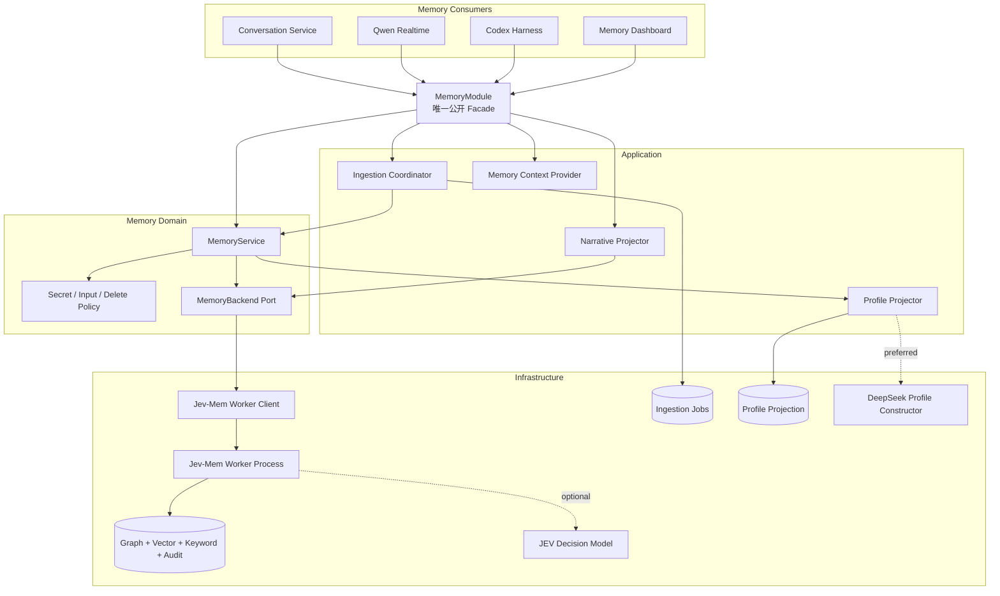
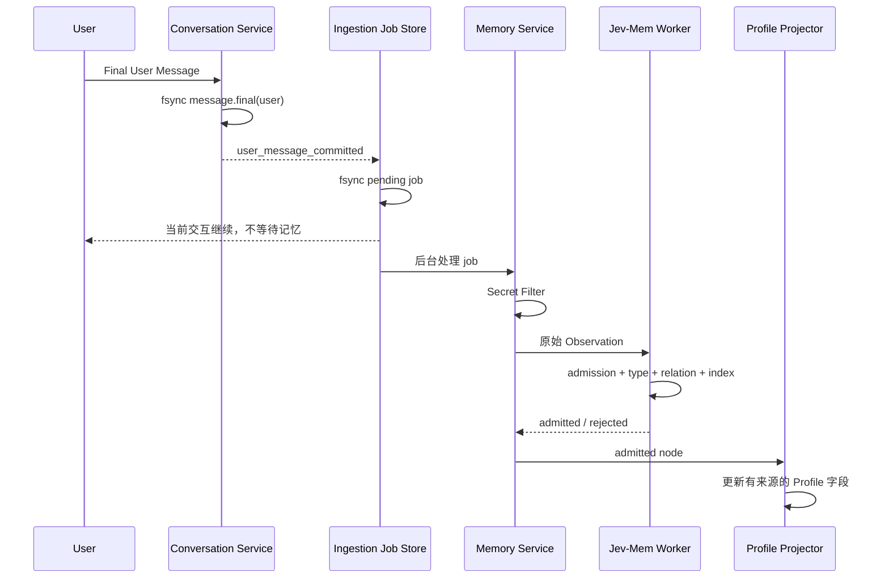
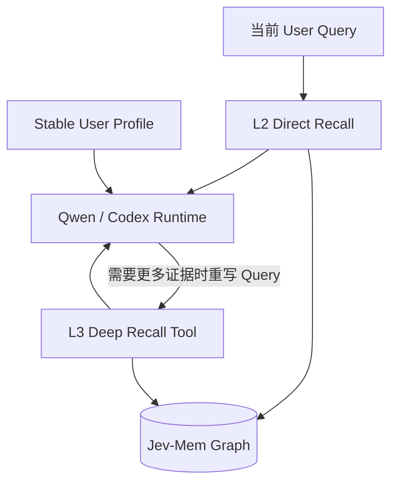

# BoxAgent 长期记忆系统当前设计

## 1. 总体结论

BoxAgent 的长期记忆是一个独立的 **Memory Bounded Context**，通过 `MemoryModule` 向 Conversation、Qwen、Codex 和 UI 提供统一接口。

1. Jev-Mem 是唯一长期记忆 Store。
   1. 保存 Event、Episode、Narrative、关系、向量和关键词索引。
   2. 负责记忆准入、类型判断、建图、直接检索和深度检索。
2. Product Session Event Log 是来源证据。
   1. 保存用户真实说过的话。
   2. 不等同于长期记忆。
3. User Profile 是可重建投影。
   1. 从已被 Jev-Mem 接纳的记忆生成。
   2. 每个字段保留来源 Memory ID。
   3. 删除来源记忆时同步撤销失去来源的字段。
4. Narrative 是 Jev-Mem 中的 `NARRATIVE` 节点。
   1. 当前由完整 Context Checkpoint 投影生成。
   2. 用于表达一段会话经历，而不是重复保存原始消息。
5. 读路径分为两层。
   1. L2 Direct Recall：每轮按原始 Query 自动召回少量记忆。
   2. L3 Deep Recall：Agent 主动重写 Query 后执行多跳、时间或因果检索。
6. 写路径不阻塞当前回复。
   1. Final User Message 与 ingestion job 先持久化。
   2. Jev-Mem 在后台完成准入与建图。
7. Jev-Mem 与 JEV 不是同一概念。
   1. Jev-Mem 是仓库内的完整记忆系统。
   2. JEV Decision Model 是 TypeSafe.ai 提供的外部决策模型，仅承担概率判断。

| 设计问题 | 当前答案 |
| --- | --- |
| 长期记忆真相在哪里 | `<BOXAGENT_DATA_DIR>/memory/jev-mem/` |
| 自动写入输入是什么 | 已持久化的 Final User Message 原文 |
| 谁判断是否值得保存 | Jev-Mem admission；配置真实 JEV 时由 JEV Decision Model 给出概率 |
| 是否使用 Codex 提取日常记忆 | 不使用 |
| Profile 由谁构建 | DeepSeek Flash；不可用时使用有限的确定性规则 |
| Narrative 从哪里来 | Product Session Context Checkpoint |
| 每轮如何使用记忆 | Profile + L2 Direct Recall |
| 复杂回忆如何处理 | `recall_memory` + L3 Deep Recall |
| 删除如何保证安全 | 先召回精确 ID，再按 ID 删除 |

## 2. 核心术语

| 术语 | 定义 |
| --- | --- |
| Memory Bounded Context | 拥有记忆模型、规则、接口和生命周期的独立领域边界 |
| MemoryModule | Application 层唯一公开 Facade，隐藏 Worker、Store、Job 和 Projection |
| Jev-Mem | 已归仓的长期记忆系统，包含准入、图、向量、关键词、检索与持久化 |
| JEV Decision Model | TypeSafe.ai 的概率决策服务，为 Jev-Mem 提供 admission、类型、关系和检索判断 |
| Observation | 一条带来源信息、等待 Jev-Mem 判断的用户原始消息 |
| Admission | 判断 Observation 是否值得进入长期记忆的过程 |
| Memory Type | 对记忆用途的多标签概率：episodic、semantic、procedural、preference |
| Memory Node | Jev-Mem 图中的可检索节点 |
| Memory Edge | Memory Node 之间的时间、语义、因果或实体关系 |
| User Profile | 面向稳定个性化的结构化字段投影 |
| Narrative | 对一段完整经历的结构化摘要节点 |
| L2 Direct Recall | 每轮自动执行的有界低延迟检索 |
| L3 Deep Recall | Agent 按需执行的多跳深度检索 |
| Provenance | 记忆的来源链，包括 Session、Interaction、Event 和 Checkpoint ID |
| Consolidation | 将多条记忆整理为 Episode、Narrative 或更稳定结构的过程 |

## 3. 模块边界



### 3.1 目录结构

```text
boxagent/
├── domain/memory/
│   ├── models.py       # Observation、Ingestion Job、Profile Patch
│   ├── contracts.py    # MemoryBackend、MemoryJobStore、ProfileConstructor
│   ├── service.py      # 写入、检索、删除和降级规则
│   ├── policy.py       # Secret Filter 与输入限制
│   └── evidence.py     # 返回给 Runtime / UI 的安全投影
├── application/
│   ├── memory.py              # MemoryModule Facade
│   ├── memory_ingestion.py    # durable job 与重试
│   ├── memory_context.py      # Profile 与 L2 Context
│   ├── memory_profile.py      # Profile 构造和投影
│   └── memory_narrative.py    # Checkpoint → Narrative
├── infrastructure/memory/jev_mem/
│   ├── client.py       # 异步 JSONL Worker Client
│   ├── worker.py       # Worker 协议入口
│   ├── api/            # Jev-Mem 公共 API
│   ├── core/           # 图、向量、决策、检索、时序与 consolidation
│   ├── LICENSE
│   ├── NOTICE
│   └── UPSTREAM.md
└── bootstrap/memory.py # Memory 唯一生产装配点
```

### 3.2 唯一公开接口

```python
class MemoryModule:
    async def user_message_committed(...): ...
    async def checkpoint_created(...): ...
    async def remember(content, **context): ...
    async def recall(query, *, top_k=5, mode="deep"): ...
    async def prepare_context(query, *, session_id="", top_k=5, consumer=""): ...
    async def stable_profile(*, character_budget=2000): ...
    async def snapshot(**filters): ...
    async def delete_node(memory_id): ...
    async def forget(memory_ids): ...
```

1. Consumer 不得直接访问 Jev-Mem Worker、Graph 或 Profile Store。
2. Worker 协议变化不能扩散到 Qwen、Codex 或 UI。
3. Memory 不可用时由 `DisabledMemoryModule` 提供明确降级结果。

## 4. 数据真相与投影

| 数据 | 作用 | 是否为长期记忆真相 | 是否可重建 |
| --- | --- | ---: | ---: |
| Product Session Event Log | 保存用户原话和交互事实 | 否 | 否 |
| Jev-Mem Graph / Vector / Keyword | 保存被接纳记忆及检索结构 | 是 | 部分索引可重建 |
| Jev-Mem Decisions Audit | 记录准入和检索决策 | 否 | 否，属于审计证据 |
| Ingestion Job Log | 记录异步投递状态 | 否 | 可由 Event 补偿生成 |
| User Profile | 提供稳定个性化字段 | 否 | 是 |
| Context Checkpoint | 恢复短期会话 | 否 | 是 |
| Narrative Node | 保存被接纳的阶段经历摘要 | 是 | 可从 Checkpoint 再投影 |
| Memory Dashboard Snapshot | UI 查询结果 | 否 | 是 |

1. Jev-Mem Store 内部同时包含图与索引，但它们属于同一个存储边界。
2. User Profile 不拥有独立事实。
3. Profile 字段必须引用一个或多个 Jev-Mem Memory ID。
4. Narrative 必须引用 Checkpoint 与对应的来源 Event。

## 5. 写入链路

### 5.1 自动写入



1. 自动写入只接收 `role=user` 的 Final Message。
2. 下列内容不进入自动写入：
   1. ASR Partial；
   2. 流式 Assistant Token；
   3. Assistant 自己生成的陈述；
   4. 未验证的工具中间结果；
   5. 截图、OCR 与网页原文；
   6. 密码、Token、API Key 与验证码。
3. 写入输入保持用户原文，不先经过 Codex 候选提取。

### 5.2 Observation

```json
{
  "content": "我不吃香菜，下次推荐餐厅时帮我避开。",
  "timestamp": "2026-10-07T12:00:00+00:00",
  "metadata": {
    "source": "automatic",
    "role": "user",
    "session_id": "ses_...",
    "interaction_id": "int_...",
    "source_event_id": "evt_...",
    "channel": "voice"
  }
}
```

### 5.3 Durable Job

幂等键定义为：

$$
K_{job}=SHA256(version:session\_id:interaction\_id:source\_hash)
$$

| Job Status | 含义 |
| --- | --- |
| `pending` | 已落盘，等待执行 |
| `running` | Worker 正在处理 |
| `retry_wait` | 临时失败，等待指数退避重试 |
| `completed` | Observation 已完成 admission；结果可能是 admitted 或 rejected |
| `skipped` | 找不到对应的 Final User Message，因此没有可处理的 Observation |
| `failed` | 达到最大重试次数 |

1. 默认最多尝试 3 次。
2. 第 $n$ 次失败后的等待时间为：

$$
d_n = 1.0\times 2^{n-1}\ \text{seconds}
$$

3. Engine 重启时恢复 `pending`、`running`、`retry_wait` 与可重试的 `failed` Job。
4. 同一 Session 的 Job 串行执行，保证写入顺序稳定。

### 5.4 显式“记住”

1. 用户明确要求记住时，Qwen 调用 `remember_memory`。
2. Host 仍执行 Secret Filter。
3. Observation 标记 `explicit=true`。
4. 显式写入跳过 admission 阈值，但仍执行类型、关系和索引构建。
5. 系统等待真实 Memory ID 返回后才能回答“已记住”。
6. 自动路径和显式路径引用同一 `source_event_id` 时复用同一节点。

## 6. Admission 与 Memory Type

### 6.1 Admission 输入

JEV Decision Model 一次判断以下概率：

| 概率 | 问题 |
| --- | --- |
| `should_store` | 这条信息是否应该成为长期记忆 |
| `future_utility` | 未来回答或行动是否可能用到 |
| `importance` | 对用户关系或任务是否重要 |
| `novelty` | 是否提供了新信息或有效更新 |
| `redundancy` | 是否只是已有记忆的重复表达 |

### 6.2 Admission 公式

设：

- $s$ 为 `should_store`；
- $f$ 为 `future_utility`；
- $i$ 为 `importance`；
- $n$ 为 `novelty`；
- $r$ 为 `redundancy`。

默认效用为：

$$
U=\frac{0.4f+0.3i+0.3n}{0.4+0.3+0.3}
$$

最终准入分数为：

$$
A=s\cdot\max(0,U-0.2r)
$$

当且仅当：

$$
A\ge 0.60
$$

Observation 才被自动写入。

### 6.3 Memory Type

Memory Type 是多标签概率，不是互斥分类。

| 类型 | 含义 | 示例 |
| --- | --- | --- |
| `episodic` | 有时间和事件边界的经历 | “昨晚一起调试了音乐播放” |
| `semantic` | 相对稳定的用户事实 | “用户在开发 BoxAgent” |
| `procedural` | 可复用的做事方式 | “音乐播放后要验证进度变化” |
| `preference` | 用户偏好与约束 | “不吃香菜” |

同一 Observation 可以同时具有较高的 `semantic` 与 `preference` 分数。

### 6.4 Decision Backend

| 配置 | 行为 |
| --- | --- |
| `BOXAGENT_JEV_MEM_BACKEND=auto` 且存在 `TYPESAFE_API_KEY` | 使用真实 JEV Decision Model |
| `BOXAGENT_JEV_MEM_BACKEND=auto` 且没有 Key | 使用 Jev-Mem mock System-One |
| `BOXAGENT_JEV_MEM_BACKEND=jev` | 强制使用真实 JEV；缺少 Key 时启动失败 |

mock 模式只用于开发、协议和端到端流程验证，不代表生产记忆质量。

## 7. Jev-Mem 存储模型

### 7.1 Node

| Node Type | 含义 | 当前来源 |
| --- | --- | --- |
| `EVENT` | 被接纳的原始 Observation | Final User Message |
| `EPISODE` | 一组相关事件形成的经历 | Jev-Mem consolidation |
| `NARRATIVE` | 一段会话或阶段的摘要 | Context Checkpoint |
| `ENTITY` | 人、项目、应用或地点 | Jev-Mem 实体结构 |
| `SESSION` | Jev-Mem 内部会话组织节点 | Jev-Mem 构建流程 |

一个可检索节点至少包含：

1. `node_id`；
2. `node_type`；
3. `content_narrative` 或 `summary`；
4. `timestamp`；
5. `attributes`；
6. `embedding_vector`。

`attributes` 中保存 BoxAgent Provenance 和 Jev-Mem 决策信息：

```text
source / role / channel
session_id / interaction_id
source_event_id / source_event_ids
explicit
entities / keywords / temporal_references
jev_mem.admission_score
jev_mem.memory_type
jev_mem.controller
```

### 7.2 Edge

| Link Type | 常用 Subtype | 含义 |
| --- | --- | --- |
| `TEMPORAL` | `PRECEDES`、`SUCCEEDS`、`CONCURRENT` | 时间顺序或邻近 |
| `SEMANTIC` | `RELATED_TO`、`SIMILAR_TO`、`PART_OF` | 语义与层级关系 |
| `CAUSAL` | `LEADS_TO`、`BECAUSE_OF`、`ENABLES` | 有依据的因果关系 |
| `ENTITY` | `REFERS_TO`、`MENTIONED_IN` | 事件与实体关系 |

1. Relation 候选先由向量、关键词、实体和时间信号限定。
2. JEV 为候选关系给出概率。
3. 概率达到默认阈值 $0.60$ 才创建关系。
4. Edge 状态可以是 `ACTIVE`、`DEPRECATED` 或 `PENDING`。

### 7.3 向量相似度

向量检索使用余弦相似度：

$$
sim(q,m)=\frac{q\cdot m}{\lVert q\rVert_2\lVert m\rVert_2}
$$

Jev-Mem 同时使用关键词与图关系，因此最终检索不是纯向量 Top-K。

## 8. User Profile

### 8.1 定义

User Profile 是将稳定、经常需要使用的信息整理成结构化字段的可重建投影。

```json
{
  "schema_version": 1,
  "version": 7,
  "fields": {
    "identity.preferred_name": {
      "value": "Leon",
      "confidence": 0.95,
      "source_memory_ids": ["memory-123"],
      "updated_at": 1791360000.0
    }
  }
}
```

### 8.2 允许字段

| Prefix | 内容 |
| --- | --- |
| `identity.*` | 用户明确表达的称呼与身份信息 |
| `preferences.*` | 沟通、内容、饮食和工具偏好 |
| `constraints.*` | 明确限制和禁忌 |
| `goals.*` | 持续目标 |
| `relationships.*` | 用户明确说明的人际关系 |
| `shared_commitments.*` | 用户与 Agent 已确认的长期约定 |

### 8.3 构建流程

1. Jev-Mem 首先接纳 Observation。
2. 当以下类型的最大概率达到 $0.50$ 时才尝试更新 Profile：

$$
\max(P_{preference},P_{semantic},P_{procedural})\ge 0.50
$$

3. Profile Constructor 输入：
   1. 当前 Observation；
   2. 当前 Profile Fields；
   3. 允许的字段 Prefix；
   4. 禁止推断敏感属性的规则。
4. 当前优先使用 DeepSeek Flash 输出受限 JSON Patch。
5. DeepSeek 不可用时只执行有限的确定性规则。
   1. 首选称呼；
   2. 简洁回答偏好；
   3. 明确的食物避让偏好。
6. Domain 校验 Patch。
   1. 只允许 `add`、`replace`、`remove`；
   2. 路径必须属于允许 Prefix；
   3. Value 只能是基础 JSON 类型；
   4. Confidence 被限制在 $[0,1]$。

### 8.4 注入方式

1. Qwen 建立连接时注入 Stable Profile。
2. 每轮 L2 Memory Context 同样携带最新 Profile，因此活跃连接能获得新字段。
3. Codex 每个 Task 通过 Memory Evidence 获得相关 Profile 字段。
4. 默认 Stable Profile 字符预算为 2,000。
5. 删除某个 Memory ID 时：
   1. 从所有 Profile 字段的 `source_memory_ids` 中移除该 ID；
   2. 没有剩余来源的字段一并删除；
   3. Profile Version 增加。

## 9. Narrative

### 9.1 定义

Narrative 是对一段完整 Product Session 经历的摘要节点，用于回答“之前这段时间我们在做什么”。

### 9.2 生成流程


1. Conversation 模块生成完整 Context Checkpoint。
2. `NarrativeProjector` 将 Checkpoint 提交给 Jev-Mem。
3. Jev-Mem 使用 `summary` 创建 `NARRATIVE` 节点。
4. 节点 Metadata 保存：
   1. `checkpoint_id`；
   2. `session_id`；
   3. `segment_id`；
   4. Sequence 覆盖范围；
   5. `source_hash`；
   6. `salient_events` 对应的 Event ID。
5. 当前生产链只自动生成 Segment-level Narrative。

## 10. 检索体系

### 10.1 总体分层



| 层 | 触发者 | Query | 用途 |
| --- | --- | --- | --- |
| Profile | Harness | 无检索 Query | 稳定个性化 |
| L2 Direct | Harness 自动触发 | 用户原始 Query | 每轮低延迟相关记忆 |
| L3 Deep | Agent 主动调用 | Agent 组织后的 Query | 多跳、时间、因果、来源与删除定位 |

### 10.2 L2 Direct Recall

1. 每轮最多返回 5 条。
2. Direct Engine 的内部边界为：

| 参数 | 当前上限 |
| --- | ---: |
| Anchor | 5 |
| Graph Depth | 2 |
| Nodes | 12 |
| Edges | 40 |
| JEV Calls | 3 |
| Jev-Mem 内部延迟预算 | 0.30 秒 |
| BoxAgent 外层等待上限 | 2.0 秒 |

3. 候选来源包括：
   1. Vector Anchor；
   2. Keyword Anchor；
   3. Temporal Keyword Anchor；
   4. 有界 Graph Expansion。
4. 失败时返回空 Evidence，并记录降级原因。

### 10.3 L3 Deep Recall

1. 由 Qwen 的 `recall_memory` 工具触发。
2. Agent 可以根据当前对话重新组织 Query。
3. Jev-Mem 先判断查询需要：
   1. Semantic Graph；
   2. Temporal Graph；
   3. Causal Graph；
   4. Entity Graph；
   5. Multi-hop Depth；
   6. Recency Importance。
4. Graph Budget 按需求概率分配。
5. 检索在以下条件之一满足时停止：
   1. Evidence 已充分；
   2. 继续检索价值不足；
   3. 达到 JEV Call 上限；
   4. 达到 Node、Edge 或 Depth 上限；
   5. 达到最大延迟；
   6. Frontier 已耗尽。

### 10.4 Graph Transition Score

深度检索对候选节点计算加权分数：

$$
S=\frac{\sum_{j=1}^{5}w_jx_j}{\sum_{j=1}^{5}w_j}
$$

其中：

| $x_j$ | 含义 | 默认权重 $w_j$ |
| --- | --- | ---: |
| $x_1$ | Query 与候选的向量相似度 | 0.25 |
| $x_2$ | JEV 判断的相关性 | 0.35 |
| $x_3$ | Graph Need 与关系适配度 | 0.15 |
| $x_4$ | 候选带来的新信息 | 0.15 |
| $x_5$ | 关系强度与对现有证据的支持度 | 0.10 |

当查询强调最新事实时，再加入有界 Recency 修正：

$$
S'=\frac{S+0.1\cdot R_{need}\cdot R_{candidate}}
{1+0.1\cdot R_{need}}
$$

### 10.5 返回给 Runtime 的结构

```json
{
  "profile": [
    {
      "kind": "profile",
      "path": "preferences.communication.answer_style",
      "content": "简洁",
      "confidence": 0.95,
      "source_memory_ids": ["memory-1"]
    }
  ],
  "evidence": [
    {
      "id": "memory-2",
      "kind": "event",
      "content": "用户正在开发 BoxAgent"
    }
  ],
  "narrative": [
    {
      "id": "memory-3",
      "kind": "narrative",
      "content": "双方完成了 Context 架构整理"
    }
  ]
}
```

## 11. 删除与用户控制

### 11.1 对话删除

1. 用户提出忘记请求。
2. Qwen 必须先调用 `recall_memory`。
3. 返回一个或多个精确 Memory ID。
4. 匹配不唯一时，先向用户确认。
5. `forget_memory` 只接受当前进程中已由 `recall_memory` 返回的 ID。
6. 删除同步更新：
   1. Graph Node；
   2. Vector Index；
   3. Keyword Index；
   4. 关联 Edge；
   5. User Profile 来源引用。

### 11.2 记忆看板删除

1. UI 通过 `snapshot()` 获取脱敏、限量节点与关系。
2. 用户选择单个节点。
3. 原生确认框展示待删除内容。
4. Host 按精确 ID 调用 `delete_node()`。

## 12. Worker 与性能

### 12.1 独立 Worker

1. Jev-Mem 在独立 Python 环境中运行。
2. 主 Engine 不直接加载 Torch、Transformers 或 FAISS。
3. Client 与 Worker 使用串行 JSONL Request / Response。
4. 每个请求携带单调递增 ID。
5. 超时、管道断开或响应 ID 错位时关闭 Worker，避免下一请求读取陈旧响应。

### 12.2 启动与预热

1. `MemoryModule.start()` 创建后台预热任务。
2. 预热调用 Worker `health()`。
3. 前台启动不等待 embedding 模型完全加载。
4. 首次实际检索仍可能比后续请求慢。

### 12.3 延迟原则

写路径的前台等待时间为：

$$
T_{foreground}=T_{event\_fsync}+T_{job\_fsync}
$$

JEV、embedding、关系构建与 Profile 更新位于异步路径：

$$
T_{memory}=T_{admission}+T_{embedding}+T_{graph}+T_{profile}
$$

因此：

$$
T_{foreground}\not\supset T_{memory}
$$

## 13. 隐私与安全

1. Secret Filter 在进入 Jev-Mem 前检查：
   1. `sk-*` 类密钥；
   2. `apikey_*`；
   3. password、密码、验证码、Token、API Key 等键值表达。
2. 自动写入的单条文本上限为 8,000 字符。
3. Recall Query 上限为 2,000 字符。
4. 返回 Qwen、Codex 与 UI 前移除私有 Backend Metadata。
5. 真实 JEV Backend 会接收决策所需文本。
6. DeepSeek Profile Constructor 会接收：
   1. 当前已接纳 Observation；
   2. 当前 Profile Fields；
   3. Profile Schema 与安全规则。
7. 当前长期记忆不应存储认证材料或高敏感秘密。

## 14. 持久化与审计

| 路径 | 内容 |
| --- | --- |
| `memory/jev-mem/graph.json` | Memory Node 与 Edge |
| `memory/jev-mem/` 内其他索引文件 | Vector、Keyword 与 Cache |
| `memory/jev-mem/decisions.jsonl` | Admission、Relation 与 Retrieval 决策审计 |
| `memory/jobs/ingestion.jsonl` | Durable Ingestion Job 状态 |
| `memory/projections/profile.json` | User Profile 投影 |
| `logs/memory/events.jsonl` | BoxAgent Memory 编排日志 |
| `runs/.../memory-retrieval.json` | 单次任务的召回输入、耗时和结果 |

每次 L2 Recall 至少记录：

1. 原始 Query；
2. Consumer；
3. `direct` 模式与 `top_k`；
4. Profile、Evidence 与 Narrative 数量；
5. 注入字符数；
6. 总耗时；
7. 是否降级及原因；
8. Jev-Mem 的 Node、Edge、Depth、Call 与 Stop Reason。

## 15. 当前能力矩阵

| 能力 | Jev-Mem 内核 | BoxAgent 产品链路 |
| --- | ---: | ---: |
| Observation 写入 | 已具备 | 已接入 |
| Admission | 已具备 | 已接入 |
| Memory Type | 已具备 | 已接入 |
| Semantic / Temporal / Causal / Entity Relation | 已具备 | 已接入 |
| Vector + Keyword Anchor | 已具备 | 已接入 |
| L2 Direct Recall | 已具备 | 已接入 |
| L3 Deep Multi-hop Recall | 已具备 | 已接入 |
| Temporal Reasoning | 已具备 | 已接入检索链路 |
| Episode / Narrative | 已具备 | Narrative 已接入；Episode 依赖 consolidation |
| Consolidation | 已具备 | 当前生产配置未启用周期性 consolidation |
| User Profile | 不属于 Jev-Mem 核心 | 已通过 BoxAgent Projection 接入 |
| Durable Ingestion | 不属于 Jev-Mem 核心 | 已接入 |
| 精确删除 | 已具备 | 已接入对话和原生 UI |
| LoCoMo / LongMemEval Adapter | 已归仓 | 未接入在线产品请求 |

## 16. 当前限制

| 项目 | 当前限制 |
| --- | --- |
| Decision 质量 | 未配置 `TYPESAFE_API_KEY` 时使用 mock，不能代表真实准入质量 |
| Profile 构建 | DeepSeek 不可用时只有少量确定性规则 |
| 冲突消歧 | Jev-Mem 支持关系和检索，但产品层尚无完整的用户确认工作流 |
| Consolidation | 内核代码已具备，当前生产配置未开启周期性执行 |
| 自动输入范围 | 只接收 Final User Message，不自动记忆屏幕、文件或 Assistant 内容 |
| 多设备同步 | Store 当前仅保存在本机 |
| 敏感信息识别 | 当前 Secret Filter 是有限规则，不是完整 DLP 系统 |
| 性能基线 | 已记录单次耗时，但尚未形成稳定的 P50 / P95 / P99 发布门禁 |

## 17. 代码入口

| 关注点 | 主要文件 |
| --- | --- |
| Memory Facade | `boxagent/application/memory.py` |
| 自动写入 | `boxagent/application/memory_ingestion.py` |
| Profile | `boxagent/application/memory_profile.py` |
| Narrative | `boxagent/application/memory_narrative.py` |
| Context 注入 | `boxagent/application/memory_context.py` |
| Domain Service | `boxagent/domain/memory/service.py` |
| 安全规则 | `boxagent/domain/memory/policy.py` |
| Worker Client | `boxagent/infrastructure/memory/jev_mem/client.py` |
| Worker Protocol | `boxagent/infrastructure/memory/jev_mem/worker.py` |
| Admission 与关系 | `boxagent/infrastructure/memory/jev_mem/core/jev_mem_policies.py` |
| Direct / Deep Retrieval | `boxagent/infrastructure/memory/jev_mem/core/jev_mem_retrieval.py` |
| 生产装配 | `boxagent/bootstrap/memory.py` |
