# BoxAgent 实践记录

当前结论：BoxAgent 已形成 macOS 原生桌宠、实时语音、通用桌面操作、本地窗口摘要和 Jev-Mem-first 自动/显式长期记忆的可运行 POC；产品主线进一步收敛为“电脑座舱里的具身个人 Agent”：它常驻、随叫随到、有角色形象和连续互动，能感知宿主电脑状态并在授权边界内行动。它不被限定为娱乐或办公 Agent，而是像车端 NOMI 一样作为用户与整个环境交互的统一人格化入口。近期以 macOS 验证“常驻存在 + 低摩擦召唤 + 环境感知 + 克制主动 + 受控行动 + 关系延续”闭环；Windows 和真实机箱屏适配后置。

| 关注项 | 当前状态 | 证据 |
|---|---|---|
| 电脑座舱具身个人 Agent 定位 | planned | 已以 NOMI 作为产品类比，娱乐和办公是能力域而非产品边界；首先在 macOS 验证互动闭环 |
| 原生桌面 POC | implemented | 已迁移到 `interfaces/`、`application/`、`domain/`、`agent/`、`infrastructure/`、`bootstrap/` 与 `entrypoints/`；旧根级实现已删除 |
| Kratos/DDD 目录重写 | implemented，verified | 无兼容 façade；依赖方向、唯一生产装配点、子进程边界和薄入口已有 AST 门禁；最新全量 197 项测试通过 |
| UI / Engine 进程分离 | implemented，verified | AppKit 宿主通过 Unix Socket 调用独立 Engine；真实子进程冒烟中 Engine PID 已切换而 UI PID 保持不变；异常退出和后端源码变化会触发重启 |
| Codex Runtime 长驻与 Thread 恢复 | implemented，verified | Engine 内应用级 `CodexRuntimeHost` 持有 App Server；Thread 按 Product Session 绑定，真实跨进程恢复保持同一 Thread ID；跨 Runtime 历史已通过 `thread/inject_items` 原生注入 |
| 本地数据底座 | implemented，部分 verified | Conversation 使用自有 JSONL Session Event Log；文字/语音统一 Qwen 入口、Summary Checkpoint、Codex 后台终态与 Notification Outbox 已端到端验证；Session 切换 UI 仍待实现 |
| 本地开发环境 | verified | `.venv-pet/` 宿主环境、`.venv/` MLX 环境、`.runtime/jev-mem-venv` 记忆环境；最新全量自动化测试见本文末尾 |
| DeepSeek Flash 文本与工具调用 | verified | API 返回 `deepseek-flash`，普通对话和标准 `tool_calls` 请求成功 |
| DeepSeek Flash 视觉输入 | verified | 单张合成 PNG 中的红色方块、`BOX 73` 和蓝色圆形均被正确识别；尚未完成真实桌面任务集验证 |
| 无 Codex 模型的 Computer Use 工具桥接 | verified | Codex App Server 未启动模型 turn 时成功发现 9 个 Computer Use 工具；仍依赖本机闭源执行组件 |
| DeepSeek 桌面 Agent | implemented，verified（计算器链路） | DeepSeek 已作为 Codex App Server 的原生 Responses Provider；除三轮连续计算与跨 Engine Thread 恢复外，已从真实桌宠 AppKit 发送按钮经独立 Engine 完成 `314+159=473`，并由独立 Computer Use 读取结果；尚不等于多应用任务集评测 |
| Jev-Mem-first 长期记忆 Phase 4 | implemented，verified | Jev-Mem 是唯一长期 Store；Final User Message durable ingestion、Profile/Narrative、L2 direct/L3 deep、精确删除和旧 Canonical active 记录一次性升级导入已接入；Mock 与真实 JEV Decision backend E2E 均通过 |
| 原生记忆看板 | implemented，verified | AppKit 宿主内嵌本地 `WKWebView + vis-network`，展示 Jev-Mem 脱敏节点、来源和关系；支持筛选、拖动、缩放、平移、聚焦、原生详情联动与确认删除 |
| Skill 管理 | implemented，verified | 内置/用户 Skill Catalog、文件 CRUD、持久启停、Engine IPC、Codex allowlist 投影与原生管理页已完成；深色模式 AppKit 页面已渲染验收 |
| Qwen 前台与完成通知 | implemented，verified | 文字/语音统一进入 Qwen，普通聊天不启动 Codex；后台 DeepSeek/Codex 任务期间可继续聊天，终态进入持久 Outbox 并在真实音频 `playback_started` 后确认送达 |
| Qwen AOQ 回声消除 | implemented，locally verified，live blocked | AOQ 1.3.0 macOS Framework、Token 映射、Data Track、原生音频设备和 WebSocket 降级已接入；SDK 加载/销毁冒烟与 207 项回归通过；真实外放 AEC 验收缺百炼 Workspace ID |
| 动态 Environment Context | implemented，tested | 强类型本机 Provider 每轮只采集当前本地时间、周几和时区；Codex/Qwen 在当前 User Item 前注入动态 Evidence |
| 责任驱动的主动性 | planned | 当前只有一次性后台任务和周期性窗口摘要；没有持久责任、变化检测、通知预算、跨会话恢复或分级授权 |
| 开源发布准备 | blocked | 安装仍依赖本机 Codex Computer Use 组件，克隆仓库后不能只靠公开依赖完整运行 |

## 2026-10-07：Qwen Realtime 迁移到 AOQ 优先传输

### 目标与边界

原 WebSocket 链路由 BoxAgent 自行采集麦克风并播放模型音频，外放时模型的声音会重新进入麦克风，导致 Agent 把自己的回复当成用户插话并打断自己。本轮将 macOS 主链改为 AOQ 优先：AOQ SDK 管理原生麦克风、扬声器、AEC 和降噪；Qwen 的 JSON 事件改走 Data Track。Product Session、Context Checkpoint、Jev-Mem、Function Calling、Skill 和 Notification Outbox 协议不变。

### 实现

- 新增 `AoqTokenClient`，按官方 `/{WorkspaceId}.{region}.maas.aliyuncs.com/api/v1/webrtc/realtime`
  路径用 API Key 换取短期 `sid / aoqTokenForClient / relay / fingerprint`；不完整响应会在进入原生 SDK 前失败。
- 通过 PyObjC 动态加载 `AoqClientSdk.framework` 和 `PluginOpus.framework`；固定
  Opus 48 kHz mono、Audio + Data 双向 Track，启动 SDK 内置采集和播放。
- 保留现有 `QwenRealtimeSession` 的事件处理；AOQ 只替换传输和音频边界。用户真实说话仍由
  `input_audio_buffer.speech_started` 触发 barge-in，此时原生 `interruptAudioPlayer` 立即清除下行播放，不取消后台任务。
- `BOXAGENT_QWEN_TRANSPORT=auto` 在 Workspace ID 或 Framework 缺失时保留 WebSocket 降级，并把选择与原因记到
  `runtime/qwen/events.jsonl`。可用 `websocket` 显式固定旧链路。
- `scripts/setup-aoq-sdk.sh` 固定 AOQ 1.3.0 的官方 URL 与 SHA256，二进制只落到忽略的
  `.runtime/aoq-sdk/1.3.0/`，不进入 Git。

### 验证证据

SDK 安装脚本在隔离目录完整下载、校验和解压，得到：

```text
AoqClientSdk.framework.zip  sha256=44c757f0c88c6aeeae725f60aa0ef8ce5bce1621a1f514a93e2f2df3b3b1ba55
PluginOpus.framework.zip    sha256=fd1b7f92ae40dd8bb6b1df1adb808b9f52af1ff08458f0189df5ab1fef9f1dbb
AoqClientSdk architectures: x86_64 arm64
PluginOpus architectures:   x86_64 arm64
```

PyObjC 使用真实 Framework 创建 Engine，对无效本地 Relay 发起异步连接后完成销毁：

```text
create_and_connect_returned=True
sdk_version=1.3.0.58585095
callback_types=['_aoq.connection']
destroyed=True
```

确定性测试覆盖 Token 响应映射、缺字段拒绝、SDK/Workspace 降级、Data Track、原生 barge-in、音频 delta 不回灌旧播放器、媒体/Data Track 乱序时的通知送达回执与 Factory 选路：

```bash
.venv-pet/bin/python -m pytest -q
```

```text
207 passed in 5.39s
```

当前 `.env.local` 已有 DashScope Key，但没有 `BOXAGENT_DASHSCOPE_WORKSPACE_ID`，因此真实外放下的“Agent 不再听到自己、用户插话仍可打断、字幕/工具/任务通知不回归”仍为 `blocked`，不得从本地 Framework 冒烟推导为真实 AEC 已验收。开发阶段 Engine 仍会使用 API Key 换取 Token；正式发布必须改为业务 AppServer 下发短期 Token。
当前运行中 Engine 已按预期写入：

```json
{"event":"transport.fallback","requested":"auto","selected":"websocket","reason":"未配置 BOXAGENT_DASHSCOPE_WORKSPACE_ID"}
```

降级链路随后暴露了 DashScope 空闲关闭文案变体：旧过滤只识别
`no user input was received for 180 seconds`，新响应为
`response_idle_timeout / no response was generated for 180 seconds`，导致 WebSocket 1007 关闭帧被当作产品错误显示。现在 Provider error event 和随后的 `ConnectionClosed` 异常共用同一组语义判定；文字会话下次输入时重连，麦克风会话回到 off 状态，不再把正常空闲生命周期暴露给用户。

本轮没有 commit、push、分享或修改远程权限。

## 2026-10-07：完成 Jev-Mem-first Phase 4 迁移与命名收敛

### 目标与前态

把长期记忆从“Codex 每轮候选提取 → Canonical Ledger → Jev-Mem 派生索引”收敛为“Final User Message → durable Job → Jev-Mem admission/store”，并将 Jev-Mem 全部生产能力纳入 BoxAgent 仓库和版本边界。Profile 与 Narrative 作为可重建投影，不再新增独立通用 Fact Store。同时明确命名边界：`Jev-Mem` 是长期记忆系统，`JEV Decision Model` 是 TypeSafe.ai 提供的外部决策后端。

### 实现前基线

```bash
.venv-pet/bin/python -m pytest -q
```

```text
181 passed in 7.11s
```

### Jev-Mem 能力审计

当前上游源码位于开发期 `.runtime/jev-mem-src`，约 6.5 MB、162 个文件。确认需要迁移并保持回归覆盖的运行能力包括：

- admission 及 episodic/semantic/procedural/preference 类型判断；
- semantic/temporal/causal/entity 图关系；
- vector + keyword + RRF anchors、graph routing、budget、multi-hop、evidence sufficiency 与 stopping；
- Episode/Narrative/Session、consolidation、temporal parser、answer formatter；
- Jev、Laya、Laya-MLX backend；
- cache、audit、fallback、FAISS/Numpy vector backend 与 persistence。

Jev-Mem 当前原生节点为 `EVENT / EPISODE / NARRATIVE / ENTITY / SESSION`，不存在独立 `FACT` Node。因此 BoxAgent 保存完整 Observation，Profile 由 DeepSeek Flash 生成受限 JSON Patch，Narrative 从完备 Context Checkpoint 生成。

### 完成状态

生产主链已经收敛为：

```text
Final User Message commit
→ durable Memory Ingestion Job
→ Secret Filter
→ Jev-Mem admission/type/store
→ Profile projection

Context Checkpoint → Jev-Mem Narrative
L2 → raw query + direct retrieval
L3 → Agent query + deep retrieval
```

完成的代码收敛包括：

- Jev-Mem 源码现位于 `boxagent/infrastructure/memory/jev_mem/`，Worker 不再依赖 `.runtime/jev-mem-src`；
- 删除 Canonical Ledger、Codex Candidate Extractor、旧 `memory_extraction.py` 及审批/拒绝/索引重试 API；
- `MemoryModule` 成为 Conversation、Harness、Qwen、Codex、Engine IPC 与 UI 的唯一长期记忆边界；
- Profile 与 Narrative 作为 Jev-Mem 上的可重建投影，Narrative 可被 direct/deep retrieval 召回；
- 旧 `memory/extraction/jobs.jsonl` 可一次性迁入新 Job Store；旧 `memory/ledger/snapshot.json` 的 active 记录由后台 importer 导入 Jev-Mem，已有 backend link 不重复写入，deleted/superseded/pending 记录不会复活；
- 记忆看板改为 Jev-Mem 原生脱敏节点，不再伪装 Canonical revision/status。

### 验证证据

确定性回归：

```bash
.venv/bin/python -m pytest -q
```

```text
172 passed in 8.74s
```

Mock 与真实 JEV Decision backend 使用同一 Jev-Mem E2E 脚本：

```bash
.venv/bin/python scripts/check_memory_e2e.py --backend mock
.venv/bin/python scripts/check_memory_e2e.py --backend jev
```

两种后端均返回：

```text
user_commit_to_jev=passed
legacy_canonical_upgrade=passed
cross_session_l2_recall=passed
narrative_recall=passed
secret_rejection=passed
delete_no_resurrection=passed
```

真实 JEV Decision backend 运行的最终 `health.status=ready`、`backend.backend=jev`，Job 状态为
`completed=1`。这证明真实 admission、跨 Session L2、Narrative、Secret 拒绝和删除不复活
贯穿同一生产 API；单次 E2E 仍不能替代 LoCoMo/LongMemEval 全量质量回归或长期漂移评测。

静态验证：

```bash
.venv/bin/python -m compileall -q boxagent scripts tests
git diff --check
```

两条命令均以退出码 0 完成。本轮没有 commit、push、分享或修改远端权限。

### Jev-Mem 命名收敛和入口复验

产品内的长期记忆系统统一命名为 `Jev-Mem`；仅在表示 TypeSafe.ai 的外部决策服务时使用 `JEV Decision Model`。Python 包名使用合法标识符 `jev_mem`，生产环境变量使用 `BOXAGENT_JEV_MEM_*`；旧 `BOXAGENT_JEV_MEMORY_*` 只作为升级过渡别名，避免已有安装突然失效。命令入口同步更名为 `scripts/jev_mem_worker.py` 和 `scripts/setup-jev-mem.sh`。

首次直接用记忆 Worker 虚拟环境启动完整 E2E 失败：宿主应用导入 Qwen Runtime 时缺少 `websockets`。这说明 `.runtime/jev-mem-venv` 只是子进程依赖边界，不能代替宿主 `.venv-pet`。改用宿主环境后执行：

```bash
.venv-pet/bin/python scripts/check_memory_e2e.py --backend mock
.runtime/jev-mem-venv/bin/python scripts/jev_mem_worker.py --help
.venv-pet/bin/python -m pytest -q
.venv-pet/bin/python -m compileall -q boxagent scripts tests
git diff --check
```

结果：Jev-Mem E2E 的 `legacy_canonical_upgrade`、`user_commit_to_jev`、`cross_session_l2_recall`、`narrative_recall`、`secret_rejection` 和 `delete_no_resurrection` 全部为 `passed`；Worker 新入口能正常显示 CLI 协议；最终文件状态下的全量测试为 `180 passed in 5.07s`，静态编译与 diff 检查均通过。本次复验使用 mock JEV Decision backend，证明改名后的本地子进程、持久化和上层调用链未断裂；本次未重复消耗真实 TypeSafe.ai 服务。

仓库内置 Jev-Mem 的离线 demo 也通过：写入 4 条 Observation，完成 vector/keyword/graph 检索、
预算分配、多跳停止判断，`latency_seconds=0.0295`，最终
`stopping_decision=evidence_sufficient`。`python -m boxagent.infrastructure.memory.jev_mem.api --help`
能够列出 build/query/test、Jev-Mem config、mock 和 read/write 开关。该证据确认 vendored API 可运行，
但没有在本轮下载并跑完整 LoCoMo/LongMemEval 数据集。

### 尚未完成的质量增强

- 自动 supersede/conflict/merge/promote 与敏感内容 review；
- Episode/Project 级多尺度 Narrative consolidation；
- Profile delta 的活跃连接增量注入；
- LoCoMo/LongMemEval 全量回归、中文陪伴质量集与延迟分位数；
- 导出、清空、来源解释等完整记忆管理产品能力。

这些是 Jev-Mem-first 主链之上的质量和产品增强，不再引入第二套长期记忆 Store。

> 注：下文 2026-10-06 的 Canonical Ledger、Codex Candidate Extractor、审批与索引重试记录是当时真实执行过的历史证据，现已被本节架构取代；保留它们用于解释设计为何收敛，不代表当前生产路径。

## 资源

- [OpenAI Dots 官方文档](https://learn.chatgpt.com/docs/dots)
- [a16z personal agent 对话的中文评述：这才是 personal agent 的正确打开方式](https://mp.weixin.qq.com/s/M2gamEfyNq-H_zzcQDvH6w)
- [Meta Muse 官方介绍](https://ai.meta.com/muse/)
- [Instinct 官方介绍](https://instinct.com/)
- [OpenClaw](https://github.com/openclaw/openclaw)
- [Browser Use](https://github.com/browser-use/browser-use)
- [Letta](https://github.com/letta-ai/letta)
- [LangGraph](https://github.com/langchain-ai/langgraph)
- [AutoGen](https://github.com/microsoft/autogen)
- [CrewAI](https://github.com/crewAIInc/crewAI)
- [AIRI](https://github.com/moeru-ai/airi)
- [OpenVoiceOS](https://github.com/OpenVoiceOS/ovos-core)
- [COVESA Vehicle Signal Specification](https://github.com/COVESA/vehicle_signal_specification)
- [Eclipse KUKSA Databroker](https://github.com/eclipse-kuksa/kuksa-databroker)
- [Eclipse Velocitas](https://eclipse.dev/velocitas/)
- [Android Automotive OS](https://source.android.com/docs/automotive/start/what_automotive)
- [Automotive Grade Linux](https://www.automotivelinux.org/)

## 2026-09-19：核对当前 POC 架构

### 目标与前态

确认仓库的实际架构边界，避免把历史规划中的专注委托、长期记忆和时间线误写成已实现能力。

### 操作

1. 阅读入口、Runtime、语音、执行器、桌面宿主、本地视觉 worker 和测试代码。
2. 对照 `README.md`、`docs/poc-implementation.md` 与实际调用链。
3. 运行仓库提供的本地替身测试。

### 证据

```text
Ran 33 tests in 0.727s
OK
```

当前调用关系：

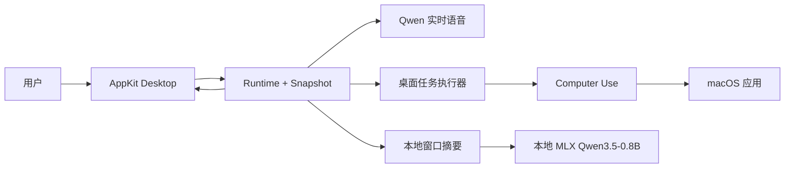

### 解释与结论

当前系统是三条能力通路在 `Runtime + Snapshot` 汇合的单 Agent POC，而不是多 Agent、长期记忆或持久工作流系统。

### 下一步

在新增主动任务前先抽象模型规划与桌面工具传输接口，避免继续扩大 `Runtime` 和 `CodexExecutor` 的职责。

## 2026-09-30：恢复可复现的本地环境

### 目标与前态

首次执行 `uv run --script scripts/pet.py --check` 时，PyAudio 因缺少 `portaudio.h` 无法构建，本地 MLX 环境和模型目录也不存在。

### 操作

```bash
brew install portaudio
uv venv .venv-pet --python 3.12
uv pip install --python .venv-pet/bin/python \
  'pyaudio>=0.2.14' 'websockets>=15,<17' \
  'pyobjc-framework-Cocoa>=11,<13' \
  'pyobjc-framework-Quartz>=11,<13' 'pillow>=11,<13'

uv venv .venv --python 3.12
uv pip install --python .venv/bin/python \
  'mlx-vlm==0.7.0' 'mlx==0.32.2' 'mlx-metal==0.32.2' requests jinja2
zsh scripts/download-qwen-mlx.zsh
uv run --script scripts/pet.py --check
```

### 证据

```text
宿主依赖导入成功
mlx-vlm 0.7.0
mlx 0.32.2
mlx-metal 0.32.2
模型文件逐项 SHA-256 校验通过
window_summary_worker: {"ready": true}
Ran 33 tests in 0.727s — OK
```

### 解释与结论

宿主和本地视觉的 Python 依赖已经可复现，但系统级权限、语音服务和真实桌面操作仍需单独验收。

### 下一步

增加一条不操作真实应用的启动前诊断，集中检查 PortAudio、模型、密钥、Computer Use 路径和 macOS 权限提示。

## 2026-09-30：验证 DeepSeek Flash 作为桌面规划模型

### 目标与前态

判断 `deepseek-flash` 能否替代 Codex 原生模型承担规划、视觉理解和工具调用，而不是只依赖模型名称或产品说明作结论。

### 操作

1. 调用 `/models` 验证当前账户可用模型。
2. 发送普通中文对话请求。
3. 提供一个 `desktop_get_app_state` 工具定义，验证 Function Calling。
4. 发送包含红色方块、文字 `BOX 73` 和蓝色圆形的合成 PNG，验证视觉理解。
5. 启动 Codex App Server 但不创建模型 turn，只建立线程并列出 Computer Use 工具。

### 证据

| 检查 | 结果 | 边界 |
|---|---|---|
| 模型发现 | `deepseek-flash` 可用 | 只代表当前账户和当前日期 |
| 普通对话 | HTTP 200，中文回答正确 | 单请求冒烟测试 |
| Function Calling | `finish_reason=tool_calls`，参数符合 schema | 尚未运行完整多步任务循环 |
| 视觉输入 | 正确识别两个图形及文字 | 合成图单样本，不代表真实 GUI 稳定性 |
| Computer Use 工具桥接 | 未运行 Codex 模型 turn，发现 9 个工具 | 仍使用 Codex App Server 和本机 Computer Use 组件 |

### 解释与结论

将“模型规划器”和“桌面工具传输”拆分后，DeepSeek Flash 在协议能力上可以承担规划和视觉推理，但是否能替代现有 Codex Agent 必须由配对桌面任务评测决定。

目标结构：

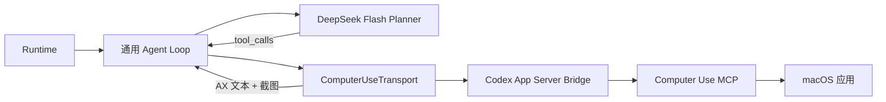

### 下一步

实现最小 `DeepSeekExecutor`，在同一套工具、提示词、预算和任务初态下，与当前执行器完成至少 10 个配对任务的 go/no-go 验证。

## 2026-09-30：对标个人助理 Agent 市场

### 目标与前态

确定 BoxAgent 应解决的产品问题和开源差异，而不是把通用多 Agent 编排包装成个人助理。

### 操作

1. 阅读 OpenAI Dots、Meta Muse 和 Instinct 的官方产品说明。
2. 阅读 OpenClaw 的 README 与 Gateway 架构说明。
3. 通过 GitHub API 获取相关开源项目的公开指标快照。

### 证据

闭源产品共同强调的能力：

| 产品 | 持续工作 | 主动跟进 | 电脑/浏览器 | 跨渠道 | 记忆 | 审批/接管 |
|---|---:|---:|---:|---:|---:|---:|
| OpenAI Dots | 是 | 是 | 云端与本机 | ChatGPT、电话、Slack、Teams | 是 | 是 |
| Meta Muse | 是 | 是 | 共享安全电脑与浏览器、本机应用 | Muse App、Mac、WhatsApp | 是 | 是 |
| Instinct | 是 | 是 | 手机与电脑 | 短信与电话 | 是 | 官方首页未完整说明 |

GitHub 指标为 2026-09-30 查询快照，不代表质量或长期趋势：

| 项目 | 定位 | Stars |
|---|---|---:|
| OpenClaw | 本地优先、多渠道个人助理 | 390,819 |
| Browser Use | 浏览器操作组件 | 116,770 |
| OpenHands | 软件开发 Agent | 89,576 |
| Open Interpreter | 本地执行/编码 Agent | 68,478 |
| AutoGen | 多 Agent 编程框架 | 61,230 |
| CrewAI | 角色式多 Agent 编排 | 59,207 |
| OpenManus | 通用 Agent | 58,442 |
| LangGraph | 有状态 Agent 编排 | 42,497 |
| Letta | 有状态记忆 Agent 平台 | 24,981 |
| Agent Zero | 通用 Agent 框架 | 19,354 |
| Leon | 开源个人助理 | 17,548 |

### 解释与结论

开源市场已经有成熟的多渠道助理和通用 Agent，BoxAgent 更可辩护的切口是“本机具身、可观察、可审计、可替换模型的桌面个人 Agent”，而不是再次实现一套泛化的多 Agent DAG。

### 下一步

用一页产品契约固定核心用户、三个高频责任、明确不做项和可量化验收，再决定是否进入持久任务与长期记忆开发。

## 2026-09-30：形成候选产品路线

### 目标与前态

把市场对标转换为能够产生代码、评测、演示和简历证据的阶段计划。

### 操作

候选定位：**BoxAgent 是运行在个人电脑上的可见桌面伙伴，能够持续跟进用户交给它的责任，并为每次操作提供证据、审批和可撤销边界。**

建议先聚焦三个责任：

1. 根据用户目标跨应用完成一次性桌面任务，并引用最终状态证据。
2. 持续观察一个明确责任，在发生重要变化时主动提醒，而不是固定频率刷状态。
3. 保留用户明确授权的偏好、决定和未完成事项，并允许查看、修正和删除。

六周候选里程碑：

| 周期 | 交付物 | Go/No-go 证据 |
|---|---|---|
| 第 1 周 | `Planner`、`ToolTransport`、`DeepSeekExecutor` 接口拆分 | 现有 33 个测试不回归；DeepSeek 完成 10 个配对任务 |
| 第 2 周 | 开放的 macOS Accessibility + 截图执行后端 | 不安装 Codex Computer Use 也能完成至少 3 类应用操作 |
| 第 3 周 | SQLite 持久任务、唤醒条件和恢复机制 | 进程重启后任务不丢失；重复唤醒不重复执行副作用 |
| 第 4 周 | 有来源、作用域和过期时间的用户记忆 | 可查看、修改、删除；冲突时不静默覆盖 |
| 第 5 周 | `PersonalAgentBench` 与基线 | 同初态比较成功率、安全违规、人工接管、延迟和成本 |
| 第 6 周 | 一键安装、演示视频、公开路线图与首个 release | 新机器按文档可启动；发布材料不依赖私人二进制或密钥 |

### 解释与结论

简历价值应来自“开放执行后端、持久责任模型、安全边界和可复现实验”的组合，而不是 Agent 数量、状态数量或未经消融的复杂机制。

### 下一步

先完成第 1 周的配对任务 PoC；如果 DeepSeek 相比现有基线的任务成功率下降超过 10 个百分点，或出现未授权高风险动作，则暂停替换并优先修复工具回传和审批策略。

## 2026-09-30：将“主动性”收敛为责任驱动的可控闭环

### 目标与前态

根据用户提供的 personal agent 文章，判断主动性对 BoxAgent 意味着什么，并避免把“定时运行一次 LLM”误当成主动 Agent。当前 `Runtime` 只接收用户发起的单次任务；`WindowSummary` 虽然每 15 秒观察前台窗口，但只产生摘要，不会建立责任、判断变化或派发动作。

### 资料观察

微信文章是对 a16z 对话的中文评述，不是原始访谈逐字稿。其中与本项目有关的主张是：

1. 用户更容易感知“省钱、避免损失、免掉麻烦”，而不是抽象的效率提升。
2. 主动性的价值来自发现用户没有显式提出的机会或风险，但一次越界就可能消耗全部信任。
3. 低打扰的 invisible agent 比频繁说话、频繁展示存在感更接近个人助理。
4. 自主权应当随信任累积逐步扩大，而不是默认获得广泛权限。

OpenAI Dots 官方文档提供了可直接核对的产品例子：Dot 会跨对话跟踪进度、根据变化决定何时唤醒，并让用户指定哪些变化值得打扰；会影响账户或共享信息的动作需要审批或交还用户。这支持“责任 + 变化 + 判断 + 权限”的实现模型，但官方文档没有公开其内部调度算法。

### 阶段性答案

BoxAgent 的主动性应定义为：

> 在用户授权的持续责任中，感知与目标相关的变化，只在预期价值高于打扰和行动风险时介入，并保留可审计证据。

一个主动任务不应只保存 prompt，而应保存一份 `ResponsibilityContract`：

| 字段 | 作用 | 例子 |
|---|---|---|
| `objective` | 长期希望维持的状态 | 保证 BoxAgent 的主分支 CI 可用 |
| `sources` | 允许观察的数据源 | GitHub Actions、本地日志 |
| `triggers` | 值得重新评估的事件 | CI 失败、新 issue、截止时间接近 |
| `attention_policy` | 什么变化值得打扰 | 连续失败两次或发布被阻断 |
| `action_policy` | 可自动、需审批、禁止的动作 | 读日志=自动，修改代码=草稿，push=审批 |
| `budget` | 时间、Token、金额和通知上限 | 每日最多两次模型评估 |
| `expiry` | 自动停止时间 | 本次 release 完成后终止 |
| `success_evidence` | 判定任务真正完成的证据 | CI 变绿的 run URL 与 commit SHA |

建议闭环：

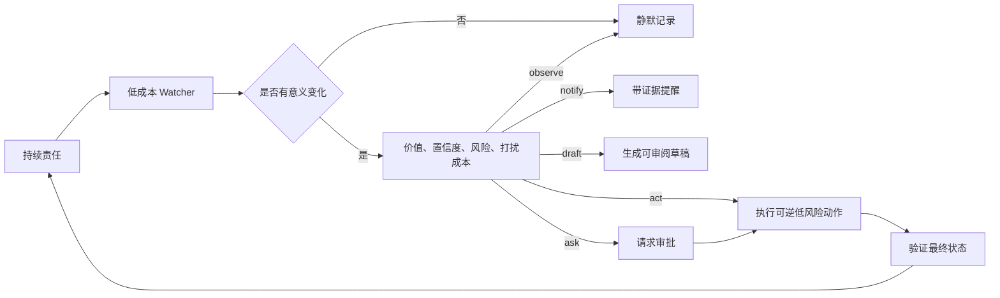

不建议让大模型持续读取整个桌面并自由决定做什么。更可控的实现是两级观察：先用廉价的确定性 watcher 检查时间、文件、窗口、日历或 API 的差量，只有命中变化后才调用模型做语义判断。

行动权限初期分为四级：

| 级别 | 行为 | 默认策略 |
|---|---|---|
| L0 Observe | 读取、比较、记录 | 可自动 |
| L1 Notify/Draft | 提醒、整理、起草 | 可自动，但受通知预算限制 |
| L2 Reversible Action | 可撤销的本地变更 | 按责任单独授权，默认先审批 |
| L3 Consequential Action | 发送、购买、删除、发布、涉及账户的动作 | 每次明确审批 |

### 建议的最小演示

第一个主动场景不建议直接做支付、报销或机票退差价；这些价值高，但外部账户、网站反自动化和资金风险会掩盖核心机制。

更适合当前仓库的 MVP 是“守护一个本地长任务”：

> 在本次发布期间关注 BoxAgent 测试和运行日志。平时不打扰；新测试失败、连续两次执行失败或密钥疑似泄漏时通知；可以自动读取日志和生成修复建议，修改代码前询问，不得自动提交或推送。

这个演示能同时验证持久任务、变化检测、低打扰、审批、证据和重启恢复，不需要先接入金融系统。

### 下一步

1. 在写调度器之前，先定义 `ResponsibilityContract`、`Observation`、`Decision`和 `ActionRecord` 四个数据契约。
2. 用 SQLite 保存责任、最后观察状态和通知去重键，进程重启后继续。
3. 先实现确定性 watcher 与规则策略，再把 DeepSeek Flash 放在“有意义变化的语义判断”上。
4. 为主动性增加四个独立指标：有用发现率、无效打扰率、越权动作数、从变化到处置的延迟。

## 2026-09-30：校正为机箱小屏中的娱乐型具身伙伴

### 目标与前态

用户明确最终形态是在电脑机箱上安装小屏，屏幕中常驻 BoxAgent 角色；它首先是娱乐型个人伙伴，未来可扩展到全场景，但不是纯软件办公 Agent。因此，上一节的“项目守护”可作为验证持久任务的工程样例，但不再作为产品首个 Hero Scenario。

### 阶段性产品定位

> BoxAgent 是住在机箱屏幕里的 AI 伙伴：它能感知电脑、游戏、媒体与用户状态，用角色表现和语音低打扰地陪伴，在有价值的时刻主动提醒或帮忙。

产品应当同时保留两种看似相反的特性：

- **角色可见**：机箱屏上始终有表情、动作和状态，建立长期陪伴感。
- **工作隐形**：不要频繁弹窗或聊天，只在新奇、重要或真正有帮助的时刻介入。

### 场景分层

| 层级 | 场景 | 例子 |
|---|---|---|
| S0 氛围陪伴 | 屏幕角色根据时间、音乐、负载和应用状态反应 | 听音乐时跟随节奏；GPU 负载高时表现出“忙碌” |
| S1 娱乐助手 | 理解游戏、音乐、视频与直播上下文 | 游戏启动后切换主题；下载完成后提醒；快捷播放喜欢的歌单 |
| S2 主动伙伴 | 根据持续上下文选择时机 | 连续游戏过久后轻量提醒；更新完成时主动告知；相同错误重复发生时帮助诊断 |
| S3 通用个人助理 | 经授权操作电脑与外部服务 | 打开应用、搜索内容、整理信息、设置提醒 |

第一版应聚焦 S0 + S1 + 少量 S2，而不是先覆盖 S3 的办公工作流。

### 建议的 Hero Scenario

> 用户打开电脑并启动游戏后，机箱屏中的 BoxAgent 自动进入对应角色状态，感知当前游戏、媒体播放、下载进度与主机健康。它平时只用表情和动作陪伴；只在游戏更新完成、设备过热、长时间游戏或用户召唤时开口，并可帮助播放音乐、调整音量、打开游戏或执行明确授权的快捷操作。

这个场景的核心价值不是“节省多少办公时间”，而是：

1. 机箱不再是静态硬件，而是拥有性格和反应的存在。
2. AI 能理解用户正在娱乐的上下文，而不是只等待命令。
3. 主动互动是稀缺且有意义的，不会变成桌面广告或通知噪声。

### 对技术路线的影响

当前 AppKit + MLX 实现默认 macOS，而“机箱小屏”更可能对应 Windows 游戏主机。如果目标硬件确认为 Windows PC，则当前原生界面和 MLX 本地模型不能直接作为发行架构，需要将系统拆分为：

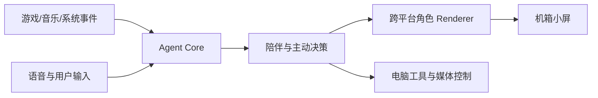

`Agent Core` 保留 Python、模型接口、事件和状态管理；角色 Renderer 需改为能在指定显示器全屏运行的跨平台实现；桌面操作后端则按宿主系统选择 macOS Accessibility 或 Windows UI Automation。

### 下一步

在正式编写 PRD 和技术选型前，需确认目标宿主是否为 Windows 游戏 PC，小屏的连接方式、分辨率、是否触控，以及麦克风和扬声器所在位置。这些选择会直接决定 Renderer、权限、打包和本地模型方案。

## 2026-09-30：确定 macOS-first 产品验证策略

### 决策

用户明确暂不处理 Windows 和真实机箱小屏适配，先在 macOS 上验证产品。因此上一节“需先确认宿主系统后才能继续”的结论已被此决策取代；硬件参数仍会影响最终产品，但不再阻塞近期开发。

### macOS 验证范围

1. 把现有桌宠视为机箱小屏的交互代理，先验证角色状态、视线反馈、主动时机和语音交互。
2. 首批上下文信号限定为前台应用、音乐播放、用户空闲/返回、会话时长和主机健康；不以持续上传整屏截图作为默认感知方式。
3. 首批动作限定为角色表现、语音/气泡提醒、播放控制、音量控制、打开应用和用户明确委托的桌面任务。
4. 开发期保留窗口化桌宠；当需要模拟小屏时，再增加指定显示器或固定视口模式，不先重写 Renderer。

### 产品验证优先级

| 优先级 | 要回答的问题 |
|---|---|
| P0 | 用户是否愿意让这个角色长时间待在屏幕上？ |
| P0 | 它能否根据娱乐上下文做出可感知、但不打扰的反应？ |
| P0 | 它的主动介入是否真正有用，而不是纯随机对话？ |
| P1 | 用户是否会自然地用语音要求它控制媒体或打开应用？ |
| P1 | 角色陪伴是否能转化为持续使用，而不是只有首次新鲜感？ |

### 下一步

基于 macOS 当前能力编写一页娱乐型 PRD，固定一条 10 分钟内可完整演示的 Hero Journey，然后才确定需要增加的事件感知接口和角色动画状态。

## 2026-09-30：复核既有产品定义与 MVP 假设

### 资料中的核心判断

用户提供的既有产品材料将市场缺口归纳为：纯软件 Companion 有对话但缺少实体存在，已有硬件 Companion 有存在但 AI、记忆和主动性弱，带屏机箱则只展示指标或 GIF，没有人格与行动能力。候选机会是将 `Companion → Agent → Hardware` 组合为“住在电脑里的数字生命”。

材料提出的购买驱动顺序是：

1. 视觉效果负责首次吸引。
2. 高频 PC/机箱控制负责日常价值。
3. 长期记忆和陪伴负责长期差异化。
4. 主动性是未来能力，但需单独验证打扰边界。

这些是待访谈和行为实验验证的产品假设，不是已证实的用户需求。

### 与当前实现的对照

| 产品支柱 | 当前状态 | 首个 macOS 版本的差距 |
|---|---|---|
| 角色视觉 | implemented | 已有 2D 桌宠和多状态动画，但尚未验证视觉风格对目标用户的吸引力，也不是 3D 数字人 |
| 语音交互 | verified | 已能实时对话和委托任务；需将语音反馈与角色表情和娱乐动作结合 |
| 电脑操作 | verified POC | 已能通用操作应用，但开源发行仍依赖私有 Computer Use 组件，且没有娱乐快捷动作契约 |
| 环境感知 | implemented POC | 已有前台窗口摘要，但缺少应用启停、媒体状态、空闲/返回和会话时长等低成本事件 |
| 主动性 | planned | 缺少触发事件、打扰策略、冷却去重和 JEV 置信度路由 |
| 长期陪伴 | planned | 没有偏好、作息、常用娱乐应用和角色关系的持久化模型 |

### 第一步不应是单点功能

只做 3D 角色无法验证 Agent 价值，只做 PC 操作又会变成语音快捷指令工具。第一步应实现一个细而完整的“角色 - 语音 - 真实动作 - 状态反馈”闭环：

> 用户说“进入游戏模式”；BoxAgent 立即用动画和语音确认，在 macOS 上打开指定游戏或 Steam、将音量调整到用户配置、播放指定歌单，并把角色切换到娱乐状态；执行结果由真实应用和媒体状态确认。

它同时验证：

- 角色是否有吸引力和存在感；
- 用户是否愿意通过语音对它下达娱乐目标；
- Agent 是否真正改变了电脑状态；
- 角色动画是否与观察、思考、执行和完成一致；
- 用户是否把它视为工具、助手还是伙伴。

### 首个垂直切片

| 模块 | 首版范围 |
|---|---|
| Avatar | 复用当前 2D 形象，补齐娱乐、庆祝、担心、睡眠等状态；同时保留未来 Live2D/VRM 适配边界 |
| Voice | 复用实时语音，将首次听见的确认反馈与慢操作分离 |
| Entertainment Context | 新增应用启停、媒体播放、空闲/返回和游戏会话时长事件 |
| Action | 先提供打开应用、设置系统音量、播放/暂停/切歌和一个可配置“游戏模式”组合动作 |
| Proactivity | 只实现两类触发：游戏/娱乐会话过长和媒体/任务状态完成；使用冷却、去重与勿扰时段 |
| Memory | 只保存显式确认的首选应用、歌单、音量和勿扰时段，不先做向量数据库或情感记忆 |
| Evidence | 记录输入、決策、动作和最终系统状态，避免用角色话术代替真实成功验证 |

### 需求验证方式的修正

访谈中的评分、功能排序和“愿意付多少钱”只能作为早期线索。展示产品概念后再问用户是否喜欢，容易得到礼貌性肯定。第一轮验证应增加行为证据：

- 首次看到后，用户是否会主动尝试第二条命令；
- 在 3-7 天体验中，每天实际召唤次数和有效动作次数；
- 主动提醒被接受、忽略或立即关闭的比例；
- 用户是否在第二天仍保留桌宠常驻；
- 对比“只有角色”、“角色 + 语音”和“角色 + 真实操作”三个版本，而不只询问假设性购买意愿。

### 下一步

以上述垂直切片为范围写入 V0.1 PRD，并在编码前固定验收条件和埋点；3D 角色、完整长期记忆、多类主动场景和真实机箱控制不进入首个 macOS 开发迭代。

## 2026-09-30：将“游戏模式”从 Hero Scenario 降级为基础 Skill

### 问题

用户指出很多电脑、主板和外设软件已经提供一键游戏模式。因此，“打开应用 + 调节音量 + 执行预设”虽然能验证执行链，但不足以证明 BoxAgent 的产品必要性，也不构成可辩护的差异化。

### 修正结论

“游戏模式”保留为一个容易理解的基础 Skill 和执行测试，但不再作为首个 Hero Scenario。BoxAgent 需要验证的核心能力应当是：

> 它能否理解电脑和娱乐上下文，把原本冰冷的运行状态转换成有角色、有记忆、有时机感的陪伴。

电脑控制是 Agent 的手，不是产品本身。

### 新的候选 Hero Scenario

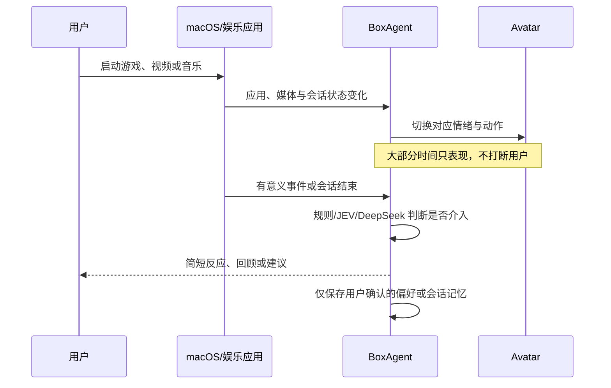

可用的首次演示是：角色识别用户开始听音乐或进入某个娱乐应用，切换为相应状态；在过程中保持安静；在切歌、播放结束、长时间使用或用户返回时，只有判断为值得介入才用一句话或动作响应；用户明确表达喜好时再写入偏好记忆。

### 功能重排

| 顺序 | 能力 | 理由 |
|---|---|---|
| 1 | 娱乐上下文事件层 | 没有可靠事件，角色只能随机表演，主动性也无从判断 |
| 2 | 上下文到角色表现的状态机 | 首先让用户感知“它知道我在做什么” |
| 3 | 低打扰介入策略 | 冷却、去重、勿扰和置信度路由决定它是伙伴还是噪声 |
| 4 | 轻量 Episode Memory | 让下一次互动能延续，但只保存确认信息 |
| 5 | 媒体控制和快捷 Skill | 作为有用的手，但不作为核心叙事 |
| 6 | 通用桌面 Agent | 作为扩展能力，不在首个产品假设中抢占主线 |

### 验证标准

新 Hero Scenario 需回答：

1. 用户能否从角色反应中正确理解它感知到的上下文。
2. 没有文字说明时，表情和动作是否仍能传达意图。
3. 主动介入的接受率、忽略率和关闭率如何。
4. 使用第二天后，用户是否仍希望它常驻。
5. 增加记忆后，用户是否更愿意继续互动，而不是只觉得“它很聪明”。

### 下一步

V0.1 PRD 的主故事应改为“电脑状态被一个有人格的数字生命感知并回应”。“游戏模式”可作为一条快捷 Skill 放在演示中，但不应成为需求价值的主证据。

## 2026-09-30：以 NOMI 重新定义产品类别与开源参考

### 定位修正

用户进一步明确 BoxAgent 不必被限定为娱乐场景。更准确的类比是车端 NOMI：一个有固定形象、随时可被召唤、能表达状态、了解所处环境并可以调用环境能力的统一交互入口。

因此，建议产品类别表述为：

> 电脑座舱里的具身个人 Agent（Embodied Personal Agent for the computer cockpit）。

“具身”在此不表示已有机器人躯体，而是它有稳定可见的角色形象、能通过表情/动作/语音反馈内部状态，并能感知和改变其所在的电脑环境。

### 开源调研结论

未发现由蔚来或其他可靠主体开源的完整 NOMI 等价实现。GitHub 上可检索到少量仿 NOMI 项目，但公开规模、活跃度和功能证据不足以作为产品基座。可复用的开源参考是分层的：

| NOMI-like 层 | 开源参考 | 可借鉴部分 | 不能直接提供的部分 |
|---|---|---|---|
| 角色形象与伙伴体验 | AIRI | 实时语音、角色表现、VRM/Three.js、多平台 Companion 形态与插件化能力 | 宿主电脑的统一信号模型、受控桌面执行和 BoxAgent 的主动判断 |
| 常驻语音与 Skills | OpenVoiceOS | 开源语音助手 Core、Skills、消息总线和可嵌入运行方式 | 可视化角色、多模态表达和电脑上下文模型 |
| 环境信号字典 | COVESA VSS | 用标准语义树描述车辆信号；可类比为 BoxAgent 的 `Computer Signal Specification` | 不包含 Agent、交互策略或人格 |
| 状态订阅与受控执行 | Eclipse KUKSA Databroker | 基于 VSS 的信号服务，读取/订阅状态并写入执行目标；可类比为 `ComputerContextBus` | 不负责模型推理、交互和记忆 |
| 车端应用开发 | Eclipse Velocitas | 容器化车载应用的 SDK、车辆模型与开发流程 | 不是 Companion Agent |
| 座舱操作系统 | Android Automotive OS、Automotive Grade Linux | 车机应用、媒体、多屏、车辆集成和系统服务的平台边界 | 平台本身不等于 NOMI；Android Auto 与运行在车机上的开源 AAOS 也不是同一事物 |

2026-09-30 的 GitHub 公开快照中，AIRI 约 49.9k stars，而 VSS、KUKSA 和 Velocitas 的价值主要来自车载标准和架构，不应用 star 数与消费级 Companion 项目直接比较。

### 对 BoxAgent 架构的影响

BoxAgent 不应复制车机 UI，而应复制“一个长期存在的人格化入口连接整个环境”的系统模式：

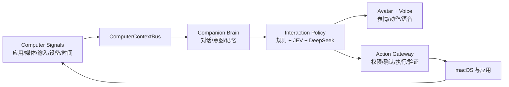

其中：

1. `ComputerContextBus` 只负责把系统事实规范化为事件和当前状态，不直接让 LLM 持续观看整屏。
2. `Companion Brain` 维护当前会话、用户偏好、关系状态和待完成承诺。
3. `Interaction Policy` 判断是仅做动作、开口、询问用户、直接执行，还是保持安静；JEV 适合先处理高频、低风险判断，不确定时再路由给 DeepSeek。
4. `Action Gateway` 将桌面能力变成明确的可审计工具，根据风险要求确认，并以真实系统状态验证结果。

### 产品能力重排

| 优先级 | 能力 | 首版结果 |
|---|---|---|
| P0 | 常驻与召唤 | 可见形象、键盘/点击/语音召唤、听见后立即反馈 |
| P0 | 角色状态表达 | 待机、倾听、思考、行动、成功、失败和克制主动状态 |
| P0 | ComputerContextBus | 先统一前台应用、媒体、空闲/返回、会话时长和主机健康事件 |
| P0 | 交互政策 | 安静/动作/语音/询问/执行五级响应，带冷却、去重、勿扰和风险分级 |
| P1 | 受控电脑行动 | 先提供打开应用、媒体与音量操作，后续再接通用桌面 Agent |
| P1 | Episode Memory | 保存用户确认的偏好、近期互动和未完成承诺，可查看、更正和删除 |
| P2 | 多场景 Skills | 娱乐、设备状态、日常问答和轻量办公均作为能力域，不用其中任一个限定产品 |

### 证据边界与下一步

上述开源项目只证明各层有可借鉴的实现，不证明已有可直接复用的完整 NOMI，也不证明 BoxAgent 的产品假设已通过用户验证。下一步应先写 V0.1 PRD，固定一条“随叫随到 + 感知正在发生的事 + 有角色地回应 + 可选受控行动”的跨场景 Hero Journey，再据此拆解 `ComputerContextBus`、交互政策和角色状态机的接口。

## 2026-10-05：核对远端 main、模型可替换性与健壮性基线

### 目标与前态

在开始 memory system 前，核对远端 `main` 是否有新实现，并确认当前代码是否真正支持将桌面规划模型替换为 DeepSeek。

### 远端 main 差异

`git fetch origin main --prune` 后，当前 `zl_dev` 与本地 `main` 仍在 `a640018`，`origin/main` 已前进到 `748df38`，当前分支落后 2 个提交，没有自己领先的提交。

| 提交 | 内容 | 影响 |
|---|---|---|
| `025bc53` | 接入形象商店与运行中换装 | 新增远端目录、资源下载、本地缓存、失败回滚、离线恢复和 6 个测试 |
| `748df38` | README 新增项目愿景和 Roadmap | 明确持续委托、活动时间线和长期记忆仍未实现 |

本轮只刷新了远端引用并在临时目录验证，没有把 `origin/main` 合并到 `zl_dev`，也没有改动现有未跟踪文件。

### 回归基线

| 被测版本 | 命令 | 结果 | 证据边界 |
|---|---|---|---|
| 当前 `zl_dev` | `uv run --script scripts/pet.py --check` | verified，33/33 通过 | 单元/本地替身测试，不包含真实语音、桌面操作和长时运行 |
| `origin/main` 临时快照 | 对 `git archive origin/main` 运行同一 `--check` | verified，39/39 通过 | 新增测试覆盖形象下载提交、离线恢复、损坏缓存、路径/主机校验和图集解码 |

远端测试在模拟断网时会打印预期的 `OSError: 断网` 堆栈，用例最终通过；这是“降级可用”的证据，但日志噪声仍可在后续改善。

### 当前模型边界

当前实际存在三种不同的模型角色：

| 角色 | 当前实现 | 是否可直接换成 DeepSeek |
|---|---|---|
| 实时语音对话 | `QwenVoice` + DashScope Realtime | 否；DeepSeek Flash 的文本/视觉接口不等价于当前全双工音频协议 |
| 桌面任务规划 | `CodexExecutor` 同时包含 Codex Planner、Agent Loop 和 Computer Use 工具传输 | 否；`BOXAGENT_TASK_MODEL` 只把模型名交给 Codex App Server，不是供应商切换开关 |
| 前台窗口摘要 | 本地 MLX Qwen3.5-0.8B | 技术上可新增云端视觉 Provider，但会改变隐私、延迟、成本和断网行为 |

### DeepSeek Flash 当日复核

使用已配置但未打印的 `DEEPSEEK_API_KEY` 执行最小 API 验证：

1. `/models` 返回 `deepseek-flash` 和 `deepseek-v4-pro`。
2. `deepseek-flash` 能产生标准 `tool_calls`，正确调用 `desktop_get_app_state` 并生成 `{"app":"Safari"}` 参数。
3. 向模型回传一条合成工具观察后，它能结束两轮工具循环并输出 JSON。
4. 输出未遵守现有 `RESULT_SCHEMA`：将 `outcome` 写为 `success` 而不是 `completed`，并将 `evidence_steps` 写为文字列表而不是整数步骤编号。

结论：DeepSeek Flash 的工具调用和多轮回传协议能力已再次 verified，但“可直接替换 Codex 完成真实桌面任务”仍未验证，且当前格式偏差证明必须在 Provider 边界增加 schema 校验、有限修复重试和失败收敛。

### 建议开发顺序

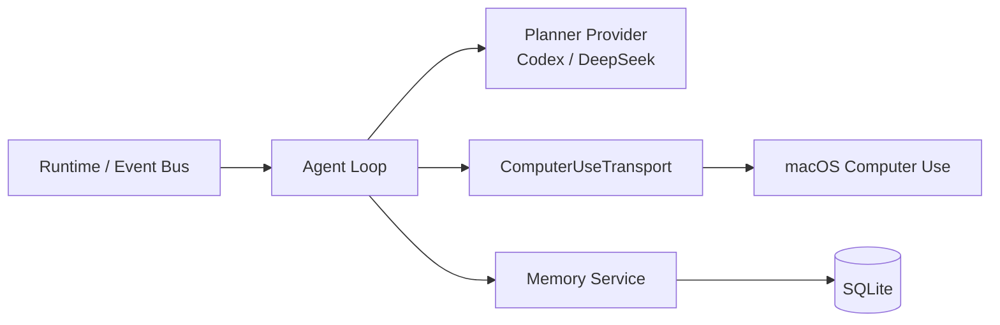

1. **先快进合并 `origin/main`。** 当前分支没有自有提交，可以在保留未跟踪文档的前提下使用 `git merge --ff-only origin/main`，合并后重跑 39 个测试。
2. **拆分 Agent Loop 与工具传输。** 从 `CodexExecutor` 抽出 `Planner`、`ToolTransport` 和供应商无关的结果校验，先使现有 Codex 路径在新接口下保持行为不变。
3. **实现可测的 Memory V0，而不是先做向量库。** 用 SQLite 保存用户明确确认的偏好、设置和未完成承诺，每条记忆带类型、来源、时间、状态和可选过期时间，支持查看、更正、遗忘和重启恢复。
4. **增加 `DeepSeekPlanner`。** 复用同一 Agent Loop、Computer Use 工具、任务初态、预算和结果校验，不让两个模型走两套桌面代码。
5. **再做分层健壮性验证。** 先用确定性替身覆盖超时、断网、无效 JSON、重复工具调用、取消竞态、崩溃重启和记忆冲突，再跑真实桌面配对任务和长时运行。

### Memory V0 的可测边界

| 能力 | 阶段一规则 | 必须测试 |
|---|---|---|
| 写入 | 只保存用户明确要求记住或确认的信息 | 普通闲聊不得自动写入 |
| 类型 | `preference`、`setting`、`commitment` 三类起步 | 错误类型被拒绝，序列化稳定 |
| 更新 | 同一 scope 的新确认值取代旧值，保留修订痕迹 | 冲突不并存为两个“当前真相” |
| 检索 | 先按类型、scope 和时间做确定性检索 | 不依赖 LLM 或 embedding 也能测试 |
| 遗忘 | 软删除后不再进入上下文，可显式彻底删除 | 重启后仍保持删除状态 |
| 证据 | 保留来源事件 ID 和原始用户表达 | 能解释“为什么记得这件事” |

### 健壮性验收层级

| 层级 | 范围 | 进入下一层的条件 |
|---|---|---|
| L0 单元测试 | Memory CRUD/冲突/遗忘、状态机、schema parser、冷却去重 | 确定性用例全部通过 |
| L1 契约测试 | Codex/DeepSeek Provider 共用录制的工具输入输出 | 两个 Provider 都生成同一内部结果类型 |
| L2 故障注入 | API 超时、429、断网、工具失败、非法 JSON、取消与进程重启 | 无虚假成功、无重复副作用、状态可恢复 |
| L3 真实桌面配对评测 | 至少 10 个可重置任务，Codex 和 DeepSeek 同初态/工具/预算 | 成功率差距、延迟、步数、成本和越权数可比较 |
| L4 长时运行 | 2 小时后扩到 8 小时，覆盖语音重连、休眠/唤醒、观察 worker 恢复和资源占用 | 无持续资源泄漏，无过时任务突然执行，退出可收敛 |

DeepSeek 的 go/no-go 应事先固定：若配对任务成功率比 Codex 低超过 10 个百分点，或出现任何未授权高风险动作，就不进入默认路由，而是保留为实验 Provider 并优先修复工具回传与安全策略。

## 2026-10-05：快进同步 main 并验证回归

### 操作

```bash
git merge --ff-only origin/main
git branch -f main origin/main
uv run --script scripts/pet.py --check
```

### 结果

`zl_dev`、本地 `main` 和 `origin/main` 现均指向 `748df38`；形象商店、运行中换装、相关文档和测试已进入当前工作分支。

```text
Ran 39 tests in 3.519s
OK
```

这一结果 verified 合并后的单元/本地替身测试没有回归；真实形象商店 UI、语音、Computer Use 和长时运行本轮未执行。模拟断网的形象商店用例会在通过时打印预期异常堆栈，不影响结果，但可后续降低日志噪声。

未跟踪的实践记录、阶段一 PRD 和 `tmp/` 均保持原状；本轮没有新建 commit，也没有 push 或对外分享。

## 2026-10-05：拆分模型规划接口并接入 DeepSeek

### 目标与实现

目标是让桌面任务的“模型规划”与“Computer Use 工具传输”可独立替换，并在不改变默认 Codex 路径的前提下新增 DeepSeek。

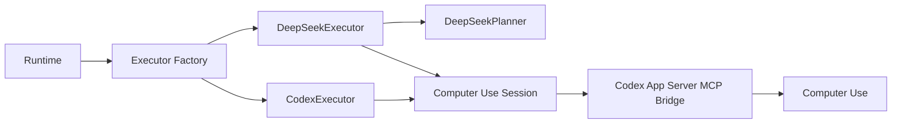

| 文件 | 实现 |
|---|---|
| `boxagent/planner.py` | 新增供应商无关的 `Planner` 协议，并将动态工具转换为 OpenAI-compatible Function Calling schema |
| `boxagent/deepseek.py` | 新增 DeepSeek API 客户端、多轮工具循环、图像观察回传、超时/重试、结果协议修复和 `DeepSeekExecutor` |
| `boxagent/providers.py` | 按 `codex`/`deepseek` 创建 Executor，使 Runtime 和 UI 不再直接绑定 Codex |
| `boxagent/executor.py` | 抽出共用 `computer_use_session()`，DeepSeek 复用相同的工具发现、参数校验、授权、证据记录和最终结果校验 |
| `boxagent/config.py` | 新增 `BOXAGENT_TASK_PROVIDER`、`BOXAGENT_DEEPSEEK_MODEL`、`BOXAGENT_DEEPSEEK_BASE_URL` 和延迟读取 `DEEPSEEK_API_KEY` |
| `boxagent/__main__.py` | 新增 `--task-provider` 和 `--task-model`，装配点经由 Executor Factory 选择实现 |

DeepSeek 只替换桌面任务 Planner；实时语音仍为 `QwenVoice`，本地窗口摘要仍为 MLX Qwen，Computer Use 仍依赖本机 Codex App Server 与闭源执行组件。

### 协议与安全边界

1. DeepSeek 返回的工具名和 JSON 参数仍经过现有动态工具 schema 校验，不能调用未注册工具。
2. 工具操作仍受步数上限、串行锁、取消状态和现有授权策略约束。
3. 截图作为工具观察回传给支持视觉的 DeepSeek Flash，但 base64 不写入事件日志。
4. 最终输出仍必须符合 `completed|blocked|failed + summary + 整数 evidence_steps`；格式错误时最多修复两次，仍失败则结束任务，不将非法结果转成成功。
5. `DEEPSEEK_API_KEY` 在发起 DeepSeek API 请求时才从环境或 `.env.local` 读取，不传给 Computer Use 子进程。

### 失败发现与修复

首次真实 Computer Use 尝试在进入 DeepSeek 前失败，错误为工作区固定的 `.runtime/codex-0.153.0/codex` 已不存在。本轮新增运行时解析器，依次查找：

1. `BOXAGENT_CODEX_BIN`。
2. 原有工作区固定运行时。
3. Codex 插件的 App Server 运行时。
4. `PATH` 中同时存在 sibling `codex-code-mode-host` 的 `codex`。

当前找到并实际使用了 Codex 插件运行时 `0.160.0`；只有同时存在 `codex-code-mode-host` 才会被接受，避免误用当前 `PATH` 中缺少配套 host 的 `codex-cli 0.150.1`。

### 验证

| 检查 | 结果 | 边界 |
|---|---|---|
| Python 语法编译 | verified | `python3 -m compileall -q boxagent tests` 通过 |
| 全量本地替身测试 | verified | 47/47 通过；原 39 项未回归，新增 8 项覆盖 Provider 选择、工具 schema 转换、图像回传、非法参数、结果修复阶段禁止新动作、共用校验和运行时选择 |
| 补丁与凭据扫描 | verified | `git diff --check` 通过；本次 tracked diff 未命中密钥格式，扫描既有文档的唯一命中是路径 `voice-task-*` 中的文本假阳性 |
| 运行时文档一致性 | verified | `docs/setup.md` 已从“固定 0.153.0”更新为与代码一致的四级解析顺序 |
| 真实 DeepSeek API + 假工具 | verified | `deepseek-flash` 调用 `desktop_get_app_state`，回传后生成通过严格校验的 `completed` 结果 |
| 真实 DeepSeek + 真实 Computer Use 只读链路 | verified | 只允许一次 `desktop_list_apps`；`outcome=completed`、`steps=1`、`evidence=1`、`tool_errors=0` |

只读冒烟测试不证明 DeepSeek 已可以默认替代 Codex；尚未验证点击/输入等真实副作用、视觉坐标稳定性、取消中的 API 请求、多任务成功率和与 Codex 的公平配对评测。

### 使用方式

```bash
BOXAGENT_TASK_PROVIDER=deepseek \
BOXAGENT_DEEPSEEK_MODEL=deepseek-flash \
uv run --script scripts/pet.py
```

也可用 `--task-provider deepseek --task-model deepseek-flash`。切回默认 Codex 时不设 `BOXAGENT_TASK_PROVIDER`，或显式设为 `codex`。

### DeepSeek 一键启动脚本

新增 `scripts/run-deepseek.sh`，从任意工作目录调用时都会定位项目根目录，检查 `uv` 和 `DEEPSEEK_API_KEY`，然后固定以 `deepseek` Provider 启动。脚本不 `source` `.env.local`，避免把配置文件当作 shell 代码执行；密钥仍由 `boxagent/config.py` 延迟读取。

```sh
./scripts/run-deepseek.sh
```

验证结果：`sh -n scripts/run-deepseek.sh` 通过；从 `/tmp` 直接运行脚本的 `--help` 成功，证明不依赖当前工作目录；`./scripts/run-deepseek.sh --check` 执行全量本地替身测试，47/47 通过。该检查验证启动与参数链路，未再次打开桌宠 UI 或执行新的真实桌面动作。

## 2026-10-05：Jev-Mem 本地启动与模块化可行性

### 拉取与环境

将 [libingzheren/Jev-Mem](https://github.com/libingzheren/Jev-Mem) 浅克隆到 Git 已忽略的 `.runtime/jev-mem-src`，固定当前提交 `7ab0c73c6d8f4f611ad252c1e6ba8083f8df0e44`。使用 Python 3.12 创建独立 `.runtime/jev-mem-venv`，通过 `uv pip install -e .runtime/jev-mem-src` 安装成功。

完整环境包含 62 个包，主要重依赖为 Torch、Transformers、Sentence Transformers、FAISS、OpenAI SDK 和 TypeSafe SDK；虚拟环境占用约 931 MB，上游源码约 7 MB。

### 实际运行结果

1. 首次使用相对解释器路径且切换到上游工作目录后，启动因路径无效失败；改为绝对路径后成功。
2. `python -m jev_mem.demo` 离线 demo 成功写入 4 条 observation，建立语义、时间和实体关系，完成检索、预算分配与 `evidence_sufficient` 停止判断。此 demo 使用 mock System-One 和 mock embedding，不代表真实 Jev 质量。
3. 通过公共 API `JevMemSystem` + `JevMemConfig` 在离线模式写入 2 条中文记忆、检索并持久化成功；未配置 OpenAI 时只返回检索证据，不进行 System-Two 答案合成。
4. `uv run --with-editable .runtime/jev-mem-src --script scripts/pet.py --check` 成功，BoxAgent 与 Jev-Mem 依赖合并后现有 47/47 测试通过。

### 直接集成判断

代码层面可以直接导入：上游公开 `JevMemSystem.build_memory_from_conversation()`、`query()`、`save_memory()` 和 `load_memory()`。但不建议直接在 AppKit 桌宠主进程中初始化完整实现：

| 检查 | 结果 | 影响 |
|---|---|---|
| 公共 API 冷导入 | 约 35.10 s，最大 RSS 约 450 MB | 会显著拖慢桌宠启动 |
| 完整独立环境 | 约 931 MB | 不宜合并进当前 PEP 723 轻量宿主 |
| `TYPESAFE_API_KEY` | 当时 missing，已 superseded | 该阶段只验证 mock controller；后续已配置并验证真实 Jev System-One，见下文 |
| `OPENAI_API_KEY` | missing | 上游 System-Two 答案生成不可用；可在 BoxAgent 适配层改用已配置的 DeepSeek |
| 中文单样本 | 可检索，但排名将“气泡提醒”放在“简洁回答”之前 | 不能由一次跑通推断中文检索质量合格 |

建议架构是 `Runtime -> MemoryService 异步接口 -> 独立 Jev-Mem Worker`，而不是在 UI 主进程内直接 import。Worker 常驻后处理 build/query/save/load，System-One 先在 mock 与确定性 fallback 下接口化，获得 TypeSafe Key 后再验证真实 Jev；System-Two 通过 BoxAgent 适配器改用 DeepSeek，避免为同一系统再引入一套 OpenAI Key。记忆缓存必须留在 `.runtime/` 且只加载可信本地数据，因为上游持久化包含可执行序列化风险边界。

## 2026-10-05：实现 Jev-Mem Worker 适配层

### 实现

| 文件 | 责任 |
|---|---|
| `boxagent/memory.py` | `MemoryService` 异步契约，子进程启停、串行请求、超时、协议校验和有限环境变量传递 |
| `scripts/jev_mem_worker.py` | 把仓库内置 `JevMemSystem` 封装为 JSONL `health/remember/query/save/shutdown` 协议 |
| `scripts/setup-jev-mem.sh` | 为仓库内置 Jev-Mem 创建独立 uv 环境，并可幂等重复安装 |
| `tests/test_memory.py` | 用轻量假 Worker 验证协议往返、顺序、输入拒绝、错误收敛和强制 Jev 时的密钥门禁 |

Worker 只向上游传递运行所需的环境变量；`TYPESAFE_API_KEY` 可从进程环境或 `.env.local` 读取，不传递 DeepSeek 和 DashScope 密钥。`auto` 在缺少 TypeSafe Key 时明确使用 mock backend，显式 `jev` 模式缺少密钥则在启动前失败。

### 验证与失败修复

1. 首次重复执行安装脚本时，`uv venv` 因已有虚拟环境而失败；脚本改为只在解释器不存在时创建环境，之后重复执行成功。
2. 首次真实 Worker 关闭后，系统 Python 3.9 报告子进程 pipe 在 event loop 关闭后才析构；适配器增加 stdin 关闭、等待与 stdout EOF 回收，使用 Python 3.12 重跑时无该警告。
3. 真实 Worker 在 mock System-One 下写入 2 条中文记忆，查询“用户喜欢怎样的回答？”的第一条证据为“用户偏好简洁直接的回答。”。
4. 关闭 Worker 后以同一 cache 启动新进程，`health.memory_count=2`，查询仍返回同一首条证据，证明跨进程持久化恢复通过。
5. `uv run --script scripts/pet.py --check` 现为 51/51 通过。

当时边界：这一步只完成 Worker 适配层，尚未将记忆写入/检索工具接入 `Runtime` 和语音，也未将检索证据注入 Codex/DeepSeek Planner。真实 Jev System-One 当时因缺少 `TYPESAFE_API_KEY` 未验证；该结论已被下一节的真实联调 supersede。

## 2026-10-05：验证真实 Jev System-One

### 目标与配置

验证 Worker 在非 mock 模式下能否使用 TypeSafe Jev 完成写入决策和检索路由。`TYPESAFE_API_KEY` 已以脱敏配置项存在 Git 忽略的 `.env.local`，文件权限为 `600`；密钥未写入命令、日志、测试数据或本记录。

冒烟测试强制使用 `JevMemWorker(backend="jev")`，以独立缓存写入两条虚构用户偏好，再询问“测试用户希望助理怎样回答？”。证据保存在 Git 忽略的 `.runtime/jev-real-smoke-20261005/`。

### 真实调用证据

| 检查 | 结果 | 证据边界 |
|---|---|---|
| Worker 后端 | `health.backend=jev` | 显式 `jev` 模式，不允许因缺少 Key 自动切到 mock |
| 写入 | `admitted=2`、`rejected=0`、`memory_count=2` | 仅两条合成中文观测，不代表长期记忆质量 |
| 检索 | 首条命中“回答简洁，并优先给出可执行建议” | 单问题功能冒烟，尚无多轮、矛盾、遗忘或规模评测 |
| 决策来源 | 5/5 `source=jev`，返回模型 `jev-1.13.0` | 写入侧 2 次 `memory_type` + 1 次 `relations`；读取侧 1 次 `routing` + 1 次 `stopping` |
| 降级 | 0 个 `jev_fallback`，检索 `fallback_events=[]` | 证明这一次请求未降级，不代表长时运行无失败 |
| Jev 用量 | 合计 input 3306 tokens，output 425 tokens | 来自上游 `decisions.jsonl` 中 5 次 `jev_decision` 的 usage 汇总 |
| 延迟 | 冷启健康检查 32.955 s；写入 2.539 s；检索 0.726 s；总计 36.220 s | 冷启主要包含本地 embedding 模型加载；只是单次本机观测，不是稳定性指标 |

Worker stderr 只有 embedding 模型加载、一条上游 API 更名警告，以及未配置 `OPENAI_API_KEY` 的 System-Two 警告；未发现 TypeSafe 认证信息或请求正文泄漏。本次 BoxAgent 只使用 Jev System-One 做决策，检索返回 evidence/context，未调用上游 OpenAI System-Two 生成最终答案。

联调后执行 `uv run --script scripts/pet.py --check`，51/51 项测试通过；当时的 Worker 入口现已收敛为 `scripts/jev_mem_worker.py`，同等 `compileall` 和 `git diff --check` 通过。对 tracked diff 扫描 TypeSafe Key、DeepSeek Key 和 Bearer Token 模式，命中数均为 0。

### 结论与下一步

真实 Jev 后端已在 Worker 边界内 verified，不再是“仅 mock 协议跑通”。当时的下一步是将 `remember_memory`、`recall_memory`、`forget_memory` 接入 Runtime/语音工具；该步骤已在下一节完成。Planner 自动注入与冲突、更新、遗忘评测仍未完成。

## 2026-10-05：将 Jev-Mem 接入 Runtime 和语音工具

### 产品边界

当前阶段统一使用文本 observation：语音转写、未来的截图摘要和桌面行为结果都可通过同一个文本边界进入记忆，本次不扩展原生图像/音频存储。当前只支持用户显式记忆，不自动把普通闲聊、屏幕摘要或桌面操作写入长期库。

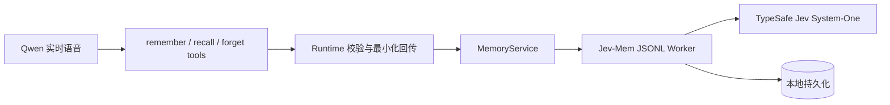

### 实现与安全约束

| 改动 | 行为 |
|---|---|
| `boxagent/__main__.py` | 在唯一装配点创建懒启动 `JevMemWorker` 并交给 Runtime |
| `boxagent/runtime.py` | 实现文本长度校验、结果最小化、错误收敛和关闭清理；不向语音泄漏 Worker trace 或内部 metadata |
| `boxagent/voice.py` | 新增 `remember_memory`、`recall_memory`、`forget_memory` 工具与明确调用约束 |
| `boxagent/memory.py` | `MemoryService` 增加按精确 ID 删除的 `forget()` 契约 |
| `scripts/jev_mem_worker.py` | 删除 graph node、vector 和 keyword postings，立即持久化并记录脱敏 `memory_forgotten` 审计事件 |

删除不接受模糊查询。Runtime 会记录本进程中 `recall_memory` 实际返回过的 ID；`forget_memory` 只能删除这些 ID。语音指令还要求匹配不唯一时先向用户确认。这能阻止幻觉 ID 直接触发删除，但尚不是独立的交互式确认机制。

隐私边界：图、向量和关键词索引持久化在本机，但真实 Jev 模式会将写入分类、关系判断、读取路由和停止判断所需的文本发送给 TypeSafe；语音回忆时，Runtime 挑选后的 `id/content/timestamp` 会作为工具结果返回当前千问 Realtime 会话。所以“本地持久化”不等于“全本地处理”。

### 验证

1. 本地替身测试覆盖 Runtime 三个工具、最小化回传、未检索 ID 拒绝、Worker 图/向量/关键词索引删除和进程退出清理。`uv run --script scripts/pet.py --check` 结果为 56/56 通过。
2. 真实端到端冒烟从 `Runtime.handle_tool()` 进入，强制使用 Jev 后端：写入 1 条合成偏好成功，检索返回精确 ID，删除后 `memory_count=0`；重启 Worker 后仍为 0，证明图、向量与索引删除已持久化。
3. 该真实链路产生 3 次 `jev_decision`（`memory_type`、`routing`、`stopping`），全部 `source=jev`，无 fallback；写入→检索→删除耗时 51.165 s，其中包含首次冷启。重启验证又发生一次本地模型冷启，不计入该数字。
4. `python3 -m compileall -q boxagent tests scripts/jev_mem_worker.py` 和 `git diff --check` 通过。脱敏验证证据保存在 Git 忽略的 `.runtime/jev-runtime-smoke-20261005/`。

证据边界：端到端测试经过了与真实语音工具相同的 `Runtime.handle_tool()` 入口，但未在本轮额外调用千问 Realtime 来验证模型是否会在自然对话中正确选择三个工具。记忆也尚未自动注入 DeepSeek/Codex Planner，普通闲聊与屏幕摘要不会自动入库。

## 2026-10-05：记忆看板接入位置与图数据边界

### 现状核对

仓库没有 HTTP/Web 管理后台。当前 `boxagent.ui.backend_bridge.BackendBridge` 是 AppKit 主线程与 asyncio 后台线程之间的调度桥，不是可对外暴露的服务器。现有可复用的产品入口是右键/菜单栏菜单与独立 AppKit 窗口，形象商店已使用这一模式。

Jev-Mem 确实使用图结构：当前上游以 NetworkX `MultiDiGraph` 实现，支持 `EVENT / EPISODE / NARRATIVE / ENTITY / SESSION` 节点，以及 `TEMPORAL / SEMANTIC / CAUSAL / ENTITY` 边。本地真实冒烟样本的 `graph.json` 包含 2 个 `EVENT` 节点和 2 条双向时序边（`PRECEDES / SUCCEEDS`）；向量另存在 FAISS 持久化中。

### 已实现架构

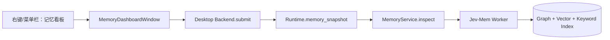

1. Worker 已新增只读 `inspect` 协议，返回限量、脱敏的节点、边和统计；节点仅含 `id/type/content/timestamp/source`，边仅含 `id/source/target/type/subtype`，不返回 embedding、`raw_content` 或完整内部 metadata。
2. Runtime 已提供 `memory_snapshot()` 与看板专用 `delete_memory_node()`；所有查询和删除仍经过 `MemoryService`，UI 不直接读写 `graph.json`，也不与 Worker 争用持久化文件。
3. `Desktop.makeMenu()` 已在“形象商店…”之后增加“记忆看板…”。同一入口同时出现在 macOS 右上角 `◉` 菜单和桌宠右键菜单，打开独立 `MemoryDashboardWindow`；没有新建 Web Server 或监听端口。
4. V1 界面已实现“左侧时间线/搜索 + 中间选中记忆的一跳关系图 + 右侧详情/来源/类型/删除”。初始列表最多返回 100 个节点，选中后的子图最多返回 40 个节点、120 条边。
5. 删除复用已验证的精确 ID `forget` 通路，并在执行前显示原生不可撤销确认框。图编辑、手工改边和批量删除仍不在 V1 范围内。

### 验证

```bash
uv run --script scripts/pet.py --check
uv run --script scripts/pet.py --check-ui
```

1. 本地测试为 60/60 通过，新增覆盖脱敏字段、搜索与数量限制、空图、选中节点一跳完整性、Runtime 快照和精确删除。
2. `--check-ui` 使用合成的 3 节点/2 边记忆图，真实打开 AppKit 看板并通过 31 项界面检查；渲染结果保存在 `.runtime/pet/ui-check/memory-dashboard.png`。该测试不启动真实 Jev，不读写用户记忆。
3. 当前产品缓存只读冒烟返回 0 节点、0 边，验证空状态。随后对隔离的历史合成 Jev 缓存执行同一 `inspect`，返回 2 节点、2 边；字段集合与上述脱敏合同一致。
4. `python3 -m compileall -q boxagent tests scripts/jev_mem_worker.py` 通过。窗口截图还经过人工明暗对比检查，并修复了深色模式下操作按钮文字对比度不足的问题。

证据边界：看板的读取、搜索、详情和图渲染已通过真实 AppKit 冒烟；为避免破坏数据，自动 UI 测试没有点击最终删除确认。删除后的图/向量/关键词索引一致性由 Worker 单元测试和此前真实端到端删除冒烟覆盖。当前产品缓存为空，因此尚未在用户自己的非空记忆数据上做交互验收。

## 2026-10-05：对标 MiraJelly 形成架构重构方案

本轮只读审查 `/Users/bytedance/MiraJelly` 的顶层进程边界、Engine composition/lifecycle、Chat turn preparation、Memory Snapshot、记忆派生索引和 AST 架构门禁，并与 BoxAgent 当前模块职责和代码规模对照；没有修改运行代码。

结论是采用“可拆进程的模块化单体”：先在当前 Python 进程内建立 Host/Engine 逻辑边界、Task Execution Kernel、统一生命周期、typed events、Conversation/Context 与 canonical Memory Ledger；等硬件屏幕或第二客户端成为实际需求后，再将 Engine 物理拆分。MiraJelly 的三栈和模块数量不直接复制，其 `app/electron/main.ts` 约 5,530 行也作为入口继续膨胀的反例保留。

完整方案、阶段、风险、测试门禁、修改量估算与待对齐决策见 `docs/BoxAgent-架构重构方案.md`。本节“尚未执行”的结论已被下一节 supersede。

## 2026-10-05：直接重写 Task Execution Kernel

### 决策与前态

用户明确要求重构时不保留新旧兼容层，只保持用户可见功能、结果合同、证据验证、授权、取消、日志和 Provider 选择行为。重写前 `DeepSeekExecutor` 继承 `CodexExecutor`，后者同时拥有 App Server 进程、RPC、工具网关、任务生命周期、结果策略和日志。

### 实现

| 边界 | 新实现 |
|---|---|
| Task Feature | `features/task/kernel.py` 统一拥有任务生命周期、串行工具调用、观察记录、取消、诊断和终态文件；`result_policy.py` 独立验证结果及证据 |
| Computer Use Adapter | `adapters/computer_use/codex_app_server.py` 只拥有 App Server 进程、RPC、MCP 发现、授权回调和 turn 清理 |
| Provider Adapter | `adapters/providers/codex.py` 与 `deepseek.py` 为同级 Planner；DeepSeek 不再继承任何 Codex Executor |
| Composition | `bootstrap/providers.py` 正交组合 Planner 与 Computer Use Session，`__main__.py` 直接使用新入口 |
| 删除 | `boxagent/executor.py`、`deepseek.py`、`planner.py`、`providers.py` 已删除；未提供 import alias 或兼容 façade |

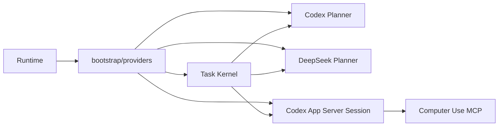

### 验证

```bash
.venv-pet/bin/python -m compileall -q boxagent tests
uv run --script scripts/pet.py --check
git diff --check
```

结果为 63/63 通过。新增测试覆盖：Provider 同级无继承、旧模块确实删除、Feature 不反向依赖 Adapter/Bootstrap、Codex native turn 边界、DeepSeek 经共享工具网关完成一次 fake 图文工具链、证据策略、取消、授权、空表单自动授权门禁、清理超时和终态诊断文件。

随后执行不调用任何桌面工具、也不启动模型 turn 的真实传输冒烟：新 `CodexAppServerSession` 启动本机 App Server，发现 10 个 Computer Use 工具（`drag/get_app_state/list_apps/perform_secondary_action/type_text/click/set_value/scroll/select_text/press_key`），确认进程运行后立即关闭，最终 `returncode=0`、`cleanup=not_needed`。这验证了重写后的真实进程启动、MCP 发现与关闭链路。

第一次误用系统 Python 3.9 执行，因项目代码使用 Python 3.11+ 的 `asyncio.timeout` 而失败；`finally` 仍将 App Server 正常关闭。改用项目 `.venv-pet/bin/python`（Python 3.12）后通过。该失败说明独立诊断命令也必须使用项目环境，不能把系统 `python3` 当成启动入口。

证据边界：自动化测试验证了重写后的合同与完整 fake 链路，真实无动作冒烟验证了 Computer Use 传输，但本节没有执行会操作真实应用的 Codex/DeepSeek 配对任务。重写前的真实 DeepSeek `list_apps` 结果只能证明底层方案曾跑通，不能替代重写后真实 Provider 任务冒烟。本节的 `bootstrap/providers.py` 与 `Runtime` 结构已被下一节的完整目录迁移 supersede。

## 2026-10-05：完成推荐目录结构与生产切换

### 目标与前态

继续执行完整架构重构，而不是停留在 Task Kernel。前态仍存在根级 `runtime.py`、`desktop.py`、`voice.py`、`context.py`、`memory.py` 等职责中心；Adapter 和 UI 还会反向读取 bootstrap 配置，推荐目录缺少 Provider Registry，Conversation/Storage 只有设计没有可执行合同。

### 实现

1. 删除全部旧根级业务模块，不提供 import alias 或新旧兼容 façade；根目录仅保留 `__init__.py`、`__main__.py` 和包目录。
2. 将应用拆为 `core/`、`contracts/`、`harness/`、`runtime/`、`features/`、`adapters/`、`engine/`、`ui/` 与 `bootstrap/`；保留独立的角色 `appearance/` 与形象商店 `pets/`。
3. `bootstrap/composition.py` 成为生产对象装配点；`bootstrap/settings.py` 生成不可变 `Settings`，环境变量和 `.env.local` 不再由 Adapter 或 UI 读取。
4. 新增 `adapters/providers/registry.py`，Codex、DeepSeek 与 Qwen 通过显式 Registry 配置；Computer Use Session 与 Tool Gateway 分离。
5. `ApplicationLifecycle` 统一启动 SQLite，并按 Perception → Task → Voice → Memory → Database 顺序关闭；关闭成功后重复调用不再重复释放资源。
6. Conversation SQLite migration/Repository、Context Assembler、UI State Projection 已有确定性测试。它们的结构与合同已实现，但生产尚未自动保存 Final Turn，也未把历史/记忆注入 Planner。
7. 增加全仓 AST 门禁：推荐文件必须存在、旧模块必须消失、Feature 不得反向依赖 Adapter/UI/Bootstrap、Adapter 不得依赖 UI/Bootstrap、UI 不得依赖具体 Adapter、子进程只能在 Adapter 中启动、生产级对象只能在 composition boundary 构造、`__main__.py` 保持薄入口。

当前依赖方向：

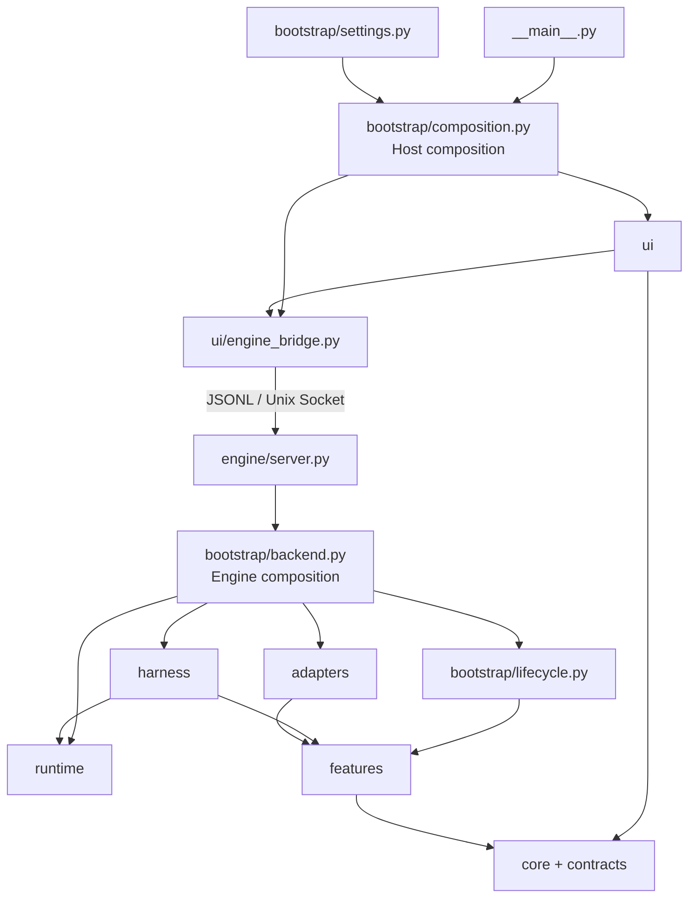

### 验证

```bash
.venv-pet/bin/python -m compileall -q boxagent tests scripts
uv run --script scripts/pet.py --check
uv run --script scripts/pet.py --check-ui
```

- 编译通过。
- 自动化测试 `76/76` 通过，包含 SQLite 重启/幂等、Context JSON fencing/近期预算、Voice 与 Task 并行投影、生命周期启动/幂等关闭和架构门禁。
- 原生 AppKit 冒烟 `32/32` 通过，覆盖对话窗、任务/授权/失败状态、窗口摘要、菜单入口与记忆看板；脚本最初在打印结果后未退出事件循环，改为 `AppHelper.stopEventLoop()` 后正常以 0 退出。
- 真实无动作 Computer Use 冒烟启动 App Server、发现 10 个工具并关闭，`closed=True`、`cleanup_status=not_needed`；没有启动规划模型或操作应用。

### 证据边界与下一步

本轮验证“推荐目录、依赖纪律和现有用户可见行为”已经切换完成，不等于 Phase 3/4 产品能力已完成。Conversation 表和 Context Assembler 目前可用但未接入真实语音/文字 Turn；Memory 仍以 Jev 为实际真相来源，尚无 BoxAgent canonical ledger；Proactivity 只有合同占位。下一步应沿新边界接通 Final Turn → Conversation Store → Context Assembler → Planner/Voice，并单独评测 DeepSeek/Codex 的真实操作任务。

## 2026-10-05：将 DeepSeek 收敛为 Codex Responses Provider

### 决策与前态

此前 `adapters/providers/deepseek.py` 自己实现 Chat Completions、多轮工具调用、截图回传和结果修复。这意味着替换模型时同时替换了 Agent Runtime，Codex App Server 的 turn 管理、模型工具协议和 DeepSeek 手写循环存在两套行为，无法验证差异究竟来自模型还是 Harness。

本轮将 Agent Runtime 定义收敛为 Codex App Server：`codex` 与 `deepseek` 只表示模型档案和用户可见的任务标签，任务生命周期、工具网关、结果校验和 Runtime 均保持同一套。

### 实现

| 变更 | 状态 |
|---|---|
| 新增不可变 `ModelProfile`，描述模型、Provider、Base URL、Key 环境变量与模型目录 | implemented |
| Registry 对 `codex`、`deepseek` 均创建 `CodexAgentRuntime` | implemented |
| App Server 通过临时 `-c` 覆盖注入 `model_provider`、`wire_api="responses"` 与模型目录 | implemented |
| `DEEPSEEK_API_KEY` 只进入 App Server 子进程环境，命令行、catalog 与日志不含密钥 | implemented，tested |
| 删除手写 `adapters/providers/deepseek.py` 及其 Chat Completions 工具循环测试 | implemented |
| 加入仓库内 `assets/model-catalogs/deepseek.json`，声明 `deepseek-flash` 的 text/image 与 `deepseek-v4-pro` 的 text 能力 | implemented，executed |

官方依据为 [OpenAI Codex 高级配置](https://learn.chatgpt.com/docs/config-file/config-advanced)、[DeepSeek Responses API](https://api-docs.deepseek.com/guides/responses_api/) 和 [DeepSeek Codex 集成](https://api-docs.deepseek.com/quick_start/agent_integrations/codex)。没有执行 DeepSeek 提供的远程安装脚本，也没有修改用户全局 `~/.codex/config.toml`。

### 验证

聚焦单元测试验证两种选择都生成 `CodexAgentRuntime`、DeepSeek 启动参数包含 Responses Provider 配置、真实 Key 不出现在参数或 `ModelProfile.repr`、OpenAI 档案不注入 DeepSeek 配置。

全量命令 `.venv-pet/bin/python -m unittest discover -s tests` 已执行并通过 `76/76`；`.venv-pet/bin/python -m compileall -q boxagent tests` 与 `git diff --check` 也通过。最终用 `./scripts/run-deepseek.sh --check` 从一键入口复验测试集。

随后用本机 `codex-cli 0.160.0` 启动 App Server，加载仓库模型目录并创建 `ephemeral=true`、`sandbox=read-only`、`approvalPolicy=never` 的线程。返回值明确为 `modelProvider=deepseek`、`model=deepseek-flash`、`reasoningEffort=high`。再从 BoxAgent 的生产装配路径启动同一 Profile，成功发现 10 个 Computer Use 工具并正常关闭。本次没有启动模型 turn、没有调用 Computer Use 工具，也没有操作桌面应用；因此只验证了配置解析、Provider 路由和 CU 传输启动，不代表真实 DeepSeek Responses 请求或桌面任务已经通过。

首次使用 `--strict-config` 冒烟失败，原因是用户全局配置已有两个与本轮无关、被 Codex 0.160.0 判定为未知的字段；去掉 strict 后仓库模型档案成功加载。该观察不证明 BoxAgent 配置有误，也未修改全局配置。

## 2026-10-05：让 Codex App Server 长驻并复用 Runtime Thread

### 目标与前态

前态是每个桌面任务各自创建和关闭 Codex App Server：这会重复支付进程启动与工具发现开销，也无法复用 Codex Thread 上下文，并会破坏有利于 Provider Prompt/KV Cache 的稳定前缀。

本轮目标是把“应用级 Runtime 资源”和“任务级执行状态”分开：Engine 持有长驻 Runtime Host，每个任务只租用一个 Session，任务结束时释放回调和 Turn 资源，不结束底层 App Server 进程。

### 实现

| 变更 | 状态 |
|---|---|
| `CodexRuntimeHost` 作为应用级资源由 `ApplicationLifecycle` 统一关闭 | implemented |
| `CodexTaskSession` 仅在任务期间获取独占 lease，结束时不销毁共享进程 | implemented |
| 相同 model、developer instructions 与规范化工具 schema 复用同一 Thread | implemented，tested |
| 模型、SOUL/指令或工具 schema 变化时创建新 Runtime Epoch，避免不同配置混用上下文 | implemented，tested |
| 工具 schema 按名称稳定排序 | implemented，tested |
| 记录 Thread ID、Turn ID、Token Usage 和 Compact 事件 | implemented |

### 执行与证据

完成该节点时执行全量自动化测试：

```text
Ran 88 tests
OK
```

随后用真实 DeepSeek Provider 在同一 Runtime Host 中连续执行两轮只读任务，并对比 App Server PID 与 Codex Thread ID：

```text
same_pid=true
same_thread=true
returncode=0
```

单元测试另外覆盖：相同签名仅调用一次 `thread/start`；人格/指令变化后创建新 Thread；连续任务共享同一进程与 Thread owner；应用关闭时由 Runtime Host 一次性回收进程。

### 证据边界

上述验证只证明同一次 BoxAgent Engine 生命周期内可以复用 App Server 进程和 Codex Thread。现在的 Thread 使用 `ephemeral=true`，Engine 重启后会创建新 Runtime Host；还没有实现跨 Engine 重启的 Thread 恢复。当前也没有基于 Provider 返回值统计实际 KV Cache hit rate，稳定前缀只是结构条件，不是命中证明。Conversation Store 和 Memory Snapshot 也尚未注入真实任务，因此不能把 Thread 复用等同于 BoxAgent 已拥有完整的产品级长期上下文。

## 2026-10-05：拆分 AppKit 宿主与可重启 Engine

### 目标与前态

原 `BackendBridge` 只把 `ApplicationLifecycle` 放到同一 Python 进程的 asyncio 线程中。修改 Harness、Runtime、Memory 或 Feature 代码后必须结束 AppKit 事件循环，因此无法在保留桌宠窗口的同时重载后端。

本轮目标是建立真实进程边界，将“热加载”定义为可审计的 Engine 进程重启，而不是在存活对象和协程中替换 Python 模块。

### 实现

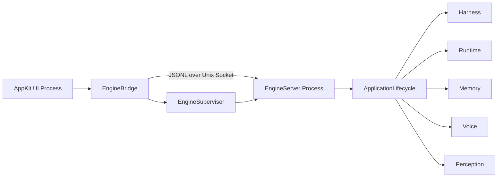

| 变更 | 状态 |
|---|---|
| 新增版本化 JSONL/Unix Socket 协议，仅暴露白名单命令 | implemented |
| 将 ApplicationLifecycle、Harness、Runtime、Memory、Voice 和 Perception 移入独立 Engine 进程 | implemented |
| AppKit 宿主使用 `EngineApplicationProxy` 保留异步命令与事件投影边界 | implemented |
| Engine 异常退出自动拉起；后端源码变化触发独立重启 | implemented |
| 旧 UI 崩溃后的健康 Engine 可被新 UI 接管；进程锁防止第二个 Engine 篡改活跃 Socket | implemented，tested |
| 重启期间桌宠显示“后台正在重新加载”，重连后用 Engine 快照恢复投影 | implemented |

### 执行与证据

```bash
uv run --script scripts/pet.py --check
```

```text
Ran 92 tests in 3.4s
OK
```

另外使用真实 `.venv-pet` Python 宿主启动 EngineBridge，发送 `health` 和 `state`，再请求一次 Engine 重启。

```text
ui_pid=53749
first_engine_pid=53750
second_engine_pid=53751
engine_restarted=True
ui_survived=True
health=ready
```

随后直接强制结束 Engine 子进程，监督器在约 1 秒内恢复新 Engine：

```text
ui_pid=54459
first_engine_pid=54460
recovered_engine_pid=54464
engine_recovered=True
ui_survived=True
health=ready
```

最后通过真实产品入口启动 AppKit 宿主，进程列表同时出现 Host PID 54668 与 Engine PID 54671；发送 SIGINT 后两者退出，`engine.sock` 被移除，`events.jsonl` 记录 `engine.ready`、`backend.connected` 和 `app.stopped`。

这些证据确认了真实子进程、异常恢复、产品入口和正常关闭边界，但尚不等于已验证运行中的语音流或桌面操作可跨重启继续。当前策略是明确中断这些瞬时状态；Conversation、Memory 和其他 SQLite 状态才能在新 Engine 中恢复。

### 下一步

在稳定的 AppKit 宿主侧实现 Model Manager 和首次引导，先管理已有的本地视觉模型，再将语音拆分为可替换的本地 STT 与云端 Realtime Provider。

## 2026-10-05：开发阶段保持本地 SQLite 与 Jev 存储（已被后续评审部分取代）

### 决策

当时决定先在单机 macOS 上完成产品主链和稳定性验证，不引入云数据库、Docker 或远程同步依赖。该“本地优先”结论仍有效；其中 Conversation 使用 SQLite 的选择已被后续评审改为 JSONL Session Event Log。

| 数据 | 当前存储 | 状态 |
|---|---|---|
| Schema 版本 | `.runtime/pet/boxagent.sqlite3` 中的 `schema_version` | implemented，executed |
| 会话 Turn | SQLite `conversation_turns` | schema/repository implemented；生产写入 planned |
| Jev 记忆图 | `.runtime/pet/memory/jev/graph.json` | implemented，verified |
| Jev 向量与关键词索引 | 同一本地 Jev cache 目录 | implemented，verified |
| 云数据库、跨设备同步、多人数据面板 | 未引入 | deferred |

### 执行与证据

本地数据库已创建 `schema_version` 和 `conversation_turns` 两张表；检查时 `conversation_turns` 为 0 条。这与当前代码状态一致：Repository 和 Context Assembler 已实现并测试，但最终语音/文字 Turn 还没有接入生产写入链路。

### 证据边界与后续触发条件

本决策只覆盖当前本地开发阶段，不等于排除云端。当出现跨设备恢复、真实多用户登录、团队分析或需要服务端主动触发时，再设计云端 store 和同步协议。原定 `Final Turn → SQLite → Context Assembler → Harness` 路径不再执行。

## 2026-10-05：完成 Phase 3 Conversation 与 Context 方案设计

### 目标

在继续改代码前，先单独定义 BoxAgent 的对话真相来源、用户可见会话模型、上下文预算、Runtime Thread 复用和重启恢复边界，避免将 SQLite 接线、Codex Thread 和长期记忆混成同一个概念。

### 初版设计结论（已被后续评审部分取代）

- V0 支持用户手动新建和切换多个 Session；不用时间、前台 App 或语义阈值自动切换。
- 旧 Session 保留自己的 Turn、Summary 和 Runtime Binding，用户之后选中它时可继续使用。
- 短期对话上下文按 Session 隔离；长期记忆按用户级共享，在所有 Session 中可检索，同时保留来源 Session/Turn 用于追溯。
- 每次请求统一为 Interaction；Task 是其中可选的执行记录，不与 Turn 拆成两套用户语义。
- ~~SQLite Final Turns 是 canonical conversation。~~ 后续改为 BoxAgent 自有 JSONL Session Event Log。
- ~~Context 按固定 L0–L5 分层组装。~~ 后续改为依照 Codex Prompt Stack 和 warm/resume/cold 生命周期组装。
- Runtime Conversation 仍是可恢复、可重建的执行状态；BoxAgent 产品会话不能只依赖单一 Provider 的内部格式。

详细文档：[BoxAgent Phase 3：Conversation 与 Context 设计](./BoxAgent-Phase3-Conversation-Context-设计.md)。

### 参考边界

本轮阅读了本地 OpenMira Harness 的 `SessionProcessor → ContextProcessor → AgentRuntime` 分层，以及 MiraJelly 的 canonical ChatSession message、`client_turn_id` 幂等、pending/completed 状态、Memory Snapshot 和 Sidecar session resolver。只借鉴其所有权、幂等和快照边界；没有照搬其“按前台 App + 一小时窗口”的会话切分策略。

### 当前状态

设计当时已修正为手动多 Session + 用户全局长期记忆；尚未实施 Phase 3A–3D，也未改变现有运行行为或 SQLite schema。Conversation 存储与 Context 结构在后续评审中再次修正。

## 2026-10-05：按 Codex Prompt Stack 修正 Phase 3 设计

### 问题

评审发现初版方案混淆了三件事：BoxAgent 产品会话、Codex Thread 内部历史，以及 Runtime 冷启动时才需要的恢复输入。固定 L0–L5 表还会让人误以为每轮都要从 SQLite 读取近期 Turn 和 Summary，再拼成一份大 Prompt。

### 核对证据

本轮读取了 OpenAI 官方 Codex App Server 文档和当前实现：

- 官方将 Thread 定义为一条 conversation，Thread 包含 Turns；`thread/resume` 用于继续已保存的会话。
- 官方说明 Codex 持久化 Thread 使用 JSONL log，并提供 `thread/read/list/resume/compact` API。
- 当前 `boxagent/runtime/codex/app_server.py` 在 `thread/start` 传入 `developerInstructions`、`dynamicTools` 和 model，在 `turn/start` 只传当前 `goal`。
- 当前实现仍设置 `ephemeral=true` 且只保存一个 `thread_id`，所以跨 Engine 重启和按 BoxAgent Session 绑定尚未实现。

### 修正后的决策

1. Conversation 使用 BoxAgent 自有 append-only JSONL Session Event Log；现有 SQLite Conversation prototype 因未接生产而在 Phase 3A 直接替换，不做双写。
2. 不直接解析 Codex 私有 rollout JSONL；通过 App Server Thread API 使用 Codex 自己的历史。
3. Prompt Stack 明确为：Codex Base/System → Codex 运行规则 → BoxAgent Developer Instructions → 工具定义 → Codex Thread 历史 → 当前 User Input。
4. Warm Codex Turn 只发送当前请求和按需 Memory/Perception Evidence，不重复注入近期历史和 Summary。
5. Engine 重启时优先 `thread/resume`；只有 Thread 无法恢复时才从 BoxAgent checkpoint + event log 生成一次 Resume Packet。
6. 删除 `Consumer` 抽象，改为 Codex Desktop、Qwen Voice、Memory Extraction、Proactivity Evaluation 等明确执行路径，各自拥有 Context Builder 和预算。
7. 原 `6000/2000` 字符预算不再作为产品默认事实；预算只对 Memory、Perception、Cold Resume Packet 和 Qwen 恢复输入分别配置，并优先使用 token 计量。

### 当前状态

设计文档与总体架构方案已更新；业务代码、SQLite schema 和现有运行行为均未修改。下一步应从 Phase 3A 的 JSONL Session Store 开始实现，再进入持久化 Codex Thread 与 `thread/resume`。

## 2026-10-05：确认 App Server 轨迹能力并规划本地路径

### 观察

OpenAI 官方 Codex App Server 文档确认：非临时 Thread 会自动持久化，`thread/read(includeTurns=true)` 可读取完整 Turn，`thread/turns/list` 和 `thread/items/list` 可分页读取持久化内容，`thread/archive` 会移动持久化 JSONL，`thread/delete` 会删除 rollout。协议没有要求客户端每轮调用一个额外的“保存”接口。

本机 `CODEX_HOME` 当前未显式设置，观察到默认目录为 `~/.codex/sessions/YYYY/MM/DD/rollout-*.jsonl`，归档目录为 `~/.codex/archived_sessions/`。这只是当前安装的本地观察；BoxAgent 不依赖这些物理文件名作为 API。

当前 `boxagent/runtime/codex/app_server.py` 的工具发现 Thread 和任务 Thread 均传入 `ephemeral=true`，因此现有 BoxAgent Thread 只在当前 App Server 生命周期内复用，不能通过 `thread/resume` 跨 Engine 重启恢复。

### 路径决策

- 源码开发的 `BOXAGENT_DATA_DIR` 默认保持为 `<repo>/.runtime/pet/`；正式 macOS App 使用 `~/Library/Application Support/BoxAgent/`。
- BoxAgent Product Session 写入 `<data>/conversations/`；Jev 写入 `<data>/memory/jev/`。
- Codex 子进程使用 `<data>/runtimes/codex-home/` 作为专用 `CODEX_HOME`，避免 BoxAgent Thread 混入用户日常 Codex 会话。
- `BOXAGENT_CODEX_BIN` 仅负责定位可执行文件，不能与 Codex 数据目录复用同一个配置含义。
- `--log-dir` 只覆盖可轮转的诊断日志，不移动 Conversation、Memory 或 Codex Thread。
- BoxAgent 通过 Thread API 管理 Runtime 轨迹。每个 Session 保存当前 Runtime Binding：通常持续复用同一个 Thread，同时记录 provider、model、Persona 和工具配置版本；只有恢复失败或 Runtime 不兼容时才替换 Thread。

### Codex Memories 边界

官方文档确认 Codex 还提供独立于 Thread rollout 的本地 Memories：后台从符合条件的旧会话生成 Markdown 记忆，默认存放于 `$CODEX_HOME/memories/`，并可在未来会话中注入。当前本机配置已启用 `features.memories`、`generate_memories` 和 `use_memories`，这可以解释 Codex 偶尔读取历史摘要或证据文件的行为，但不代表 App Server 每轮遍历所有 JSONL。

BoxAgent V0 不同时启用两套长期记忆。专用 Codex Home 默认关闭 Codex Memories，由 Jev-Mem 提供用户可见、可追溯、可删除的跨 Session 记忆；Codex Thread 只承担 Session 内历史与 compact。Codex Memories 后续可作为独立 Backend 做对照实验。

### 当前状态

以上为 `planned` 设计，已同步 Phase 3 与总体架构文档；尚未修改 Settings、App Server 启动环境或 `ephemeral` 参数，也未创建、归档或删除任何 Codex Thread。

## 2026-10-05：实现 Phase 3 Context 基础与 Codex Thread 恢复

### 目标与前态

前态只有未接生产链路的 SQLite `conversation_turns` prototype；文字请求不会形成 Product Session Event，Codex Thread 使用 `ephemeral=true`，Engine 重启后无法恢复。长期记忆的自动提取仍处于设计阶段，本轮明确不把 Jev 注入 Context 主链。

### 实现

| 变更 | 状态 |
|---|---|
| 以 `conversations/index.json + sessions/<id>/events.jsonl` 替换 SQLite Conversation prototype | implemented，tested |
| Product Event 使用 schema version、Session 内单调 sequence 和 event ID 幂等 | implemented，tested |
| JSONL 尾行因崩溃截断时保留有效前缀并在下一次写入前修复 | implemented，tested |
| 默认 Session、手动创建/激活/归档、历史读取 Engine API | implemented，tested；UI 入口 planned |
| 文字 Interaction 写入 started、User Final、Assistant Final 和 terminal Event | implemented，tested |
| Session 首次输入生成标题；Session 与 Runtime Binding 分开持久化 | implemented，tested |
| Codex 任务 Thread 改为 `ephemeral=false`，使用 `<data>/runtimes/codex-home` | implemented，verified |
| Engine 重启后使用已保存的 Thread ID 调用 `thread/resume` | implemented，verified |
| Warm/resumed Thread 只发送当前请求；恢复失败并新建 Thread 时才附加 Resume Packet | implemented，tested |
| `MemoryEvidenceProvider` 返回空列表，`MemoryExtractionSink` 不执行任务 | implemented；自动提取与记忆注入 deferred to Phase 4 |

### 执行与证据

```bash
python3 -m compileall -q boxagent tests scripts/jev_mem_worker.py
uv run --script scripts/pet.py --check
```

```text
Ran 101 tests in 2.665s
OK
```

测试覆盖多 Session 隔离、Event ID 幂等、JSONL 尾行恢复、文字任务最终事件、Runtime Binding、专用 `CODEX_HOME`、新 Product Session 不误用其他 Session 的 Thread，以及 `thread/resume` 请求结构。

随后使用真实 Codex App Server 和 DeepSeek Profile 做无桌面操作的持久化冒烟：第一个进程创建 Thread 并完成一个最小 Turn，关闭后由第二个进程从相同专用 `CODEX_HOME` 恢复。

```text
first_result_nonempty=true
resumed=resumed
same_thread=true
rollouts_before_resume=1
```

第一次仅执行 `thread/start`、没有创建 Turn 的探测得到 `same_thread=false` 且没有 rollout；这确认 Thread 必须产生实际 Turn 后才有可恢复记录。另一次误用系统旧版 `python3` 遇到 Python 3.12 union type 语法错误，最终固定使用 `uv run --python 3.12` 完成验证。

### 证据边界与下一步

当前结果证明文字链路拥有持久 Product Session、最终消息记录和可跨 Engine 进程恢复的 Codex Thread。尚未实现 Qwen 最终转写/回答落盘、Qwen 与 Codex 的增量上下文同步、Summary Checkpoint、会话切换 UI 和 Notification Outbox，因此 Phase 3 尚未整体完成。下一步先完成 Phase 3C 的语音最终事件与跨 Runtime cursor，再实现 Session UI；自动 Memory Extraction 继续留在 Phase 4。

## 2026-10-05：完成 Phase 3C 语音上下文与跨 Runtime 增量

### 决策

自动 Memory Extraction 不进入当前响应链路，也不在本阶段决定“只记 User”还是“同时记 Agent”。Phase 3 只保证用户和 Assistant 的最终可见消息进入 Product Session Event Log；Phase 4 再将完整 Interaction 作为有界输入，异步提取候选记忆。这使记忆模型的延迟不会阻塞当前回复。

### 实现

| 变更 | 状态 |
|---|---|
| Qwen 最终用户转写、Assistant 最终回答与 Interaction 终态写入 JSONL Event Log | implemented，tested |
| `response_id` 与 Interaction 绑定，隔离 barge-in 后的迟到取消事件 | implemented，tested |
| Qwen 委托 Codex 时沿用原 Interaction，不重复写 User Message，terminal Event 记录实际 Task ID | implemented，tested |
| Codex warm/resumed Thread 只注入 `context_cursor` 之后的跨 Runtime Final Messages | implemented，tested |
| Qwen 新建 Realtime 连接时注入有界的原生 user/assistant message items | implemented，tested |
| 取消的 response 不写 Assistant Final；工具结果后的第二个 Qwen response 不重复完成 Interaction | implemented，tested |

### 执行与证据

```bash
python3 -m compileall -q boxagent tests scripts/jev_mem_worker.py
uv run --script scripts/pet.py --check
git diff --check
```

```text
Ran 111 tests in 2.770s
OK
```

测试覆盖 Qwen 直答、barge-in、旧 response 迟到、Qwen→Codex 委托、warm Thread delta 和 Qwen 重连恢复包。这是确定性合同验证；本轮没有连接真实 DashScope 音频会话，因此不声称已验证实际播放回执。

### 剩余边界

Summary Checkpoint、会话选择 UI、持久化 Notification Outbox 和 playback receipt 仍未实现。这些不阻塞当前 Session 内的文本/语音短期连续性，但后台任务在断线或崩溃后的可靠通知仍需 Phase 3D 完成。

## 2026-10-06：真实端到端使用验证揭示 Qwen 事件顺序缺陷

### 目标与隔离

使用独立数据目录 `.runtime/e2e-20261006.wSrhGf/`，不读写日常 BoxAgent Session。真实启动 Engine、DeepSeek Flash、Codex App Server 和 macOS Computer Use，并使用系统计算器执行可逆的低风险任务。语音路径使用 macOS 本地合成的 16 kHz PCM 中文语音，连接真实 Qwen Realtime。

### DeepSeek + Codex + Computer Use 三轮链路

| 轮次 | 用户目标 | 实际终态 | 屏幕核验 |
|---|---|---|---|
| 1 | 打开计算器并计算 `137+248` | succeeded | 表达式 `137+248`，结果 `385` |
| 2 | “把刚才的计算结果乘以 2” | succeeded | 表达式 `385×2`，结果 `770` |
| 3 | Engine 重启后“把刚才的结果减去 70” | succeeded | 表达式 `770-70`，结果 `700` |

三轮均写入完整 `interaction.started → User message.final → Assistant message.final → interaction.finalized(succeeded)`。Session Event sequence 从 1 连续增长到 12。第一轮建立 Thread，第二轮记录 `runtime_epoch_reused`，关闭 Engine 并启动新 PID 后，第三轮记录 `runtime_thread_resumed`。三轮 Thread ID 一致，`runtime-bindings.json` 的 `context_cursor` 最终为 12，且专用 Codex Home 中只有一份 rollout。

这证明当前文字桌面主链能真实操作 macOS 应用、继续同 Thread 上下文，并在 Engine 跨进程重启后恢复。这仍是单应用、单 Session、三轮冒烟，不等于广泛任务集的稳定性证明。

### Qwen Realtime 真实验证与失败

直接 Provider 验证成功连接 `qwen-audio-3.0-realtime-plus`，ASR 得到“你好，请用一句简短的话介绍你自己。”，并收到 Assistant Final 与 `response.done`。真实事件顺序是：

```text
response.created
conversation.item.input_audio_transcription.completed
response.audio_transcript.done
response.done
```

但通过 `ApplicationLifecycle → VoiceService → ConversationService` 运行时，`response.created` 到达时 `user_final` 尚未创建 Interaction。当前 `VoiceService` 因此无法保存 `response_id → Interaction` 映射；后续虽然 UI 已显示 Assistant 文本，Event Log 只有 User Final，没有 Assistant Final 和 `interaction.finalized`。下次 Engine/Conversation 恢复只能将该 Interaction 追加为 `interrupted`。

这是真实集成缺陷，说明新增确定性测试使用了错误的 Provider 事件顺序。Phase 3C 应从 `implemented` 回退为 `partial`；在进入自动 Memory 前，必须先实现“先到 response 的暂存绑定”并使用真实事件序列增加回归测试。否则自动 Memory Extractor 将看不到完整 Interaction。

### Host UI 边界

产品 Host 进程已从真实入口启动，并成功接管已运行 Engine；在尝试通过全局快捷键打开桌宠气泡时 macOS 进入锁屏，无法继续可视 UI 交互验证。因此 Host 启动为 executed，气泡/菜单操作本轮 blocked by locked screen。测试进程已正常关闭，隔离产物保留于 `.runtime/e2e-20261006.wSrhGf/` 供复核。

## 2026-10-06：修复 Qwen Response 早到竞态并完成真实回归

### 目标与前态

修复真实 Qwen Realtime 中 `response.created` 早于用户最终转写时，`VoiceService` 无法建立 `response_id → Interaction` 绑定的问题。修复前 UI 可以显示回答，但 Product Session 只保存 User Final，缺少 Assistant Final 与 `interaction.finalized`，因此该 Interaction 会在恢复时被误标为 `interrupted`。

### 实现

- `VoiceService` 增加有序的 pending user response 暂存；当 `user_final` 创建 Interaction 后，绑定最早尚未完成的用户 Response。
- `response.done` 会清理尚未绑定的 Response；取消或迟到事件不能串入下一轮 Interaction。
- Qwen 会话关闭时清空 Response 关联状态，不跨 Realtime 连接复用 Provider 临时 ID。
- 新增两项回归测试：真实 Provider 事件顺序，以及“取消的早到 Response 不得污染下一轮”。

### 执行与证据

最小回归测试在修复前稳定失败，仅得到：

```text
['interaction.started', 'message.final']
```

修复后使用真实 DashScope `qwen-audio-3.0-realtime-plus`、隔离目录和同一段 16 kHz 合成语音复验。Provider 实际顺序为：

```text
response.created
conversation.item.input_audio_transcription.completed
response.audio_transcript.done
response.done
```

Product Session 最终事件为：

```text
interaction.started(running)
message.final(user): 你好，请用一句简短的话介绍你自己。
message.final(assistant): 我是住在 Mac 桌面的 BoxAgent，能帮您操作电脑和应用。
interaction.finalized(succeeded)
```

隔离证据目录：`.runtime/qwen-lifecycle-fix-n79hmbyv/`。密钥仅由本地配置读取，未写入日志或文档。

```bash
.venv-pet/bin/python -m unittest discover -s tests -v
```

```text
Ran 113 tests in 3.810s
OK
```

直接使用 `.venv/` 执行全量测试会因该 MLX 环境未安装 `PyAudio` 和 `PyObjC/AppKit` 而在收集阶段失败；切换到项目定义的 macOS 宿主环境 `.venv-pet/` 后全量通过。这是环境边界，不是本次代码回归。

### 结论与边界

Phase 3C 的“最终转写、最终回答、Interaction 终态、barge-in/迟到隔离、重连恢复”核心链路现为 implemented、真实 verified。严格 playback receipt 仍未实现，不能把“模型已生成音频”解释为“用户已经完整听到”；该能力继续属于 Phase 3D Notification Outbox。

## 2026-10-06：真实桌宠 UI → DeepSeek/Codex → Calculator 全链路验收

### 目标与隔离

补齐此前未重测的桌宠 UI 与桌面操作链路。使用隔离目录 `.runtime/full-ui-e2e-20261006.rdZN0h/` 启动真实 AppKit 桌宠和独立 Engine，任务 Provider 为 `deepseek-flash`，目标为：

```text
打开 macOS 计算器，计算 314+159，并确认最终显示为 473。只操作计算器，不要修改其他内容。
```

### 执行路径

```text
真实 AppKit 对话窗口
→ 输入框与 SendButton.performClick_
→ EngineBridge / 独立 Engine 进程
→ Harness
→ Codex App Server
→ DeepSeek Responses Provider
→ Computer Use
→ macOS Calculator
→ Product Session Event Log
→ 桌宠完成态气泡
```

验收脚本在真实窗口中设置输入内容，并调用实际 `SendButton` 的 AppKit 点击动作，不直接调用 `submit_text` 后端接口。系统级坐标点击工具因当前调用进程没有 macOS Accessibility 权限而不可用，因此本轮验证覆盖控件 target/action、UI 状态投影和窗口渲染，不声称覆盖物理鼠标命中测试。

### 结果与独立核验

任务在独立 Engine PID `40842` 中执行，约 47 秒到达 `succeeded`，共记录 12 个步骤。Computer Use 最终读取到：

```text
上个表达式：314+159
编辑字段：473
```

任务结束后又通过独立 Computer Use 客户端读取 Calculator Accessibility Tree，结果仍为表达式 `314+159`、编辑字段 `473`，不是只采信 Agent 自报结果。

桌宠 UI 验收项全部通过：

- 对话窗口和桌宠窗口真实显示；
- 输入内容后发送按钮启用；
- AppKit 发送按钮成功提交；
- 运行中气泡显示用户目标、进度与停止入口；
- 完成气泡显示最终结果和实际用时；
- 输入框在受理后清空；
- 完成后气泡保持可见；
- Product Session 写入完整的 `interaction.started → User Final → Assistant Final → interaction.finalized(succeeded)`。

证据：

- `.runtime/full-ui-e2e-20261006.rdZN0h/data/full-ui-e2e/summary.json`
- `.runtime/full-ui-e2e-20261006.rdZN0h/data/full-ui-e2e/running-bubble.png`
- `.runtime/full-ui-e2e-20261006.rdZN0h/data/full-ui-e2e/completed-bubble.png`
- `.runtime/full-ui-e2e-20261006.rdZN0h/data/logs/tasks/bcdb4e406409/events.jsonl`

所有 BoxAgent、Engine、Codex App Server 测试进程均在验收后关闭；Calculator 保留最终结果供人工复核。该结果证明当前单 Session、单计算器任务的产品级主链可运行，但尚未覆盖语音入口与桌面任务在同一次场景中的串联、多应用任务集、物理鼠标命中或后台通知送达。

## 2026-10-06：建立 BoxAgent Skill 管理底座与 Runtime Allowlist

### 目标与前态

此前 Codex Runtime 会自动扫描 `$HOME/.agents/skills` 和内置 System Skills。真实桌面任务
的初始 Skill 列表包含大量与 BoxAgent 无关的全局 Skill，增加 Prompt/KV Cache 成本并带来
误触发风险。独立 `CODEX_HOME` 不能阻止对 `$HOME/.agents/skills` 的扫描。

### 实现

- 新增顶层 `skills/builtin/`，将官方 Skill 与 `assets/` 静态素材分离。
- 新增 `SkillService` 和文件仓储，支持用户 Skill 创建、更新、启停、删除与列举；状态保存到
  `<BOXAGENT_DATA_DIR>/skills/registry.json`，Skill 目录本身不因禁用而移动。
- Engine IPC 新增 `list_skills`、`create_skill`、`update_skill`、
  `set_skill_enabled` 和 `delete_skill`。
- `CodexSkillAdapter` 使用 `skills/extraRoots/set` 注册 BoxAgent 受管目录，随后通过
  `skills/list` 获取真实发现结果，并用 `skills/config/write` 禁用 allowlist 外的 Skill。
- Skill 内容或启用集合参与 Runtime signature；发生变化后创建新 Runtime Epoch。
- 文件层校验 Skill ID、防止路径越界和覆盖内置 Skill，写入采用临时文件加原子替换。
- Catalog 扫描只接受受管根目录下的真实一级目录与真实 `SKILL.md` 文件；忽略符号链接和
  非法 ID 的手工目录，避免 allowlist 意外跟随到目录外部。

### 执行与证据

```bash
.venv-pet/bin/python -m compileall -q boxagent tests
.venv-pet/bin/python -m unittest discover -s tests -v
git diff --check
```

```text
Ran 122 tests in 3.049s
OK
git diff --check: exit 0
```

使用临时 `CODEX_HOME` 启动真实 Codex App Server，不启动模型 Turn，执行 Skill 同步与
Computer Use 工具发现：

```text
skill_count=35
managed desktop-assistant enabled=true
external_enabled=[]
tool_count=10
```

### 结论与边界

Skill 控制面、持久化和 Codex 投影当时为 implemented，并通过确定性测试和真实 App Server
协议冒烟验证。当时尚无原生 Skill 管理窗口；该结论已被下一节 supersede。ZIP/Git
导入、依赖检查、版本更新和市场仍未实现；真实模型 Turn 是否只接收精简后的
Skill 元数据尚未通过 rollout 再次核对。

## 2026-10-06：完成 Skill 管理页、统一前台入口与持久通知闭环

### 目标与前态

本轮收口四个产品缺口：原生 Skill 管理页；文字/语音先经 Qwen 的统一
前台入口；任务终态的持久 Notification Outbox；以及“先回应 → 后台执行 →
继续聊天 → 完成后主动语音通知”的真实链路。

### 实现

- `ApplicationLifecycle.submit_text()` 在生产装配中交给 `VoiceService.submit_text()`；
  文字输入使用 `microphone=False` 建立 Qwen Realtime 连接。只有 Qwen 选择
  `run_task` 时才创建 Codex 执行器。
- `run_task` 只返回 `accepted`，不等待后台任务。Qwen 会话继续可用，用户可在
  Codex 执行时发起新的普通对话。
- `NotificationOutbox` 以 `session_id + interaction_id + task_id` 去重，原子保存到
  `<BOXAGENT_DATA_DIR>/notifications/outbox.json`，支持 `pending/delivering/delivered`、
  claim、ack、retry 和重启时将中断的 delivering 恢复为 pending。
- 任务终态在 Session Event Log commit 后进入 Outbox。Qwen 在线时等待用户和当前
  播报结束，再注入带 `[BoxAgent可信任务结果]` 标记的有界结果包；音频
  callback 首次进入 playing 后记录 `playback_started`。Realtime 离线时发出
  `notification.system_requested`，由 AppKit 宿主展示气泡/系统通知并回写回执。
- Qwen 的多个 `response.create` 改为按请求顺序保存 origin 队列，避免工具结果
  Response 和用户快速继续聊天的 Response 互相覆盖身份。
- 新增 `SkillManagerWindow`，从菜单栏/桌宠菜单打开；内置 Skill 只读但可启停，
  用户 Skill 可新建、编辑、启停和删除。所有操作通过 Engine IPC，不让 UI
  直接读写 Runtime 目录。

### 确定性测试和原生 UI 验收

```bash
.venv-pet/bin/python -m compileall -q boxagent tests scripts/check_pet_ui.py scripts/check_front_task_notification.py
.venv-pet/bin/python -m unittest discover -s tests -v
git diff --check
```

```text
Ran 128 tests in 3.559s
OK
git diff --check: exit 0
```

新增测试确认：普通文字聊天不创建 Codex Executor；后台任务期间可完成第二个
Qwen Interaction；终态 Outbox 只在 `playback_started` 后进入 delivered；进程在
delivering 阶段中断后，重启会恢复为 pending。

原生 AppKit 冒烟使用独立数据目录：

```bash
PYTHONPATH=. BOXAGENT_DATA_DIR=<isolated-dir> \
  .venv-pet/bin/python scripts/check_pet_ui.py
```

首次遗漏 `PYTHONPATH=.` 时在脚本导入阶段失败，报 `ModuleNotFoundError: boxagent`；修正命令后
40 项 UI 检查全部通过。检查曾暴露 Skill 页在深色模式下的白底白字问题，修复后
重新渲染确认 ID、名称、描述、正文与操作按钮可见。证据：

- `.runtime/ui-four-parts.lHEJ45/ui-check/summary.json`
- `.runtime/ui-four-parts.lHEJ45/ui-check/skill-manager.png`

### 真实 Qwen → DeepSeek/Codex → 完成通知闭环

使用新增的可重复脚本和独立数据目录：

```bash
PYTHONPATH=. .venv-pet/bin/python scripts/check_front_task_notification.py \
  --data-dir <isolated-dir>
```

第一次真实运行在 `.runtime/front-task-notification.WB3PVc/` 发现了第二个 Interaction
已标记 succeeded 但缺失 Assistant Final。原因是工具结果和快速继续聊天各自请求
`response.create`，单一 `next_response_origin` 被后来请求覆盖。改为 FIFO origin 队列并增加
回归测试后，在 `.runtime/front-task-notification.Beb8nX/` 复验成功：

| 节点 | 真实结果 |
|---|---|
| Qwen 路由 | 约 2.9 秒后调用 `run_task`，前台说“我开始处理这个任务，你可以继续聊天” |
| 执行中聊天 | 用户请求一句冷笑话，Qwen 语音回答并将 User/Assistant Final 完整写入同一 Session |
| DeepSeek/Codex | 约 24 秒完成 macOS 计算器 `21+21=42`，9 个工具步骤，无工具错误 |
| 独立可视核验 | 最后一帧截图明确显示表达式 `21+21` 和结果 `42` |
| 完成通知 | Outbox 先记录 voice delivering，约 1.3 秒后收到真实 `playback_started`，再记为 delivered |

证据：

- `.runtime/front-task-notification.Beb8nX/front-task-notification/summary.json`
- `.runtime/front-task-notification.Beb8nX/conversations/sessions/ses_4a119109a31243ac/events.jsonl`
- `.runtime/front-task-notification.Beb8nX/logs/tasks/c35f890b98a6/step-9-1.jpg`

### 结论与边界

四个核心部分现为 implemented，并通过确定性、AppKit 视觉与真实网络/桌面链路验证。
`playback_started` 证明播放设备已开始输出，不能证明用户听完全句。macOS 系统通知
目前只能记录“已提交给 `NSUserNotificationCenter`”，本轮未验证通知中心实际展示。
自适应 `auto` 通知、媒体 ducking、Session 点击跳转、ZIP/Git Skill 导入、依赖检查和
版本升级仍为后续项。本轮未 commit、push、分享或修改远端权限。

## 2026-10-06：迁移 Codex 原生会话历史与 Warm Thread 增量同步

### 目标与前态

此前 Harness 会把 `conversation_history` / `conversation_delta` 序列化为 fenced JSON，
再与最新目标一起放进 `turn/start`。这种方式让历史看起来像当前 User Prompt 的一段数据，
Codex 无法把它作为标准 user/assistant 对话轨迹管理和 compact。本轮迁移到 App Server 原生
历史协议：

```text
thread/start 或 thread/resume
→ thread/inject_items(native user/assistant messages)
→ turn/start(latest query + optional evidence)
```

### 实现

- `RuntimeRequest` 使用 `history`、`history_delta` 和 `evidence_context`，删除
  `resume_context` / `context_delta`。
- Harness 将 Product Session 的 Final Message 投影为 provider-neutral `RuntimeMessage`；
  只接收 `user` / `assistant`，保留 event sequence、event ID 与来源。
- Codex 新 Thread 注入预算内完整历史；Warm/Resumed Thread 只注入
  `context_cursor` 后的增量。User 映射为 `input_text`，Assistant 映射为
  `output_text`。
- `turn/start` 不再携带历史 JSON，只发送最新目标；长期 Memory/Perception 仍作为
  有来源的 evidence fence，不能伪装成历史消息。
- 删除不再使用的 Resume/Delta Packet builder，新增
  `scripts/check_codex_native_history.py` 作为真实冷/暖 Thread 回归入口。

### 确定性验证

```bash
git diff --check
.venv-pet/bin/python -m compileall -q \
  boxagent tests scripts/check_front_task_notification.py \
  scripts/check_codex_native_history.py
.venv-pet/bin/python -m unittest discover -s tests -q
```

```text
Ran 130 tests in 2.656s
OK
git diff --check: exit 0
```

直接使用系统 Python 3.9 会因 `str | None`、`StrEnum` 和缺少 PyAudio/AppKit 在测试收集
阶段失败；使用项目定义的 `.venv-pet` 后全量通过。该失败属于错误解释器/环境，不是迁移
回归。

### 真实 DeepSeek 冷/暖 Thread 回归

先运行完整 Qwen → DeepSeek/Codex → 语音通知链路。App Server 真实收到
`thread/inject_items`，Codex rollout 中依次出现两条 Qwen 原生消息和独立的最新计算器
请求；Computer Use 实际完成 `21+21=42`。该次模型最终输出为自然语言而非 JSON，导致
严格 Result Policy 标记 `invalid_result`，但失败通知仍收到真实 `playback_started`。
此结果证明原生历史和通知协议生效，不把该次任务终态记为成功。

随后运行专用连续任务：

```bash
PYTHONPATH=. .venv-pet/bin/python scripts/check_codex_native_history.py \
  --data-dir .runtime/native-history-warm.gruTJ1 \
  --model deepseek-flash
```

```text
status=succeeded
same_process=true
same_thread=true
first:  thread_state=started, injected_sequences=2..3, count=2
second: thread_state=reused,  injected_sequences=10..11, count=2
```

Codex rollout 的消息顺序为：Qwen User → Qwen Assistant → 第一条最新任务 → Codex
最终结果 → 新增 Qwen User → 新增 Qwen Assistant → 第二条最新任务 → Codex 最终结果。
第二条任务正确使用增量历史中的临时代号“海盐”，并只读 Calculator 后返回结构化成功结果。

证据：

- `.runtime/native-history-warm.gruTJ1/native-history/summary.json`
- `.runtime/native-history-warm.gruTJ1/runtimes/codex-home/sessions/2026/10/06/rollout-2026-10-06T15-25-51-01a1101a-c269-7781-85c2-38168ac7357b.jsonl`
- `.runtime/native-history-warm.gruTJ1/logs/tasks/c9dbe0c590e2/events.jsonl`
- `.runtime/native-history-warm.gruTJ1/logs/tasks/d9c9675c2a96/events.jsonl`

### 结论与边界

Codex 原生历史迁移现为 implemented、真实 verified。同一 Product Session 的短期历史由
Codex Thread 原生持有并参与 compact；BoxAgent 只同步该 Thread 尚未看到的跨 Runtime
Final Message。长期记忆仍是跨 Session、结构化、可更正删除的独立 Evidence，不等于历史
重放。Summary Checkpoint、Session 切换 UI 和 Phase 4 自动记忆提取仍未完成。本轮未
commit、push、分享或修改远端权限。

## 2026-10-06：固定 Qwen → Codex 的原始 Query 边界

Qwen 此前通过 `run_task(goal=...)` 生成委托参数。提示词虽然要求完整保留目标，但模型生成
参数不能保证与用户原话逐字一致。本轮将 Product Session 中已落盘的 User Final 设为唯一
权威请求：Qwen 只决定是否调用 `run_task()`，Harness 从该工具调用所绑定的
`InteractionContext.user_event.content` 读取原文。仅对没有 Product Interaction 的测试或
内部直接调用保留 `goal` 参数 fallback。

Runtime 合同中的 `RuntimeRequest.goal` 同步改名为 `query`。它最终进入 Codex App Server
的 `turn/start.input`，只是本轮普通 User Query，并非 Codex 的特殊 Goal 配置。历史继续通过
`thread/inject_items` 单独注入。

新增回归让 Qwen 故意传入“Qwen 改写后的内容”，并确认 `ExecutionService` 实际执行的仍是用户原文
“打开音乐”。验证：

```text
Ran 130 tests in 2.879s
OK
git diff --check: exit 0
```

本轮未重新执行真实网络/桌面任务；变更由 Product Interaction 回归和全量自动化测试验证。
未 commit、push、分享或修改远端权限。

## 2026-10-06：Qwen 迁移为原生会话历史注入

之前 Codex 已通过 `thread/inject_items` 接收 Product Session 的原生
user/assistant 历史，但 Qwen 重连时仍将 `conversation_history` 序列化为 JSON，
追加到 `session.update.instructions`。这会混淆稳定策略和会话消息，也不利于
Realtime Runtime 自身管理上下文。

本轮将 Qwen 链路迁移为：

```text
session.update(稳定交互策略 + SOUL + tools)
conversation.item.create(预算内历史 user/assistant messages)
conversation.item.create(当前 user query)
response.create
```

`RuntimeContextProjector.runtime_messages()` 现在是 Qwen 和 Codex 共享的 provider-neutral
投影边界；Qwen Infrastructure Adapter 负责转成 Realtime item，Codex Infrastructure Adapter 负责转成
App Server `thread/inject_items`。Persona 也在 Harness/Bootstrap 边界编译后进入
Qwen 的稳定 Instructions，不与历史消息混合。

删除固定 4,000 字符的 Qwen 恢复包，改为可配置的
`BOXAGENT_QWEN_HISTORY_CHARS` 和 `BOXAGENT_CODEX_HISTORY_CHARS`，默认各 24,000
字符。这仍是 V0 保护线，后续需要按 Provider tokenizer 升级为 token 预算。

验证：

```text
131 passed
真实 DashScope Qwen Realtime：注入“我喜欢爵士乐”及 Assistant 历史后，
当前请求“我刚才说我喜欢什么？”返回“爵士乐”。
```

本轮没有重新执行真实 Computer Use 桌面任务；验证范围是 Qwen 真实网络协议、
Context 投影和全量自动化测试。未 commit、push、分享或修改远端权限。

## 2026-10-06：接入动态 Environment Context

### 目标与参考

之前 Harness 只能投影 Product Session 历史和预留的 Memory Evidence，模型无法可靠获知当前时间、时区和设备基础信息。本轮阅读 OpenMira `ChatContext`、`ProcessorMeta`、`EnvProcessor` 和 Prompt Processor，采用其“强类型上下文先采集、再按 Runtime 投影”的原则；没有照搬将所有信息写入进程环境变量的实现。

### 实现

- 新增 `domain/environment/models.py` 和 `contracts.py`，定义 `EnvironmentContext` 与 `EnvironmentProvider`。
- 新增 `infrastructure/environment/local_system.py`，仅采集带时区 RFC3339 时间、中文周几和 IANA 时区。评审后主动移除 locale、OS/版本、设备类型和架构，避免把低价值宿主元数据带入每轮上下文。hostname、用户名、序列号、IP、位置、截图和前台窗口也不采集。
- `HarnessInput` 得到强类型 `environment`；`RuntimeContextProjector` 将其编译为与历史、记忆分离的可信 Evidence。
- Codex 在每次 Runtime Request 编译前采集，并通过现有 `evidence_context` 边界在 `turn/start` 中传入；Qwen 文字转在 user item 前采集，语音转在 `speech_started` 后、Realtime 生成本轮 user item 前采集。
- Environment 不写入 Codex `developerInstructions` 或 Qwen `session.update.instructions`，以保持稳定前缀和 KV Cache。采集失败时写 Trace 并降级为空，不阻断用户转。

### 验证

首次直接使用 `.venv-pet/bin/python -m pytest` 时返回 `No module named pytest`，这表明宿主 venv 不应被假定包含测试工具。改用临时注入 pytest 的仓库标准命令：

```bash
uv run --python .venv-pet/bin/python --with pytest python -m pytest -q
```

```text
139 passed in 3.18s
```

确定性测试覆盖：时间/时区/周几格式、无关和敏感字段不存在、Environment 不进入稳定 Instructions 或改写当前 Query、TaskExecutor 每轮采集、Qwen 文字/语音 item 顺序，以及采集失败降级。本轮没有调用真实 Qwen/DeepSeek 网络模型，因此状态是 `implemented, tested`，不声称真实 Provider 协议已重新验证。未 commit、push、分享或修改远端权限。

## 2026-10-06：完成 Kratos/DDD 风格物理目录重构

### 目标与前态

前一版虽然已经拆出 Harness、Runtime、Feature、Adapter 和 UI，但顶层目录仍混合了
“业务能力”“技术实现”和“交付界面”三种分类方式，且 `AgentRuntimeRegistry` 反向导入
Codex 具体实现。用户确认采用更接近 Kratos 的职责约定：Domain 内的 `models.py` 保存
数据结构，`contracts.py` 定义所需能力，`service.py` 注入 Contract 并实现用例；
Infrastructure 实现 Contract，Interfaces 调用 Application/Service，Bootstrap 负责装配。

### 实现

- `features/` 迁为 `domain/`，并将 `task`、`voice`、`skills` 分别改名为
  `execution`、`interaction`、`skill`，名称描述业务语义而不是入口形态。
- `harness/` 与 provider-neutral Runtime 合同统一收进 `agent/`；Codex、Qwen、Jev、
  PyAudio、MLX 与 JSONL Repository 全部迁入 `infrastructure/`。
- AppKit、Unix Socket Client/Server/Supervisor 迁入 `interfaces/macos/` 与
  `interfaces/engine/`；进程入口独立为 `entrypoints/desktop.py` 和
  `entrypoints/engine.py`。
- `bootstrap/desktop.py` 和 `bootstrap/engine.py` 成为两个进程唯一的生产装配点；
  `application/assistant.py` 持有跨 Domain 用例协调和 Engine 生命周期。
- `AgentRuntimeRegistry` 改为接收 Bootstrap 注入的 Runtime 工厂，不再从 Agent 层
  反向导入 `infrastructure.runtimes.codex`。
- 修正迁移后宠物资源根目录少退两级的问题；修正 Engine Supervisor 启动模块为
  `python -m boxagent.entrypoints.engine`；热加载监听改为新目录。
- 删除旧 Python 源入口，不提供 import compatibility façade。架构门禁同步改为检查
  新目录存在性、层间依赖方向、生产构造位置、子进程边界和薄入口。

### 验证

```bash
uv run --python .venv-pet/bin/python --with pytest python -m pytest -q
python3 -m compileall -q boxagent tests scripts
git diff --check
```

```text
133 passed in 4.25s
compileall: exit 0
git diff --check: exit 0
```

真实进程冒烟从公开入口启动独立 Engine，连接 Unix Socket 后依次调用
`health`、`state`、`shutdown`：

```text
health.status=ready
protocol_version=1
state.task=idle
shutdown.status=stopping
exit_code=0
engine.ready event received=true
```

原生 AppKit 替身验收使用隔离的临时数据目录执行 `scripts/check_pet_ui.py`，40 项检查
全部通过，覆盖输入、任务状态、浅色/深色、记忆看板和 Skill 管理页。第一次进程冒烟在
收到 `shutdown` 后先等待进程、后关闭 Client，因连接仍存活而超时；按真实 Host 的关闭顺序
先关闭 Client 再等待进程后通过。这是验收脚本顺序问题，没有修改生产关闭协议。

### 结论与边界

新目录结构现为 implemented、verified，现有功能没有因物理迁移发生自动化或原生 UI
回归。未在本轮重新调用 Qwen/DeepSeek 网络模型或执行真实 Computer Use 动作；这些能力的
最近真实证据仍是前述连续对话、原生历史和通知闭环记录。本轮未 commit、push、分享或修改远端权限。

## 2026-10-06：核对 OpenMira 的 Session、Compact 与轨迹持久化

### 目标

判断 OpenMira 中“一个用户 Session 下出现多段上下文”的真实机制，避免 BoxAgent 因误读
轨迹展示而自行实现一套质量更弱的压缩算法。

### 源码证据

- OpenMira 使用产品 `ThreadID` 固定工作目录 `/home/mira/.session/{thread_id}`，并从
  `query_uuid_map.jsonl` 找到最后一个 Claude Runtime `session_id`，通过 `resume` 继续原生会话。
- 非首轮请求设置 `continue_conversation=true`；Claude 的 replay 消息只用于恢复和保存
  `run_id -> query_uuid -> raw session_id` 映射，不重新拼装整段历史 Prompt。
- Runtime 环境设置 `CLAUDE_AUTOCOMPACT_PCT_OVERRIDE=75`；若仍遇到 token limit，Harness
  才发送 `/compact Summarize...`，等待 Runtime 完成后重试原请求。
- Claude Runtime 自己把对话、compact 产物和后续消息写入 project 下的原生 JSONL；OpenMira
  额外维护的是查询映射、迁移、rewind/clear 和宿主挂载，不存在独立的业务层 `Segment` 模型。

关键代码：

- `/Users/bytedance/Documents/mira_agent/open_mira/mira_harness/internal/agent_runtime/claude/launch_options.go`
- `/Users/bytedance/Documents/mira_agent/open_mira/mira_harness/internal/agent_runtime/claude/retry/runner.go`
- `/Users/bytedance/Documents/mira_agent/open_mira/mira_harness/internal/agent_runtime/claude/runtime.go`
- `/Users/bytedance/Documents/mira_agent/open_mira/mira_harness/internal/agent_control/context/mgr_claude_repo.go`

### 解释与决策

用户看到的多个“segment”更准确地说是同一产品 Session 中由 Runtime compact 边界形成的
上下文阶段，或并发 fork 时产生的多个原生 Runtime Session；它不是 OpenMira 自己发明的
摘要算法和独立 Segment 数据库。

BoxAgent 可以采用相同原则：

1. Codex 路径直接使用 App Server 的原生持久 Thread 与 `thread/compact/start`，监听
   `contextCompaction` / `thread/compacted`，只在 Product Event Log 中记录边界和引用，不复制
   或重新生成 Codex 的 compact 内容。
2. Qwen Realtime 当前没有等价的可恢复 compact 接口，因此不能假装与 Codex 一样；它需要在
  连接轮换时使用 BoxAgent Event Log 恢复近期原生消息，未来再评估模型生成 Checkpoint，而不是
  手写启发式摘要。
3. Jev-Mem 不属于 Agent Runtime。`domain/memory` 应只保存记忆模型、策略和 Contracts；
   Jev worker 继续作为 `infrastructure/memory` 的实现，由 Bootstrap 随 Engine 启动；自动提取、
   重试和 cursor 属于 Application/后台工作流。

### 当前边界

上述结论已通过 OpenMira 本地源码和 OpenAI App Server 官方协议核对；本轮只完成架构可行性
判断，没有修改 BoxAgent 生产代码，也没有执行真实 compact 或长期记忆自动提取。

## 2026-10-06：实现跨 Runtime Checkpoint 与自动长期记忆闭环

### 决策

Codex 任务 Thread 继续使用原生 compact。Qwen 没有等价的可恢复 compact API，因此产品层
保存可移植 Checkpoint，但不读取 Codex 私有 rollout 作为主路径：

1. 独立 Codex ephemeral Thread 使用 `outputSchema` 返回结构化 Checkpoint；
2. Product Session 保存 `ContextCheckpoint + RuntimeContextSegment + source hash`；
3. Qwen 重连按 Stable Profile、Checkpoint、Checkpoint 后 Final Message 的顺序恢复；
4. 原生 `compacted.payload.message` 只保留为诊断线索，不形成版本耦合。

长期记忆不属于 Agent Runtime。实现落点为：Domain 定义候选、Canonical Memory、Extraction
Job 与准入策略；Application 编排异步提取和 Context 投影；Infrastructure 提供本地 JSONL
Ledger、Codex 结构化 Extractor 与 Jev Worker；Bootstrap 统一生命周期。

### 实现证据

- Session 目录新增 `context.jsonl`，同一次落盘追加闭合 Segment 和 Checkpoint；Checkpoint
  带 provider/model、覆盖 cursor 和 SHA-256 source hash。
- `<BOXAGENT_DATA_DIR>/memory/ledger/` 保存追加事件与原子 `snapshot.json`；
  `memory/extraction/jobs.jsonl` 保存 pending/running/completed/skipped/failed 状态变化。
- `interaction.finalized` 只等待本地 durable enqueue，模型提取和 Jev 建图在后台执行。
- Extractor 输入中的凭据先确定性脱敏；候选还会经过 subject、类型、稳定性、敏感度、置信度、
  evidence event/quote 和精确重复检查。
- Qwen 只注入 normal 且 active 的稳定画像；Codex Memory Evidence 作为当前 Turn 的 fenced
  data 注入，不能改变 Developer Instructions、工具权限或安全规则。

真实 DeepSeek Checkpoint 冒烟使用虚构对话，5.7 秒返回 `summary/user_facts/decisions/open_loops`
四个字段，正确保留“喜欢爵士乐”“回答简洁”和后续选歌事项。隔离临时目录中的真实自动记忆
链路执行结果为：

```text
provider=deepseek
model=deepseek-flash
job_status=completed
candidate_count=2
active=2
pending_review=0
rejected=0
index_failed=0
profile_injected=true
Jev recall returned both canonical preferences
```

该全链路约 61 秒，主要耗时是 Jev 首次冷启动与建图；它证明后台链路可用，不代表前台可同步
等待。因此生产设计继续坚持 durable enqueue 后立即返回，Jev 预热另行优化。

最终本地验证：

```text
.venv-pet/bin/python -m unittest discover -s tests -q
Ran 156 tests in 3.726s — OK

.venv-pet/bin/python -m compileall -q boxagent scripts tests
exit 0

git diff --check
exit 0

isolated create_application start/close
bootstrap_start_close=ok
session_created=ok
memory_ledger_created=ok
```

### 当前边界

截至该阶段，已实现自动稳定事实写入、显式记忆进入 Canonical Ledger、Jev 派生索引、Stable
Profile 和 Codex Evidence 注入；语义冲突更新、待确认 UI 与指数退避当时尚未实现，已由下一条
实践记录补齐。本阶段没有 commit、push、分享或修改远端权限。

## 2026-10-06：完成长期记忆产品闭环与真实 E2E

### 目标与前态

前一阶段已经打通“Interaction 完成 → DeepSeek 候选 → Canonical Ledger → Jev”，但语义更正、
待确认操作、运行期失败恢复、Canonical 看板投影和低延迟显式写入仍不完整。本轮目标是让所有
入口走同一 `MemoryService` 状态机，并在真实 Provider 上验证，而不是只证明类和文件存在。

### 实现

- `MemoryCandidate` 增加受格式约束的 `canonical_slot`；同一槽的新事实会生成新 Canonical ID，
  旧记录转为 `superseded`，保留 append-only revision、`supersedes_revision` 和来源 event lineage。
- `pending_review` 增加 approve/reject Application API、Engine JSONL IPC 与 AppKit 按钮；批准后
  才进入 Jev，拒绝后不会进入任何 Runtime Context。
- Extraction Job 增加 `retry_wait/next_retry_at` 与指数退避；Jev `index_failed` 具有独立重试状态，
  Engine 重启会从 Canonical Snapshot 恢复未完成索引。
- 显式 `remember_memory` 改为 Canonical durable commit 后立即返回，再由后台索引；真实 Jev
  测得前台返回 0.026 秒，随后状态从 `active/pending` 变为 `active/indexed`。
- Stable Profile 原子写入 `<BOXAGENT_DATA_DIR>/memory/profiles/stable-profile.json`；删除先写
  Canonical tombstone 并刷新画像，再清理 Jev，Qwen 新连接、Codex 和本地 fallback 均不再可见。
- 记忆看板以 Canonical Ledger 为主数据源，展示 status、kind、revision、slot、来源和索引状态；
  Jev 仅补充可映射的一跳关系。

### 确定性验证

```text
uv run --script scripts/pet.py --check
Ran 164 tests in 7.223s
OK
```

新增回归覆盖：同槽更正与 lineage、待确认批准、显式 durable enqueue、提取失败持久退避、
索引失败独立重试、Stable Profile 原子更新与删除、Engine 审核 IPC。该结果验证确定性合同，
不替代真实模型和真实 Jev。

### 真实 DeepSeek + Jev E2E

执行：

```text
BOXAGENT_TASK_PROVIDER=deepseek BOXAGENT_TASK_MODEL=deepseek-flash \
BOXAGENT_JEV_MEM_BACKEND=jev \
.venv-pet/bin/python scripts/check_memory_e2e.py
```

隔离临时目录中得到：

```text
automatic_extraction=passed
cross_session_recall=passed
semantic_correction=passed
pending_review_approval=passed
secret_rejection=passed
safe_delete=passed
dashboard_projection=passed
job_statuses=[completed, completed]
memory_statuses={deleted: 1, superseded: 1, active: 2}
```

这条链路使用真实 `deepseek-flash` structured turn 和真实 Jev，而不是测试替身；临时目录在命令
完成后清理，没有污染产品数据。一次通过不能证明大规模自动记忆 precision 或长期漂移质量。

### Codex Runtime 与桌面链路复核

真实 DeepSeek/Codex 两轮任务继续复用同一 App Server 进程和 Thread：

```text
same_thread=true
same_process=true
first thread_state=started, injected_count=2
second thread_state=reused, injected_count=2
```

另一次真实任务编译得到 `memory_evidence_count=1`、`evidence_characters=284`、Runtime 进程存活，
证明 Canonical/Jev 召回已经进入 Codex Harness。本机验收当时处于锁屏状态，Computer Use 对
计算器观察返回 `blocked`，并明确报告无法访问界面；这验证了失败闭环和不虚构成功，但不构成
真实鼠标点击成功验收。解锁后的桌宠按钮物理点击仍需单独人工复核。

### 当前边界

Phase 4A–4C 已实现并通过确定性与真实链路验证。Phase 4D 当前只有基础案例，尚未建立规模化
中文质量集、precision/duplicate/p95 指标和跨版本长期漂移报告。

最终审查执行了 164 项测试、`compileall`、`git diff --cached --check`、161 个 staged 文件的
凭据字面量扫描和大文件扫描，均通过；真实 `.env.local` 保持 Git ignored。实现提交为
`6b5d2de refactor: rebuild agent architecture and memory system`。随后执行
`git push -u origin zl_dev`，GitHub 返回当前账号 `LeonCheung033` 对
`kono-dada/BoxAgent` 没有写权限（HTTP 403）；HTTPS 与 SSH 均解析为同一账号，且该账号下不存在
可直接推送的 `BoxAgent` fork。本轮没有擅自创建 fork、修改远端或权限，提交已安全保留在本地
`zl_dev` 分支，推送需仓库授权或用户指定可写远端。

## 2026-10-07：真实连续会话、跨 Session 记忆与后台通知验收

### 验收范围与边界

复用唯一一份桌宠进程，以 `deepseek-flash` 作为 Codex App Server 的模型 Provider；文本通过
桌宠正在使用的 Unix Socket API 进入同一 Engine，桌宠窗口同步消费真实事件。由于开发态
Python/AppKit Accessory 进程没有 Bundle ID，Computer Use 无法绑定其输入框，因此本轮没有声称
覆盖“物理鼠标点击桌宠输入框”；但后台任务确实通过 BoxAgent Computer Use 操作了系统计算器，
并另外用 macOS 可访问性树核对最终界面，不是脚本伪造结果。

### 真实链路结果

1. 普通对话输入“我喜欢乌龙茶，而且希望回答简洁”，约 4.2 秒开始返回并最终回复“我记住了”。
   Final User/Assistant Message 与 `interaction.finalized(succeeded)` 顺序正确。
2. 自动记忆 Job 在用户消息提交后立即进入 pending/running，约 3 秒完成 Jev admission。
3. 新建 Product Session 后询问饮品和回答风格，约 4.2 秒返回“你喜欢喝乌龙茶，希望我回答简洁”，
   证明跨 Session L2 召回已进入 Qwen Context。
4. 提交“计算 21+21”后约 5.3 秒完成前台委托；后台执行期间第二条聊天约 3.7 秒回复，没有被
   Codex 阻塞。任务约 34 秒完成，通知按 `pending → voice playback → delivered` 送达。
5. 计算器可访问性树显示上个表达式 `21+21`、最终值 `42`；第二轮 `7×6` 同样得到 `42`。
6. 会话投影保留最近 30 个 Interaction，并按事件 sequence 展示。本次真实历史顺序为：任务请求、
   前台接单、并行聊天请求、聊天回复、Codex 最终结果、任务终态。

### 验收发现与修正

- 同一个 Final User Message 可能同时走自动 ingestion 和 Qwen `remember_memory`，此前会产生两个
  Jev 节点。Jev Worker 现在以 `source_event_id/source_event_ids` 做 provenance 幂等；显式路径
  命中已有节点时提升其 explicit/source 元数据并复用原节点。真实复验中同一 event 只剩 1 个节点。
- Qwen 用一句自然语言播报后台完成通知时，通知 transcript 此前还会覆盖 `assistant_text`，导致面板
  同时展示 Codex 结果和一条近义改写。Realtime 现在按 response origin 隔离 notification transcript：
  音频仍播放、回执仍持久化，但不再写入可见聊天状态，也不会冒充 Product Session 消息。
- `.env.local` 仅存在 DeepSeek Key 并不会选择 DeepSeek；未配置 `BOXAGENT_TASK_PROVIDER` 时默认仍为
  `codex/gpt-5.6-luna`。本次通过显式启动参数验证 DS 路径，正式 Onboarding 需要把 Provider 选择
  明确展示给用户。
- Engine 实时事件流发布 `conversation.updated` 而不直接广播 `interaction.finalized`；外部集成若只等
  原始终态事件会超时，应像当前产品一样从 Session Event Store 读取终态。该点未在本轮改协议。

### 回归结果

```text
uv run --with pytest python -m pytest -q
174 passed in 6.31s

真实显式记忆复验
matching_memory_count=1
source=voice_explicit

真实任务通知复验
events_after_notification_pending=[notification.pending, voice.playback, notification.delivered]
assistant_text_events_after_pending=[]
```

本轮没有 commit 或 push。真实测试向本地 `.runtime/pet/` 写入了会话、任务、通知和 Jev 测试记忆；
这些目录被 Git 忽略，不会进入仓库。

## 2026-10-07：修复 Qwen 假接单并复盘音乐任务收口延迟

### Qwen 路由缺陷

真实文字请求“打开 macOS 音乐 App，继续播放当前歌曲，并确认播放进度确实发生变化”曾只得到
“我开始处理啦，你可以继续聊天”，随后 Interaction 被错误地以 `succeeded` 封口；没有
`run_task`、`task.accepted` 或 Codex 任务。根因是前台只用“本轮是否包含 Function Call”决定直答
终态，没有约束执行承诺必须对应真实委托。

已实现两层兼容：

- Qwen 指令明确要求执行承诺与 `run_task` 必须出现在同一个 response。
- 若 Provider 仍输出肯定的执行承诺但遗漏 Function Call，Realtime Adapter 将该承诺视为 Qwen
  已完成路由决策，直接把当前 Product Interaction 的原始 User Final 委托给后台；不会生成或改写
  `goal`。同时从 `response.done.output` 恢复可能缺失增量事件的 Function Call。

确定性回归：

```text
uv run --with pytest python -m pytest -q tests/test_runtime.py tests/test_conversation.py
58 passed in 1.06s
```

### 真实音乐任务轨迹

修复后复用桌宠 Engine 提交同一请求，约 4 秒获得前台接单，后台任务
`9044224b1c7b` 成功创建。动作与收口时间不是一回事：

| 时间 | 真实行为 |
|---|---|
| 5.4 秒 | 首次读取 Music，发现《春河》暂停在 5:42/5:49 |
| 10.8 秒 | 点击播放；核心动作已经完成 |
| 27.2 秒 | 再次观察，歌曲自然切到《小帆船》，按钮为“暂停”，表示正在播放 |
| 46.9–84.7 秒 | 多次读取到相同的可访问性滑块值 `0:00`；该值没有随真实播放刷新 |
| 96.3 秒 | 模型误判播放卡住，点击按钮，反而暂停 |
| 105.8 秒 | 识别误操作并再次点击恢复播放 |
| 132.3 秒 | 一次 ScreenCaptureKit `-3811` 瞬时失败，随后重试成功 |
| 181.5 秒 | 第十次观察；仍在播放且进度继续变化 |
| 196.0 秒 | Runtime 最终收口并结束任务 |

独立只读 AppleScript 复核时，Music 为 `playing`，当前曲目《回家的路》，进度从约 40 秒继续推进到
104 秒。由此可确认主要延迟不是启动应用或点击播放，而是：Music 可访问性树的
`isPlaying=false` 与“暂停”按钮语义冲突、播放滑块值长时间陈旧、DeepSeek 在累计的大型 UI
Observation 上多次推理，以及一次截图服务失败。当前行为属于“动作约 11 秒完成，验证循环约
185 秒后才收口”。

本轮还观察到：`run_task` 的 `accepted` 工具回传可能被 Qwen 表述成类似完成结果的文字，而后台
仍在运行。这是独立的前台状态语义缺陷，尚未在本条记录中标为已修复。

### 将最短路径沉淀为完整的 Music 内置 Skill

从轨迹看，步骤 3 已同时具备“播放按钮为‘暂停’”和“曲目从《春河》切换到《小帆船》”两个强证据，所以最短可靠路径应在约 27 秒、3 次工具调用时结束，而不是执行到 196 秒。以下非显然规则现统一归入 `skills/builtin/macos-music/SKILL.md`：

- `播放` / `Play` 是按下后将执行的动作，表示当前暂停；`暂停` / `Pause` 表示当前正在播放；
- `Music.miniPlayer.contentView[isPlaying=false]` 和 slider 都可能滞后，不能覆盖按钮语义、可见图标和曲目切换；
- 曲目切换本身就是“播放进度确实推进”的证据，不必等新曲 slider 刷新；
- 简单播放任务最多两次后验证，观察错误最多重试一次；成功后禁止再点播放/暂停来“测试”界面字段。

随后将窄范围的 `macos-music-playback` 收敛为 `skills/builtin/macos-music/SKILL.md`。除播放、暂停和有限验证外，新增上一首、下一首、歌曲/歌手/专辑/歌单搜索与播放、播放队列、随机/循环、进度、Music 内音量、歌词和队列面板等操作。上一首特别处理 Music 的双重语义：第一次点击可能只是回到当前歌曲开头，只有在标题未变且进度归零后才允许再点一次。搜索明确区分全局 Search 和仅过滤当前页面的 `filterField`；所有状态变更继续遵守“一次动作、一次验证”和最多两次后观察的边界。

最终验证：`skill-creator/scripts/quick_validate.py` 返回 `Skill is valid!`；BoxAgent `SkillFileRepository` 扫描到 `macos-music`，`source=builtin`、`enabled=true`，旧 `macos-music-playback` 不再存在；全量回归为 `180 passed in 4.92s`，`git diff --check` 通过。这证明 Skill 已进入产品的自动发现和 allowlist 边界；尚未用真实 Music 对每一种会改变播放状态的操作逐项执行回归。

本轮没有 commit 或 push。

## 2026-10-07：接入对话式 Skill Authoring 与宿主确认安装

### 目标与安全边界

参考 OpenMira 的 `find_skill → skill_write → 服务端校验/部署 → Runtime 重新发现` 链路，
本轮让 Qwen 可以从对话中搜索当前 Skill、请求生成草稿，并在用户明确授权后安装。第一阶段只接受
instruction-only Skill，不开放脚本、依赖安装或模型直接文件写入。

Skill 内容由独立 Codex structured turn 生成。该 Thread 固定使用 `sandbox=read-only`、
`dynamicTools=[]`，不能调用 Computer Use、Shell 或文件工具；返回值必须符合 Skill Draft JSON
Schema。真正的写入由宿主 `SkillService` 完成，继续沿用路径越界保护、内置 Skill 防覆盖、长度校验、
临时文件和原子替换。

### 实现链路

- Qwen 新增 `find_skill`、`prepare_skill`、`install_skill_draft` 三个工具。纯 Skill 管理不再错误转交
  `run_task`。
- `prepare_skill` 使用当前 Interaction 的原始 User Final，不接受模型改写后的请求作为真相；输入还
  包含最近完成任务的有界脱敏轨迹和当前 Skill 元数据。
- 草稿持久化到 `<BOXAGENT_DATA_DIR>/skills/.drafts/`，带 Session、Interaction、Task provenance；
  跨 Session 安装被拒绝，24 小时后过期，已安装草稿不可重复使用。
- 创建、安装、更新或优化等明确用户原话可以授权落盘；否则工具返回
  `confirmation_required`。内置 Skill 只能由应用版本升级，不能被对话覆盖。
- 安装成功后调用现有 Runtime Skill 同步；Codex App Server `forceReload` 后按新 Skill signature
  使用新的 Runtime 配置。
- 任务轨迹读取只保留 action、tool result、最终结果等相关事件，过滤 heartbeat，限制总字符数并
  复用 Secret/Image redaction。

### 验证

```text
uv run --with pytest python -m pytest -q
186 passed in 5.14s

真实 DeepSeek/Codex Skill Authoring 冒烟
preview_status=preview
action=create
skill_id=foreground-app-readonly-check
install_status=installed
manifest_exists=true

git diff --check
passed
```

真实冒烟使用临时 Skill、Draft 与 Codex Home 目录，结束后自动清理，没有改动正式用户 Skill。
该测试验证了真实模型结构化生成和宿主安装边界，没有操作桌面。第三方市场、ZIP/Git 导入以及可执行
脚本 Skill 仍未实现；后者必须等待独立 SkillRunner/Capability Broker 隔离。

## 2026-10-07：将 Skill 草稿生成改为可恢复的后台工作流

### 真实故障与结论

Session `ses_3401ae6b951d4804` 中，“沉淀刚刚的知乎找文章操作”并不是普通聊天慢，也不是
Jev-Mem 召回慢。原链路把独立 Codex Structured Turn 放在 Qwen 的同步工具调用内：

```text
Qwen 判断并调用 prepare_skill
→ 前台同步等待 Codex 读取任务轨迹并生成完整 Skill
→ 工具结果返回 Qwen
→ Qwen 才生成用户可见回复
```

从持久化 Event Log 复盘得到：第一条泛化请求约 22.9 秒出现首个回复、25.4 秒完成；明确指定
知乎轨迹后约 69.1 秒才出现首个回复、71.5 秒完成。草稿其实已经成功保存为
`skills/.drafts/skd_8a09d2cec4094e18.json`，但待确认草稿 ID 只存在于 Qwen 工具结果上下文中。
草稿生成后 Engine 热重载，新的 Realtime 连接无法从 Product Session Final Messages 恢复该工具结果，
因此后续“安装”传入了无效 ID，“继续”又错误回到重新判断轨迹的模型链路。

### 实现

- `prepare_skill` 现在只创建持久化 `preparing` 草稿并启动后台 Job，立即返回 `accepted + draft_id`；
  Qwen 不再等待 Codex 完整生成后才回复。
- 后台生成完成后把同一草稿原子更新为 `pending`，并通过现有持久通知 Outbox 主动提示
  “草稿已生成，回复安装即可应用”；`not_needed` 和 `failed` 同样形成明确终态。
- 草稿仓储支持按 `session_id + status + created_at` 查询。安装参数为空或 Qwen 在重连后给出无效
  ID 时，宿主以当前 Session 最新 `pending` 草稿为准，不再让模型管理 opaque ID。
- 当当前 Session 存在 `pending/preparing` 草稿时，“安装、确认、继续、可以”等短确认由宿主确定性
  短路：直接安装，或立即说明仍在生成；不再额外调用 Qwen。
- 最近任务来源改为读取持久化 `interaction.finalized.task_id`，再读取对应 Task Trace；Engine 重启后
  不再依赖会被清空的 `ExecutionService.last_result`。
- Engine 启动时将上一次进程遗留的 `preparing` 草稿标记为 `failed`，避免永久卡在生成中；已经
  `pending` 的草稿保持可安装。
- Qwen Realtime 新增脱敏 Trace，后续可直接审计 Function Call 参数、工具结果和 Provider 事件，
  不再只能依靠外围 UI Event 反推。

### 验证

```text
.venv/bin/python -m pytest -q
190 passed in 7.06s

git diff --check
passed
```

对仍在磁盘上的真实知乎草稿执行 Engine IPC `submit_text(goal="继续")`：

```text
elapsed_seconds=0.078
status=accepted
message=Skill 'zhihu-article-discovery' 已安装并启用。
draft_status=installed
registry.skills.zhihu-article-discovery.enabled=true
```

该实测经过当前桌宠 Engine 与 Product Session，而不是直接调用 `SkillService.install()`。它证明
“Engine 重载后仅说继续即可恢复并安装”已经跑通；本轮没有重新付费调用真实 Qwen/Codex 生成第二份
草稿，因此“生成阶段前台立即回复 + 完成后真实语音通知”的 Provider 级时延仍需下一次自然使用时观察
新写入的 `runtime/qwen/events.jsonl`。本轮没有 commit 或 push。

## 2026-10-07：记忆关系图迁移到本地 Web 图引擎

### 决策与边界

保留 AppKit 的看板窗口、搜索、详情和删除交互，只把中间的关系图从手写
`NSBezierPath` 迁移到本地 `WKWebView + vis-network 9.1.9`。不启动 HTTP 服务，不访问
CDN，不改变 Engine 的 `memory_snapshot` 数据边界。第三方 JavaScript 和 MIT/
Apache-2.0 License 随仓库保存在 `assets/memory-graph/vendor/`。

### 实现

- 新图支持 ForceAtlas2 力导向布局、类型筛选、拖动节点、缩放/平移、Hover 全文、
  双击聚焦和视口适配。
- WebKit Message Handler 把点击的精确节点 ID 回传原生层，右侧详情和删除仍由
  BoxAgent Application/Memory API 处理。
- 同一节点对的平行边保留方向和颜色，但只允许一条边参与物理布局，避免
  多条关系把节点拉在一起。标签按关系类型聚合为“时间 ×2”等文本，完整 subtype
  保留在 Hover 和详情面板。

### 失败实验与修复

首次 WKWebView snapshot 显示工具栏和“3 个节点 · 10 条关系”，但 Canvas 为空。
JavaScript 诊断证明 DataSet、节点坐标、视口平移和 Canvas 尺寸均正常；问题是
vis-network 稳定化完成后关闭 physics 时，WKWebView 可能在最后一帧重绘后又排入
一次 Canvas clear。修复为原子替换 DataSet，稳定化完成后明确执行
`stopSimulation → fit → redraw`，并在 50/250 ms 后进行两次同世代重绘兜底。

### 验证

从正在运行的 Engine 通过 Unix Socket 读取真实 Jev-Mem snapshot，得到 3 个 `EVENT`
节点和 10 条 `SEMANTIC / CAUSAL / TEMPORAL` 关系。在独立 WKWebView 中执行同一
`setSnapshot` 代码，Canvas 成功绘制节点、方向箭头、聚合关系标签和中文节点摘要。
验收图保存在 `.runtime/pet/ui-check/memory-graph-web.png`。

```text
uv run --script scripts/pet.py --check
197 tests in 6.885s
OK

git diff --check
passed
```

`uv run --script scripts/pet.py --check-ui` 同时暴露了一个与记忆图无关的现有桌宠面板回归：
“长结果完整保留并支持滚动”断言失败；脚本把错误写入 JSON 但进程仍返回 0。
该失败不影响独立 WKWebView 记忆图验收，但桌宠 UI 回归脚本本身仍需单独修复。
