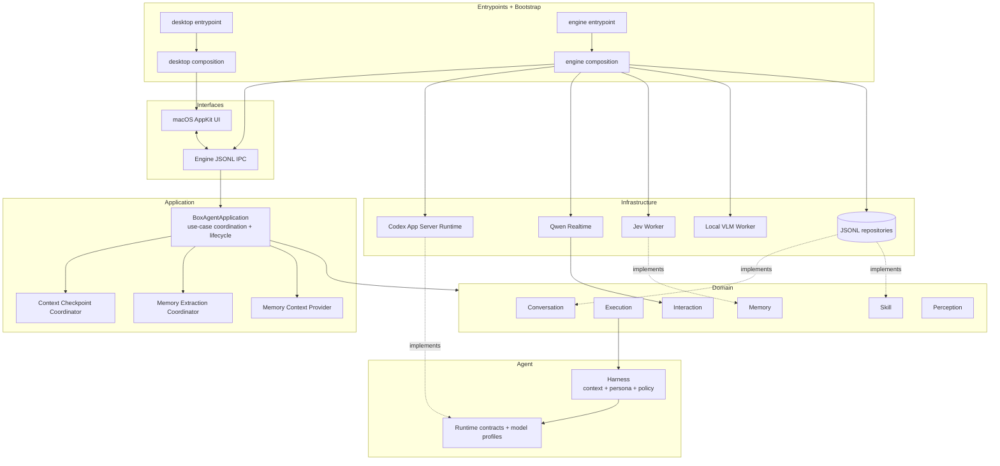
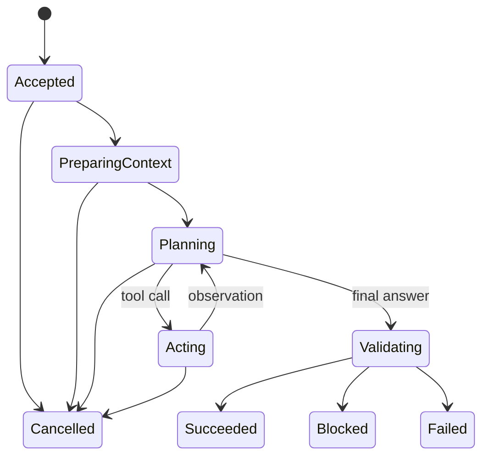
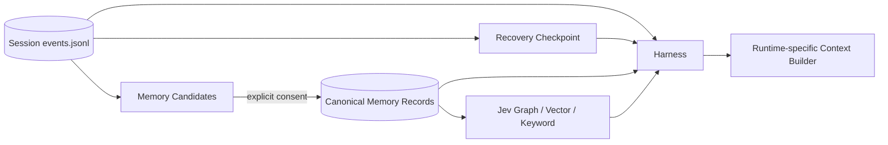
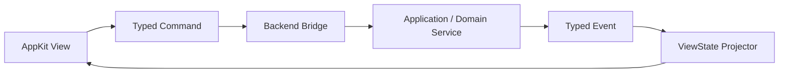

# BoxAgent 架构重构方案

## 当前结论

BoxAgent 不应直接复制 MiraJelly 的 Electron、Swift、Python 三栈和数百个模块，而应复制它最有效的架构纪律：明确宿主与引擎边界、唯一装配点、单一生命周期所有者、typed contract、不可变快照、可追溯证据和自动化依赖检查。

2026-10-06 已按“内部直接重写、不保留新旧兼容层”的原则完成 Kratos/DDD 风格目录迁移和生产切换。顶层边界固定为 `application/`、`domain/`、`agent/`、`infrastructure/`、`interfaces/`、`bootstrap/` 与 `entrypoints/`；旧根级模块以及 `features/`、`adapters/`、`ui/`、`runtime/`、`harness/`、`engine/` 不再保留 Python 兼容入口。

Agent Engine 已拆为独立本地进程：macOS Host 持有 AppKit 窗口、进程监督和 IPC 客户端；Engine 持有 `BoxAgentApplication`、Domain Services、Harness、Runtime、Memory、Interaction 与 Perception。两者使用 Unix Socket 上的版本化 JSONL 协议，后端可在不结束 UI 的情况下重启。

开发阶段的数据底座保持本地优先：Conversation 已改用 BoxAgent 自有 append-only JSONL Session Event Log，旧 SQLite Conversation prototype 已删除；Jev 继续使用本地图、向量和关键词索引。当前不引入 Docker、云数据库或跨设备同步。

| 项目 | 当前状态 | 本方案目标 |
|---|---|---|
| UI 与运行时 | `interfaces/macos/` 通过 Engine Bridge 跨进程调用 Application，并消费 ViewState | 后续把当前字符串事件升级为完整 typed envelope |
| 任务执行 | Harness 已拆分 Agent Runtime、Tool Gateway、Context、Persona 与 Result Policy；已接入 Conversation 原生历史、动态环境和有界 Memory Evidence | 后续引入严格的 as-of Memory Snapshot 以冻结单次长任务的读取边界 |
| 模型扩展 | Codex Runtime 通过 Registry 选择 OpenAI/DeepSeek Model Profile；Qwen Voice 独立 | 增加 Capability 描述和可用性探测 |
| 生命周期 | Engine 内 `BoxAgentApplication` 统一持有服务与长驻 `CodexRuntimeHost`，并按序关闭 | 增加 quiesce、失败聚合与重试状态 |
| 上下文 | JSONL Session Store、手动 Session、Qwen/Codex 原生历史、Runtime Binding、Codex warm/resume/cold、Qwen Summary Checkpoint、动态 Environment Evidence 与通知回执已接入 | 增加上下文质量与 KV cache 指标 |
| 长期记忆 | Canonical Ledger、自动/显式写入、语义更正、审核、重试、Stable Profile、Jev 派生索引和原生看板已接入 | 扩大质量集与多设备同步研究 |
| Skill | BoxAgent 已拥有本地 Catalog、CRUD、启停状态、原生管理页与 Codex Runtime 投影；默认只允许受管 Skill | 增加 ZIP/Git 导入、依赖检查与版本升级 |
| 数据部署 | Conversation JSONL + 本地 Jev cache + BoxAgent 专用 Codex Home | 云数据库、同步与多人分析 deferred |
| 状态 | 可变 `Snapshot` + 裸字符串 | typed Event + 独立状态机 + UI Projection |
| 架构约束 | 164 项测试通过；AST 门禁覆盖目录、依赖方向、生产构造点、子进程位置和薄入口 | 后续随新增能力扩展门禁 |

## 目标与边界

### 目标

1. 允许独立替换语音模型、Agent Runtime、Computer Use 实现、长期记忆后端和本地感知模型。
2. 支持语音对话与后台任务并行，不由一个全局状态字符串互相覆盖。
3. 建立可恢复、可压缩、可审计的会话上下文与长期记忆链路。
4. 让每个后台进程、线程、模型和长任务都有唯一生命周期所有者。
5. 为未来机箱屏幕、移动端或其他客户端复用同一个 Agent Engine。
6. 用确定性 contract test 验证模块边界、状态转换、持久化和降级，而不只验证文件中存在某段代码。

### 本轮边界

- 第一阶段不迁移 Electron、Swift 或 Web 前端。
- Agent Engine 使用本机 Unix Socket，不暴露 HTTP 端口。
- 开发阶段不引入 Docker、云数据库或远程同步服务。
- 不自动将所有聊天、截图或音频写入长期记忆。
- 不把 Jev 图中的关系当作事实真相；图首先是检索与导航索引。
- 不在架构重构中同时实现完整主动性系统。

## 现状证据

截至 2026-10-05，本地 BoxAgent Python 源码约 3,544 行，测试约 995 行。主要复杂度集中在：

| 文件 | 约行数 | 当前职责 |
|---|---:|---|
| `boxagent/desktop.py` | 642 | AppKit 组件、窗口、菜单、输入、状态投影、后台桥和退出 |
| 重构前 `boxagent/executor.py` | 477 | Codex 进程、Computer Use、工具网关、审批、日志、结果校验、生命周期 |
| `boxagent/memory_window.py` | 316 | 记忆读取、搜索、关系图、详情、删除和 AppKit 布局 |
| `boxagent/runtime.py` | 283 | Voice、Task、Memory、审批、Context Observer 和全局状态 |
| `boxagent/voice.py` | 246 | Qwen 协议、音频、实时状态、工具调度和交付仲裁 |

MiraJelly 的可借鉴证据包括：

- `engine/nerajelly_engine/feature_composition.py` 只负责生产装配。
- `feature_lifecycle.py` 为后台服务、线程 Worker、retention loop 和模型资源提供统一生命周期。
- Chat、Voice、Capture 各自拥有 composition owner，避免服务在多个位置重复构造。
- `MemorySnapshot(as_of, revision)` 固定一次 Assistant Turn 能看到的记忆边界。
- 记忆文档是 canonical source，文本向量、视觉向量、实体图和精确索引是平行派生。
- AST 检查限制反向依赖、重复构造、未登记进程启动和生命周期越权。

同时，MiraJelly 的 `app/electron/main.ts` 已约 5,530 行，说明“存在 composition 模块”并不会自动阻止入口膨胀。BoxAgent 需要更严格地限制入口文件只做装配。

## 架构原则

### 1. 稳定逻辑边界支撑物理拆分

模块之间通过 Contract、Command 和 Event 交互。这些边界现已映射到 Unix Socket 协议，Domain Service 不感知 UI 是同进程还是跨进程调用。

### 2. Composition Root 是唯一具体实现创建者

`bootstrap/desktop.py` 是 Host 装配点，`bootstrap/engine.py` 是 Engine 装配点。只有这两个边界可以创建对应进程的生产实现：

- Qwen Voice Adapter；
- Codex Agent Runtime 与 OpenAI/DeepSeek Model Profile；
- Computer Use Transport；
- Jev Worker；
- JSONL Session Store；
- UI Controller；
- 后台观察 Worker。

Domain Service 只依赖自身模型与 Contract，不读取环境变量，也不自行启动子进程。`models.py` 表示领域数据，`contracts.py` 表示该领域向外需要的能力，`service.py` 注入并调用这些 Contract 来实现用例；Infrastructure 提供具体实现，Bootstrap 负责连线。

### 3. Command、Event、State 分离

- Command 表示用户或系统希望发生的事情，例如 `StartTask`。
- Event 表示已经发生的事实，例如 `TaskAccepted`。
- State 是 Event 的投影，不作为事实来源。

UI 不直接修改 Runtime 字段，只发送 Command；UI 显示由 `ViewStateProjector` 生成。

### 4. 原始数据与派生数据分离

- 最终对话 Turn、明确确认的 Memory Record、Task Result 是 canonical data。
- 摘要、Embedding、图关系、检索排序和 UI ViewState 都是可重建派生物。
- 派生失败不能破坏原始记录。

### 5. 每个资源只有一个 Owner

每个进程、线程、WebSocket、音频设备、后台 Task 和数据库连接必须明确：

- 谁创建；
- 谁允许提交新工作；
- 谁发出停止信号；
- 谁等待物理退出；
- 启动中途失败时谁回收。

## 目标系统架构



`Host Bridge` 与 `Agent Engine` 已通过 Unix Domain Socket 上的 JSONL Command/Response/Event 交互。Engine 异常退出或受监视源码变化时，Host 保持 AppKit 存活并拉起新 Engine。

## 已落地目录结构

```text
boxagent/
  core/
    events.py / states.py / ids.py / errors.py

  domain/
    conversation/           # models + contracts + service
    environment/            # 当前本地时间、周几与时区快照
    execution/              # 后台委托执行用例
    interaction/            # Qwen 前台交互用例与 Runtime contract
    memory/                 # 记忆模型、策略、端口与服务
    notification/           # 持久通知模型、Repository contract 与 Outbox
    perception/             # 短期环境感知
    proactivity/            # 预留决策 contract
    skill/                  # Skill 模型、Repository contract 与服务

  agent/
    harness/                # 请求编译、上下文、人格、策略与执行器
    runtime/                # provider-neutral contracts/models/registry

  application/
    assistant.py            # 跨 Domain 用例协调与 Engine 生命周期
    context_checkpoint.py   # Qwen Checkpoint 异步生成与 Segment 轮换
    memory_extraction.py    # durable Job、候选准入与 Jev 派生索引
    memory_context.py       # Stable Profile 与按需 Memory Evidence

  infrastructure/
    runtimes/codex/         # App Server、CU、Session Host、Skill、Checkpoint/Memory 提取
    runtimes/qwen/          # Realtime Runtime
    memory/jev.py
    environment/local_system.py
    perception/qwen_mlx.py
    audio/pyaudio.py
    persistence/            # JSONL Session、Canonical Memory、Notification、Skill repositories

  interfaces/
    engine/                 # Unix Socket protocol/client/server/supervisor
    macos/                  # AppKit host、Bridge、窗口、形象与菜单

  bootstrap/
    engine.py               # Engine 唯一生产装配点
    desktop.py              # macOS Host 唯一生产装配点
    settings.py             # 环境变量到不可变 Settings

  entrypoints/
    engine.py               # Engine 进程入口
    desktop.py              # 桌面进程入口
```

该目录已完成迁移。`models.py`、`contracts.py`、`service.py` 是 Domain 内的语义角色，不要求每个能力机械地凑齐三个文件：没有领域数据就不建 `models.py`，没有外部依赖就不建 `contracts.py`。旧路径已删除，不设置兼容入口。

仓库根目录的 `skills/builtin/` 保存随应用发布、受 Git 管理的官方 Skill；用户创建或
导入的 Skill 保存到 `<BOXAGENT_DATA_DIR>/skills/`，不写入 `assets/` 或源码包。
Domain Skill Service 是 Skill 状态的真相来源，Codex Runtime 仅通过
`skills/extraRoots/set`、`skills/list` 与 `skills/config/write` 接收运行时投影。

## 核心合同

### EventEnvelope

所有关键链路共用关联 ID：

```python
@dataclass(frozen=True)
class EventEnvelope:
    event_id: str
    event_type: EventType
    occurred_at: float
    correlation_id: str
    session_id: str | None
    turn_id: str | None
    task_id: str | None
    source: EventSource
    payload: Mapping[str, JsonValue]
```

`correlation_id` 将一次用户输入、语音回答、后台 Task、Provider 调用、Computer Use 步骤和 Memory 检索连在同一条诊断链上。

### Agent Runtime Port

Agent Runtime 负责完成一次模型推理与工具调用循环，但不拥有产品会话、记忆或主动性状态：

```python
class AgentRuntime(Protocol):
    async def execute(
        self,
        request: TaskRequest,
        tools: Sequence[ToolSpec],
        call_tool: ToolCaller,
    ) -> TaskDecision: ...
```

Codex App Server 是当前唯一 Runtime 实现；OpenAI 与 DeepSeek 通过不同 Model Profile 进入同一 Port 和 Agent Loop。

### ComputerUse Port

```python
class ComputerUseSession(Protocol):
    async def start(self, context: TaskInvocationContext) -> Sequence[ToolSpec]: ...
    async def call(self, call: ToolCall) -> ToolObservation: ...
    async def cancel(self) -> None: ...
    async def close(self) -> None: ...
```

当前 Computer Use Session 是 Codex Runtime 的基础设施能力，不属于 Feature，也不承担产品策略。

### Memory Port

```python
class MemoryService(Protocol):
    async def remember(self, content: str, **source) -> MemoryWriteResult: ...
    async def recall(self, query: str, *, top_k: int = 5) -> EvidencePack: ...
    async def approve(self, memory_id: str) -> ReviewResult: ...
    async def reject(self, memory_id: str) -> ReviewResult: ...
    async def retry_index(self, memory_id: str) -> IndexResult: ...
    async def forget(self, memory_ids: list[str]) -> ForgetResult: ...
```

当前每次 Assistant Turn 或 Task 只获取一次有界 Evidence Pack；后续若引入长程并行读取，应把
该读取边界显式升级为 `MemorySnapshot(as_of, revision)`，保证同一任务中观察一致。

## Harness Execution

目标状态机：



Task Kernel 负责：

1. 固定原始用户目标和 Memory Snapshot。
2. 通过 Context Assembler 构建任务输入。
3. 创建 Computer Use Session。
4. 调用 Agent Runtime。
5. 串行执行工具并记录 Observation。
6. 通过 Result Policy 验证 outcome 和证据引用。
7. 发布终态 Event。

Agent Runtime、Computer Use、日志和 UI 均不能自行改变 Task 状态。

## Conversation、Context 与 Memory

### 数据分层



#### Conversation

- V0 允许用户手动新建、选择和恢复多个 Session。
- 每次请求统一建模为 Interaction；Task 只是需要工具或长程执行时的内部记录，不是独立对话。
- 不按无活动时长、前台 App 或语义阈值自动创建/切换 Session；只接受用户明确操作。
- 短期消息和 Checkpoint 按 Session 隔离；明确保存的长期 Memory 按用户级共享，并保留来源 Session/Event 用于追溯。
- BoxAgent 自有 JSONL Event Log 保存最终用户/Assistant 消息和 Interaction 终态。
- 流式 delta、思维过程和工具中间输出只进入 Trace，不进入产品 Conversation。
- 使用 Provider event ID 保证幂等。

详细语义、数据模型、Runtime 恢复和验收标准见 [BoxAgent Phase 3：Conversation 与 Context 设计](./BoxAgent-Phase3-Conversation-Context-设计.md)。

#### Context

Harness 不生成一份供所有模型使用的大 Prompt，而是按执行路径和 Runtime 生命周期选择 Context Builder：

| 执行路径 | 默认内容 |
|---|---|
| Codex Warm Thread | 先以 `thread/inject_items` 补齐其他 Runtime 产生的原生消息，再以 `turn/start` 发送当前用户输入 + 本轮 Environment/Memory/Perception Evidence |
| Codex Cold Thread | 新 Thread 先注入预算内的原生 user/assistant 历史；当前轮再单独注入 Environment Evidence；未来超长历史使用 Checkpoint + 近期原生消息 |
| Qwen Realtime 重连 | 稳定 SOUL/语音工具说明 + 有限近期最终消息；每轮 User Item 前刷新 Environment Evidence |
| Memory Extraction | 单次已完成 Interaction + 来源 ID + 已有相关 Memory |
| Proactivity Evaluation | 当前感知 + 用户授权/冷却策略 + 少量相关 Memory |

Codex Prompt Stack 保持为：Runtime Base/System → Codex 运行规则 → BoxAgent Developer Instructions → 工具定义 → Thread 历史 → 当前 User Input。普通对话历史通过 `thread/inject_items` 成为原生 user/assistant messages；Environment、Memory、Perception 和其他非对话证据以有来源的显式 fence 注入，不能改变本轮目标或扩大授权。

#### Memory

已实现 BoxAgent-owned Canonical Memory Ledger。核心记录包含：

- `memory_id/revision/canonical_slot`
- `content`
- `memory_type`
- `source_mode/source_session_id/source_interaction_id/source_event_ids`
- `created_at/updated_at`
- `created_at/updated_at/expires_at`
- `confidence`
- `status`
- `supersedes_revision/lineage_event_ids/backend_links/index_state`

长期记忆的默认作用域是用户级，所有 Session 共享；来源 ID 只用于追溯，不作为默认检索边界。
Jev 只保存可重建的图、向量和关键词索引；Canonical Ledger 的追加事件和原子 Snapshot 是真相。
`MemoryService` 串行化准入、更正、审核、重试和删除，自动提取器、显式工具、Engine IPC 与
原生看板不再分别操作 Jev。

### 隐式记忆策略

- 用户明确说“记住”时，写入 `consent=explicit` 的 Memory Record。
- 普通聊天先生成 Candidate：安全、稳定、由用户直接陈述且无冲突的候选可自动进入 Canonical Ledger 和 Jev；敏感、推断、第三方或未解决冲突的候选保持 `pending_review`；临时内容忽略。
- Candidate 保存证据 Turn ID、候选命题、类型、置信度和敏感等级。
- 提取固定在 `interaction.completed` 落盘后异步触发；启动扫盘只负责崩溃恢复，不参与正常请求延迟。
- 提取水位使用真实 `last_processed_turn_id`，不通过 turn 数推导消息数组位置。
- 短期 Context 可以先做 Runtime compact，但原始事件不可在 Memory Extraction 水位追上前清理；Checkpoint 恢复时继续携带尚未提取的 Final Message Tail，避免出现“短期已丢、长期未写”的空窗。
- 候选以稳定 `canonical_slot` 表示语义位置；明确更正生成新记录，旧记录变为 `superseded`，
  source lineage 与 append-only revisions 均保留。
- Extraction Job 使用 `pending/running/retry_wait/completed/skipped/failed` 状态和指数退避；
  Jev `index_failed` 由独立后台重试恢复，不阻塞前台回答。

### Forget 语义

必须区分：

1. 删除长期记忆：删除 Memory Record 及所有派生索引。
2. 删除会话记录：删除原始 Turn，并使相关摘要与 Candidate 失效。
3. 彻底忘记：同时执行前两项，仅留下不包含正文的审计事件。

## 感知与主动性边界

重构前 `boxagent/context.py` 实际是窗口感知模块；现已拆为 `domain/perception` 生命周期与 `infrastructure/perception/qwen_mlx.py` 实现，不再使用泛化的“上下文管理”名称。

窗口截图和 VLM 摘要默认是短期感知：

- 截图处理完成后删除。
- 摘要只进入当前 Context，不默认进入 Conversation 或 Memory。
- 只有用户确认或明确的产品策略允许时，才生成长期记忆 Candidate。
- 未来主动性模块只能消费经过权限、隐私、时效和来源治理的 Observation。

## UI 边界

`Desktop` 应逐步退化为窗口编排器，不承担业务流程：



记忆看板只调用 `MemoryDashboardService`，不直接读取 Jev 文件。会话历史只调用 `ConversationQueryService`。删除确认属于 UI，删除一致性属于 Memory Service。

## 生命周期设计

启动顺序建议：

1. 配置与数据目录校验。
2. JSONL Session Store 初始化与尾行恢复。
3. Event Bus 与 Domain Service。
4. Worker Supervisor；Worker 可以 lazy start。
5. Host Bridge 与 UI。
6. 可选的后台观察和预热。

停止顺序：

1. `quiesce`：拒绝新 Voice、Task 和 Worker 请求。
2. 取消或结束活动 Task。
3. 停止感知 producer，避免继续唤醒 consumer。
4. 关闭 Voice WebSocket 和音频设备。
5. flush Conversation、Memory 和诊断事件。
6. 停止 Jev/VLM/Computer Use 子进程。
7. 关闭数据库和 UI Bridge。

所有 stop 必须幂等，并区分“已发停止信号”和“进程已经退出”。关闭失败不能被静默吞掉，应记录稳定错误码并允许再次执行 stop。

## 配置与 Capability Registry

环境变量应只在 bootstrap 读取，转换成不可变 Settings：

```python
@dataclass(frozen=True)
class Settings:
    task_provider: TaskProvider
    task_model: str
    voice_provider: VoiceProvider
    memory_backend: MemoryBackend
    conversation_db: Path
```

Registry 根据 Settings 产生 Capability 描述，UI 依据 Capability 决定功能是否可用，而不是依据显示文案或捕获异常猜测。

Provider 注册表至少覆盖：

- Agent Runtime Provider；
- Voice Provider；
- Memory Backend；
- Perception Backend；
- Computer Use Backend。

第一阶段使用显式静态 registry，不需要动态插件加载。

## 存储设计

V0 的 Conversation 采用本地 append-only JSONL，而不是先建立 SQLite canonical tables：

```text
.runtime/pet/conversations/
├── index.json
└── sessions/<session-id>/
    ├── metadata.json
    ├── events.jsonl
    ├── checkpoint.json
    └── runtime-bindings.json
```

`events.jsonl` 保存用户可见的最终消息和 Interaction 终态；底层工具步骤、截图、thinking 和 RPC 进入独立 Trace。`checkpoint.json` 和 `runtime-bindings.json` 是可重建状态，采用临时文件 + 原子替换。Jev 自有缓存继续位于独立目录。

BoxAgent 不直接解析 Codex 的 rollout JSONL。Codex Thread 通过 App Server 的 `thread/start/read/resume` 管理；BoxAgent Event Log 用于统一 Codex、Qwen 和未来其他 Runtime 的产品会话。

当出现多用户并发、复杂全文查询、云端同步或分析需求时，可以增加 SQLite/Postgres 派生索引或替换 Store Adapter，而不改变 Conversation/Harness 合同。

持久数据统一从 `BOXAGENT_DATA_DIR` 派生：源码开发默认使用仓库内已忽略的 `.runtime/pet/`，正式 macOS App 使用 `~/Library/Application Support/BoxAgent/`。Conversation、Jev 和 Codex Thread 不随 `--log-dir` 改变；后者只控制可轮转诊断数据。

Codex 使用 `<BOXAGENT_DATA_DIR>/runtimes/codex-home/` 作为专用 Runtime Home。BoxAgent 按 Session 保存当前 Runtime Binding，包括 Thread ID、Provider、模型和指令/工具配置版本；模型或 Persona 变化时优先继续原 Thread，只有无法恢复或 Runtime 不兼容时才替换 Thread。所有生命周期操作通过 App Server 的 `thread/read/resume/archive/delete` 完成，不直接解析或修改 Codex rollout JSONL。`BOXAGENT_CODEX_BIN` 继续独立指定 Runtime 可执行文件，避免将二进制发现与 Runtime 数据路径耦合。

Codex 自带的本地 Memories 与 Thread rollout 是两套状态。V0 默认关闭 BoxAgent 专用 `CODEX_HOME` 中的 Codex Memories：Codex Thread 负责 Session 内连续上下文，Jev-Mem 负责跨 Session 长期记忆，避免两套系统重复提取、重复注入和删除语义冲突。后续可将 Codex Memories 作为独立 Memory Backend 做对照实验，但不作为 Phase 3 的确定性依赖。

## 可观测性

每次调用至少记录：

- correlation/session/turn/task ID；
- Provider 与模型；
- Context 各部分字符/token 预算；
- Memory Snapshot revision；
- 检索 route、候选数、最终 Evidence ID；
- Runtime round、Tool step、终态与延迟；
- 是否发生 fallback；
- 内容字段经过脱敏，不记录密钥、完整截图或音频。

“调用成功”与“任务完成”必须是不同指标。Computer Use 的点击成功不能替代最终状态验证。

## 测试与架构门禁

### Contract tests

| 合同 | 必须覆盖 |
|---|---|
| Agent Runtime | 工具 schema、非法调用、取消、最终 JSON、证据引用 |
| Computer Use | 启动、工具发现、串行操作、关闭、部分启动失败 |
| Conversation | 重启恢复、手动 Session 创建/切换、跨 Session 隔离、Turn 去重、摘要范围 |
| Context | 预算、fencing、当前目标优先、恶意历史文本 |
| Memory | snapshot 一致性、来源、删除、backend fallback |
| Lifecycle | 重复 start/stop、启动中取消、关闭失败重试 |
| UI Projection | Voice 与 Task 并行时的展示优先级 |

### 架构检查

新增只读 AST 检查，至少禁止：

- `interfaces/` 直接导入具体 Provider、Jev Worker 或 Computer Use 进程实现；
- `domain/`、`agent/` 或 `application/` 读取环境变量或创建子进程；
- 非 bootstrap 模块构造生产级核心 Service；
- 非 lifecycle/worker supervisor 模块调用子进程启动；
- Infrastructure 反向导入 Application 或 Interfaces；
- 新代码导入兼容期的旧 `Runtime` 内部实现。

## 分阶段重写

### Phase 0：冻结合同与特征测试

状态：已完成现有行为的特征测试与全仓架构门禁；typed EventEnvelope 已定义，但现有 UI 状态流仍使用轻量事件字典。

- 为当前 Voice、Task、Memory、UI 状态行为补 characterization tests。
- 定义 Event、Command、错误码、状态枚举和核心 Port。
- 新增架构检查，但先只约束新增目录。
- 不改变用户可见行为。

验收：现有测试全部通过；新旧接口输出一致；没有真实外部写操作。

### Phase 1：拆 Task Execution Kernel

状态：已实现并通过自动化回归；真实 App Server 已完成无模型、无桌面动作的工具发现与进程复用冒烟。

- 删除 `executor.py`，将其职责分别重写为 Computer Use Session、Task Kernel/Tool Gateway 和 Result Policy。
- 只保留 CodexAgentRuntime，通过 Model Profile 把 DeepSeek 配成 Codex 的 Responses Provider。
- 删除 `DeepSeekExecutor(CodexExecutor)` 的继承关系和手写 DeepSeek Agent Runtime。
- 保持现有真实 Computer Use 路径不变。

验收：Codex/DeepSeek 使用同一套 fake tools contract；真实只读冒烟结果不回归。

### Phase 2：统一 Lifecycle 与 typed events

状态：目录和 Application/Domain Service/UI Projection 已完成；Codex Runtime Host 已纳入应用生命周期并在任务间复用进程和 Thread。完整 typed EventEnvelope、quiesce 与关闭失败重试仍待实现。

- 引入 AppLifecycle、WorkerSupervisor、CommandBus/EventBus。
- Voice、Task、Perception、Memory 独立状态机。
- UI 改为消费 ViewState Projection。
- 关闭失败可观测且可以重试。

验收：启动中取消、Voice 断线、Task 并行、Worker 冷启动和 App 退出均有确定性测试。

### Phase 3：Conversation 与 Context

状态：Phase 3A、Phase 3B、Phase 3C 与 Phase 3D 核心链路已实现。JSONL Session Store、统一 Qwen 前台入口、Runtime Binding、持久化 Thread、`thread/resume`、Qwen→Codex cursor delta、动态 Environment Evidence、持久 Notification Outbox 和真实 playback-started receipt 已接入生产装配。上下文已迁移到 App Server `thread/inject_items` 原生历史：新 Thread 注入预算内完整历史，Warm/Resumed Thread 只注入 cursor 后增量，`turn/start` 携带最新请求和本轮 Evidence；真实 DeepSeek 连续任务已验证同进程、同 Thread 与增量边界。Environment 采集与 Qwen/Codex 投影已通过确定性协议测试，本轮未重新运行真实网络模型。Checkpoint、Session 切换 UI 和自适应 `auto` 通知策略尚未实现。

详细方案已拆分为独立文档：[BoxAgent Phase 3：Conversation 与 Context 设计](./BoxAgent-Phase3-Conversation-Context-设计.md)。

- JSONL Session Event Log，记录最终语音/文本消息和 Interaction 终态。
- BoxAgent Session 与 Codex Thread 按 Session 绑定；Engine 重启后优先 `thread/resume`。
- Warm Codex Turn 先注入 Codex 尚未见过的原生跨 Runtime 消息，再只发送当前请求与按需证据。
- Thread 不可恢复时创建新 Thread，并注入预算内的原生历史；不保留历史 JSON Prompt 兼容路径。
- Qwen Voice、Memory Extraction 和 Proactivity 使用各自的 Context Builder。
- 当前本地时间、周几和时区通过 `EnvironmentContext` 每轮采集，不混入稳定 Instructions；设备信息、感知和位置不进入该基础上下文。
- 所有动态历史和证据执行 context fencing。

验收：重启恢复、重复事件、预算裁剪、恶意历史指令和 Memory 超时降级通过。

### Phase 4：Memory Ledger 与候选确认

状态：Memory Service、Jev Adapter、显式 remember/recall/forget 与记忆看板已完成；BoxAgent canonical ledger、候选确认和 snapshot 一致性尚未实现。

详细方案见 [BoxAgent Phase 4：长期记忆设计](./BoxAgent-Phase4-Memory-设计.md)。最终采用混合准入：安全、稳定、由用户直接陈述且无冲突的事实可静默自动写入；敏感、推断、第三方或未解决冲突进入待确认；临时信息直接忽略。

- 新增 canonical Memory Record 和 Candidate。
- 显式记忆保存 consent/provenance。
- 隐式提取经过产品策略后进入自动写入、待确认或忽略三种结果。
- Jev 节点与 canonical record 建立 backend link。
- 记忆看板支持来源、版本、候选接受/拒绝和不同 forget 语义。

验收：删除后 canonical record、Jev 图、向量、关键词和 Context 检索结果一致。

### Phase 5：拆分 UI 模块

状态：物理拆分已完成；Engine Bridge、State Projection、Menu、Conversation/Pet/Memory/Skill Window 已独立，原根级 `desktop.py` 已删除。生产 UI 通过 `EngineApplicationProxy` 发送 IPC 白名单命令，不再直接持有或调用 `BoxAgentApplication`；完整 typed Command/Event Envelope 后续实现。

- 抽离 Backend Bridge、State Projection、Menu 和各 Window Controller。
- `desktop.py` 最终只保留应用与窗口编排。
- UI 不再调用 Runtime 具体业务方法。

验收：现有 UI 冒烟通过；ViewState contract 可在无 AppKit 环境测试。

### Phase 6：独立 Agent Engine

状态：已实现并通过单元测试、真实子进程重启冒烟和 AppKit 产品入口启停验证。

- Host 使用 Unix Socket JSONL 命令/响应/事件协议调用 Engine；
- 后端源码变化和异常退出可独立重启 Engine；
- 健康的遗留 Engine 可由新 Host 接管，进程锁防止重复 Engine；
- Engine 内长驻 `CodexRuntimeHost`，稳定模型/人格/工具配置下复用 App Server 进程和 Codex Thread；
- 任务、语音和审批为瞬时状态，重启时中断；产品会话由 JSONL Session Store 恢复，长期记忆由 Jev 恢复；
- IPC 尚未升级为完整 typed EventEnvelope；Codex Thread Binding 已持久化，Engine 重启后优先通过 `thread/resume` 恢复。

### Skill 管理与 Runtime 投影

状态：本地管理底座、原生管理窗口与 Codex Runtime 投影已实现并验证；ZIP/Git 导入、依赖检查、版本升级和 Skill 市场尚未实现。

- 内置 Skill 保存于 `skills/builtin/`，用户 Skill 保存于
  `<BOXAGENT_DATA_DIR>/skills/`；用户目录可通过 `BOXAGENT_SKILLS_DIR` 覆盖。
- `SkillService` 提供创建、更新、启用、禁用、删除和列举能力，Engine IPC 暴露对应命令。
- `CodexSkillAdapter` 在创建任何 Runtime Thread 前设置额外根目录、读取实际发现结果，
  并按绝对路径禁用所有不属于 BoxAgent allowlist 的 Skill。
- Skill 内容或启用集合变化会改变 Runtime signature；当前绑定 Thread 不再错误复用，
  而是创建新的 Runtime Epoch。
- Skill 文件使用稳定路径；禁用状态记录于 `registry.json`，不通过移动目录表达。

验收：文件 CRUD、路径越界、持久启停、Runtime allowlist、Engine IPC 和 Epoch 切换均有
确定性测试；真实 Codex App Server 冒烟中发现 35 个 Skill，仅启用 1 个 BoxAgent
内置 Skill，外部启用数为 0。该验证未运行模型 Turn，因此只证明发现和启停配置生效。

## 初步修改量评估

这是跨阶段估算，不建议在一个 PR 中完成。

| 阶段 | 普通代码新增/修改 | 测试新增/修改 | 风险 |
|---|---:|---:|---|
| Phase 0 | 180–300 | 250–400 | 低，主要是合同和特征测试 |
| Phase 1 | 450–700 | 300–500 | 中高，触及任务主链 |
| Phase 2 | 400–650 | 350–550 | 高，触及生命周期和 UI 状态 |
| Phase 3 | 450–700 | 300–500 | 中，新增持久化与上下文 |
| Phase 4 | 450–750 | 350–600 | 中高，涉及删除一致性和迁移 |
| Phase 5 | 500–850 | 250–450 | 中，主要是 UI 回归风险 |

总规模明显超过 1,000 行，必须拆成独立、可回滚的阶段；每阶段重新给出逐文件估算后再实施。

## 风险与回滚

| 风险 | 控制方式 |
|---|---|
| 重构期间破坏真实 Computer Use | 先写特征测试；新旧 Kernel 可切换；保留真实只读冒烟 |
| Event 化增加调试难度 | EventEnvelope 必须包含 correlation ID；提供单任务时间线导出 |
| Conversation Event 与 Jev 写入不一致 | 以不可变来源事件和 Memory provenance 关联；后台重试；不把半成功报告为已记住 |
| 上下文恢复引入历史 prompt injection | JSON fence、system policy、恶意历史合同测试 |
| 冷启动进一步变慢 | Worker lazy start、预热可取消、记录 p50/p95 |
| 过度模块化 | 每个模块必须拥有明确状态、资源或策略；纯转发层不单独拆分 |
| UI 重构影响体验 | UI Projection 先行，AppKit 结构后移，截图冒烟对比 |

## 待对齐决策

1. **部署形态**：已选择 AppKit Host + 独立本地 Engine，对外不暴露网络端口。
2. **开发数据底座**：Conversation 选择本地 JSONL Session Event Log，Memory 使用本地 Jev cache；不在当前阶段引入 Docker、云数据库或同步服务。
3. **UI 技术栈**：推荐继续 AppKit；只有主窗口、设置、会话历史明显扩张后再评估 React/Electron。
4. **Memory 真相来源**：推荐 BoxAgent 保存 canonical ledger，Jev 逐步降为可替换后端/派生索引。
5. **隐式记忆**：已选择三档准入；安全稳定事实可自动写入，敏感、推断、第三方或冲突项必须确认，临时内容忽略。
6. **下一实施阶段**：实现 JSONL Session Store 与文字主链，再实现按 Session 的持久化 Codex Thread 和 `thread/resume`。
7. **保留策略**：需要确定会话原文、任务诊断、截图摘要和拒绝候选各自保存多久。

其中第 4 项会直接影响后续 Memory Schema 和 Jev 适配成本；第 6 项决定下一份文件级技术方案的范围。进入实现前应逐项确认。
