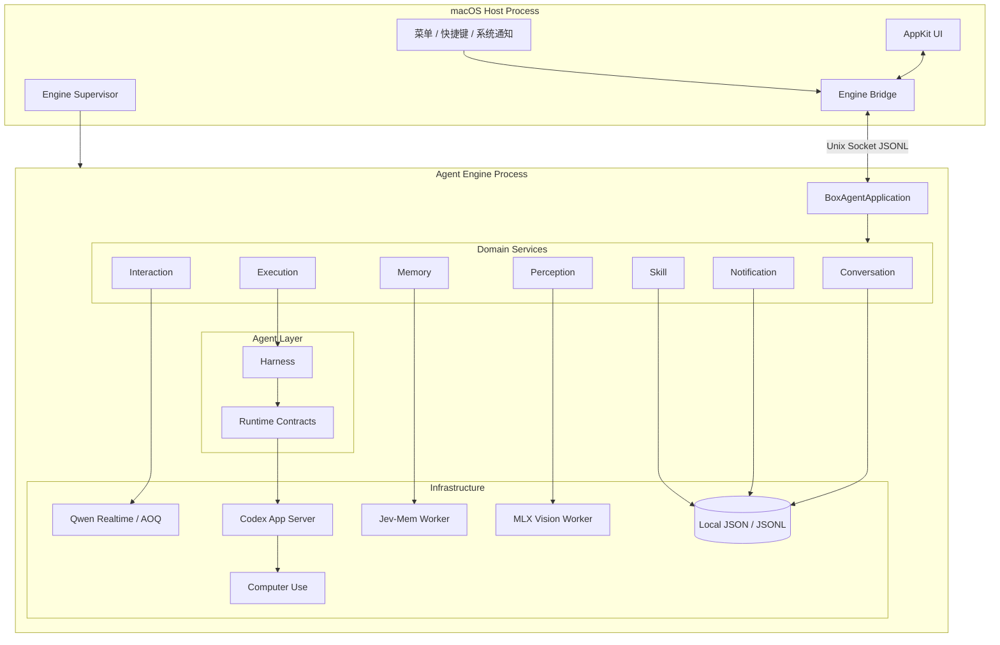
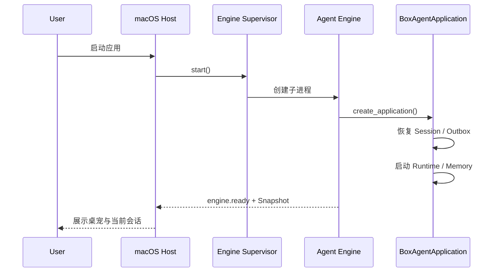
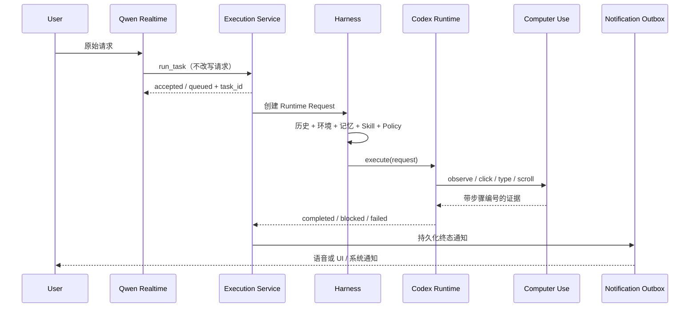

# BoxAgent 当前系统架构

## 1. 总体结论

BoxAgent 是一个由 **macOS Host** 与 **Agent Engine** 组成的本地桌面 Agent 系统。

1. macOS Host 负责用户界面与操作系统集成。
   1. 持有 AppKit 窗口、菜单栏、桌宠形象和系统通知。
   2. 监督 Agent Engine 进程，并在开发模式下支持后端热重启。
   3. 不直接创建模型、记忆或 Computer Use 实现。
2. Agent Engine 负责业务能力与模型运行时。
   1. 持有 Product Session、Qwen Realtime、桌面任务、Jev-Mem、Skill 和本地感知服务。
   2. 通过 Unix Domain Socket 与 Host 通信。
   3. 通过 `BoxAgentApplication` 统一管理启动、运行与关闭。
3. 两类 Runtime 分工明确。
   1. Qwen Realtime 是前台交互 Runtime，负责文字、语音、普通聊天和任务委托。
   2. Codex Task Runtime 是后台执行 Runtime，负责规划、调用 Computer Use 工具和验证结果。
4. 三类持久状态相互独立。
   1. Product Session 保存用户可见的会话事实。
   2. Jev-Mem 保存跨 Session 的长期记忆。
   3. Notification Outbox 保存尚未完成送达的后台结果。
5. 依赖方向固定为：

$$
\text{Entrypoints} \rightarrow \text{Bootstrap} \rightarrow
\{\text{Application},\text{Domain},\text{Agent}\}
\leftarrow \text{Infrastructure}
$$

| 结论 | 当前实现 |
| --- | --- |
| UI 与后端隔离 | Host 与 Engine 为两个本地进程 |
| 会话唯一来源 | append-only JSONL Product Session Event Log |
| 长期记忆唯一 Store | Jev-Mem |
| 后台任务执行 | 串行队列，避免多个任务同时争抢桌面 |
| 模型扩展方式 | Provider-neutral Runtime Contract + Model Profile |
| 具体实现装配 | 只在 `bootstrap/` 创建生产实现 |
| Engine 通信 | 权限为 `0600` 的本地 Unix Socket JSONL 协议 |
| 当前安全边界 | Codex 沙箱为只读，但授权的 Computer Use 工具可以改变应用状态 |

## 2. 核心术语

| 术语 | 定义 |
| --- | --- |
| Host | macOS 原生宿主进程，负责 UI、系统权限入口与 Engine 监督 |
| Engine | 独立 Python 后端进程，负责应用服务、领域逻辑、Runtime 和持久化 |
| Runtime | 执行模型交互循环的适配器；当前包括 Qwen Realtime 与 Codex Task Runtime |
| Harness | 将用户请求、会话历史、记忆、环境和工具策略编译成 Runtime 请求的控制层 |
| Product Session | BoxAgent 自己管理的一段用户会话，是跨 Runtime 的共同上下文边界 |
| Interaction | 一条 Final User Message 引发的一次完整交互，可包含回答、工具调用或后台任务 |
| Task | 需要后台执行的操作单元，拥有独立 `task_id`、状态、轨迹和终态 |
| Domain | 不依赖具体模型、UI 或存储实现的业务规则 |
| Port | Domain 或 Agent 声明的抽象能力接口，Python 中主要使用 `Protocol` 表达 |
| Adapter | Infrastructure 对 Port 的具体实现，例如 Qwen、Codex、Jev-Mem 或 JSONL Store |
| Composition Root | 创建具体实现并连接依赖的唯一位置；当前位于 `bootstrap/` |
| Projection | 从持久事实计算出的可重建视图，例如 UI Snapshot 与 User Profile |
| Outbox | 先持久化、后投递的通知队列，用于保证后台结果不会因断线丢失 |

## 3. 系统全景



## 4. 进程与生命周期

### 4.1 启动顺序

1. `boxagent.entrypoints.desktop` 启动 Host。
   1. 读取 `Settings`。
   2. 获取单实例文件锁。
   3. 创建 AppKit Application。
2. `bootstrap.desktop.create_desktop_host()` 装配 Host。
   1. 创建桌宠形象与窗口。
   2. 创建 `EngineBridge`。
   3. 创建角色、记忆、Skill 与形象管理界面。
3. `EngineSupervisor` 启动 Engine 子进程。
   1. Engine 入口为 `boxagent.entrypoints.engine`。
   2. 通信 Socket 位于 Product Data 目录。
   3. Socket 文件权限设置为 `0600`。
4. `bootstrap.engine.create_application()` 装配 Engine。
   1. 创建 Session Store、Notification Outbox 与 Skill Repository。
   2. 创建 Codex Runtime Host、Qwen Voice Factory 与本地感知 Worker。
   3. 通过 `bootstrap.memory.create_memory_module()` 创建完整 Memory Module。
   4. 创建 `BoxAgentApplication` 并注入全部服务。
5. `BoxAgentApplication.start()` 按顺序启动资源。
   1. 恢复 Product Session 和未封口 Interaction。
   2. 恢复未送达通知。
   3. 启动 Codex Runtime Host 与 Context Checkpoint Coordinator。
   4. 启动并预热 Jev-Mem Worker。
6. Engine 发送 `engine.ready`，Host 开始展示可交互状态。



### 4.2 资源所有权

| 资源 | 唯一 Owner | 关闭责任 |
| --- | --- | --- |
| AppKit UI | macOS Host | Desktop Delegate |
| Engine 子进程 | `EngineSupervisor` | 发送 shutdown，超时后终止进程 |
| Unix Socket Server | `EngineServer` | 停止接收、关闭客户端、删除 Socket |
| Qwen 连接与音频设备 | `InteractionService` | 完成输入、关闭连接和音频资源 |
| 桌面任务与排队任务 | `ExecutionService` | 取消当前任务并清空待执行队列 |
| Codex App Server | `CodexRuntimeHost` | 停止共享 Runtime 进程 |
| Jev-Mem Worker | `MemoryModule` | 停止 ingestion 后关闭 Worker |
| 屏幕总结 Worker | `PerceptionService` | 取消观察并释放模型进程 |

### 4.3 并发规则

1. 前台对话与后台任务可以并行。
   1. Qwen 可以在 Codex 执行期间继续响应用户。
   2. 后台结果通过 Outbox 独立送达。
2. 桌面操作任务串行执行。
   1. 当前任务运行时，新任务进入 `ExecutionService.pending`。
   2. 当前任务终结后自动启动队首任务。
   3. 取消操作同时取消当前任务与尚未执行的排队任务。
3. 记忆写入与 Checkpoint 生成异步执行。
   1. 不阻塞前台首字响应。
   2. 每个 Session 内部串行处理，避免顺序错乱。

## 5. 代码分层

### 5.1 目录职责

```text
boxagent/
├── core/               # 全局 ID、状态、事件发布和通用错误
├── domain/             # 领域模型、领域端口和领域服务
├── application/        # 跨领域用例编排与应用级 Facade
├── agent/
│   ├── harness/        # 请求编译、上下文、人格和执行策略
│   └── runtime/        # Provider-neutral Runtime Contract
├── infrastructure/     # 模型、存储、音频、感知等 Adapter
├── interfaces/
│   ├── engine/         # Unix Socket API、Client、Server、Supervisor
│   └── macos/          # AppKit 页面、菜单、桌宠和系统通知
├── bootstrap/          # Desktop、Engine、Memory 的生产装配点
└── entrypoints/        # 可执行进程入口
```

| 层 | 可以依赖 | 不应依赖 |
| --- | --- | --- |
| `domain/` | `core/`、标准库、同领域 Contract | Infrastructure、UI、Bootstrap |
| `application/` | Domain、Agent Contract | AppKit、具体模型 SDK |
| `agent/` | Domain 数据与 Runtime Contract | macOS UI、具体持久化 |
| `infrastructure/` | Domain / Agent Port | Application、Interfaces、Bootstrap |
| `interfaces/` | Application 对外能力、Core State | 具体 Infrastructure 实现 |
| `bootstrap/` | 全部需要装配的模块 | 业务逻辑 |
| `entrypoints/` | Bootstrap | 具体业务实现 |

### 5.2 Domain 组织方式

1. 每个领域按实际需要使用以下文件名。
   1. `models.py`：领域数据结构与枚举。
   2. `contracts.py`：领域向外部请求的 Port。
   3. `service.py`：领域规则与状态转换。
   4. `policy.py`：纯规则、校验和安全约束。
2. 当前领域边界如下。

| Domain | 核心职责 |
| --- | --- |
| `conversation` | Session、Product Event、Runtime Binding、Checkpoint |
| `interaction` | Qwen 连接、前台消息与工具调用生命周期 |
| `execution` | 后台任务接收、排队、取消和终态 |
| `memory` | 记忆写入、检索、删除和安全规则 |
| `notification` | 后台结果的幂等入队、认领、确认与重试 |
| `skill` | Skill Catalog、CRUD、启停状态与校验 |
| `environment` | 当前时间、周几和时区的可信快照 |
| `perception` | 本地前台窗口总结状态 |
| `proactivity` | 主动行为决策 Port，目前不承载完整实现 |

## 6. 核心数据流

### 6.1 普通对话

1. Host 发送 `submit_text`，或 Qwen 接收一段最终语音转写。
2. Conversation Service 写入：
   1. `interaction.started`；
   2. `message.final(role=user)`。
3. Qwen 收到当前环境与相关记忆。
4. Qwen 生成 Final Assistant Message。
5. Conversation Service 写入：
   1. `message.final(role=assistant)`；
   2. `interaction.finalized(status=succeeded)`。

### 6.2 桌面任务



1. Qwen 只能通过 `run_task` 委托桌面任务。
   1. 当前用户原文由 Host 从 Interaction 读取。
   2. Qwen 不负责重写或扩写任务目标。
2. Harness 编译 `RuntimeRequest`。
   1. `query`：原始用户目标。
   2. `developer_instructions`：稳定执行规则与人格边界。
   3. `history` / `history_delta`：Runtime 原生历史。
   4. `evidence_context`：当前环境与相关长期记忆。
   5. `tools`：经过安全策略过滤的 Computer Use 工具。
3. Codex Runtime 只返回结构化终态。
   1. `completed`：已用观察证据验证目标状态。
   2. `blocked`：缺少登录、信息、权限或可见界面。
   3. `failed`：执行或协议异常。

### 6.3 长期记忆

1. 用户 Final Message 成功落盘后，Memory Module 创建 durable ingestion job。
2. Jev-Mem Worker 完成准入、类型判断、建图和索引。
3. 被接纳的相关记忆通过两条路径使用。
   1. L2：Harness 每轮根据原始 Query 自动直接检索。
   2. L3：Agent 通过 `recall_memory` 主动发起深度检索。
4. Context Checkpoint 创建后投影为 Narrative 节点。
5. User Profile 是可重建投影，不是第二套长期记忆 Store。

详细契约见 [长期记忆系统设计](./BoxAgent-Phase4-Memory-设计.md)。

### 6.4 Skill

1. 官方 Skill 位于 `skills/builtin/`。
2. 用户 Skill 位于 `<BOXAGENT_DATA_DIR>/skills/`。
3. `SkillService` 是启用状态与内容的管理边界。
4. Codex Runtime 只接收启用 Skill 的目录投影。
5. 对话式 Skill 创建使用独立、无工具、只读的结构化 Codex Turn。
6. 真正写入用户目录前必须满足显式授权条件。

## 7. Command、Event 与 State

### 7.1 三者定义

| 类型 | 含义 | 示例 |
| --- | --- | --- |
| Command | 请求系统执行某件事 | `submit_text`、`cancel_task`、`create_session` |
| Product Event | 已持久发生的产品事实 | `message.final`、`interaction.finalized` |
| UI State | 当前界面的可变投影 | `voice=ready`、`task=running`、`notification_unread=true` |

### 7.2 约束

1. Command 可以失败，因此不能直接当作事实。
2. Product Event 追加后不可原地修改。
3. UI State 可以被重建，不是审计来源。
4. 所有跨进程 UI 更新携带单调递增的 `revision`。
5. Session 切换时必须整体替换 Session-owned UI State，避免旧任务结果串台。

## 8. 持久化布局

默认 `BOXAGENT_DATA_DIR=.runtime/pet`。

| 路径 | 内容 | 性质 |
| --- | --- | --- |
| `conversations/index.json` | Session 顺序与当前活跃 Session | 产品状态 |
| `conversations/sessions/<session_id>/events.jsonl` | Product Event Log | 不可重建来源 |
| `conversations/sessions/<session_id>/context.jsonl` | Checkpoint 与 Segment | 可重建压缩视图 |
| `conversations/sessions/<session_id>/runtime-bindings.json` | Runtime Thread 绑定与 Cursor | 可恢复绑定 |
| `memory/jev-mem/` | Jev-Mem 图、向量、关键词索引与审计 | 长期记忆 Store |
| `memory/jobs/ingestion.jsonl` | 自动记忆写入任务状态 | 投递状态 |
| `memory/projections/profile.json` | User Profile | 可重建投影 |
| `notifications/outbox.json` | 未送达和已送达通知 | 持久投递状态 |
| `runs/<date>/<time-task_id>/` | 单次任务请求、上下文、步骤与结果 | 可审计运行记录 |
| `skills/` | 用户 Skill | 用户配置 |
| `logs/` | Runtime、Memory、Context 与 Engine 日志 | 诊断数据 |

1. JSONL 追加时执行 `flush + fsync`。
2. JSON 文件使用临时文件与 `os.replace` 原子替换。
3. JSONL 最后一行截断时允许修复；中间记录损坏时直接报错。
4. Session ID、Memory ID 与 Skill ID 均在进入文件路径前校验。

## 9. 安全边界

### 9.1 权限分层

| 层级 | 当前规则 |
| --- | --- |
| Codex Sandbox | `read-only`，禁止模型通过 Shell 或文件写入绕过桌面工具 |
| Dynamic Tools | 只暴露 BoxAgent 提供的 Computer Use 工具 |
| Tool Approval | 默认自动允许来自 `boxagent_cua` 的无参数授权请求；可启用逐次确认 |
| macOS 权限 | 麦克风、屏幕录制和辅助功能仍由系统授权控制 |
| Skill 写入 | 仅允许 instruction-only 内容；真正落盘由 Host 完成 |
| Memory 写入 | Secret Filter 在调用 Jev-Mem 前拒绝凭据、Token 和验证码 |

### 9.2 不变量

1. Persona、历史消息、界面文字和记忆均不能覆盖安全策略。
2. 工具返回“调用成功”不等于任务完成，必须重新观察目标状态。
3. 发送消息、提交表单等不可逆动作必须确保目标对象明确。
4. 删除记忆前必须先检索，并使用用户确认过的精确 Memory ID。
5. Engine 或 Runtime 失败时必须返回 `blocked` 或 `failed`，不能伪造完成。

## 10. 降级与恢复

| 故障 | 当前行为 |
| --- | --- |
| AOQ 不可用 | 启动时回退到 Qwen WebSocket |
| Qwen 空闲断线 | 不展示 Provider 原始错误；下次输入重新连接并恢复上下文 |
| AOQ 临时断线 | 静默重连，重试耗尽后才提示用户 |
| Codex Thread 可恢复 | 使用 `thread/resume` 继续原 Thread |
| Codex Thread 不可恢复 | 创建新 Thread，并注入预算内原生历史 |
| Jev-Mem 超时或不可用 | L2 返回空 Evidence，不阻塞当前聊天或任务 |
| Engine 重启 | Host 保持 UI；未封口 Interaction 标记为 `interrupted` |
| 通知送达中断 | Outbox 恢复为 `pending`，下次连接继续投递 |

## 11. 可观测性与验证

### 11.1 单次任务记录

每个任务目录至少包含：

1. `task.json`：原始目标与 Runtime 配置。
2. `context.json`：历史、Cursor、环境和记忆证据。
3. `request.json`：最终 Runtime Request、工具与输出 Schema。
4. `events.jsonl`：执行阶段和 Computer Use 事件。
5. `agent-result.json`：模型原始结构化输出。
6. `result.json`：Host 认可的最终结果。
7. `memory-retrieval.json`：检索输入、耗时、结果和降级状态。

### 11.2 架构门禁

1. `tests/test_architecture.py` 检查：
   1. Domain 不反向依赖 Infrastructure、Interfaces、Bootstrap 或 Entrypoints。
   2. Infrastructure 不依赖 Application 或 Interfaces。
   3. Interfaces 不直接构造 Infrastructure。
   4. 生产实现只在 Bootstrap 创建。
   5. 子进程创建只允许出现在 Infrastructure 或 Engine Interface。
2. 核心测试覆盖：
   1. Session 与 Context；
   2. Qwen / Codex Runtime；
   3. Memory 写入、检索和删除；
   4. Notification Outbox；
   5. Skill Authoring；
   6. Engine IPC 与 UI Projection。

## 12. 当前限制

| 能力 | 当前限制 |
| --- | --- |
| 分发 | 仍由 Qwen Function Calling 决定是否调用 `run_task`，Harness 负责协议兜底 |
| 任务并发 | 桌面任务仅串行；尚未区分可并行的无界面任务 |
| 沙箱 | 不是完整系统沙箱，Computer Use 仍能改变真实应用状态 |
| Onboarding | 依赖与凭据检测尚未形成完整首次启动向导 |
| 长期运行 | 睡眠唤醒、网络切换和多日运行仍需持续验证 |
| 多设备 | Product Session、Memory 与 Skill 当前仅保存在单机 |
| 主动性 | 持续委托与活动时间线尚未成为完整产品能力 |

## 13. 相关文档

1. [Conversation 与 Context 当前设计](./BoxAgent-Phase3-Conversation-Context-设计.md)
2. [长期记忆系统当前设计](./BoxAgent-Phase4-Memory-设计.md)
3. [Onboarding 与启动就绪设计](./BoxAgent-Onboarding-与启动就绪设计.md)
4. [运行记录与上下文审计](./BoxAgent-运行记录与上下文审计.md)
5. [本机环境准备](./setup.md)
